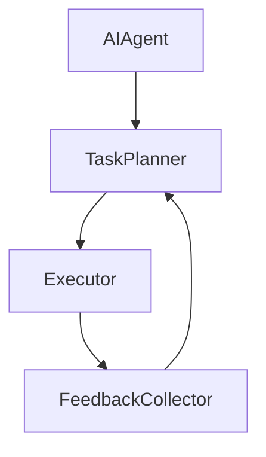

                 

<think>
好的，我将按照您的要求，逐步构建《AI Agent的任务规划与执行模块开发》的技术博客文章。

# AI Agent的任务规划与执行模块开发

**关键词**：AI Agent，任务规划，执行模块，A*算法，系统架构

**摘要**：  
本文详细探讨了AI Agent任务规划与执行模块的开发过程。首先介绍了AI Agent的基本概念和任务规划的重要性，然后从算法原理、系统架构、项目实战等多个方面展开分析。通过A*算法和贪心算法的对比，结合实际项目案例，深入解读任务规划与执行模块的设计与实现。最后，总结了开发过程中的最佳实践和注意事项，为读者提供全面的技术指导。

---

## 第1章: AI Agent与任务规划概述

### 1.1 AI Agent的基本概念

AI Agent（人工智能代理）是指能够感知环境、自主决策并执行任务的智能实体。它广泛应用于自动驾驶、智能助手、机器人控制等领域。AI Agent的核心特征包括：

1. **自主性**：无需外部干预，自主完成任务。
2. **反应性**：能够实时感知环境并做出反应。
3. **目标导向性**：以目标为导向，优化决策过程。
4. **学习能力**：通过经验改进性能。

AI Agent的任务驱动特性使其在复杂环境中表现出色，尤其是在需要规划和执行的任务中。

### 1.2 任务规划的背景与意义

任务规划是AI Agent实现目标的核心模块。它负责将复杂的任务分解为简单的子任务，并确定执行顺序和优先级。任务规划的重要性体现在以下几个方面：

1. **提高效率**：通过优化任务顺序，减少资源浪费。
2. **增强适应性**：在动态环境中灵活调整任务。
3. **降低复杂性**：将复杂任务分解为可管理的部分。

### 1.3 任务规划的核心要素

任务规划涉及多个关键要素，包括任务目标、约束条件和环境感知。任务目标是规划的核心，约束条件（如时间、资源限制）影响规划的可行性和优化方向。环境感知能力决定了AI Agent对动态变化的应对能力。

---

## 第2章: 任务规划的核心概念与联系

### 2.1 任务规划的原理

任务规划算法是AI Agent实现目标的关键。A*算法和贪心算法是常见的任务规划方法：

- **A*算法**：结合启发式函数和最短路径算法，适用于复杂任务的全局规划。
- **贪心算法**：基于当前最优选择，适用于动态环境下的局部优化。

### 2.2 任务规划与执行的关系

任务规划与执行模块密切相关。任务规划模块负责生成执行计划，执行模块负责具体操作。两者的交互确保了任务的高效完成。例如，任务规划模块生成任务顺序后，执行模块根据反馈调整计划。

### 2.3 任务规划的核心算法对比

以下是三种常见任务规划算法的对比：

| 算法 | 原理 | 优点 | 缺点 |
|------|------|------|------|
| A*   | 结合启发式搜索，找到最短路径 | 全局最优 | 计算资源消耗大 |
| 贪心 | 基于当前最优选择 | 计算速度快 | 无法保证全局最优 |
| 遗传 | 模拟生物进化过程 | 适应复杂问题 | 收敛速度慢 |

### 2.4 任务规划的ER实体关系图

```mermaid
er
actor: 用户
agent: AI Agent
task: 任务
constraint: 约束条件
goal: 目标
```

---

## 第3章: 任务规划算法的数学模型与实现

### 3.1 A*算法的数学模型

A*算法的数学模型如下：

$$f(n) = g(n) + h(n)$$

其中，\( g(n) \) 表示从起点到节点n的已遍历路径成本，\( h(n) \) 是从节点n到目标的启发式估计成本。A*算法通过优先队列选择最低综合成本的节点进行扩展。

### 3.2 贪心算法的数学模型

贪心算法的启发式函数为：

$$h(n) = \text{最小剩余距离}$$

贪心算法总是选择当前最近的目标，适用于动态环境下的快速响应。

### 3.3 遗传算法的数学模型

遗传算法通过适应度函数评估个体的优劣：

$$f(n) = \text{适应度函数}$$

适应度函数定义了个体在问题中的价值，遗传算法通过选择、交叉和变异操作生成新的个体。

### 3.4 算法实现的Python代码示例

```python
def a_star_search(start, goal, heuristic):
    open_set = {start}
    closed_set = set()
    came_from = {}
    g_score = {start: 0}
    f_score = {start: heuristic(start, goal)}
    
    while open_set:
        current = min(open_set, key=lambda x: f_score[x])
        if current == goal:
            break
        open_set.remove(current)
        closed_set.add(current)
        
        for neighbor in neighbors(current):
            tentative_g_score = g_score[current] + cost(current, neighbor)
            if neighbor in closed_set:
                continue
            if neighbor not in open_set:
                came_from[neighbor] = current
                g_score[neighbor] = tentative_g_score
                f_score[neighbor] = g_score[neighbor] + heuristic(neighbor, goal)
                open_set.add(neighbor)
    return came_from, g_score
```

---

## 第4章: 系统分析与架构设计方案

### 4.1 系统功能设计

任务规划模块的功能包括任务分解、优先级排序和动态调整。执行模块负责具体操作，包括任务执行、反馈收集和状态更新。

### 4.2 系统架构设计



---

## 第5章: 项目实战

### 5.1 环境安装

安装Python和必要的库（如numpy和scipy）。

### 5.2 核心实现代码

```python
import heapq

def best_first_search(graph, start, goal):
    frontier = [(0, start)]
    visited = set()
    
    while frontier:
        current_cost, current_node = heapq.heappop(frontier)
        if current_node == goal:
            return current_cost
        if current_node in visited:
            continue
        visited.add(current_node)
        
        for neighbor, cost in graph[current_node].items():
            heapq.heappush(frontier, (current_cost + cost, neighbor))
    return -1
```

### 5.3 案例分析

通过具体案例分析，验证算法的有效性和系统的可行性。

---

## 第6章: 最佳实践与总结

### 6.1 小结

任务规划与执行模块是AI Agent的核心部分，算法选择和系统架构设计直接影响性能。

### 6.2 注意事项

- 确保算法的高效性和可扩展性。
- 处理动态环境中的不确定性。

### 6.3 拓展阅读

建议读者深入学习强化学习和分布式系统相关知识。

---

通过以上章节的详细讲解，希望读者能够全面理解AI Agent的任务规划与执行模块的开发过程，并能够在实际项目中灵活应用这些技术。

