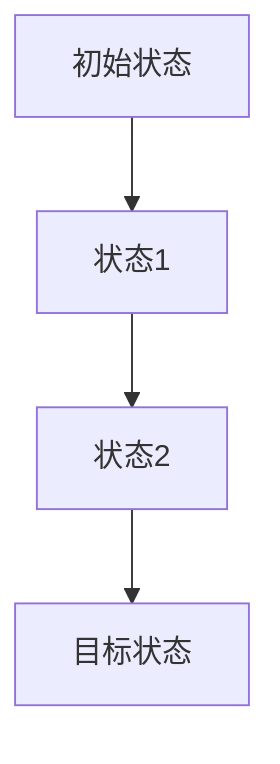
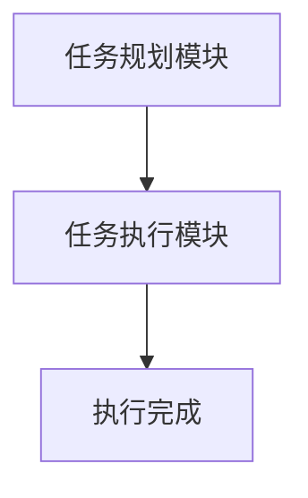

                 


# AI Agent的任务规划与执行模块设计

> 关键词：AI Agent，任务规划，执行模块，算法原理，系统架构，项目实战

> 摘要：本文详细探讨AI Agent的任务规划与执行模块设计，从基本概念、算法原理、系统架构到项目实战，全面解析如何实现高效的任务规划与执行。

---

# 第1章: AI Agent的基本概念与背景

## 1.1 AI Agent的定义与特点

### 1.1.1 AI Agent的定义
AI Agent（人工智能代理）是一种能够感知环境、自主决策并执行任务的智能实体。它可以是一个软件程序、机器人或其他智能系统，具备以下核心特点：

- **自主性**：能够自主决策，无需外部干预。
- **反应性**：能够实时感知环境并做出反应。
- **目标导向**：基于目标进行规划和行动。

### 1.1.2 AI Agent的核心特点
AI Agent的核心特点包括：
1. **智能性**：能够处理复杂问题并做出合理决策。
2. **适应性**：能够根据环境变化调整行为。
3. **交互性**：能够与人类或其他系统进行有效交互。

### 1.1.3 AI Agent与传统AI的区别
AI Agent与传统AI的区别主要体现在自主性和目标导向上。传统AI（如专家系统）依赖于规则和知识库，而AI Agent具备更强的自主性和目标导向能力，能够主动完成任务。

## 1.2 任务规划与执行模块的背景

### 1.2.1 任务规划的定义与作用
任务规划是指AI Agent根据目标和环境信息，制定出一系列行动步骤的过程。其作用在于确保AI Agent能够高效、有序地完成任务。

### 1.2.2 任务执行模块的重要性
任务执行模块是AI Agent的核心部分，负责将规划好的行动步骤转化为实际操作，确保任务的顺利执行。

### 1.2.3 当前任务规划与执行的挑战
当前任务规划与执行面临的主要挑战包括：
- 复杂环境下的不确定性
- 动态变化的任务目标
- 多目标冲突的协调问题

## 1.3 本章小结
本章介绍了AI Agent的基本概念、特点以及任务规划与执行模块的重要性，并指出了当前面临的主要挑战。

---

# 第2章: 任务规划的原理与方法

## 2.1 任务规划的基本原理

### 2.1.1 问题建模
任务规划的第一步是将问题转化为可计算的形式。例如，可以将任务目标转化为一系列状态和动作。

### 2.1.2 状态空间与动作空间
状态空间是指所有可能的状态集合，动作空间是指所有可能的动作集合。任务规划的目标是从初始状态到目标状态找到一条最优路径。

### 2.1.3 规划算法的分类
任务规划算法可以分为以下几类：
1. **基于搜索的算法**：如BFS、DFS、A*。
2. **基于采样的算法**：如蒙特卡洛树搜索（MCTS）。
3. **基于模型的算法**：如动态规划。

## 2.2 常见的任务规划算法

### 2.2.1 BFS算法
BFS（广度优先搜索）是一种简单的任务规划算法，适用于状态空间较小的情况。其流程如下：



### 2.2.2 A*算法
A*算法是一种高效的路径搜索算法，结合了启发式搜索和最佳优先搜索。其数学模型如下：

$$f(n) = g(n) + h(n)$$

其中，$g(n)$表示从初始状态到状态$n$的已知成本，$h(n)$表示从状态$n$到目标状态的估计成本。

### 2.2.3 随机采样方法
随机采样方法（如MCTS）适用于复杂问题，通过随机采样生成候选动作，并选择最优动作进行执行。

## 2.3 任务规划中的搜索算法

### 2.3.1 BFS算法
BFS算法适用于简单任务的规划，其优点是实现简单，缺点是效率较低。

### 2.3.2 DFS算法
DFS（深度优先搜索）是一种深层次的搜索算法，适用于任务目标较为明确的情况。

### 2.3.3 A*算法的优化与实现
A*算法通过引入启发函数，显著提高了搜索效率。其优化策略包括：
- 优先选择具有较低$f(n)$值的状态。
- 使用合适的状态表示方法。

## 2.4 本章小结
本章详细介绍了任务规划的基本原理和常见算法，重点讲解了BFS、DFS和A*算法的实现方法和优化策略。

---

# 第3章: 任务执行模块的系统架构

## 3.1 任务执行模块的功能设计

### 3.1.1 任务分解与分配
任务分解是指将复杂任务分解为多个子任务，并分配给不同的执行模块。

### 3.1.2 任务执行的监控与反馈
任务执行模块需要实时监控任务执行状态，并根据反馈结果进行调整。

### 3.1.3 任务执行的异常处理
任务执行过程中可能会遇到异常情况，如环境变化、资源不足等，需要有相应的异常处理机制。

## 3.2 系统架构设计

### 3.2.1 分层架构设计
任务执行模块可以采用分层架构，包括：
1. **感知层**：负责感知环境信息。
2. **决策层**：负责任务规划和决策。
3. **执行层**：负责具体任务执行。

### 3.2.2 模块化设计
任务执行模块可以划分为多个独立模块，如任务分解模块、执行监控模块等。

### 3.2.3 高可用性设计
任务执行模块需要具备高可用性，确保在部分模块故障时仍能正常执行任务。

## 3.3 系统接口设计

### 3.3.1 标准接口定义
任务执行模块需要定义标准接口，如：
- `start_task()`：开始执行任务。
- `stop_task()`：停止任务执行。
- `get_status()`：获取任务状态。

### 3.3.2 接口调用流程
任务执行模块的接口调用流程如下：



### 3.3.3 接口的安全性设计
任务执行模块需要确保接口的安全性，防止未经授权的访问和操作。

## 3.4 本章小结
本章重点介绍了任务执行模块的系统架构设计和接口设计，强调了高可用性和安全性的重要性。

---

# 第4章: 任务规划算法的数学模型

## 4.1 A*算法的数学模型

### 4.1.1 状态空间模型
状态空间模型可以表示为图中的节点，每个节点代表一个状态。

### 4.1.2 成本函数与启发函数
A*算法的核心在于成本函数和启发函数的选择。例如：

$$g(n) = \text{从初始状态到状态n的已知成本}$$
$$h(n) = \text{从状态n到目标状态的估计成本}$$

### 4.1.3 A*算法的数学表达式
A*算法的目标是最小化$f(n) = g(n) + h(n)$，选择$f(n)$最小的节点进行扩展。

## 4.2 随机采样方法的数学分析

### 4.2.1 Monte Carlo树搜索（MCTS）
MCTS是一种基于随机采样的算法，适用于复杂任务的规划。

### 4.2.2 UCT算法的数学推导
UCT（Upper Confidence Bound for Trees）算法是一种基于MCTS的优化算法，其数学推导如下：

$$f(n) = \frac{w(n)}{n(n)} + \sqrt{\frac{\ln(N)}{n(n)}}$$

其中，$w(n)$是节点$n$的总奖励，$n(n)$是节点$n$的访问次数，$N$是当前总访问次数。

### 4.2.3 算法复杂度分析
A*算法的时间复杂度为$O(B \cdot W)$，其中$B$是分支因子，$W$是路径宽度。

## 4.3 任务规划的优化方法

### 4.3.1 动态规划方法
动态规划方法适用于任务目标明确的情况。

### 4.3.2 动作选择的优化策略
动作选择的优化策略包括贪心策略、随机选择策略等。

### 4.3.3 算法的收敛性分析
任务规划算法的收敛性分析需要考虑算法的搜索空间和目标函数。

## 4.4 本章小结
本章详细分析了任务规划算法的数学模型和优化方法，重点讲解了A*算法和MCTS算法的实现和优化策略。

---

# 第5章: 任务规划系统的系统分析

## 5.1 系统需求分析

### 5.1.1 功能需求
任务规划系统需要具备以下功能：
- 任务分解与分配
- 任务规划与执行
- 任务监控与反馈

### 5.1.2 性能需求
任务规划系统的性能需求包括：
- 响应时间小于1秒
- 并发处理能力

## 5.2 项目实战

### 5.2.1 智能助手开发

#### 5.2.1.1 环境配置
安装必要的库和工具，如Python、NumPy、Pandas等。

#### 5.2.1.2 核心代码实现
以下是任务分解模块的代码示例：

```python
def decompose_task(main_task):
    sub_tasks = []
    # 分解任务
    for task in main_task:
        sub_tasks.append(task.split())
    return sub_tasks
```

#### 5.2.1.3 功能实现
任务分解模块将复杂任务分解为多个子任务，并分配给不同的执行模块。

#### 5.2.1.4 案例分析
例如，一个智能助手需要完成“预订机票”的任务，可以将其分解为“选择日期”、“选择航班”、“确认订单”等多个子任务。

## 5.3 本章小结
本章通过实际案例分析，展示了任务规划系统的系统分析与设计过程。

---

# 第6章: 最佳实践与总结

## 6.1 最佳实践 tips

### 6.1.1 算法选择
根据任务特点选择合适的算法，如A*算法适用于路径规划，MCTS适用于复杂任务。

### 6.1.2 系统设计
模块化设计和分层架构是系统设计的重要原则。

### 6.1.3 代码实现
代码实现时要注意可扩展性和可维护性。

## 6.2 小结
任务规划与执行模块是AI Agent的核心部分，其设计和实现需要综合考虑算法选择、系统架构和实际应用。

## 6.3 注意事项
任务规划与执行模块的设计需要注意以下几点：
- 确保算法的高效性和准确性
- 保证系统的高可用性和安全性
- 处理好任务分解与资源分配的问题

## 6.4 拓展阅读
推荐阅读相关书籍和论文，深入理解任务规划与执行的理论和实践。

---

# 附录: 总结

本文从AI Agent的基本概念出发，详细讲解了任务规划与执行模块的设计与实现，包括算法原理、系统架构和项目实战等内容。希望对读者在AI Agent领域有所帮助。

