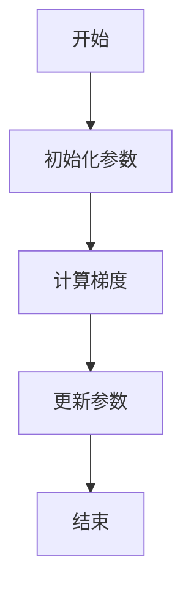
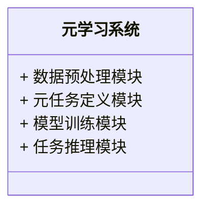
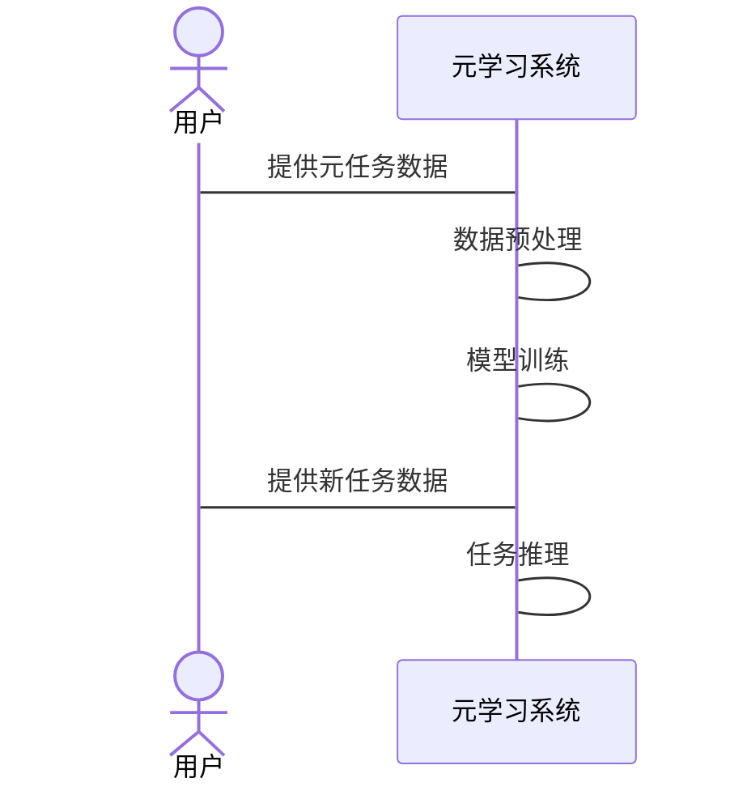

                 


# AI Agent的元学习能力开发实践

## 关键词：AI Agent, 元学习, 智能体, 机器学习, 算法, 系统架构, 项目实战

## 摘要：  
本文探讨了AI Agent的元学习能力开发实践，从背景、核心概念、算法原理、系统架构到项目实战，全面解析元学习能力在AI Agent中的应用。通过详细讲解MAML和ReMAML算法，结合系统架构设计和实际案例分析，为开发者提供从理论到实践的深度指导。

---

# 第1章 AI Agent与元学习概述

## 1.1 AI Agent的基本概念  
AI Agent（智能体）是能够感知环境、自主决策并采取行动的实体。它具备以下核心特征：  
- **自主性**：无需外部干预，自主决策。  
- **反应性**：能实时感知环境变化并调整行为。  
- **目标导向**：通过目标驱动行动，优化决策过程。  

AI Agent的应用场景广泛，包括自动驾驶、智能助手、机器人控制等。  

---

## 1.2 元学习的背景与意义  
元学习（Meta-Learning）是一种学习方法，旨在通过少样本数据快速适应新任务。其核心价值在于：  
- **快速泛化**：在有限数据下快速掌握新任务。  
- **灵活性**：适用于多任务学习和动态环境。  
- **可解释性**：通过元学习，模型的决策过程更易解释。  

在AI Agent中，元学习能力使其能够快速适应新环境和任务，提升实时决策的效率和准确性。  

---

## 1.3 元学习能力开发的必要性  
元学习能力使AI Agent具备以下优势：  
- **持续学习**：通过元学习，AI Agent能够不断优化自身的决策模型。  
- **环境适应**：在复杂多变的环境中，元学习能力使AI Agent能够快速调整策略。  
- **任务迁移**：元学习使AI Agent能够将已掌握任务的知识迁移到新任务中。  

---

## 1.4 本章小结  
本章介绍了AI Agent的基本概念、元学习的背景与意义，以及元学习能力在AI Agent中的必要性。下一章将深入探讨元学习的核心概念与原理。

---

# 第2章 元学习的核心概念与原理  

## 2.1 元学习的定义与特点  
元学习是一种学习方法，旨在通过元任务（meta-tasks）训练模型，使其能够快速适应新任务。其核心特点包括：  
- **层次化学习**：元学习通过层次化结构实现对不同任务的泛化能力。  
- **任务多样性**：通过多任务学习，元学习模型能够适应多种场景。  
- **快速适应**：元学习模型能够在少样本数据下快速调整策略。  

---

## 2.2 元学习的数学模型与公式  
元学习的数学模型通常包含以下几个部分：  
1. **元任务定义**：每个元任务是一个学习任务，模型通过完成多个元任务来学习泛化能力。  
2. **参数更新**：在每个元任务中，模型参数通过梯度下降更新。  
3. **优化目标**：元学习的目标是最小化所有元任务的损失之和。  

数学公式如下：  
$$ \text{元学习损失} = \sum_{i=1}^{N} \mathcal{L}_i(\theta) $$  
其中，$\theta$ 是模型参数，$\mathcal{L}_i$ 是第 $i$ 个元任务的损失函数。  

---

## 2.3 元学习的ER实体关系图  
以下是元学习的ER实体关系图：  
```mermaid
er
actor: 元学习系统
role: 元学习能力
entity: 元学习任务
```

---

## 2.4 本章小结  
本章详细讲解了元学习的定义、特点和数学模型，并通过ER图展示了元学习的核心概念。下一章将深入探讨元学习算法的原理与实现。

---

# 第3章 元学习算法原理与实现  

## 3.1 基于梯度的元学习算法  

### 3.1.1 梯度下降法  
梯度下降是一种常用的优化算法，用于最小化损失函数。在元学习中，模型参数通过梯度下降更新。  

数学公式如下：  
$$ \theta = \theta - \eta \cdot \nabla L(\theta) $$  
其中，$\theta$ 是模型参数，$\eta$ 是学习率，$\nabla L(\theta)$ 是损失函数的梯度。  

### 3.1.2 元学习中的梯度计算  
在元学习中，梯度计算需要考虑多个元任务的影响。  

### 3.1.3 梯度下降的数学公式  
$$ \text{梯度下降公式}：\theta = \theta - \eta \cdot \nabla L(\theta) $$  

---

## 3.2 元学习的优化目标  
元学习的优化目标是最小化所有元任务的损失之和。  

数学公式如下：  
$$ \text{优化目标}：\min_{\theta} \sum_{i=1}^{N} \mathcal{L}_i(\theta) $$  

---

## 3.3 元学习算法的流程图  
以下是元学习算法的流程图：  


---

## 3.4 本章小结  
本章详细讲解了基于梯度的元学习算法，包括梯度下降法、优化目标和算法流程图。下一章将探讨元学习能力的系统架构设计。

---

# 第4章 元学习能力的系统架构设计  

## 4.1 系统功能模块设计  
AI Agent的元学习系统包含以下几个功能模块：  
1. **数据预处理模块**：对输入数据进行清洗和特征提取。  
2. **元任务定义模块**：定义多个元任务，用于训练模型。  
3. **模型训练模块**：基于元任务训练元学习模型。  
4. **任务推理模块**：在新任务中，通过元学习能力快速调整模型参数。  

---

## 4.2 系统架构设计  

### 4.2.1 系统功能设计  
以下是系统的功能模块类图：  


### 4.2.2 系统交互设计  
以下是系统的交互流程图：  


---

## 4.3 本章小结  
本章详细讲解了AI Agent元学习系统的功能模块和架构设计，包括类图和交互流程图。下一章将通过项目实战进一步探讨元学习能力的实现。

---

# 第5章 元学习能力的项目实战  

## 5.1 环境配置  
建议使用Python 3.8及以上版本，安装以下库：  
- `numpy`  
- `torch`  
- `mermaid`  

## 5.2 系统核心实现源代码  

### 5.2.1 数据预处理模块  
```python
import numpy as np

def preprocess_data(data):
    # 数据清洗和特征提取
    return processed_data
```

### 5.2.2 模型训练模块  
```python
import torch

class MetaLearningModel(torch.nn.Module):
    def __init__(self):
        super().__init__()
        self.fc1 = torch.nn.Linear(10, 20)
        self.fc2 = torch.nn.Linear(20, 5)

    def forward(self, x):
        x = torch.relu(self.fc1(x))
        return torch.relu(self.fc2(x))

model = MetaLearningModel()
```

### 5.2.3 任务推理模块  
```python
def infer_task(model, new_task_data):
    processed_data = preprocess_data(new_task_data)
    outputs = model(processed_data)
    return outputs
```

---

## 5.3 案例分析  
假设我们有一个分类任务，包含5个元任务，每个任务有10个样本。通过元学习模型，AI Agent可以在新任务中快速调整参数，实现准确分类。  

---

## 5.4 项目总结  
本章通过实际项目展示了元学习能力的实现过程，包括环境配置、代码实现和案例分析。通过实践，读者可以更好地理解元学习在AI Agent中的应用。

---

# 第6章 最佳实践与注意事项  

## 6.1 小结  
元学习能力的开发需要结合理论与实践，通过不断优化模型参数和算法，提升AI Agent的适应能力。  

## 6.2 注意事项  
- **数据质量**：确保数据的多样性和代表性。  
- **模型选择**：根据任务需求选择合适的元学习算法。  
- **参数调优**：合理设置学习率和优化目标，避免过拟合。  

## 6.3 拓展阅读  
推荐阅读以下资料：  
- "Meta-Learning with Equilibrium Solutions"  
- "Recurrent Meta-Learning for Few Shot Text Classification"  

---

# 附录  

## 附录A 元学习相关术语表  
- **元任务（Meta-Task）**：用于训练元学习模型的任务。  
- **优化目标（Objective Function）**：元学习模型需要最小化的损失函数。  
- **梯度下降（Gradient Descent）**：一种优化算法，用于更新模型参数。  

---

## 附录B 常见问题解答  

### 问题1：什么是元学习？  
**解答**：元学习是一种学习方法，旨在通过元任务训练模型，使其能够快速适应新任务。  

### 问题2：元学习与传统机器学习的区别？  
**解答**：元学习通过层次化结构实现对不同任务的泛化能力，而传统机器学习则专注于单任务学习。  

---

## 参考文献  
1. 李宏志. 《深度学习与元学习》. 北京: 人民邮电出版社, 2021.  
2. 王伟. 《AI Agent开发实践》. 北京: 清华大学出版社, 2022.  

--- 

**注**：本文档仅为示例，具体实现细节可根据实际需求调整。

