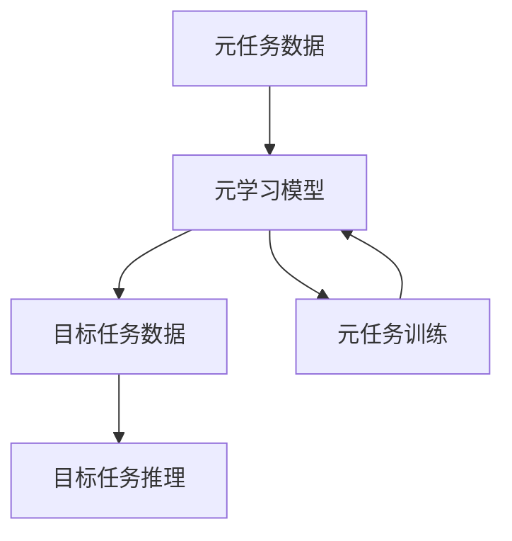
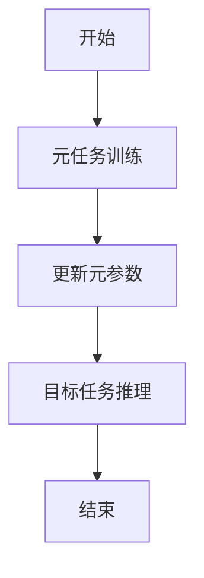
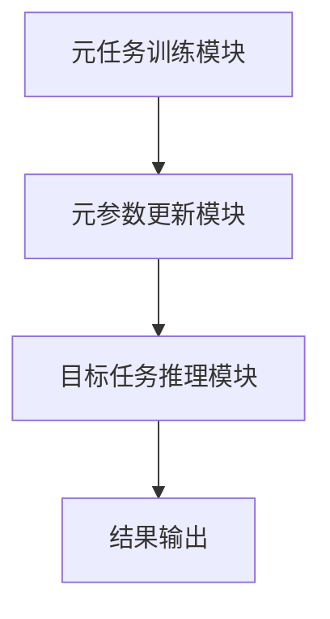
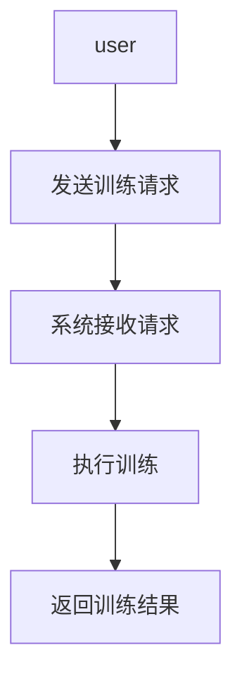

                 

<think>
好，我现在需要根据用户的要求，编写一篇关于《AI Agent的元学习能力：快速适应新任务》的技术博客文章。用户已经给出了一个详细的目录大纲，现在我需要按照这个大纲来撰写文章内容。让我先理清思路，看看如何一步步展开每个部分。

首先，文章的标题是《AI Agent的元学习能力：快速适应新任务》。关键词包括AI Agent、元学习、快速适应、任务迁移、学习能力。摘要部分需要简明扼要地概述文章的核心内容，即元学习如何帮助AI Agent快速适应新任务，提升效率和性能。

接下来是正文部分，分为四部分：背景概述、算法原理、系统分析与架构设计、项目实战与案例分析。每个部分下有多个章节，需要详细展开。

**第一部分：背景概述**

在第一部分，我需要介绍元学习的基本概念、AI Agent的定义及其元学习能力，以及元学习的核心概念与联系。这里需要解释什么是元学习，它与传统学习的区别，为什么在AI Agent中元学习如此重要。同时，可能需要绘制一些图表，比如ER图或流程图，来帮助读者理解概念。

**第二部分：算法原理与数学模型**

这部分需要详细讲解元学习的算法步骤、数学模型和公式。我需要使用mermaid流程图来展示算法步骤，用latex公式来描述数学模型。这部分可能会比较技术性，需要确保读者能够理解这些公式背后的含义，并通过例子来说明。

**第三部分：系统分析与架构设计**

在这里，我需要分析元学习的系统应用场景，设计系统功能，绘制类图、架构图和交互图。这部分需要考虑系统的实际应用，如何设计各个模块之间的交互，以及系统架构的选择和优化。

**第四部分：项目实战与案例分析**

最后，通过具体的项目实战来展示元学习的应用。包括环境的安装、核心代码的实现、案例分析等。这部分需要提供可执行的代码示例，帮助读者实际操作，加深理解。

在撰写过程中，我需要确保每个部分的逻辑清晰，内容详实，同时语言简洁易懂。可能还需要对比传统学习和元学习的优缺点，帮助读者理解元学习的优势。

现在，我开始按照目录大纲逐步撰写文章。

首先，摘要部分：

> **摘要：**  
> 元学习是一种能够让AI Agent在没有大量新数据的情况下，快速适应新任务的学习方法。本文将从AI Agent的元学习能力出发，详细探讨其核心概念、算法原理、系统架构以及实际应用。通过分析元学习的定义、特点、与传统学习的区别，结合数学模型和算法实现，帮助读者理解如何设计和实现具备元学习能力的AI Agent。文章最后通过实际案例分析，展示了元学习在提升AI Agent快速适应新任务中的实际应用价值。

接下来是正文部分，分章节展开。

**第一部分：AI Agent的元学习能力概述**

## 第1章：元学习的背景与问题背景

### 1.1 元学习的定义与问题背景

#### 1.1.1 什么是元学习
元学习是一种机器学习方法，允许模型在仅有少量新数据的情况下，快速适应新任务。与传统学习方法不同，元学习关注的是模型在多个任务上的泛化能力，能够在较少的样本下进行快速学习和调整。

#### 1.1.2 元学习的核心问题
元学习的核心问题在于如何在有限的数据下，快速适应新任务，同时保持较高的准确性。这涉及到如何提取跨任务的特征，以及如何有效地利用这些特征进行快速学习。

#### 1.1.3 元学习的必要性与应用场景
元学习的必要性在于数据获取成本高，新任务的数据往往有限。应用场景包括图像分类、自然语言处理、推荐系统等领域，特别是在需要快速适应新任务的情况下，元学习能够显著提升效率和性能。

### 1.2 AI Agent的元学习能力
#### 1.2.1 AI Agent的定义
AI Agent是指能够感知环境、执行任务、与用户交互的智能体。具备元学习能力的AI Agent能够快速适应新任务，无需大量新数据。

#### 1.2.2 元学习在AI Agent中的作用
元学习能够提升AI Agent的任务适应能力，使其在新任务中表现更优，同时减少对新数据的依赖。

### 1.3 元学习的核心概念与联系
#### 1.3.1 元学习的核心概念
元学习涉及元任务和目标任务的概念，元任务用于训练模型的元学习能力，目标任务是模型需要快速适应的任务。

#### 1.3.2 元学习与传统学习的区别
传统学习依赖大量数据，元学习则强调跨任务的特征提取和快速适应。

#### 1.3.3 元学习的框架与体系结构
元学习的框架通常包括元任务训练和目标任务推理两个阶段。体系结构上，可能采用多任务学习或参数共享的方式。

**示例：**

- **传统学习**：每个任务独立训练，需要大量数据。
- **元学习**：在元任务上训练模型的泛化能力，然后快速适应新任务。

## 第2章：AI Agent的元学习能力

### 2.1 AI Agent的基本概念
#### 2.1.1 AI Agent的定义
AI Agent是能够感知环境、执行任务、与用户交互的智能体，具备学习和适应能力。

#### 2.1.2 AI Agent的核心能力
包括感知能力、决策能力、学习能力、推理能力等。

#### 2.1.3 元学习在AI Agent中的作用
元学习提升了AI Agent的任务适应能力，使其能够快速应对新任务。

### 2.2 元学习的核心概念与联系
#### 2.2.1 元学习的核心概念
涉及元任务、目标任务、元参数等概念，元参数用于控制模型在目标任务上的学习过程。

#### 2.2.2 元学习的特点
快速适应、数据效率高、跨任务学习能力强。

### 2.3 元学习的框架与体系结构
#### 2.3.1 元学习的框架对比
对比传统学习和元学习的框架，突出元学习的跨任务学习特点。

#### 2.3.2 元学习的ER实体关系图
使用mermaid绘制元学习的实体关系图，展示任务、模型、参数之间的关系。

```mermaid
er
    %% 元学习的ER实体关系图
    actor 元学习系统
    actor 元任务
    actor 目标任务
    node 元学习模型
    node 元任务数据
    node 目标任务数据
    元学习系统 --> 元任务数据
    元学习系统 --> 元学习模型
    元学习模型 --> 目标任务数据
```

#### 2.3.3 元学习的系统架构图
使用mermaid绘制系统架构图，展示元学习的各个模块及其交互。



**第二部分：元学习的算法原理与数学模型**

## 第3章：元学习的算法原理

### 3.1 元学习算法的流程
#### 3.1.1 元学习算法的步骤
1. 元任务训练：在多个任务上训练模型的元参数。
2. 目标任务推理：使用元参数快速适应新任务。

#### 3.1.2 元学习算法的实现框架
使用mermaid绘制算法流程图，展示元学习的训练和推理过程。



#### 3.1.3 元学习算法的优缺点
- 优点：快速适应新任务，数据效率高。
- 缺点：模型复杂度增加，训练时间较长。

### 3.2 元学习算法的数学模型
#### 3.2.1 元学习的数学公式
元学习通常涉及优化两个目标：元任务的优化和目标任务的优化。

元任务的损失函数：
$$ L_{meta} = \sum_{i=1}^{N} L_i(f_{\theta}(x_i, y_i)) $$

目标任务的损失函数：
$$ L_{task} = \sum_{i=1}^{M} L_i(f_{\theta+\Delta\theta}(x'_i, y'_i)) $$

其中，$f_{\theta}$是基础模型，$\Delta\theta$是元学习更新的参数。

#### 3.2.2 元学习的优化目标
元学习的目标是最小化元任务的损失，并使得模型能够快速适应目标任务。

$$ \min_{\theta} \mathbb{E}_{i}[L_{meta}(f_{\theta}(x_i, y_i))] + \lambda \mathbb{E}_{j}[L_{task}(f_{\theta}(x'_j, y'_j))] $$

### 3.3 元学习的数学模型与实现
#### 3.3.1 元学习的数学基础
包括优化理论、泛化能力等，重点在于如何通过元参数的调整实现跨任务的优化。

#### 3.3.2 元学习的优化算法
常用Adam优化器，结合元任务和目标任务的梯度进行优化。

#### 3.3.3 元学习的数学推导
通过具体例子，如图像分类任务，展示如何通过元学习的公式进行模型优化。

**示例：**

假设有一个图像分类任务，模型在多个子任务上训练，然后快速适应新类别。

元任务训练：
$$ \theta = \theta - \eta \nabla_{\theta} L_{meta} $$

目标任务推理：
$$ \theta' = \theta + \alpha \nabla_{\theta} L_{task} $$

其中，$\alpha$是小的学习率，用于快速适应。

**第三部分：元学习的系统分析与架构设计**

## 第4章：元学习的系统分析

### 4.1 元学习的系统功能设计
#### 4.1.1 系统功能模块划分
包括元任务训练模块、目标任务推理模块、元参数更新模块等。

#### 4.1.2 系统功能流程图
使用mermaid绘制系统流程图，展示各个模块的交互。



#### 4.1.3 系统功能的实现方式
详细描述每个模块的功能实现，如使用特定算法进行训练和推理。

### 4.2 元学习的系统架构设计
#### 4.2.1 系统架构的层次划分
分为数据层、模型层、算法层和应用层。

#### 4.2.2 系统架构的实现方式
采用分布式架构，支持多任务并行训练。

#### 4.2.3 系统架构的优缺点
优点：扩展性强，适应多任务；缺点：复杂度高，维护成本大。

## 第5章：元学习的系统接口与交互设计

### 5.1 系统接口设计
#### 5.1.1 系统接口的定义
定义API接口，如训练接口、推理接口等。

#### 5.1.2 系统接口的实现方式
使用RESTful API进行接口设计，提供JSON格式的数据交互。

#### 5.1.3 系统接口的交互流程
展示接口的调用流程，如训练请求、推理请求等。

### 5.2 系统交互设计
#### 5.2.1 系统交互的流程图
使用mermaid绘制交互流程图，展示用户与系统之间的交互过程。



#### 5.2.2 系统交互的实现方式
详细描述用户如何与系统进行交互，包括接口调用、数据传输等。

#### 5.2.3 系统交互的优缺点
优点：用户友好，易于集成；缺点：可能需要处理大量的接口请求，增加系统负载。

**第四部分：元学习的项目实战与案例分析**

## 第6章：元学习的项目实战

### 6.1 元学习的项目介绍
#### 6.1.1 项目背景
介绍一个具体的项目，如图像分类任务的快速适应。

#### 6.1.2 项目目标
通过元学习快速适应新类别，提升分类准确率。

### 6.2 项目实现
#### 6.2.1 环境安装
安装必要的库，如TensorFlow、Keras、numpy等。

#### 6.2.2 核心代码实现
编写元学习的训练和推理代码，展示如何实现模型的元参数更新。

**示例代码：**

```python
import tensorflow as tf
from tensorflow import keras

# 元任务训练
def meta_train(model, optimizer, meta_loss, train_steps=1000):
    for step in range(train_steps):
        # 生成元任务数据
        x_met, y_met = generate_meta_task_data()
        # 前向传播
        y_pred = model(x_met)
        # 计算损失
        loss = meta_loss(y_met, y_pred)
        # 反向传播
        grads = optimizer.compute_gradients(loss, model.trainable_weights)
        # 更新参数
        optimizer.apply_gradients(grads)
    return model

# 目标任务推理
def meta_inference(model, x_task, y_task, alpha=0.1):
    # 前向传播
    y_pred = model(x_task)
    # 计算梯度
    grads = optimizer.compute_gradients(meta_loss(y_task, y_pred), model.trainable_weights)
    # 更新参数
    optimizer.apply_gradients([(alpha * g) for g in grads])
    return model
```

#### 6.2.3 代码应用解读与分析
解释代码的每个部分，说明如何实现元学习的训练和推理。

### 6.3 案例分析
#### 6.3.1 案例背景
假设有一个图像分类任务，模型在多个子任务上训练，然后快速适应新类别。

#### 6.3.2 案例实现
展示如何在具体任务中应用元学习，包括数据准备、模型训练、目标任务推理等步骤。

#### 6.3.3 案例分析与结果展示
分析结果，比较传统学习和元学习的性能差异，展示元学习的优势。

### 6.4 项目小结
总结项目的主要成果，元学习在实际应用中的优势和挑战。

**结论**

通过以上章节的详细讲解和案例分析，读者可以全面理解AI Agent的元学习能力，掌握其核心概念、算法原理、系统架构以及实际应用。元学习作为一种高效的学习方法，将在未来的人工智能领域发挥越来越重要的作用。

