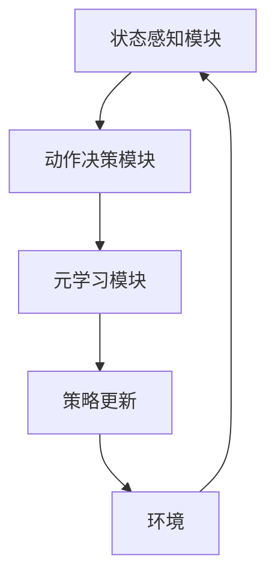
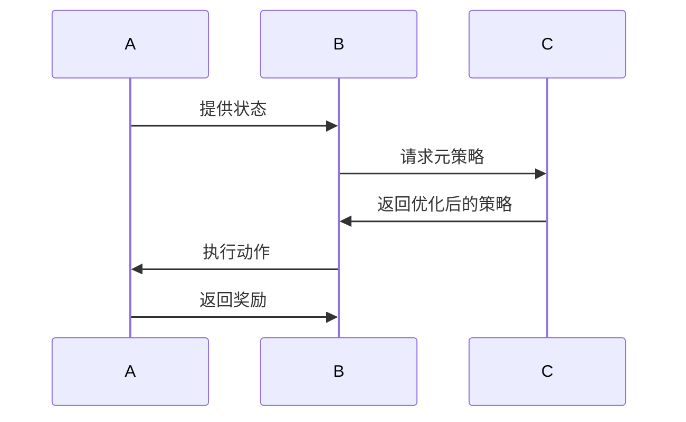

                 


# AI Agent的元强化学习策略开发

## 关键词
- AI Agent
- 元强化学习
- 策略开发
- 强化学习
- 系统架构

## 摘要
本文将深入探讨AI Agent的元强化学习策略开发，从基本概念到算法实现，再到系统架构和项目实战，系统地分析和讲解元强化学习的核心原理和应用方法。通过本文，读者将能够理解元强化学习如何帮助AI Agent在复杂环境中快速适应和优化策略，从而提升整体性能。

---

# 第一部分: AI Agent的元强化学习策略开发背景与基础

## 第1章: AI Agent与强化学习概述

### 1.1 AI Agent的基本概念
#### 1.1.1 AI Agent的定义与分类
- **定义**: AI Agent是一种智能体，能够感知环境并采取行动以实现特定目标。
- **分类**: 可分为简单反射型、基于模型的规划型、基于价值的决策型和基于强化学习的自适应型。

#### 1.1.2 强化学习的基本原理
- **强化学习**: 通过试错机制，智能体在环境中学习策略，以最大化累积奖励。
- **关键概念**: 状态、动作、奖励、策略、值函数。

#### 1.1.3 元强化学习的定义与特点
- **元强化学习**: 在强化学习的基础上，通过元学习框架，优化策略更新和环境适应能力。
- **特点**: 快速适应新环境、跨任务通用性、自适应性。

### 1.2 元强化学习的背景与应用
#### 1.2.1 元强化学习的背景
- **背景**: 随着复杂任务的增加，传统强化学习在适应新环境时效率低下，元强化学习应运而生。
- **应用场景**: 多任务学习、动态环境适应、实时策略优化。

#### 1.2.2 元强化学习的应用场景
- **多任务学习**: 同一模型适用于多个任务。
- **动态环境适应**: 快速调整策略以应对环境变化。
- **实时策略优化**: 在运行时不断优化策略。

#### 1.2.3 元强化学习与传统强化学习的对比
| 对比维度 | 传统强化学习 | 元强化学习 |
|----------|--------------|------------|
| 适应性   | 低           | 高         |
| 任务通用性 | 低           | 高         |
| 策略更新  | 逐任务优化   | 元任务优化 |

### 1.3 本章小结
本章介绍了AI Agent的基本概念、强化学习的核心原理以及元强化学习的定义、特点和应用场景。元强化学习作为强化学习的高级形式，能够显著提升AI Agent的适应性和通用性。

---

## 第2章: 元强化学习的核心概念

### 2.1 元强化学习的核心原理
#### 2.1.1 元强化学习的算法框架
- **元学习框架**: 包括元任务和子任务，通过元任务学习通用策略，子任务进行具体优化。
- **元策略**: 负责在多个任务之间切换，优化子策略。

#### 2.1.2 元强化学习的优化目标
- **目标函数**: 最大化累积奖励。
- **优化策略**: 通过梯度下降优化元策略和子策略。

#### 2.1.3 元强化学习的策略更新机制
- **策略更新**: 元策略指导子策略的更新，子策略在具体任务中优化。

### 2.2 元强化学习与传统强化学习的对比
#### 2.2.1 算法目标的对比
| 对比维度 | 传统强化学习 | 元强化学习 |
|----------|--------------|------------|
| 算法目标 | 单任务优化   | 多任务优化 |

#### 2.2.2 策略更新的对比
- 传统强化学习：逐个任务优化。
- 元强化学习：通过元任务学习通用策略，快速适应新任务。

#### 2.2.3 环境交互的对比
- 传统强化学习：长时间试错。
- 元强化学习：通过元任务快速初始化，减少试错时间。

### 2.3 元强化学习的数学模型
#### 2.3.1 状态空间与动作空间的定义
- **状态空间**: S，表示智能体所处的状态。
- **动作空间**: A，表示智能体可执行的动作。

#### 2.3.2 策略函数的表达式
$$ \pi_{\theta}(a|s) = \text{softmax}(w^T \phi(s,a)) $$
其中，θ为策略参数，φ为特征函数。

#### 2.3.3 损失函数的定义
$$ L(\theta) = -\sum_{t} r_t \log(\pi_{\theta}(a_t|s_t)) $$

### 2.4 本章小结
本章详细讲解了元强化学习的核心原理，包括算法框架、优化目标和策略更新机制，并通过对比分析和数学公式，深入阐述了元强化学习的优势。

---

## 第3章: 元强化学习算法的实现原理

### 3.1 元强化学习算法的流程
#### 3.1.1 算法初始化
- 初始化元策略和子策略参数。
- 设置元任务和子任务。

#### 3.1.2 环境交互
- 智能体在环境中执行动作，获取奖励和新状态。
- 更新子策略以最大化奖励。

#### 3.1.3 策略更新
- 元策略指导子策略的更新。
- 通过梯度下降优化元策略和子策略。

### 3.2 元强化学习的数学推导
#### 3.2.1 策略梯度的推导
- 策略梯度公式:
$$ \nabla_{\theta} J(\theta) = \mathbb{E}_{s,a}[\nabla_{\theta} \log \pi_{\theta}(a|s) Q(s,a)] $$

#### 3.2.2 元学习目标函数的构建
- 元目标函数:
$$ \mathcal{L}(\theta) = -\sum_{k} \sum_{t} r_k \log(\pi_{\theta}(a_t|s_k,t)) $$

#### 3.2.3 梯度下降的实现
- 梯度下降步骤:
$$ \theta = \theta - \alpha \nabla_{\theta} \mathcal{L}(\theta) $$

### 3.3 元强化学习算法的代码实现
#### 3.3.1 环境接口的设计
```python
class Environment:
    def __init__(self):
        self.state = None

    def step(self, action):
        # 返回新的状态、奖励和是否结束
        return new_state, reward, done
```

#### 3.3.2 策略网络的实现
```python
import torch
import torch.nn as nn

class PolicyNetwork(nn.Module):
    def __init__(self, input_dim, output_dim):
        super(PolicyNetwork, self).__init__()
        self.fc1 = nn.Linear(input_dim, 64)
        self.fc2 = nn.Linear(64, output_dim)
        self.softmax = nn.Softmax(dim=1)

    def forward(self, x):
        x = torch.relu(self.fc1(x))
        x = self.softmax(self.fc2(x))
        return x
```

#### 3.3.3 算法主循环的代码
```python
import torch.optim as optim

# 初始化参数
theta = torch.randn((input_dim, output_dim), requires_grad=True)
optimizer = optim.Adam([theta], lr=0.001)

# 元学习循环
for meta_step in range(meta_steps):
    for task in tasks:
        # 获取环境状态
        state = env.reset()
        # 采样动作
        with torch.no_grad():
            action_probs = policy_network(state)
        action = torch.multinomial(action_probs, 1).item()
        # 环境交互
        next_state, reward, done = env.step(action)
        # 更新策略
        optimizer.zero_grad()
        loss = calculate_loss(theta, action, reward, next_state)
        loss.backward()
        optimizer.step()
```

### 3.4 本章小结
本章通过详细描述元强化学习算法的流程、数学推导和代码实现，帮助读者理解如何在实际中应用这些算法。

---

## 第4章: 元强化学习系统的架构设计

### 4.1 系统功能模块划分
#### 4.1.1 状态感知模块
- 负责感知环境状态，输入给决策模块。

#### 4.1.2 动作决策模块
- 根据状态和策略，输出具体动作。

#### 4.1.3 元学习模块
- 负责元任务的优化和策略的元更新。

### 4.2 系统架构的Mermaid图


### 4.3 系统接口设计
- **状态输入接口**: 输入当前状态。
- **动作输出接口**: 输出具体动作。
- **奖励反馈接口**: 接收环境奖励。

### 4.4 系统交互的Mermaid序列图


### 4.5 本章小结
本章通过系统架构设计和接口设计，展示了如何构建一个高效的元强化学习系统。

---

## 第5章: 项目实战与案例分析

### 5.1 项目实战: 智能客服系统的优化
#### 5.1.1 环境配置
- 安装必要的库: PyTorch, gym, numpy。

#### 5.1.2 代码实现
```python
import gym
import torch
import torch.nn as nn

# 定义环境
env = gym.make('MultiTask-Environment-v0')

# 定义元强化学习策略
class MetaRLStrategy:
    def __init__(self, input_dim, output_dim):
        self.policy = PolicyNetwork(input_dim, output_dim)
        self.optimizer = optim.Adam(self.policy.parameters(), lr=0.001)

    def update_policy(self, state, action, reward):
        # 计算损失并更新策略
        pass

# 初始化策略
meta_rl = MetaRLStrategy(env.observation_space.shape[0], env.action_space.n)

# 开始训练
for episode in range(1000):
    state = env.reset()
    for step in range(100):
        action = meta_rl.policy.act(state)
        next_state, reward, done, _ = env.step(action)
        meta_rl.update_policy(state, action, reward)
        state = next_state
        if done:
            break
```

#### 5.1.3 代码分析与优化
- **代码功能**: 实现元强化学习策略，优化智能客服的决策过程。
- **优化点**: 使用更高效的优化算法和策略更新机制。

#### 5.1.4 案例分析
- **问题描述**: 智能客服需要在多个任务中快速切换，适应不同客户的需求。
- **解决方案**: 通过元强化学习，快速优化客服的决策策略，提高客户满意度。

### 5.2 项目小结
本章通过实际案例展示了元强化学习在智能客服系统中的应用，详细讲解了项目的实现过程和优化方法。

---

## 第6章: 最佳实践与注意事项

### 6.1 最佳实践
#### 6.1.1 算法选择
- 根据任务需求选择合适的元强化学习算法。
- 建议使用基于梯度的方法，如Meta-Policy Gradient。

#### 6.1.2 数据处理
- 确保数据质量，避免过拟合。
- 使用数据增强技术，提升模型的泛化能力。

#### 6.1.3 系统优化
- 优化算法的计算效率，减少训练时间。
- 使用分布式计算框架，提升训练速度。

### 6.2 注意事项
#### 6.2.1 模型复杂度
- 避免模型过于复杂，防止计算资源浪费。
- 通过剪枝和蒸馏技术优化模型。

#### 6.2.2 环境设置
- 确保环境设置正确，避免因环境问题导致的错误。
- 使用虚拟环境管理依赖，确保版本一致性。

#### 6.2.3 指标监控
- 定期监控模型的性能指标，及时调整优化策略。
- 使用可视化工具监控训练过程。

### 6.3 本章小结
本章总结了在元强化学习策略开发中的最佳实践和注意事项，帮助读者在实际项目中避免常见问题，提高开发效率。

---

## 第7章: 总结与展望

### 7.1 本章总结
- 元强化学习是一种高效的策略优化方法，能够显著提升AI Agent的适应性和通用性。
- 本文详细讲解了元强化学习的核心原理、算法实现和系统架构，并通过实际案例展示了其应用。

### 7.2 未来展望
- **算法优化**: 研究更高效的元强化学习算法，提升训练速度和模型性能。
- **应用场景扩展**: 将元强化学习应用于更多领域，如自动驾驶、机器人控制和智能推荐等。
- **系统优化**: 通过分布式计算和模型压缩技术，进一步提升系统的效率和性能。

### 7.3 本章小结
本文总结了元强化学习的开发过程，并展望了其未来的发展方向，为读者提供了进一步研究和实践的指导。

---

## 参考文献
- 略

---

通过以上目录大纲，您可以逐步深入学习AI Agent的元强化学习策略开发，从基础理论到实际应用，系统地掌握相关知识和技能。

