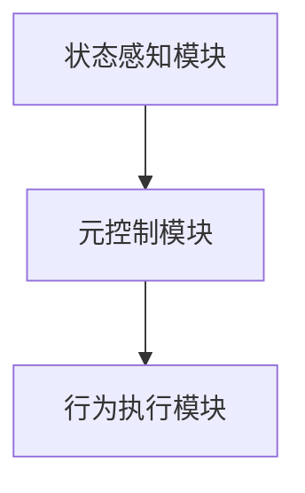
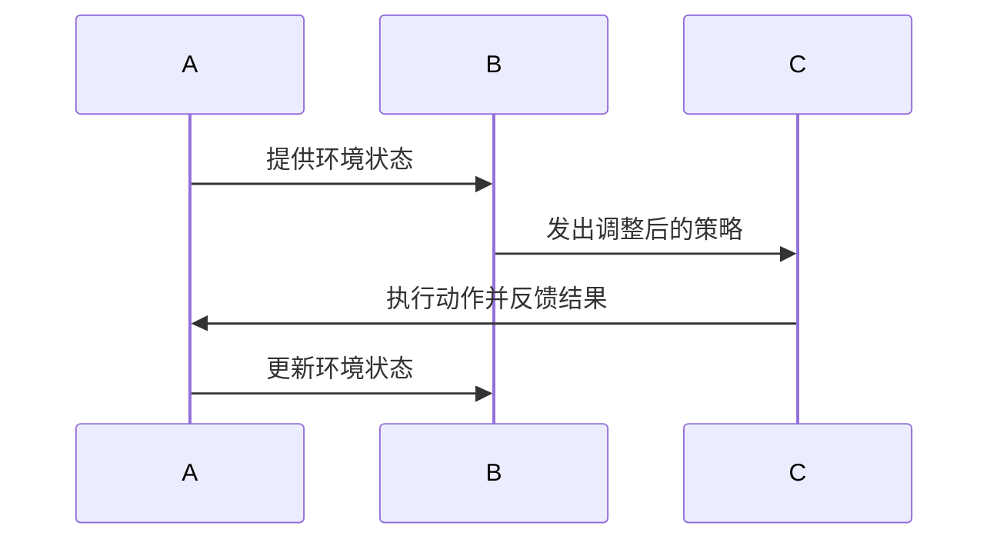

                 


# AI Agent的元控制：自适应行为策略

## 关键词
- AI Agent, 元控制, 自适应行为策略, 系统架构设计, 项目实战

## 摘要
AI Agent的元控制是实现自适应行为策略的核心技术。本文从背景介绍、核心概念、算法原理、系统架构设计、项目实战等多个维度详细探讨AI Agent的元控制。通过数学模型、算法实现、系统交互设计等内容，帮助读者理解如何设计和实现高效的自适应行为策略。文章还结合实际案例，分析了自适应行为策略在不同场景中的应用，并总结了最佳实践和注意事项，为AI Agent的开发提供了实用的指导。

---

# 第一部分: AI Agent的元控制概述

## 第1章: AI Agent与元控制的基本概念

### 1.1 AI Agent的基本概念
#### 1.1.1 AI Agent的定义与特点
- **定义**: AI Agent（智能体）是具有感知环境、决策、执行动作能力的实体。它可以是一个软件程序或物理设备，能够自主完成任务。
- **特点**: 
  1. **自主性**: 能够自主决策和行动，无需外部干预。
  2. **反应性**: 能够实时感知环境变化并做出反应。
  3. **目标导向**: 具有明确的目标，所有行为旨在实现目标。

#### 1.1.2 AI Agent与传统程序的区别
- **自主性**: 传统程序按预设逻辑执行，而AI Agent能够自主决策。
- **环境互动**: AI Agent能与环境互动，传统程序仅在预设环境中运行。
- **学习能力**: AI Agent能够学习和适应，传统程序无法。

### 1.2 元控制的概念与作用
#### 1.2.1 元控制的定义
- **定义**: 元控制是对AI Agent的行为进行监控、分析和调整的上层控制机制，用于优化其行为策略。
- **作用**: 提供更高层次的控制，使AI Agent能够更好地适应复杂环境和任务需求。

#### 1.2.2 元控制与其他控制方式的对比
| 对比项         | 传统控制                | 元控制                |
|----------------|-------------------------|-----------------------|
| 控制层次       | 单层次                  | 多层次（元级）         |
| 适应性         | 有限                   | 强                    |
| 复杂性         | 较低                   | 较高                  |
| 灵活性         | 较低                   | 较高                  |

---

## 第2章: 自适应行为策略的核心概念

### 2.1 自适应行为策略的定义
#### 2.1.1 自适应行为策略的定义
- **定义**: 自适应行为策略是指AI Agent能够根据环境变化动态调整其行为策略，以达到最佳目标。
- **特点**:
  1. **动态调整**: 根据环境反馈实时调整策略。
  2. **目标导向**: 策略调整以实现目标为核心。
  3. **多样性**: 能够适应多种环境和任务。

### 2.2 自适应行为策略的实现机制
#### 2.2.1 状态感知与反馈机制
- **状态感知**: AI Agent通过传感器或接口感知环境状态。
- **反馈机制**: 根据环境反馈调整行为，形成闭环控制。

#### 2.2.2 策略调整与优化
- **策略调整**: 根据反馈结果调整当前策略。
- **策略优化**: 使用强化学习等算法优化长期目标的实现。

---

## 第3章: 元控制在AI Agent中的作用

### 3.1 元控制的核心功能
#### 3.1.1 元控制的功能模块
| 模块         | 功能描述                     |
|--------------|------------------------------|
| 监测模块     | 实时监控环境状态和行为效果     |
| 分析模块     | 分析监测数据，识别问题和机会   |
| 调整模块     | 调整行为策略，优化系统性能     |

### 3.2 元控制与其他控制方式的对比
#### 3.2.1 元控制与反馈控制的对比
- **反馈控制**: 基于当前状态调整行为，适用于简单系统。
- **元控制**: 基于当前和历史数据，调整整体策略，适用于复杂系统。

#### 3.2.2 元控制与分层控制的对比
- **分层控制**: 将系统分为多个层次，每个层次独立控制。
- **元控制**: 对整个系统进行元级控制，协调各层次的策略。

---

## 第4章: 自适应行为策略的数学模型与算法

### 4.1 自适应行为策略的数学模型
#### 4.1.1 状态空间模型
- **状态空间**: 所有可能环境状态的集合。
- **表示方法**: 使用向量表示状态，例如 $s = [s_1, s_2, ..., s_n]$。

#### 4.1.2 动作空间模型
- **动作空间**: 所有可能动作的集合。
- **表示方法**: 使用离散或连续的变量表示动作，例如 $a \in \{1, 2, 3\}$。

### 4.2 元控制的算法实现
#### 4.2.1 基于强化学习的元控制算法
- **强化学习**: 通过奖励机制优化策略。
- **元控制应用**: 使用强化学习优化元控制策略，例如：
  1. **状态感知**: $s_t$ 表示当前状态。
  2. **动作选择**: $a_t$ 表示选择的动作。
  3. **奖励函数**: $r_t = f(s_t, a_t)$ 表示奖励。

#### 4.2.2 基于遗传算法的元控制优化
- **遗传算法**: 通过自然选择优化策略。
- **实现步骤**:
  1. **初始化**: 生成初始策略种群。
  2. **评估**: 根据环境反馈评估每个策略的适应度。
  3. **选择**: 根据适应度选择优秀策略。
  4. **交叉与变异**: 生成新策略并替换种群。
  5. **迭代**: 重复评估、选择、优化过程。

---

## 第5章: 系统架构与交互设计

### 5.1 系统架构设计
#### 5.1.1 系统功能模块划分
- **状态感知模块**: 负责环境状态的感知。
- **元控制模块**: 负责策略的监控和调整。
- **行为执行模块**: 负责执行具体动作。

#### 5.1.2 系统架构图


### 5.2 系统交互设计
#### 5.2.1 系统交互流程
1. **状态感知**: 感知模块获取环境状态。
2. **元控制决策**: 元控制模块根据状态和历史数据调整策略。
3. **行为执行**: 执行模块根据新策略执行动作。
4. **反馈循环**: 反馈机制收集结果，再次调整策略。

#### 5.2.2 交互序列图


---

## 第6章: 项目实战

### 6.1 项目背景与目标
- **背景**: 某AI Agent需要在动态环境中完成任务，如自动驾驶。
- **目标**: 设计一个自适应行为策略，使其在复杂环境中高效完成任务。

### 6.2 环境安装与配置
- **工具安装**: Python、TensorFlow、OpenAI Gym。
- **环境配置**: 安装必要的依赖库，设置开发环境。

### 6.3 核心代码实现
#### 6.3.1 状态感知模块
```python
class StatePerceiver:
    def perceive(self, environment):
        # 返回当前环境状态
        return environment.get_state()
```

#### 6.3.2 元控制模块
```python
class MetaController:
    def __init__(self):
        self.model = self.build_model()
    
    def build_model(self):
        # 构建强化学习模型
        pass
    
    def adjust_strategy(self, state, reward):
        # 根据状态和奖励调整策略
        pass
```

#### 6.3.3 行为执行模块
```python
class ActionExecutor:
    def execute(self, action):
        # 执行具体动作
        pass
```

### 6.4 案例分析与解读
- **案例分析**: 在自动驾驶场景中，AI Agent需要实时调整驾驶策略。
- **策略调整**: 根据交通状况和反馈调整加速、转向等动作。

### 6.5 项目总结
- **成功经验**: 元控制使AI Agent在动态环境中表现更优。
- **遇到问题**: 策略调整过快导致稳定性问题。
- **优化建议**: 增加反馈机制的延迟，平衡策略调整速度。

---

## 第7章: 最佳实践与注意事项

### 7.1 最佳实践
1. **状态感知**: 使用多种传感器提高感知准确性。
2. **策略优化**: 结合强化学习和遗传算法优化策略。
3. **系统架构**: 设计清晰的模块划分，便于维护和扩展。

### 7.2 注意事项
1. **反馈机制**: 设计合理的反馈机制，避免策略震荡。
2. **策略稳定性**: 注意策略调整的稳定性，防止系统崩溃。
3. **环境适应性**: 确保系统能够在多种环境中稳定运行。

---

## 结语
AI Agent的元控制是实现自适应行为策略的关键技术。通过本文的详细讲解，读者可以深入了解元控制的核心概念、算法实现和系统设计。希望本文能为AI Agent的开发提供有价值的指导和参考。

