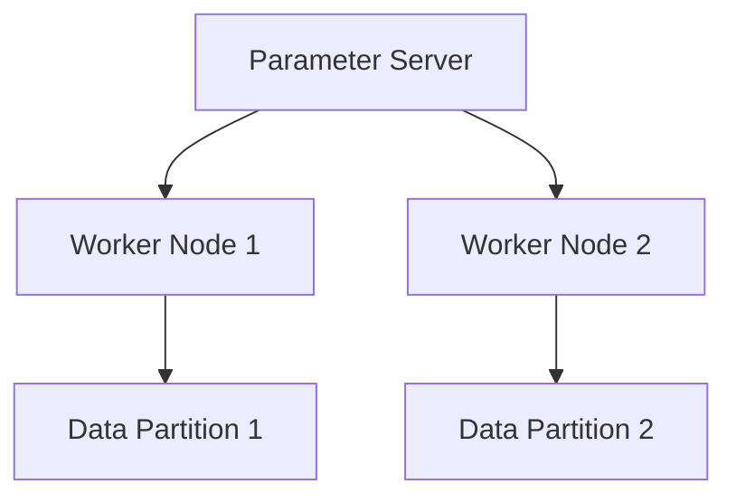

                 

# AI Agent的分布式训练与部署策略

## 关键词：AI Agent，分布式训练，部署策略，机器学习，分布式系统

## 摘要

AI Agent作为人工智能的重要组成部分，正在广泛应用于各个领域。为了提高AI Agent的性能和效率，分布式训练与部署策略变得至关重要。本文将详细探讨AI Agent的分布式训练算法、系统架构设计、部署策略以及项目实战，为读者提供全面的指导。

---

## 第一部分：AI Agent的背景与核心概念

### 第1章：AI Agent概述

#### 1.1 AI Agent的基本概念

AI Agent，即人工智能代理，是指能够感知环境、采取行动以实现目标的智能体。它具备自主性、反应性、社会性、学习能力和规划能力等核心特征。AI Agent的应用场景包括智能推荐系统、自动驾驶、机器人控制、游戏AI等。

#### 1.2 分布式训练与部署的背景

随着AI Agent的应用需求增加，单机训练和部署的效率逐渐成为瓶颈。分布式训练能够有效提升计算效率，而分布式部署则能灵活适应不同的应用场景。然而，分布式系统也带来了通信开销、数据同步等问题，需要精心设计解决方案。

---

## 第二部分：分布式训练的算法原理

### 第2章：分布式训练算法

#### 2.1 分布式训练的基本原理

分布式训练通过将数据分发到多个节点上并行处理，显著提高了训练效率。数据并行和模型并行是两种主要的并行方式。数据并行适用于数据量大但模型较小的场景，而模型并行适用于模型参数多但数据量小的场景。

#### 2.2 分布式梯度下降算法

分布式梯度下降是一种常见的优化算法，通过将计算任务分发到多个节点，并将梯度汇总后更新模型参数。同步更新和异步更新是两种主要的更新方式，同步更新保证了数据一致性，但可能增加通信开销；异步更新提高了训练速度，但可能导致数据不一致。

公式：
$$ \text{损失函数} = \frac{1}{n}\sum_{i=1}^{n}L_i $$
$$ \text{梯度} = \sum_{i=1}^{n}\nabla L_i $$

---

## 第三部分：系统架构与设计

### 第3章：分布式训练系统架构

#### 3.1 系统架构设计

一个典型的分布式训练系统包括多个工人节点和一个参数服务器。工人节点负责处理数据并计算梯度，参数服务器负责汇总梯度并更新模型参数。这种架构既保证了计算效率，又简化了通信机制。

#### 3.2 系统架构图

---

## 第四部分：部署策略与优化

### 第4章：AI Agent的部署策略

#### 4.1 部署环境分析

AI Agent可以在边缘计算和云计算环境中部署。边缘计算适用于实时性要求高、数据量小的场景，而云计算适用于计算资源需求大、数据量大的场景。选择合适的部署环境能够显著提升系统的性能。

#### 4.2 模型优化技术

模型压缩和量化技术是优化AI Agent的重要手段。模型压缩通过剪枝、知识蒸馏等方法减少模型参数数量，量化技术通过降低数据精度减少存储和计算开销。

---

## 第五部分：项目实战与案例分析

### 第5章：分布式训练与部署实战

#### 5.1 项目环境搭建

首先安装必要的库，如TensorFlow、Kubernetes等。配置分布式训练环境，确保各个节点之间的通信畅通。

#### 5.2 分布式训练实现

编写分布式训练代码，实现数据并行或模型并行。例如，在TensorFlow中使用`tf.distribute.Strategy`实现分布式训练。

#### 5.3 模型部署与测试

将训练好的模型部署到目标环境中，进行模型推理和性能测试。确保模型在实际应用中表现良好。

---

## 第六部分：总结与最佳实践

### 第6章：总结与建议

#### 6.1 项目总结

本文详细探讨了AI Agent的分布式训练与部署策略，从算法原理到系统架构，再到实际部署，为读者提供了全面的指导。

#### 6.2 最佳实践

选择合适的分布式训练框架，优化模型结构，降低通信开销，提升系统性能。同时，定期监控和维护分布式系统，确保其稳定运行。

---

通过以上内容，读者可以全面了解AI Agent的分布式训练与部署策略，并能够实际操作，提升AI Agent的应用效果。

