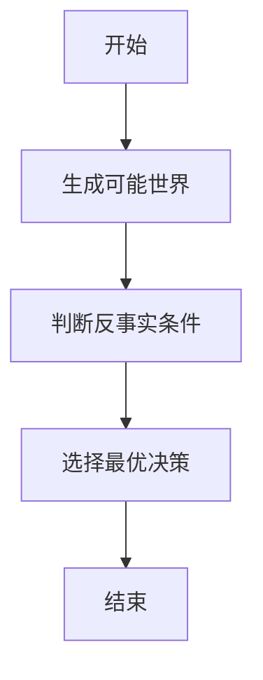
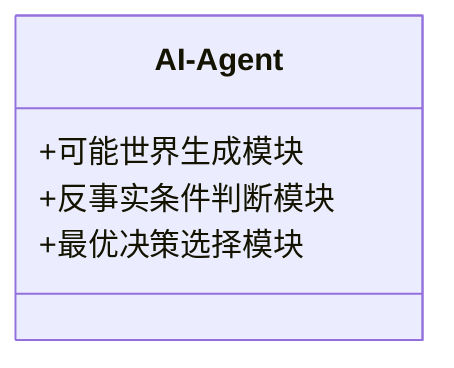

                 


# AI Agent的反事实推理：增强决策能力

## 关键词
AI Agent, 反事实推理, 决策能力, 可能世界模型, 逻辑推理, 数学公式

## 摘要
反事实推理是一种强大的工具，用于增强AI Agent的决策能力。通过考虑可能的假设和替代情景，AI Agent可以在复杂环境中做出更明智的决策。本文将从基本概念到算法实现，再到实际应用，详细探讨反事实推理在AI Agent中的应用，帮助读者理解并掌握这一技术。

---

# 目录

## 第一部分: 反事实推理的基本概念

### 第1章: 问题背景与描述

#### 1.1 传统决策方法的局限性
传统的决策方法，如基于事实的推理，往往只能依赖已有的数据和信息进行决策。这种方法在面对不确定性和潜在的多种可能性时显得力不从心，无法有效地探索和评估假设情景。

#### 1.2 反事实推理的提出与意义
反事实推理是一种新兴的决策方法，它允许AI Agent考虑“如果情况是这样的，结果会如何”的假设情景。这种方法在复杂和不确定的环境中，能够帮助AI Agent做出更灵活和优化的决策。

#### 1.3 反事实推理的定义与目标
反事实推理是指在AI Agent中，通过构造和评估可能的假设情景，来增强决策能力和灵活性。其目标是在复杂环境中，通过考虑多种可能的假设，找到最优的决策方案。

### 第2章: 反事实推理的核心概念与联系

#### 2.1 反事实推理的原理
反事实推理基于可能世界语义学，通过构建不同的可能世界模型，评估每个假设情景下的结果，从而选择最优的决策。

#### 2.2 反事实推理与事实推理的对比
事实推理依赖于已有的事实和数据，而反事实推理则构建假设情景。两者的区别在于，事实推理处理现实情况，反事实推理处理假设情况。

## 第二部分: 反事实推理的算法原理

### 第3章: 算法流程

#### 3.1 可能世界生成
生成可能世界模型，考虑不同的假设情景。

#### 3.2 反事实条件判断
评估每个可能世界下的条件是否满足反事实推理的要求。

#### 3.3 最优决策选择
在满足条件的可能世界中，选择最优的决策方案。

### 第4章: 算法实现

#### 4.1 Mermaid算法流程图


#### 4.2 Python实现示例
```python
def generate_possible_worlds(data):
    # 生成可能世界模型
    pass

def evaluate_counterfactual_conditions(worlds):
    # 评估反事实条件
    pass

def select_optimal_decision(worlds, conditions):
    # 选择最优决策
    pass
```

## 第三部分: 系统分析与架构设计

### 第5章: 系统功能设计

#### 5.1 领域模型


### 第6章: 系统架构设计

#### 6.1 Mermaid架构图


## 第四部分: 项目实战

### 第7章: 实际案例分析

#### 7.1 环境配置
说明如何配置开发环境，包括安装必要的库和工具。

#### 7.2 核心代码实现
详细展示核心代码的实现，包括可能世界生成、反事实条件判断和最优决策选择的实现。

#### 7.3 功能解读与分析
解读每个模块的功能，并分析其在反事实推理中的作用。

## 第五部分: 最佳实践与总结

### 第8章: 小结与注意事项

#### 8.1 小结
总结反事实推理的核心概念和算法实现，强调其在AI Agent中的重要性。

#### 8.2 注意事项
提醒读者在实际应用中需要注意的事项，如数据质量、假设情景的合理性等。

### 第9章: 未来研究方向

#### 9.1 反事实推理的扩展应用
探讨反事实推理在其他领域的潜在应用，如医疗诊断、金融投资等。

#### 9.2 技术改进方向
提出如何进一步优化反事实推理算法，提升其效率和准确性。

---

通过以上目录结构，我们可以系统地学习和掌握反事实推理在AI Agent中的应用，从理论到实践，全面增强AI Agent的决策能力。

