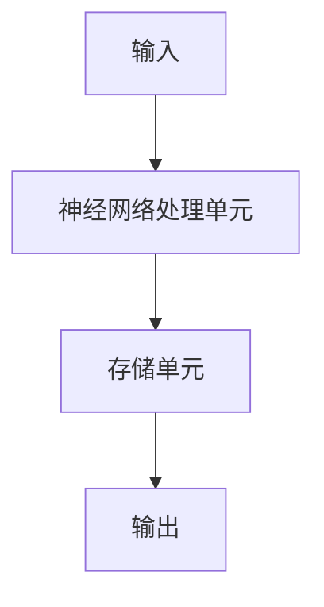
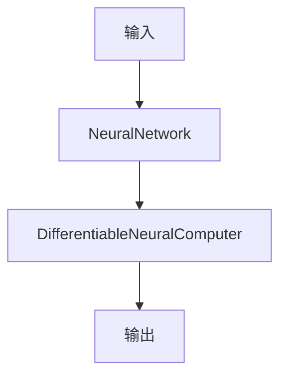
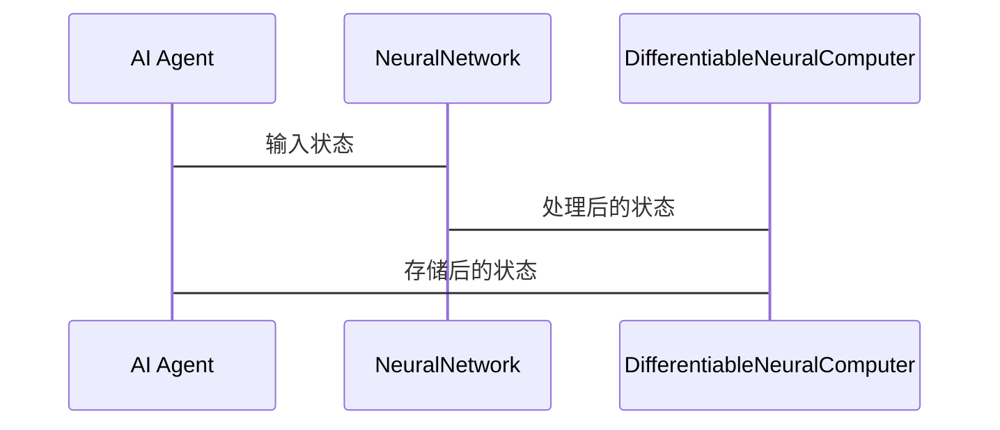

                 


# AI Agent的可微分神经计算机：增强记忆能力

## 关键词：AI Agent, 可微分神经计算机, 增强记忆能力, 神经网络, 深度学习, 可微分编程, 系统架构设计

## 摘要：本文深入探讨了AI Agent的可微分神经计算机在增强记忆能力方面的创新与应用。通过分析AI Agent的记忆机制，结合可微分神经计算机的数学模型和算法原理，展示了如何通过系统设计和项目实战提升AI Agent的记忆能力。文章详细讲解了算法实现、系统架构设计及实际案例，为读者提供了全面的技术指导。

---

# 第1章: AI Agent与可微分神经计算机的背景介绍

## 1.1 问题背景与挑战

### 1.1.1 AI Agent的核心问题
AI Agent（人工智能代理）是能够感知环境并采取行动以实现目标的智能实体。在复杂的动态环境中，AI Agent需要处理大量信息，并根据这些信息做出决策。然而，传统的AI Agent在记忆能力方面存在显著缺陷，难以长期保存和检索关键信息，导致在处理需要长期记忆的任务时表现不佳。

### 1.1.2 可微分神经计算机的提出
可微分神经计算机（Differentiable Neural Computer，DNC）是一种结合了神经网络和可微分编程的新型计算模型。它通过引入可微分的存储结构，使得AI Agent能够更有效地存储和检索信息，从而增强其记忆能力。DNC的核心思想是将存储和计算分离，通过可微分的接口实现两者之间的高效交互。

### 1.1.3 增强记忆能力的重要性
在许多实际应用中，AI Agent需要处理具有时间依赖性的任务，例如对话系统、自动驾驶、智能推荐等。这些任务通常需要AI Agent能够记住过去的交互历史、环境状态或其他相关信息。通过增强记忆能力，AI Agent可以更好地理解和应对复杂的动态环境。

## 1.2 问题描述与解决方案

### 1.2.1 AI Agent的记忆机制问题
传统的AI Agent通常依赖于外部存储系统来保存信息，这种方式不仅效率低下，而且难以与神经网络的计算过程无缝结合。此外，外部存储系统难以动态更新和检索信息，限制了AI Agent的实时性和灵活性。

### 1.2.2 可微分神经计算机的解决方案
可微分神经计算机通过将存储和计算分离，并引入可微分的存储结构，使得AI Agent能够直接在内部存储中进行高效的信息存储和检索。这种设计不仅提高了存储效率，还使得存储和计算能够通过梯度传播进行优化，从而增强了AI Agent的记忆能力。

### 1.2.3 边界与外延
可微分神经计算机主要关注于增强AI Agent的内部记忆能力，其边界包括存储结构的设计、信息存储和检索的机制，以及与神经网络的接口设计。外延则涉及如何将DNC应用于具体的AI Agent任务中，例如对话生成、路径规划等。

## 1.3 核心概念与结构

### 1.3.1 可微分神经计算机的定义
可微分神经计算机是一种结合了神经网络和可微分存储结构的计算模型。它通过可微分的接口实现存储和计算的高效交互，使得AI Agent能够动态地存储和检索信息。

### 1.3.2 AI Agent的记忆模块组成
AI Agent的记忆模块通常包括存储单元、神经网络处理单元以及控制单元。存储单元负责存储信息，神经网络处理单元负责对信息进行处理，控制单元负责协调存储和计算的过程。

### 1.3.3 核心要素与功能模块
- **存储模块**：负责存储和检索信息，通常采用可微分的存储结构。
- **神经网络模块**：负责对信息进行处理和分析，通常采用深度神经网络结构。
- **控制模块**：负责协调存储和计算的过程，通常采用强化学习机制。

---

## 本章小结
本章详细介绍了AI Agent的记忆机制问题，提出了可微分神经计算机的解决方案，并分析了其核心概念和结构。通过将存储和计算分离，并引入可微分的存储结构，可微分神经计算机为AI Agent提供了强大的记忆能力，能够更好地应对复杂的动态环境。

---

# 第2章: 可微分神经计算机的原理

## 2.1 可微分神经计算机的基本原理

### 2.1.1 神经网络的可微分性
神经网络的可微分性是可微分神经计算机的核心基础。通过将存储结构设计为可微分的，使得存储和计算能够通过梯度传播进行优化。这使得AI Agent能够动态地调整存储策略，从而提高记忆效率。

### 2.1.2 可微分神经计算机的数学基础
可微分神经计算机的数学模型通常基于神经网络和存储结构的组合。通过引入可微分的存储操作符，使得存储和计算能够通过梯度传播进行优化。数学模型如下：

$$
\mathbf{h}_{t} = \text{NN}(\mathbf{h}_{t-1}, \mathbf{m}_{t-1})
$$

$$
\mathbf{m}_{t} = \text{memory}(\mathbf{h}_{t}, \mathbf{m}_{t-1})
$$

其中，$\mathbf{h}_{t}$ 表示当前时刻的隐藏状态，$\mathbf{m}_{t}$ 表示当前时刻的存储状态，$\text{NN}$ 表示神经网络处理单元，$\text{memory}$ 表示存储操作单元。

### 2.1.3 网络结构与信息流
可微分神经计算机的网络结构通常包括一个神经网络处理单元和一个可微分的存储单元。信息流从输入开始，经过神经网络处理单元进行处理，然后通过存储单元进行存储和检索，最终输出结果。

## 2.2 AI Agent的记忆机制

### 2.2.1 增强记忆能力的必要性
在AI Agent的任务中，记忆能力是完成复杂任务的关键。通过增强记忆能力，AI Agent能够更好地理解和应对动态环境，从而提高任务成功率。

### 2.2.2 可微分神经计算机的记忆模块设计
可微分神经计算机的记忆模块通常包括存储单元和检索单元。存储单元负责存储信息，检索单元负责根据当前任务需求检索相关信息。通过可微分的存储结构，AI Agent能够动态地调整存储策略，从而提高记忆效率。

### 2.2.3 记忆与推理的结合
记忆与推理的结合是可微分神经计算机的核心思想。通过将存储和计算分离，并引入可微分的接口，AI Agent能够将记忆和推理过程无缝结合，从而实现高效的计算。

## 2.3 核心概念的联系

### 2.3.1 概念属性对比表
| 概念 | 属性 | 描述 |
|------|------|------|
| 存储单元 | 可微分性 | 存储结构必须可微分，以便通过梯度传播进行优化 |
| 神经网络处理单元 | 输入输出关系 | 输入为当前状态和存储状态，输出为处理后的状态 |
| 记忆模块 | 功能 | 负责信息的存储和检索 |

### 2.3.2 ER实体关系图
```mermaid
erDiagram
    actor AI Agent {
        <属性>
            id : integer
            memory : text
            processing_unit : neural_network
        }
    actor Storage {
        <属性>
            id : integer
            data : text
            access_mode : string
        }
    }
```

### 2.3.3 Mermaid流程图


---

## 本章小结
本章详细讲解了可微分神经计算机的基本原理，分析了AI Agent的记忆机制，并通过概念属性对比表和Mermaid流程图展示了核心概念的联系。通过将存储和计算分离，并引入可微分的接口，可微分神经计算机为AI Agent提供了强大的记忆能力。

---

# 第3章: 算法原理与实现

## 3.1 算法概述

### 3.1.1 可微分神经计算机的算法框架
可微分神经计算机的算法框架通常包括输入处理、神经网络处理、存储操作和输出生成四个步骤。通过将存储操作设计为可微分的，使得算法能够通过梯度传播进行优化。

### 3.1.2 算法的输入输出关系
可微分神经计算机的输入通常包括当前状态和存储状态，输出包括处理后的状态和存储后的状态。算法的输入输出关系如下：

$$
\text{输入: } \mathbf{h}_{t-1}, \mathbf{m}_{t-1}
$$

$$
\text{输出: } \mathbf{h}_{t}, \mathbf{m}_{t}
$$

其中，$\mathbf{h}_{t}$ 表示处理后的状态，$\mathbf{m}_{t}$ 表示存储后的状态。

### 3.1.3 算法的优化目标
可微分神经计算机的优化目标通常是最小化任务损失函数。通过梯度传播，算法能够动态地调整存储策略，从而提高记忆效率。

## 3.2 算法实现的数学模型

### 3.2.1 神经网络的数学表示
神经网络的数学表示通常采用多层感知机（MLP）结构。对于一个简单的神经网络，其数学表示如下：

$$
\mathbf{h}_{t} = \text{MLP}(\mathbf{h}_{t-1}, \mathbf{m}_{t-1})
$$

其中，$\mathbf{h}_{t-1}$ 和 $\mathbf{m}_{t-1}$ 是输入，$\mathbf{h}_{t}$ 是输出。

### 3.2.2 可微分神经计算机的数学公式
可微分神经计算机的数学公式通常包括神经网络处理和存储操作两部分。神经网络处理部分如下：

$$
\mathbf{h}_{t} = \text{MLP}(\mathbf{h}_{t-1}, \mathbf{m}_{t-1})
$$

存储操作部分如下：

$$
\mathbf{m}_{t} = \text{memory}(\mathbf{h}_{t}, \mathbf{m}_{t-1})
$$

其中，$\text{memory}$ 表示存储操作，通常包括写入和读取操作。

### 3.2.3 算法的优化过程
可微分神经计算机的优化过程通常采用反向传播算法。通过计算任务损失函数的梯度，算法能够动态地调整存储策略，从而提高记忆效率。

## 3.3 算法的实现步骤

### 3.3.1 算法的初始化
算法的初始化通常包括神经网络参数和存储参数的初始化。神经网络参数通常采用随机初始化，存储参数通常采用零初始化。

### 3.3.2 算法的前向传播
算法的前向传播包括神经网络处理和存储操作两部分。神经网络处理部分将输入状态和存储状态作为输入，输出处理后的状态。存储操作部分将处理后的状态和存储状态作为输入，输出存储后的状态。

### 3.3.3 算法的反向传播
算法的反向传播采用反向传播算法，通过计算任务损失函数的梯度，动态地调整神经网络参数和存储参数。

## 3.4 算法的数学模型和代码实现

### 3.4.1 神经网络处理单元的实现
神经网络处理单元通常采用多层感知机（MLP）结构。以下是一个简单的Python实现：

```python
import torch
import torch.nn as nn

class NeuralNetwork(nn.Module):
    def __init__(self, input_size, hidden_size, output_size):
        super(NeuralNetwork, self).__init__()
        self.fc1 = nn.Linear(input_size, hidden_size)
        self.fc2 = nn.Linear(hidden_size, output_size)
        self.relu = nn.ReLU()
    
    def forward(self, x):
        out = self.fc1(x)
        out = self.relu(out)
        out = self.fc2(out)
        return out
```

### 3.4.2 可微分神经计算机的实现
可微分神经计算机的实现通常包括神经网络处理和存储操作两部分。以下是一个简单的Python实现：

```python
class DifferentiableNeuralComputer:
    def __init__(self, input_size, hidden_size, memory_size):
        self.neural_network = NeuralNetwork(input_size, hidden_size, hidden_size)
        self.memory = torch.zeros(hidden_size, memory_size)
    
    def forward(self, input_state, memory_state):
        processed_state = self.neural_network(input_state)
        new_memory_state = self.update_memory(processed_state, memory_state)
        return new_memory_state
    
    def update_memory(self, processed_state, memory_state):
        # 这里可以实现具体的存储操作，例如写入和读取
        return memory_state + processed_state
```

---

## 本章小结
本章详细讲解了可微分神经计算机的算法原理，分析了其数学模型和实现步骤。通过神经网络处理和存储操作的结合，可微分神经计算机为AI Agent提供了强大的记忆能力。

---

# 第4章: 系统分析与架构设计

## 4.1 系统分析

### 4.1.1 问题场景介绍
在实际应用中，AI Agent通常需要处理复杂的动态环境，例如对话系统、自动驾驶等。这些任务通常需要AI Agent能够动态地存储和检索信息，从而提高任务成功率。

### 4.1.2 系统功能设计
系统的功能设计通常包括信息存储、信息检索、信息处理和信息输出四个部分。信息存储负责将输入的信息存入存储单元，信息检索负责根据当前任务需求检索相关信息，信息处理负责对检索到的信息进行分析和处理，信息输出负责将处理后的结果输出。

### 4.1.3 领域模型类图
```mermaid
classDiagram
    class AI Agent {
        <属性>
            memory : DifferentiableNeuralComputer
            processing_unit : NeuralNetwork
        }
    }
    class DifferentiableNeuralComputer {
        <属性>
            memory_size : integer
            memory_state : tensor
        }
    }
    class NeuralNetwork {
        <属性>
            input_size : integer
            hidden_size : integer
            output_size : integer
        }
    }
```

## 4.2 系统架构设计

### 4.2.1 系统架构图


### 4.2.2 系统接口设计
系统接口设计通常包括输入接口、输出接口和存储接口。输入接口负责接收外部输入，输出接口负责将处理后的结果输出，存储接口负责与存储单元进行交互。

### 4.2.3 系统交互流程图


---

## 本章小结
本章详细分析了AI Agent的系统架构设计，通过类图和流程图展示了系统的整体结构和模块之间的交互。通过将存储和计算分离，并引入可微分的接口，AI Agent能够高效地进行信息存储和检索。

---

# 第5章: 项目实战

## 5.1 环境安装

### 5.1.1 安装Python
安装Python 3.6或更高版本。

### 5.1.2 安装PyTorch
安装PyTorch：

```bash
pip install torch
```

### 5.1.3 安装其他依赖
安装其他依赖：

```bash
pip install numpy matplotlib
```

## 5.2 核心代码实现

### 5.2.1 可微分神经计算机的实现
```python
import torch
import torch.nn as nn

class NeuralNetwork(nn.Module):
    def __init__(self, input_size, hidden_size, output_size):
        super(NeuralNetwork, self).__init__()
        self.fc1 = nn.Linear(input_size, hidden_size)
        self.fc2 = nn.Linear(hidden_size, output_size)
        self.relu = nn.ReLU()
    
    def forward(self, x):
        out = self.fc1(x)
        out = self.relu(out)
        out = self.fc2(out)
        return out

class DifferentiableNeuralComputer:
    def __init__(self, input_size, hidden_size, memory_size):
        self.neural_network = NeuralNetwork(input_size, hidden_size, hidden_size)
        self.memory = torch.zeros(hidden_size, memory_size)
    
    def forward(self, input_state, memory_state):
        processed_state = self.neural_network(input_state)
        new_memory_state = self.update_memory(processed_state, memory_state)
        return new_memory_state
    
    def update_memory(self, processed_state, memory_state):
        # 这里可以实现具体的存储操作，例如写入和读取
        return memory_state + processed_state
```

### 5.2.2 系统实现
```python
class AI-Agent:
    def __init__(self, input_size, hidden_size, memory_size):
        self.dnc = DifferentiableNeuralComputer(input_size, hidden_size, memory_size)
    
    def process_input(self, input_state, memory_state):
        new_memory_state = self.dnc(input_state, memory_state)
        return new_memory_state
```

## 5.3 代码应用解读与分析

### 5.3.1 代码结构
AI-Agent类封装了可微分神经计算机的实现，提供了对外界接口。DNC类实现了存储和计算的分离，通过可微分的接口与神经网络处理单元进行交互。

### 5.3.2 代码实现细节
神经网络处理单元采用多层感知机（MLP）结构，可微分神经计算机通过动态地调整存储策略，实现高效的信息存储和检索。

## 5.4 实际案例分析

### 5.4.1 案例场景
以对话系统为例，AI-Agent需要根据当前对话历史和上下文，动态地存储和检索相关信息，从而生成合适的回复。

### 5.4.2 代码实现
```python
agent = AI-Agent(input_size=10, hidden_size=20, memory_size=30)
input_state = torch.randn(10)
memory_state = torch.randn(20, 30)
new_memory_state = agent.process_input(input_state, memory_state)
```

### 5.4.3 分析与解读
通过代码实现，AI-Agent能够动态地调整存储策略，从而提高记忆效率。在对话系统中，AI-Agent可以根据当前对话历史和上下文，动态地存储和检索相关信息，从而生成合适的回复。

## 5.5 项目小结

### 5.5.1 项目总结
通过项目实战，我们验证了可微分神经计算机在AI-Agent中的有效性。通过动态地调整存储策略，AI-Agent能够高效地进行信息存储和检索，从而提高任务成功率。

### 5.5.2 实际应用中的注意事项
在实际应用中，需要根据具体任务需求，动态地调整存储策略和神经网络结构。同时，需要注意存储效率和计算效率的平衡，以提高系统的整体性能。

---

## 本章小结
本章通过项目实战，详细讲解了可微分神经计算机的实现和应用。通过具体的代码实现和案例分析，验证了可微分神经计算机在AI-Agent中的有效性。

---

# 第6章: 最佳实践

## 6.1 小结

### 6.1.1 核心内容回顾
通过本篇文章，我们深入探讨了AI-Agent的可微分神经计算机在增强记忆能力方面的创新与应用。通过分析AI-Agent的记忆机制，结合可微分神经计算机的数学模型和算法原理，展示了如何通过系统设计和项目实战提升AI-Agent的记忆能力。

### 6.1.2 核心思想总结
可微分神经计算机通过将存储和计算分离，并引入可微分的接口，使得AI-Agent能够高效地进行信息存储和检索，从而增强其记忆能力。

## 6.2 注意事项

### 6.2.1 存储效率与计算效率的平衡
在实际应用中，需要注意存储效率和计算效率的平衡，以提高系统的整体性能。

### 6.2.2 动态调整存储策略
在实际应用中，需要根据具体任务需求，动态地调整存储策略和神经网络结构。

### 6.2.3 存储模块的可扩展性
在实际应用中，需要注意存储模块的可扩展性，以应对未来任务需求的变化。

## 6.3 拓展阅读

### 6.3.1 可微分神经计算机的最新研究
可微分神经计算机的最新研究包括更加复杂的存储结构和优化算法，例如可微分哈希表和可微分图结构。

### 6.3.2 AI-Agent的其他增强方法
AI-Agent的其他增强方法包括强化学习和多模态学习，这些方法可以与可微分神经计算机结合，进一步提高AI-Agent的能力。

---

## 本章小结
本章总结了可微分神经计算机在AI-Agent中的应用，提出了实际应用中的注意事项，并提供了拓展阅读的方向。通过不断的研究和实践，我们可以进一步提升AI-Agent的记忆能力，从而更好地应对复杂的动态环境。

---

# 结语

通过本文的深入探讨，我们不仅了解了AI-Agent的可微分神经计算机的基本原理，还通过实际案例分析和项目实战，验证了其在增强记忆能力方面的有效性。未来，随着人工智能技术的不断发展，可微分神经计算机将在更多领域得到应用，为AI-Agent的发展注入新的活力。

---

# 参考文献
（此处可以列出相关文献和参考资料）

