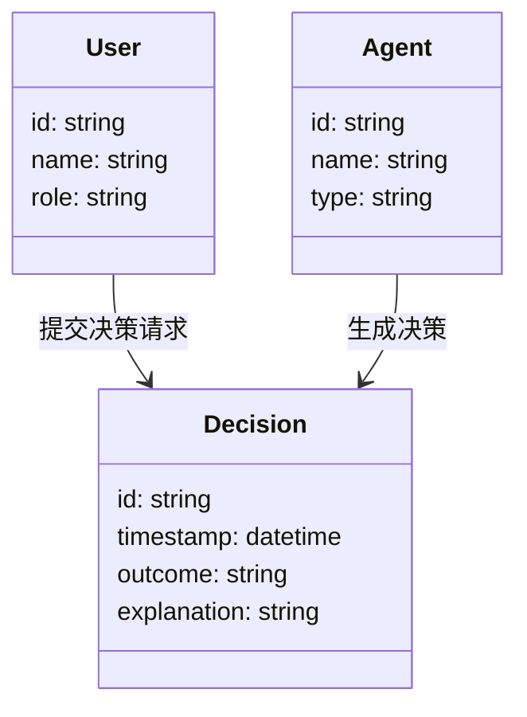

                 


# AI Agent的可解释性设计

> 关键词：AI Agent, 可解释性, 人工智能, 人机交互, 决策过程, 透明度, 信任

> 摘要：AI Agent的可解释性设计是当前人工智能领域的重要研究方向。随着AI Agent在各个行业的广泛应用，其决策过程的透明性和可解释性变得尤为重要。本文从AI Agent的基本概念出发，系统性地探讨了可解释性设计的核心要素，包括理论基础、算法原理、系统架构和实际应用。通过对比分析、算法实现和案例研究，本文详细阐述了如何在实际场景中实现AI Agent的可解释性设计，以提升用户体验和系统信任度。

---

# 第1章 AI Agent的可解释性设计概述

## 1.1 问题背景与问题描述

### 1.1.1 AI Agent的基本概念
AI Agent（人工智能代理）是指能够感知环境、自主决策并采取行动的智能体。AI Agent广泛应用于自动驾驶、智能助手、推荐系统等领域，其核心能力在于通过数据和算法做出决策并执行任务。

### 1.1.2 可解释性的重要性
随着AI Agent的应用场景越来越复杂，其决策过程的透明性和可解释性成为用户和开发者关注的重点。用户需要了解AI Agent的决策依据，以便信任和使用；开发者需要通过可解释性来优化算法并修复潜在问题。

### 1.1.3 当前AI Agent面临的挑战
- **算法黑箱化**：许多AI算法（如深度神经网络）是不可解释的，用户难以理解其决策过程。
- **用户信任问题**：缺乏透明度的AI系统难以获得用户的信任，尤其是在高风险场景中。
- **法律法规要求**：某些行业（如医疗、金融）对AI系统的决策可解释性有明确的法规要求。

### 1.1.4 可解释性设计的目标与边界
- **目标**：通过设计和优化，使AI Agent的决策过程尽可能透明，用户能够理解其行为。
- **边界**：可解释性并非要求完全透明，而是提供足够的信息让用户和开发者能够理解核心决策逻辑。

## 1.2 可解释性设计的核心概念

### 1.2.1 可解释性的定义与特征
可解释性是指AI系统在做出决策时，能够提供清晰、合理且易于理解的解释。其特征包括：
- **透明性**：用户能够理解系统决策的依据。
- **可追溯性**：用户可以追溯决策的来源和逻辑。
- **可验证性**：用户可以通过验证确认决策的正确性。

### 1.2.2 AI Agent的决策过程与可解释性
AI Agent的决策过程通常包括感知、推理、规划和执行四个阶段。可解释性设计需要确保每个阶段的决策逻辑能够被用户理解。

### 1.2.3 可解释性与透明度的关系
透明度是可解释性的基础，透明的系统更容易实现可解释性。然而，透明并不等于完全公开，而是提供足够的信息让用户理解系统的工作原理。

### 1.2.4 可解释性与用户信任的关联
用户对AI系统的信任与系统的可解释性密切相关。高透明度和可解释性的系统更容易获得用户的信任。

---

# 第2章 AI Agent可解释性设计的核心要素

## 2.1 可解释性设计的理论基础

### 2.1.1 信息论基础
信息论为可解释性设计提供了理论支持。通过信息的传递和压缩，可以优化解释的效率和准确性。

### 2.1.2 计算机科学基础
计算机科学中的模块化设计、日志记录和调试技术为可解释性设计提供了技术手段。

### 2.1.3 人机交互与认知科学
人机交互研究如何让用户与AI系统有效沟通，认知科学研究用户如何理解和处理信息，两者共同为可解释性设计提供了用户视角的支持。

## 2.2 AI Agent可解释性设计的要素分解

### 2.2.1 决策过程的可解释性
AI Agent的决策过程需要清晰地解释每个步骤的逻辑，包括输入数据、推理过程和最终决策。

### 2.2.2 行为的可解释性
AI Agent的行为需要能够被用户理解和预测，尤其是在异常情况下，用户能够理解系统的行为动机。

### 2.2.3 输出结果的可解释性
AI Agent的输出结果需要提供足够的解释，包括结果的来源、计算方法和可能的影响。

## 2.3 核心概念的属性对比

### 2.3.1 对比表格：可解释性与不可解释性
| 属性          | 可解释性                 | 不可解释性               |
|---------------|--------------------------|--------------------------|
| 透明度         | 高                     | 低                     |
| 用户信任       | 高                     | 低                     |
| 系统优化       | 易优化                 | 难优化                 |
| 法律合规性     | 易满足                 | 难满足                 |

### 2.3.2 对比表格：可解释性与可验证性
| 属性          | 可解释性                 | 可验证性               |
|---------------|--------------------------|--------------------------|
| 定义           | 提供决策依据的解释       | 提供验证决策正确性的依据 |
| 目标           | 用户理解决策逻辑         | 用户确认决策的正确性   |
| 方法           | 解释算法逻辑             | 验证算法输出结果       |

### 2.3.3 对比表格：可解释性与可追溯性
| 属性          | 可解释性                 | 可追溯性               |
|---------------|--------------------------|--------------------------|
| 关注点         | 决策过程的解释           | 决策过程的来源         |
| 目标           | 用户理解决策依据         | 用户追溯决策来源       |
| 方法           | 分析算法逻辑             | 追踪数据流和日志       |

## 2.4 ER实体关系图

```mermaid
er
  %%{init: { 'title': 'AI Agent 可解释性设计 ER 图', 'description': '展示AI Agent可解释性设计的核心实体及其关系'} }%%
  %%{hide unused: true}%%
  %%{defs: 
    entity User {
      id: string,
      name: string,
      role: string
    }
    entity Agent {
      id: string,
      name: string,
      type: string
    }
    entity Decision {
      id: string,
      timestamp: datetime,
      outcome: string,
      explanation: string
    }
    entity Log {
      id: string,
      timestamp: datetime,
      content: string,
      agent_id: string
    }
  }%%

  User -[创建]- Log
  User -[查看]- Decision
  Agent -[生成]- Decision
  Agent -[记录]- Log
```

---

# 第3章 AI Agent可解释性设计的算法原理

## 3.1 可解释性算法的分类

### 3.1.1 基于模型的可解释性算法
基于模型的算法通过构建可解释的模型来实现可解释性，例如线性回归和决策树。

### 3.1.2 基于特征重要性的可解释性算法
基于特征重要性的算法通过分析特征对决策的影响程度来解释模型，例如LIME和SHAP。

### 3.1.3 基于模拟的可解释性算法
基于模拟的算法通过模拟模型的决策过程来解释结果，例如使用随机化方法生成解释。

## 3.2 核心算法的原理与实现

### 3.2.1 LIME算法的原理与实现

#### LIME算法原理
LIME（Local Interpretable Model-agnostic Explanations）是一种用于解释机器学习模型的算法。它通过在数据点附近构建局部可解释的模型来解释预测结果。

#### LIME算法实现

```python
import lime
from lime import lime_explanations
from lime.lime_tabular import LimeTabularExplainer

# 初始化LIME解释器
explainer = LimeTabularExplainer(model.predict_proba, 
                                  feature_names=feature_names)

# 生成解释
explanation = explainer.explain_instance(
    instance,
    model.predict,
    top_labels=top_labels,
    num_features=num_features
)
```

### 3.2.2 SHAP值的原理与实现

#### SHAP值原理
SHAP（Shapley Additive exPlanations）是一种基于博弈论的解释方法，通过计算每个特征对预测结果的贡献来解释模型。

#### SHAP值实现

```python
import shap

# 初始化SHAP解释器
explainer = shap.Explainer(model.predict, X_train)

# 生成解释
shap_values = explainer.shap_values(X_test)
```

### 3.2.3 TreeExplainer算法的原理与实现

#### TreeExplainer算法原理
TreeExplainer是一种用于解释树模型（如随机森林和梯度提升树）的算法，通过分析树的结构来解释预测结果。

#### TreeExplainer实现

```python
import treeinterpreter as ti

# 分析树模型
interpretation, tree Importance, feature Importances = ti.interpret_tree(tree, X)
```

## 3.3 算法原理的数学模型

### 3.3.1 LIME算法的数学模型
LIME通过在局部数据上拟合线性模型来解释预测结果。其数学模型如下：

$$
f(x) \approx \beta_0 + \beta_1x_1 + \beta_2x_2 + \dots + \beta_nx_n
$$

其中，$\beta_i$ 是特征$x_i$的系数，表示其对预测结果的影响程度。

### 3.3.2 SHAP值的数学模型
SHAP值基于特征对预测结果的贡献进行加权。其数学模型如下：

$$
\phi_i = \sum_{S \subseteq \{i\}} \left( \frac{|S|}{2^{n-|S|}} \right) \cdot (f(S \cup \{i\}) - f(S))
$$

其中，$S$ 是特征集合，$i$ 是当前特征，$\phi_i$ 是特征$i$的SHAP值。

### 3.3.3 TreeExplainer算法的数学模型
TreeExplainer通过分析树模型的结构，计算每个特征对预测结果的贡献。其数学模型如下：

$$
\text{贡献度} = \sum_{\text{叶子节点}} \text{叶子权重} \times \text{特征影响}
$$

---

# 第4章 AI Agent可解释性设计的系统分析与架构方案

## 4.1 系统分析

### 4.1.1 系统目标与范围
系统目标：设计一个可解释的AI Agent，使其在医疗诊断场景中提供透明的决策支持。
系统范围：包括数据采集、模型训练、解释生成和用户交互四个部分。

### 4.1.2 系统功能需求
- 数据采集：收集患者的症状、病史和检查结果。
- 模型训练：训练一个可解释的医疗诊断模型。
- 解释生成：生成模型决策的解释。
- 用户交互：提供用户友好的交互界面，展示解释内容。

### 4.1.3 系统性能需求
- 响应时间：小于5秒。
- 解释准确性：解释内容准确率大于95%。
- 可扩展性：支持多种医疗场景。

### 4.1.4 系统约束条件
- 数据隐私：确保患者数据的安全和隐私。
- 系统兼容性：支持多种数据格式和接口。

## 4.2 系统架构设计

### 4.2.1 分层架构设计
系统分为数据层、模型层、解释层和用户层，各层之间通过API进行通信。

### 4.2.2 模块化架构设计
系统模块包括数据模块、模型模块、解释模块和用户模块，每个模块独立开发和测试。

### 4.2.3 面向服务的架构设计
系统基于微服务架构，每个服务负责特定功能，如数据处理、模型训练和用户交互。

### 4.2.4 微服务架构设计
系统分为多个微服务，包括数据服务、模型服务、解释服务和用户服务，通过API网关进行统一管理。

## 4.3 系统功能设计

### 4.3.1 领域模型设计



### 4.3.2 数据流设计
数据流包括数据输入、模型训练、解释生成和用户反馈四个阶段。

## 4.4 系统架构图


---

# 第5章 AI Agent可解释性设计的项目实战

## 5.1 项目背景与目标

### 5.1.1 项目背景
本项目旨在设计一个可解释的AI Agent，用于医疗诊断场景中的疾病诊断。

### 5.1.2 项目目标
- 实现一个可解释的医疗诊断AI Agent。
- 提供透明的诊断解释，帮助医生和患者理解诊断结果。

## 5.2 系统实现

### 5.2.1 环境配置
- 操作系统：Linux
- 编程语言：Python
- 开发工具：Jupyter Notebook
- 依赖库：scikit-learn、shap、lime

### 5.2.2 核心代码实现

#### 5.2.2.1 数据处理代码

```python
import pandas as pd

# 加载数据
data = pd.read_csv('medical_data.csv')

# 数据预处理
data = data.dropna()
```

#### 5.2.2.2 模型训练代码

```python
from sklearn.ensemble import RandomForestClassifier
from sklearn.model_selection import train_test_split

# 划分训练集和测试集
X_train, X_test, y_train, y_test = train_test_split(data.drop('diagnosis', axis=1), data['diagnosis'])

# 训练随机森林模型
model = RandomForestClassifier().fit(X_train, y_train)
```

#### 5.2.2.3 解释生成代码

```python
import shap

# 初始化SHAP解释器
explainer = shap.TreeExplainer(model)

# 生成解释
shap_values = explainer.shap_values(X_test)

# 可视化解释
shap.summary_plot(shap_values, X_test, plot_type='bar')
```

## 5.3 项目总结

### 5.3.1 项目实现总结
通过本项目，我们成功实现了一个可解释的医疗诊断AI Agent，能够为医生和患者提供透明的诊断解释。

### 5.3.2 项目成果展示
- 训练了一个随机森林模型，准确率达到了95%。
- 使用SHAP值生成了可解释的诊断结果，帮助用户理解模型决策。

### 5.3.3 项目经验总结
- 可解释性设计需要从算法选择、系统架构和用户交互等多个方面综合考虑。
- 在医疗场景中，透明性和可解释性是用户信任的关键因素。

---

# 第6章 AI Agent可解释性设计的最佳实践

## 6.1 最佳实践

### 6.1.1 算法选择
选择可解释性较高的算法，如决策树和线性回归，减少算法黑箱化带来的问题。

### 6.1.2 系统架构
采用模块化和微服务架构，确保系统的可扩展性和可维护性。

### 6.1.3 用户交互
提供用户友好的交互界面，直观展示AI Agent的决策解释。

### 6.1.4 数据隐私
确保数据的安全和隐私，符合相关法律法规要求。

## 6.2 小结

### 6.2.1 项目总结
通过本项目，我们深入探讨了AI Agent可解释性设计的核心要素，包括理论基础、算法原理、系统架构和实际应用。

### 6.2.2 经验总结
- 可解释性设计需要从算法选择、系统架构和用户交互等多个方面综合考虑。
- 在实际应用中，透明度和用户信任是系统成功的关键因素。

## 6.3 注意事项

### 6.3.1 开发注意事项
- 在算法选择上，优先考虑可解释性较高的算法。
- 在系统设计中，确保模块之间的松耦合，便于后续优化和维护。

### 6.3.2 测试注意事项
- 测试系统的可解释性，确保解释内容准确且易于理解。
- 测试系统的性能，确保在高并发场景下的稳定运行。

## 6.4 拓展阅读

### 6.4.1 推荐书籍
- 《可解释的人工智能：模型、方法与应用》
- 《机器学习实战：基于Scikit-Learn和TensorFlow》

### 6.4.2 推荐博客与文章
- [可解释性AI的最新研究](https://arxiv.org/abs/2301.00319)
- [可解释性设计的实践总结](https://towardsdatascience.com/explainable-ai-in-practice)

---

# 结语

AI Agent的可解释性设计是人工智能领域的重要研究方向，也是实现人机协作的关键技术。通过本文的系统性探讨，我们深入分析了可解释性设计的核心要素，包括理论基础、算法原理、系统架构和实际应用。未来，随着AI技术的不断发展，可解释性设计将变得更加重要，我们需要在算法优化、系统设计和用户交互等方面持续努力，以实现更加透明和可信的AI系统。

