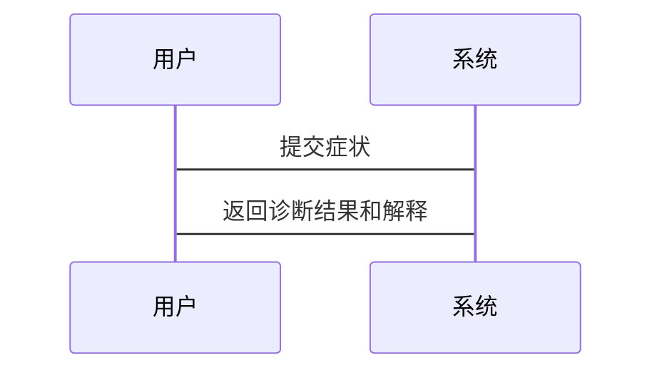

                 


# AI Agent的可解释性设计与实现

> 关键词：AI Agent，可解释性，机器学习，决策树，线性回归，系统架构，项目实战

> 摘要：AI Agent的可解释性是确保其决策过程透明、可信和合规的关键。本文详细探讨了AI Agent的可解释性设计，从核心概念到算法实现，再到系统架构和项目实战，层层剖析，为读者提供全面的指导。

---

## 目录大纲

### 第一部分: AI Agent的可解释性设计基础

#### 第1章: AI Agent概述

##### 1.1 AI Agent的基本概念

###### 1.1.1 什么是AI Agent
- AI Agent的定义
- AI Agent的分类
- AI Agent的特点

###### 1.1.2 AI Agent的分类与特点
- 分类：基于智能水平、基于应用领域、基于交互方式
- 特点：自主性、反应性、目标导向性、社交能力

###### 1.1.3 AI Agent的应用场景
- 例子：医疗诊断、金融投资、智能助手
- 场景分析：任务自动化、数据处理、决策支持

##### 1.2 可解释性的重要性

###### 1.2.1 为什么需要可解释性
- 信任基础
- 合规要求
- 责任追究

###### 1.2.2 可解释性在AI Agent中的作用
- 提供决策依据
- 改善用户体验
- 优化系统性能

###### 1.2.3 可解释性与AI伦理的关系
- 伦理影响
- 社会责任
- 透明度要求

#### 第2章: 可解释性设计的核心概念

##### 2.1 可解释性的定义与属性

###### 2.1.1 可解释性的定义
- 明确性
- 简洁性
- 相关性

###### 2.1.2 可解释性的关键属性
- 明确性：决策过程清晰
- 简洁性：易于理解
- 相关性：信息与决策相关

###### 2.1.3 可解释性与模型复杂性的关系
- 复杂性与可解释性的负相关
- 简单模型更易解释
- 高复杂性模型的权衡

##### 2.2 可解释性与AI Agent的关系

###### 2.2.1 可解释性在AI Agent中的核心地位
- 决策过程的透明性
- 用户信任的基础
- 系统维护的需要

###### 2.2.2 可解释性对用户信任的影响
- 信任建立
- 用户满意度
- 长期使用

###### 2.2.3 可解释性对系统维护的意义
- 问题排查
- 性能优化
- 功能扩展

#### 第3章: AI Agent的可解释性模型

##### 3.1 基于规则的可解释性模型

###### 3.1.1 规则的定义与特点
- 规则的定义：明确的条件和操作
- 特点：可解释性强，易于理解和修改

###### 3.1.2 规则在AI Agent中的应用
- 例子：医疗诊断中的症状匹配
- 优势：快速决策，易于验证

###### 3.1.3 规则模型的优缺点
- 优点：透明性高，易于解释
- 缺点：规则复杂，维护困难，难以处理复杂情况

##### 3.2 基于概率的可解释性模型

###### 3.2.1 概率模型的基本原理
- 概率分布：描述事件发生的可能性
- 条件概率：事件之间的依赖关系

###### 3.2.2 概率模型在AI Agent中的应用
- 例子：金融风险评估中的概率计算
- 优势：量化不确定性，提供概率支持决策

###### 3.2.3 概率模型的可解释性挑战
- 概率计算复杂
- 用户对概率的理解差异
- 模型依赖数据质量

#### 第4章: 可解释性算法的设计与实现

##### 4.1 基于决策树的可解释性算法

###### 4.1.1 决策树的基本原理
- 决策树结构：根节点、内部节点、叶子节点
- 分割标准：信息增益、信息增益率、基尼指数

###### 4.1.2 决策树在AI Agent中的应用
- 例子：医疗诊断中的症状分类
- 优势：直观，易于解释

###### 4.1.3 决策树的可解释性优势
- 结构清晰
- 易于可视化
- 决策路径明确

##### 4.2 基于线性回归的可解释性算法

###### 4.2.1 线性回归的基本原理
- 线性回归模型：$$y = \beta_0 + \beta_1x + \epsilon$$
- 最小二乘法：$$\hat{\beta} = (X^T X)^{-1} X^T y$$

###### 4.2.2 线性回归在AI Agent中的应用
- 例子：销售预测中的趋势分析
- 优势：简单，解释性强

###### 4.2.3 线性回归的可解释性挑战
- 线性假设的局限性
- 多重共线性问题
- 非线性关系的处理

### 第二部分: 可解释性系统架构与实现

#### 第5章: 可解释性系统的架构设计

##### 5.1 问题场景介绍

###### 5.1.1 问题背景
- AI Agent在医疗诊断中的应用
- 可解释性需求：患者和医生需要理解诊断依据

##### 5.2 系统功能设计

###### 5.2.1 领域模型
- mermaid 类图：展示系统中的主要实体及其关系
- 实体：患者、症状、疾病、诊断规则

###### 5.2.2 系统架构设计
- mermaid 架构图：展示系统的分层结构
- 层：数据层、计算层、解释层、用户层

##### 5.3 系统接口设计

###### 5.3.1 输入接口
- 数据格式：JSON，包含患者症状信息
- 示例：```json
  {
    "symptoms": ["发热", "咳嗽"],
    "patient_id": "123"
  }
  ```

###### 5.3.2 输出接口
- 结果格式：JSON，包含诊断结果和解释
- 示例：```json
  {
    "diagnosis": "流感",
    "explanation": {
      "symptoms": ["发热", "咳嗽"],
      "probability": 0.85
    }
  }
  ```

##### 5.4 系统交互设计

###### 5.4.1 交互流程
- mermaid 序列图：展示用户与系统的交互步骤
- 步骤：用户输入症状，系统处理，返回诊断结果和解释

#### 第6章: 项目实战

##### 6.1 环境安装

###### 6.1.1 安装Python
- 版本要求：Python 3.8+
- 安装命令：```bash
  python --version
  ```

###### 6.1.2 安装依赖库
- 库：scikit-learn、pandas、numpy、mermaid
- 安装命令：```bash
  pip install scikit-learn pandas numpy mermaid
  ```

##### 6.2 系统核心实现

###### 6.2.1 数据预处理
- 数据清洗：处理缺失值和异常值
- 特征工程：选择相关特征

###### 6.2.2 模型训练
- 使用决策树模型：```python
  from sklearn.tree import DecisionTreeClassifier
  model = DecisionTreeClassifier()
  model.fit(X_train, y_train)
  ```

###### 6.2.3 可解释性分析
- 特征重要性：```python
  importances = model.feature_importances_
  ```

##### 6.3 代码实现

###### 6.3.1 完整代码示例
```python
import pandas as pd
from sklearn.tree import DecisionTreeClassifier
from sklearn.model_selection import train_test_split
from sklearn.metrics import accuracy_score

# 加载数据
data = pd.read_csv('data.csv')

# 数据分割
X = data.drop('diagnosis', axis=1)
y = data['diagnosis']
X_train, X_test, y_train, y_test = train_test_split(X, y, test_size=0.2, random_state=42)

# 模型训练
model = DecisionTreeClassifier()
model.fit(X_train, y_train)

# 预测与评估
y_pred = model.predict(X_test)
print("准确率:", accuracy_score(y_test, y_pred))

# 特征重要性分析
importances = model.feature_importances_
print("特征重要性:", importances)
```

###### 6.3.2 代码解读与分析
- 数据加载：读取CSV文件
- 数据分割：训练集和测试集
- 模型训练：决策树分类器
- 预测评估：计算准确率
- 可解释性分析：提取特征重要性

##### 6.4 案例分析

###### 6.4.1 实际案例
- 患者症状：发热、咳嗽
- 模型诊断：流感，概率85%

###### 6.4.2 案例分析
- 症状分析：发热和咳嗽是流感的主要症状
- 模型解释：特征重要性显示发热权重更高

#### 第7章: 总结与展望

##### 7.1 总结

###### 7.1.1 核心内容回顾
- AI Agent的定义与分类
- 可解释性的关键概念
- 常用可解释性算法：决策树、线性回归
- 系统架构设计与实现

##### 7.1.2 小结
- 可解释性是AI Agent的重要特性
- 选择合适的算法和系统架构是实现可解释性的关键
- 实践项目展示了理论的应用价值

##### 7.1.3 注意事项
- 数据质量影响可解释性
- 模型选择需考虑应用场景
- 可解释性与性能的平衡

##### 7.1.4 最佳实践 tips
- 文档记录：详细记录模型和系统的决策过程
- 用户反馈：收集用户对解释的理解程度
- 持续优化：根据反馈不断改进模型

##### 7.1.5 拓展阅读
- 推荐书籍：《机器学习实战》、《可解释的人工智能：模型、方法和应用》
- 推荐博客：Towards Data Science, Medium的AI专栏

##### 7.1.6 未来展望
- 可解释性与AI伦理的结合
- 更复杂的模型可解释性研究
- 多模态数据的可解释性挑战

---

### 附录

#### 附录A: mermaid图表示例

##### 附录A.1 决策树算法流程图


##### 附录A.2 系统架构图


##### 附录A.3 系统交互序列图


#### 附录B: 数学公式汇总

##### 附录B.1 线性回归公式
$$y = \beta_0 + \beta_1x + \epsilon$$

##### 附录B.2 决策树特征重要性
$$\text{重要性} = \sum (\text{分裂信息增益})$$

---

### 参考文献

1. 周志华. 《机器学习》. 清华大学出版社, 2016.
2. Mothil D. Explainable AI (XAI): Concepts, Challenges, and Applications. arXiv preprint arXiv:1909.11299, 2019.
3. Doshi-Velez F, Kim M. A survey of algorithms for feature selection in machine learning. arXiv preprint arXiv:1701.02367, 2017.

---

# END

