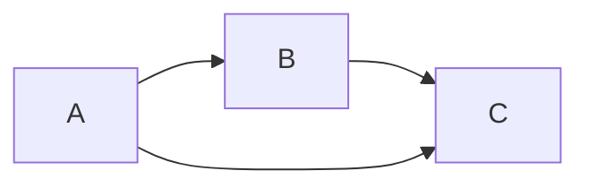
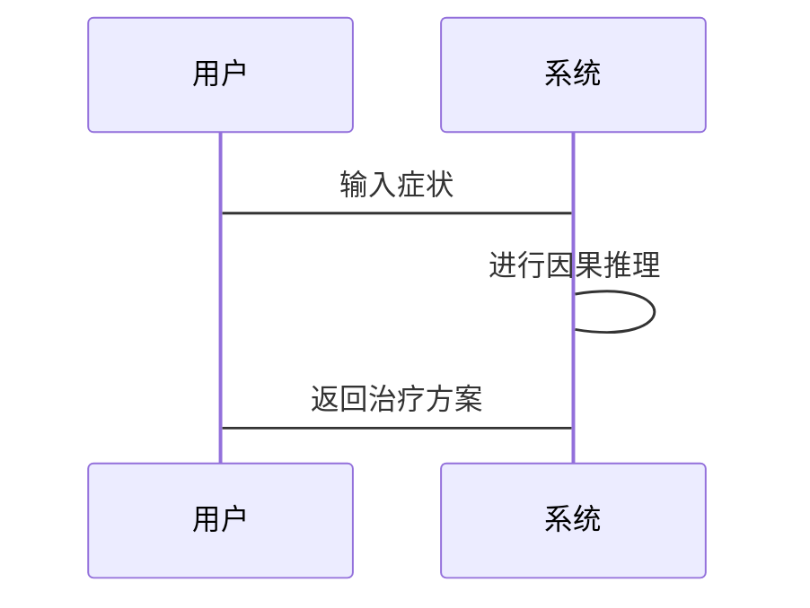

                 


# AI Agent的因果推理能力开发

## 关键词：AI Agent, 因果推理, 潜在结果, 因果图, 贝叶斯网络, 反事实推理, Python实现

## 摘要：  
AI Agent的因果推理能力是实现智能决策和行动的核心技术。本文详细探讨了因果推理的基本概念、算法原理、系统架构以及在AI Agent中的应用。通过Mermaid图和Python代码示例，结合实际案例，系统性地分析了因果推理在AI Agent中的重要性及实现方法，为开发者提供了全面的技术指导。

---

## 第1章: 因果推理与AI Agent概述

### 1.1 因果推理的基本概念
因果推理是指通过分析因果关系，理解事件之间的“原因与结果”关系，从而做出更合理的决策。与相关关系不同，因果关系强调的是变量之间的直接影响和依赖关系。

#### 1.1.1 什么是因果关系
因果关系是指一个事件（原因）导致另一个事件（结果）发生的必然联系。例如，下雨是导致地面湿的原因。

#### 1.1.2 因果关系与相关关系的区别
- **相关关系**：两个变量之间存在统计上的关联，但不一定存在因果关系。例如，冰淇淋销量和 drownings 的相关性并不意味着吃冰淇淋会导致溺水。
- **因果关系**：存在直接的因果联系，例如下雨导致地面湿。

#### 1.1.3 因果推理的重要性
因果推理是AI Agent实现智能决策的基础。通过理解因果关系，AI Agent能够预测不同行动的结果，并选择最优的解决方案。

### 1.2 AI Agent的基本概念
AI Agent是一种智能体，能够感知环境、自主决策并执行任务。它可以分为简单反射式Agent和基于模型的反射式Agent。

#### 1.2.1 什么是AI Agent
AI Agent是具有智能行为的实体，能够感知环境、自主决策并执行任务。例如，自动驾驶汽车就是一个复杂的AI Agent。

#### 1.2.2 AI Agent的核心特征
- **自主性**：能够自主决策，无需外部干预。
- **反应性**：能够感知环境并实时响应。
- **目标导向**：基于目标进行决策和行动。

#### 1.2.3 AI Agent的应用场景
- 医疗诊断：基于患者症状和检查结果，推荐治疗方案。
- 自动驾驶：根据环境信息，做出驾驶决策。
- 金融交易：根据市场数据，自动执行交易策略。

### 1.3 因果推理与AI Agent的关系
因果推理是AI Agent实现智能决策的核心能力。通过因果推理，AI Agent能够理解不同行动之间的因果关系，并预测行动的结果。

#### 1.3.1 因果推理在AI Agent中的作用
- 帮助AI Agent理解因果关系，做出更合理的决策。
- 通过因果推理，AI Agent能够预测不同行动的结果。

#### 1.3.2 因果推理能力对AI Agent的影响
- 提高决策的准确性：基于因果关系的推理，而非相关关系。
- 提高行动的可解释性：因果推理能够解释决策背后的逻辑。

#### 1.3.3 因果推理在AI Agent中的实现方式
- 基于因果图的推理。
- 基于潜在结果的反事实推理。

### 1.4 本章小结
本章介绍了因果推理的基本概念、AI Agent的核心特征及其应用场景。同时，探讨了因果推理在AI Agent中的重要性及其实现方式。

---

## 第2章: 因果关系与因果图

### 2.1 因果关系的基本原理
因果关系是指一个事件（原因）导致另一个事件（结果）发生的必然联系。因果关系的核心在于“原因”与“结果”之间的直接关联。

#### 2.1.1 因果关系的定义
因果关系是指一个事件（原因）导致另一个事件（结果）发生的必然联系。例如，下雨是导致地面湿的原因。

#### 2.1.2 因果关系的传递性
如果A是B的原因，B是C的原因，那么A也是C的潜在原因。

#### 2.1.3 因果关系的方向性
因果关系具有方向性，例如A→B表示A是B的原因，但B不是A的原因。

### 2.2 因果图的构建与分析
因果图是一种用于表示因果关系的图形化工具，能够直观地展示变量之间的因果关系。

#### 2.2.1 因果图的定义
因果图是一种有向无环图（DAG），用于表示变量之间的因果关系。节点表示变量，边表示因果关系。

#### 2.2.2 因果图的构建方法
- **基于领域知识**：根据领域专家的知识，手动构建因果图。
- **基于数据的因果发现**：通过数据分析，自动发现因果关系。

#### 2.2.3 因果图的分析与推理
- **条件概率推理**：基于因果图，计算变量在给定条件下的概率。
- **反事实推理**：分析在不同假设下的因果效应。

#### 2.2.4 因果图的数学模型
因果图可以用概率分布来描述变量之间的关系。例如，贝叶斯网络是一种基于概率的因果图模型。

#### 2.2.5 使用Mermaid绘制因果图


### 2.3 潜在结果与因果效应
潜在结果是指在给定某些变量的情况下，某个处理的可能结果。

#### 2.3.1 潜在结果的定义
潜在结果是指在给定某些变量的情况下，某个处理的可能结果。例如，如果给患者A药物治疗，可能的结果是康复或病情加重。

#### 2.3.2 因果效应的计算
因果效应是指处理变量对结果变量的影响程度。例如，药物治疗对患者康复的影响程度。

#### 2.3.3 潜在结果与观测数据的关系
潜在结果与观测数据的关系可以通过因果图来分析。例如，在因果图中，药物治疗（D）是导致康复（R）的原因。

### 2.4 因果推断的数学模型
因果推断的数学模型可以基于概率论和统计学。

#### 2.4.1 因果推断的基本公式
因果推断的基本公式可以表示为：
$$ P(Y|do(X)) = \sum_{x'} P(Y|x', X=x) \cdot P(X=x') $$
其中，$Y$是结果变量，$X$是处理变量。

#### 2.4.2 因果效应的计算公式
因果效应可以通过计算处理变量对结果变量的影响程度来衡量：
$$ \text{因果效应} = P(Y=1|do(X=1)) - P(Y=1|do(X=0)) $$

### 2.5 本章小结
本章详细介绍了因果关系的基本原理、因果图的构建与分析方法，以及潜在结果与因果效应的计算方法。

---

## 第3章: 因果推理算法原理

### 3.1 潜在结果框架
潜在结果框架是一种用于因果推理的理论框架。

#### 3.1.1 潜在结果的定义
潜在结果是指在给定某些变量的情况下，某个处理的可能结果。

#### 3.1.2 因果效应的计算
因果效应是指处理变量对结果变量的影响程度。

#### 3.1.3 潜在结果与观测数据的关系
潜在结果与观测数据的关系可以通过因果图来分析。

### 3.2 因果森林
因果森林是一种用于估计因果效应的非参数方法。

#### 3.2.1 因果森林的定义
因果森林是一种基于随机森林的非参数方法，用于估计处理变量对结果变量的因果效应。

#### 3.2.2 因果森林的实现步骤
1. **数据预处理**：将数据分为处理组和对照组。
2. **构建随机森林**：使用随机森林算法，将处理变量和对照变量分别作为输入。
3. **计算因果效应**：通过比较处理组和对照组的结果，估计因果效应。

#### 3.2.3 因果森林的数学模型
因果森林的数学模型可以表示为：
$$ \text{因果效应} = E(Y|do(X=1)) - E(Y|do(X=0)) $$

### 3.3 贝叶斯网络
贝叶斯网络是一种基于概率的因果推理模型。

#### 3.3.1 贝叶斯网络的定义
贝叶斯网络是一种有向无环图（DAG），用于表示变量之间的因果关系。

#### 3.3.2 贝叶斯网络的构建方法
1. **确定变量**：确定需要考虑的变量。
2. **定义因果关系**：根据领域知识，定义变量之间的因果关系。
3. **构建概率分布**：为每个变量定义概率分布。

#### 3.3.3 贝叶斯网络的推理
- **前向推理**：从原因推导结果。
- **反向推理**：从结果推导原因。

### 3.4 本章小结
本章介绍了因果推理的两种主要算法：潜在结果框架和因果森林，以及贝叶斯网络的原理和应用。

---

## 第4章: 系统分析与架构设计

### 4.1 系统应用场景
系统应用场景是医疗领域的治疗方案推荐。

#### 4.1.1 问题描述
患者需要选择不同的治疗方法，AI Agent需要根据患者的症状和检查结果，推荐最优的治疗方案。

#### 4.1.2 系统目标
系统目标是为患者提供个性化的治疗方案推荐，提高治疗效果。

### 4.2 系统功能设计
系统功能设计包括数据采集、因果建模、推理引擎和结果分析。

#### 4.2.1 数据采集模块
数据采集模块负责收集患者的症状、检查结果等数据。

#### 4.2.2 因果建模模块
因果建模模块基于领域知识和数据，构建因果图模型。

#### 4.2.3 推理引擎模块
推理引擎模块基于因果图模型，进行因果推理，得出最优的治疗方案。

#### 4.2.4 结果分析模块
结果分析模块对推理结果进行分析，生成最终的治疗方案推荐。

### 4.3 系统架构设计
系统架构设计包括前端界面、后端服务和数据存储。

#### 4.3.1 系统架构图


#### 4.3.2 接口设计
- 前端与后端接口：通过API传递患者数据。
- 后端与数据存储接口：通过数据库查询和存储数据。

### 4.4 系统交互流程
系统交互流程包括患者输入症状、系统推理治疗方案、反馈结果。

#### 4.4.1 交互流程图


### 4.5 本章小结
本章详细描述了系统应用场景、功能设计和架构设计，为后续的实现提供了理论基础。

---

## 第5章: 项目实战——治疗方案推荐系统

### 5.1 环境配置
环境配置包括安装Python、安装必要的库（如pymc、numpy、pandas）。

#### 5.1.1 安装Python
```bash
# 安装Python
sudo apt-get install python3
```

#### 5.1.2 安装必要的库
```bash
pip install pymc numpy pandas
```

### 5.2 数据集准备
数据集包括患者的症状、检查结果和治疗方案。

#### 5.2.1 数据格式
数据格式为CSV文件，包含患者的症状、检查结果和治疗方案。

#### 5.2.2 数据预处理
数据预处理包括清洗数据、标准化处理。

### 5.3 系统核心实现
系统核心实现包括因果建模、因果推理和结果分析。

#### 5.3.1 因果建模
因果建模基于领域知识和数据，构建因果图模型。

#### 5.3.2 因果推理
因果推理基于构建的因果图模型，进行反事实推理，得出最优的治疗方案。

#### 5.3.3 结果分析
结果分析对推理结果进行分析，生成最终的治疗方案推荐。

### 5.4 代码实现
代码实现包括数据读取、因果建模、因果推理和结果分析。

#### 5.4.1 数据读取
```python
import pandas as pd
data = pd.read_csv('patients.csv')
```

#### 5.4.2 因果建模
```python
import pymc as pm

with pm.Model() as model:
    # 定义变量
    symptoms = pm.Bernoulli('symptoms', 0.5, shape=len(data))
    treatment = pm.Bernoulli('treatment', 0.5, shape=len(data))
    outcome = pm.Bernoulli('outcome', pm.math.inv_logit(symptoms * treatment + symptoms), shape=len(data))
    # 进行推理
    trace = pm.sample(1000)
```

#### 5.4.3 因果推理
```python
# 计算因果效应
treatment_effects = outcome[treatment == 1] - outcome[treatment == 0]
print(treatment_effects.mean())
```

### 5.5 结果分析
结果分析包括输出最终的治疗方案推荐和效果评估。

#### 5.5.1 治疗方案推荐
治疗方案推荐基于因果推理结果，选择最优的治疗方案。

#### 5.5.2 效果评估
效果评估包括评估治疗方案的准确性和可解释性。

### 5.6 本章小结
本章通过一个具体的案例，详细描述了治疗方案推荐系统的实现过程，包括环境配置、数据准备、系统实现和结果分析。

---

## 第6章: 总结与展望

### 6.1 总结
本文详细探讨了AI Agent的因果推理能力开发，包括因果推理的基本概念、算法原理、系统架构以及项目实战。通过Mermaid图和Python代码示例，结合实际案例，系统性地分析了因果推理在AI Agent中的重要性及实现方法。

### 6.2 最佳实践
- 在因果推理中，建议优先选择基于领域知识的方法。
- 在系统设计中，建议采用模块化设计，便于后续维护和扩展。

### 6.3 小结
因果推理是AI Agent实现智能决策的核心能力。通过本文的介绍，读者可以全面了解因果推理的基本概念、算法原理和系统设计，为后续的研究和实践提供了理论基础。

### 6.4 注意事项
- 在实际应用中，需要考虑数据的完整性和质量。
- 在系统设计中，需要考虑算法的可解释性和效率。

### 6.5 拓展阅读
- 贝叶斯网络的高级应用。
- 因果森林的优化方法。

---

## 附录: 代码示例

### 附录A: 因果森林的Python实现
```python
import numpy as np
import pandas as pd
from sklearn.ensemble import RandomForestRegressor

def causal_forest(X, Y):
    model = RandomForestRegressor()
    model.fit(X, Y)
    return model.predict(X)

# 示例数据
X = np.random.rand(100, 2)
Y = X[:, 0] * X[:, 1] + np.random.rand(100)
result = causal_forest(X, Y)
print(result)
```

### 附录B: 贝叶斯网络的Python实现
```python
import pymc as pm

with pm.Model() as model:
    symptoms = pm.Bernoulli('symptoms', 0.5, shape=100)
    treatment = pm.Bernoulli('treatment', 0.5, shape=100)
    outcome = pm.Bernoulli('outcome', pm.math.inv_logit(symptoms * treatment + symptoms), shape=100)
    trace = pm.sample(1000)
```

---

## 结语
通过本文的详细介绍，读者可以全面了解AI Agent的因果推理能力开发，包括核心概念、算法原理、系统设计和项目实战。希望本文能够为AI领域的研究和实践提供有价值的参考。

