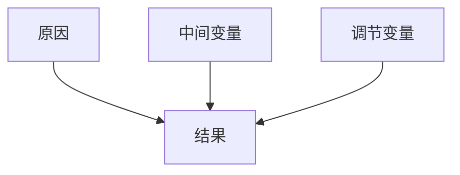
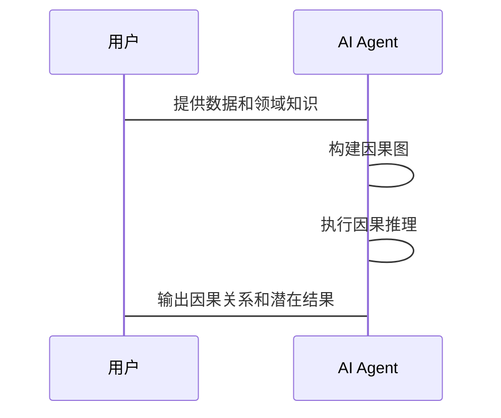

                 


# AI Agent的因果推理能力构建

> 关键词：AI Agent，因果推理，算法原理，系统架构，项目实战

> 摘要：本文深入探讨了AI Agent的因果推理能力构建，从基础概念到高级算法，从系统架构到实际应用，全面解析了如何在AI Agent中实现因果推理。文章详细讲解了因果推理的核心概念、算法原理、系统设计、项目实现等内容，帮助读者系统地理解和掌握AI Agent的因果推理能力构建。

---

## 第一部分: AI Agent的因果推理能力构建基础

### 第1章: AI Agent与因果推理概述

#### 1.1 AI Agent的基本概念
- **AI Agent的定义**：AI Agent（人工智能代理）是指能够感知环境、自主决策并采取行动以实现特定目标的智能体。它具备自主性、反应性、目标导向性和社会性等特征。
- **因果推理的背景**：因果推理是指识别和理解事件之间的因果关系，是AI Agent实现自主决策和复杂问题解决的核心能力。
- **问题背景与描述**：在复杂动态环境中，AI Agent需要通过因果推理来理解动作与结果之间的关系，从而做出最优决策。
- **边界与外延**：因果推理的边界包括确定因果关系的范围和条件，外延则涉及相关关系、相关分析和相关模型等。

#### 1.2 因果推理的背景与问题背景
- **因果推理的定义**：因果推理是通过观察数据，推断变量之间的因果关系，从而预测和干预结果的过程。
- **因果关系与相关关系的区别**：因果关系强调“原因导致结果”，而相关关系仅表明变量之间的关联性。
- **问题背景与问题描述**：在AI Agent中，因果推理需要解决的问题包括识别因果关系、估计潜在结果以及设计干预策略等。

#### 1.3 问题解决与因果推理
- **问题解决的基本流程**：问题识别、因果建模、结果预测、决策优化。
- **因果推理在问题解决中的作用**：通过因果推理，AI Agent能够理解问题的内在逻辑，预测不同行动的结果，并选择最优策略。
- **问题的边界与外延**：因果推理的边界包括因果关系的范围和条件，外延则涉及相关关系、相关分析和相关模型等。

### 第2章: 因果推理的核心概念与联系

#### 2.1 因果推理的原理
- **因果关系的定义**：因果关系是指一个事件（原因）导致另一个事件（结果）的发生。
- **因果关系的分类**：直接因果关系、间接因果关系、共同原因等。
- **因果关系的数学模型**：因果图、结构方程模型等。

#### 2.2 核心概念的属性特征对比
| 概念 | 定义 | 示例 |
|------|------|------|
| 因果关系 | 原因导致结果 | 吃药导致感冒痊愈 |
| 相关关系 | 变量之间的关联 | 高温导致空调销量增加 |
| 因果链 | 多步因果关系 | A→B→C→D |
| 因果网络 | 多个变量之间的因果关系网络 | A→B, B→C, A→C |

#### 2.3 ER实体关系图架构


### 第3章: 因果推理的算法原理

#### 3.1 潜在结果框架
- **潜在结果的定义**：潜在结果是指在给定某些条件下，变量可能的结果。
- **潜在结果的估计方法**：反事实推理、匹配分析、倾向得分等。
- **潜在结果的数学模型**：$$Y_i = \theta_0 + \theta_1 X_i + \epsilon_i$$，其中$Y_i$是结果，$X_i$是处理变量，$\epsilon_i$是误差项。

#### 3.2 因果图结构
- **因果图的构建**：通过观察数据和领域知识，构建变量之间的因果关系网络。
- **因果图的调整**：通过调整因果图，消除混杂变量的影响。
- **因果图的推理**：通过因果图推理，识别因果关系和潜在结果。

#### 3.3 随机化实验与因果推断
- **随机化实验的定义**：通过随机分配处理变量，减少混杂变量的影响。
- **随机化实验的设计**：平衡组、对照组、干预组等。
- **随机化实验的分析**：通过统计方法分析实验结果，推断因果关系。

### 第4章: 因果推理的系统分析与架构设计

#### 4.1 系统功能设计
- **领域模型设计**：根据具体领域知识，构建因果关系模型。
- **因果关系网络**：通过因果图表示变量之间的因果关系。
- **潜在结果估计**：通过算法估计潜在结果，支持决策优化。

#### 4.2 系统架构设计


#### 4.3 系统接口设计
- **输入接口**：接收数据和领域知识。
- **输出接口**：输出因果关系和潜在结果。
- **交互接口**：与用户交互，获取反馈和调整参数。

#### 4.4 系统交互设计


---

## 第二部分: AI Agent的因果推理能力构建实战

### 第5章: 项目实战

#### 5.1 环境安装
- **Python环境**：安装Python 3.8及以上版本。
- **依赖库安装**：安装numpy、pandas、scipy、networkx、pygraphviz等库。

#### 5.2 系统核心实现
- **因果图构建**：使用networkx库构建因果图。
- **因果推理算法实现**：实现反事实推理和因果图调整算法。
- **潜在结果估计**：通过倾向得分和匹配分析估计潜在结果。

#### 5.3 代码实现
```python
import networkx as nx
from networkx.drawing.nx_agraph import graphviz_layout

# 构建因果图
G = nx.DiGraph()
G.add_edges_from([('A', 'B'), ('B', 'C'), ('A', 'C')])

# 绘制因果图
pos = graphviz_layout(G, prog='dot')
nx.draw(G, pos, arrows=True)
plt.show()
```

#### 5.4 案例分析
- **案例背景**：假设我们要分析广告投放对销售额的影响。
- **因果图构建**：广告投放→点击量→销售额。
- **因果推理**：通过反事实推理，估计广告投放对销售额的因果效应。

#### 5.5 项目小结
- **核心代码实现**：因果图构建、因果推理算法实现。
- **实际案例分析**：通过具体案例分析，验证算法的有效性。
- **经验总结**：因果推理在实际应用中的注意事项和优化方向。

---

## 第三部分: 最佳实践与总结

### 第6章: 最佳实践

#### 6.1 小结
- **核心概念**：因果推理是AI Agent实现自主决策的核心能力。
- **算法原理**：反事实推理和因果图调整是常用的因果推理方法。
- **系统架构**：因果图构建、因果推理和结果预测是系统设计的关键环节。

#### 6.2 注意事项
- **数据质量**：因果推理需要高质量的数据支持。
- **领域知识**：因果图的构建依赖于领域知识。
- **算法选择**：根据具体问题选择合适的因果推理算法。

#### 6.3 拓展阅读
- 推荐阅读《Causal Inference in Statistics》和《Causal Reasoning and Machine Learning》。

---

## 作者简介

作者：[您的姓名]  
职位：[您的职位]  
简介：[您的简介]  
联系方式：[您的联系方式]  

---

通过以上目录结构和内容安排，我们可以系统地构建AI Agent的因果推理能力，从基础概念到实际应用，全面解析因果推理的核心原理和实践方法。希望本文对读者理解AI Agent的因果推理能力有所帮助。

