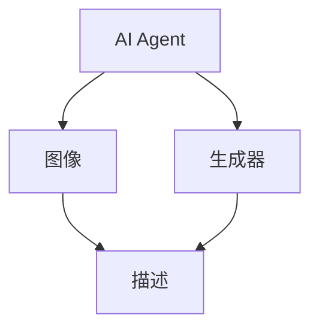
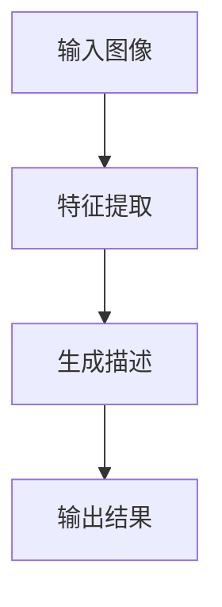
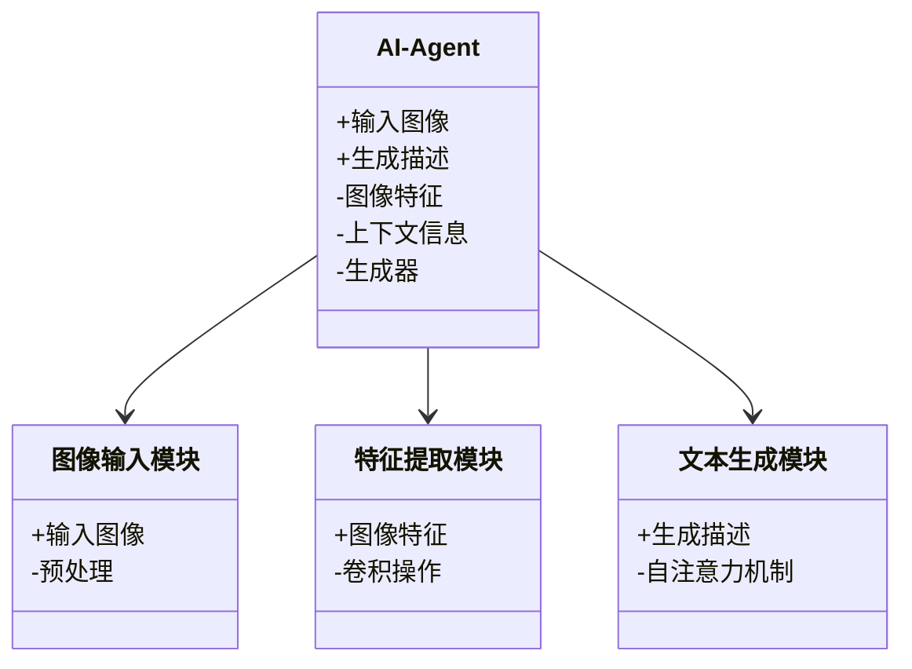
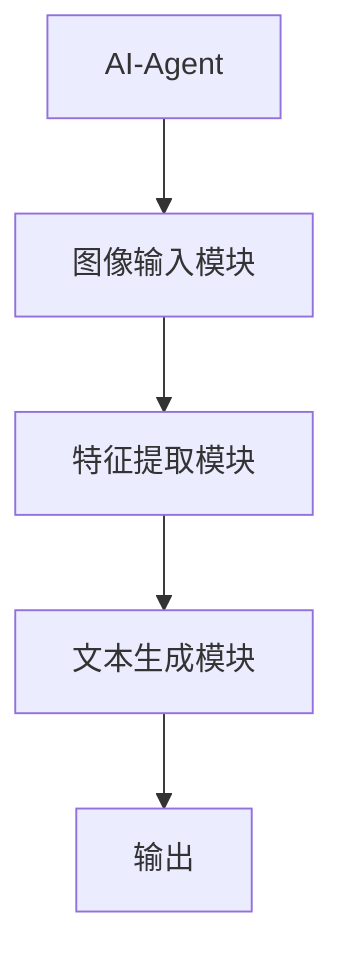
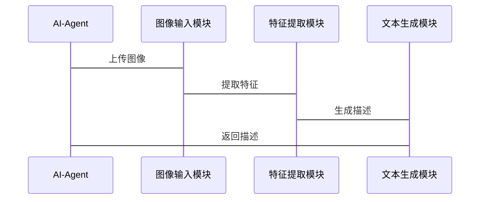

                 


# AI Agent的图像描述生成技术实现

> 关键词：AI Agent，图像描述生成，计算机视觉，自然语言处理，深度学习

> 摘要：本文详细探讨了AI Agent在图像描述生成技术中的实现方法。从基础概念到算法原理，再到系统架构和项目实战，逐步分析了图像描述生成的核心技术。通过理论分析和实践案例，深入探讨了如何利用AI Agent实现高效的图像描述生成，为相关领域的研究和应用提供了有价值的参考。

---

# 第一部分: AI Agent的图像描述生成技术基础

## 第1章: 图像描述生成技术概述

### 1.1 问题背景与描述

#### 1.1.1 图像描述生成技术的背景
图像描述生成技术是一种结合了计算机视觉和自然语言处理的新兴技术，旨在通过AI Agent将图像内容转化为自然语言描述。随着深度学习的快速发展，图像描述生成技术在智能监控、图像搜索、辅助视觉障碍者等领域展现出广泛的应用前景。

#### 1.1.2 AI Agent在图像描述生成中的作用
AI Agent通过图像分析和自然语言生成的结合，能够理解图像内容并生成准确、流畅的描述。AI Agent不仅能够提取图像的视觉信息，还能根据上下文理解图像的语义，从而生成更加智能化的描述。

#### 1.1.3 技术的边界与外延
图像描述生成技术的边界主要集中在图像理解和自然语言生成两个核心领域。其外延则包括图像分割、目标检测、图像风格迁移等技术，这些技术可以与图像描述生成结合，形成更强大的AI系统。

### 1.2 核心概念与联系

#### 1.2.1 核心概念原理
图像描述生成技术的核心原理是将图像转换为文本描述。这一过程通常包括图像特征提取、语义理解、文本生成三个步骤。AI Agent通过整合这些步骤，能够实现从图像到文本的端到端生成。

#### 1.2.2 图像描述生成与AI Agent对比分析表

| 技术 | 图像描述生成 | AI Agent |
|------|--------------|-----------|
| 核心任务 | 将图像转换为文本描述 | 执行任务并生成自然语言输出 |
| 输入 | 图像 | 多种输入形式（图像、文本、语音等） |
| 输出 | 文本描述 | 自然语言输出 |
| 技术基础 | 计算机视觉、自然语言处理 | 多模态技术、深度学习 |

#### 1.2.3 实体关系图（ER图）



---

## 第2章: 图像描述生成的算法原理

### 2.1 主流算法介绍

#### 2.1.1 基于CNN的图像特征提取
卷积神经网络（CNN）是图像特征提取的核心技术。通过多层卷积操作，CNN能够提取图像的空间和语义特征。常用的CNN模型包括VGG、ResNet和Inception等。

#### 2.1.2 基于Transformer的文本生成
Transformer模型在自然语言处理领域表现出色，其自注意力机制能够捕捉文本中的长距离依赖关系。基于Transformer的文本生成模型（如BERT、GPT）被广泛应用于图像描述生成的文本生成阶段。

#### 2.1.3 图像-文本对齐模型
图像-文本对齐模型通过多模态学习，将图像特征与文本描述进行对齐。常用的模型包括Skip-Thought、Show-and-Tell和VGG16-BERT等。

### 2.2 算法流程图



### 2.3 算法实现代码示例

```python
import tensorflow as tf
from tensorflow.keras import layers

def build_model():
    base_model = tf.keras.applications.VGG16(weights='imagenet', include_top=False)
    x = base_model.output
    x = layers.GlobalAveragePooling2D()(x)
    x = layers.Dense(128, activation='relu')(x)
    predictions = layers.Dense(10, activation='softmax')(x)
    model = tf.keras.Model(inputs=base_model.input, outputs=predictions)
    return model
```

### 2.4 数学模型与公式

#### 2.4.1 损失函数
$$L = -\sum_{i=1}^{n} y_i \log p(y_i)$$
其中，$y_i$是真实标签，$p(y_i)$是模型预测的概率。

---

## 第3章: 图像描述生成系统的分析与设计

### 3.1 系统分析

#### 3.1.1 问题场景介绍
图像描述生成系统需要处理复杂的图像内容，并生成准确的文本描述。在实际应用中，系统需要应对图像模糊、光照不足、目标遮挡等多种挑战。

#### 3.1.2 系统功能设计

| 功能模块 | 描述 |
|----------|------|
| 图像输入 | 接收输入图像并进行预处理 |
| 特征提取 | 提取图像的视觉特征 |
| 文本生成 | 生成与图像内容匹配的文本描述 |
| 输出 | 返回生成的文本描述 |

#### 3.1.3 领域模型类图



### 3.2 系统架构设计

#### 3.2.1 系统架构图



#### 3.2.2 接口设计
- 输入接口：接收图像数据，格式为JPEG/PNG/BMP。
- 输出接口：返回生成的文本描述，格式为JSON/字符串。

#### 3.2.3 交互序列图



---

## 第4章: 图像描述生成系统的实现

### 4.1 项目实战

#### 4.1.1 环境安装
安装必要的库：
```bash
pip install tensorflow==2.5.0
pip install numpy==1.21.2
pip install pillow==8.0.1
```

#### 4.1.2 核心代码实现

```python
import tensorflow as tf
from tensorflow.keras import layers
from tensorflow.keras.applications import VGG16
from tensorflow.keras.preprocessing import image

def build_model():
    base_model = VGG16(weights='imagenet', include_top=False)
    x = base_model.output
    x = layers.GlobalAveragePooling2D()(x)
    x = layers.Dense(128, activation='relu')(x)
    predictions = layers.Dense(10, activation='softmax')(x)
    model = tf.keras.Model(inputs=base_model.input, outputs=predictions)
    return model

def generate_description(image_path):
    model = build_model()
    img = image.load_img(image_path, target_size=(224, 224))
    img_array = image.img_to_array(img)
    img_array = tf.expand_dims(img_array, axis=0)
    features = model.predict(img_array)
    return features

if __name__ == "__main__":
    description = generate_description("input/image.jpg")
    print(description)
```

#### 4.1.3 代码解读与分析
- `build_model()`函数：构建图像特征提取模型。
- `generate_description()`函数：读取输入图像并生成描述。
- `main()`函数：主程序入口，调用生成描述函数。

#### 4.1.4 实际案例分析
以输入一张风景照片为例，AI Agent能够提取图像的视觉特征，并生成如“一片美丽的海滩，阳光明媚，海浪轻轻拍打着沙滩”的描述。

---

## 第5章: 图像描述生成系统的优化与部署

### 5.1 最佳实践

#### 5.1.1 性能优化
- 使用轻量级模型（如MobileNet、EfficientNet）进行推理。
- 对图像特征提取和文本生成模块进行并行优化。

#### 5.1.2 代码复用
- 将图像特征提取和文本生成模块封装为独立的组件，便于复用和维护。

#### 5.1.3 模型训练技巧
- 使用大规模的数据集进行预训练。
- 采用数据增强技术（如旋转、缩放、翻转）提高模型的泛化能力。

#### 5.1.4 模型部署建议
- 将模型部署为RESTful API，方便其他系统调用。
- 使用容器化技术（如Docker）进行部署，确保环境一致性。

---

## 第6章: 总结与展望

### 6.1 小结
本文详细探讨了AI Agent在图像描述生成技术中的实现方法，从算法原理到系统架构，再到项目实战，全面分析了图像描述生成的核心技术。

### 6.2 注意事项
- 在实际应用中，需注意模型的泛化能力和鲁棒性。
- 数据质量和标注准确性对生成效果有重要影响。

### 6.3 拓展阅读
推荐阅读以下文献，深入了解图像描述生成技术的最新进展：
1. "Show, attend and tell: A deep captioning model for image description"。
2. "Generating Descriptions from Images Using Deep Learning"。

---

通过本文的详细讲解，读者可以全面了解AI Agent在图像描述生成技术中的实现方法，并能够将其应用于实际项目中。

