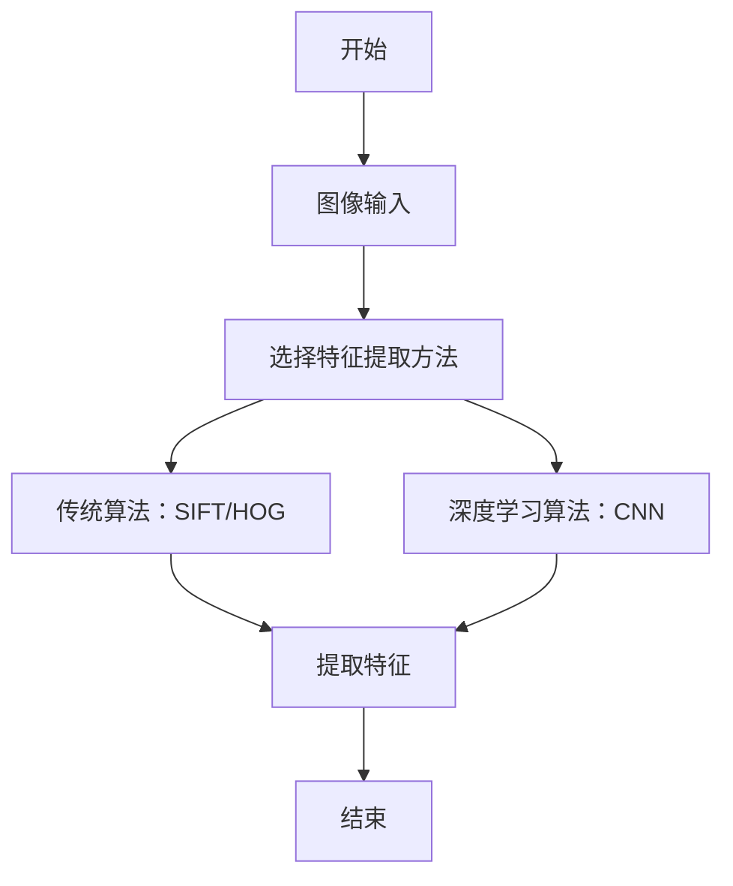
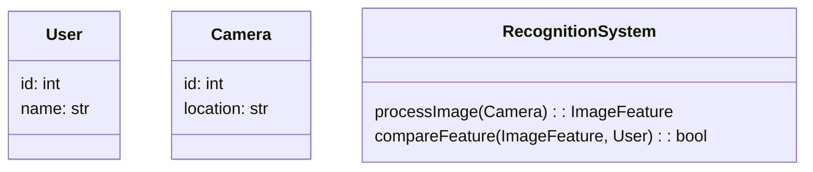
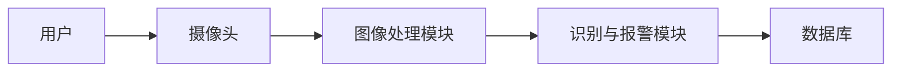
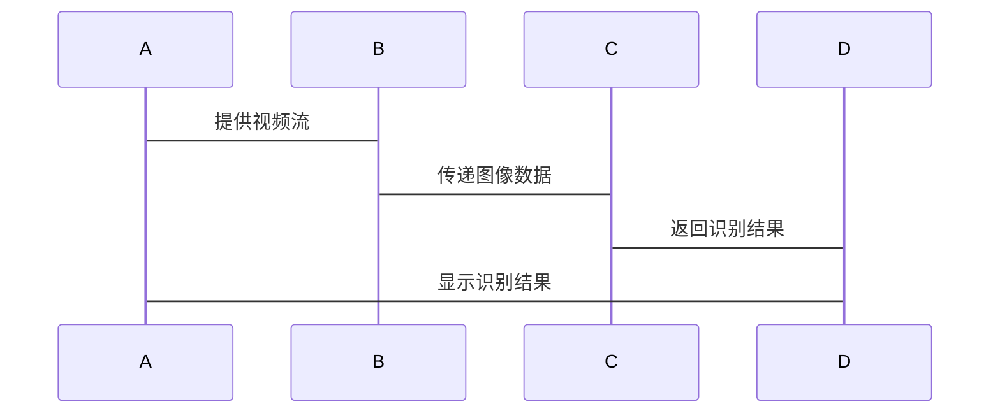

                 


# AI Agent的图像识别与处理技术

## 关键词：
AI Agent, 图像识别, 图像处理, 深度学习, 图像特征提取, 智能安防

## 摘要：
本文深入探讨AI Agent在图像识别与处理技术中的应用，从基础概念到核心技术，再到实际应用，层层解析。文章首先介绍了AI Agent与图像识别的基本概念和发展历程，然后详细讲解图像预处理、特征提取等核心技术，接着通过实际项目展示系统设计与实现，最后总结最佳实践并展望未来趋势。旨在为AI Agent开发者和图像处理研究人员提供系统性指导。

---

## 第一部分：AI Agent与图像识别基础

### 第1章：AI Agent与图像识别概述

#### 1.1 AI Agent的基本概念
- **AI Agent的定义**：AI Agent是具有感知环境和自主决策能力的智能体，能够执行特定任务。
- **图像识别技术**：通过算法分析图像内容，识别出图像中的物体、场景或文字。
- **AI Agent与图像识别的结合**：AI Agent利用图像识别技术来感知环境，实现智能决策。

#### 1.2 图像识别技术的发展历程
- **传统图像处理技术**：基于规则的图像处理方法，如边缘检测、阈值处理。
- **深度学习的崛起**：深度学习模型（如CNN）在图像识别任务中表现出色。
- **AI Agent的应用**：从医疗影像分析到智能安防，图像识别技术推动了AI Agent的发展。

#### 1.3 AI Agent在图像识别中的应用场景
- **智能监控**：实时监控视频流，识别异常行为。
- **医疗影像分析**：辅助医生识别疾病，提高诊断准确率。
- **智能安防**：通过人脸识别、行为分析提升安全性。

#### 1.4 本章小结
本章介绍了AI Agent和图像识别的基本概念，分析了图像识别技术的发展历程，并展示了AI Agent在图像识别中的广泛应用场景。

---

## 第二部分：图像处理的核心技术

### 第2章：图像预处理技术

#### 2.1 图像的获取与存储
- **图像获取**：通过摄像头、文件读取等方式获取图像。
- **存储格式**：JPEG、PNG、BMP等常见格式的优缺点。
- **分辨率与压缩**：分辨率对图像质量的影响，压缩技术的作用。

#### 2.2 图像的几何变换
- **缩放**：放大或缩小图像，保持图像内容。
- **旋转与平移**：改变图像的方向和位置。
- **剪裁与拼接**：提取图像部分或合并多张图像。

#### 2.3 图像的增强处理
- **灰度化**：将彩色图像转换为灰度图像。
- **二值化**：将图像转换为黑白两色，便于后续处理。
- **噪声去除**：通过滤波等方法消除图像中的噪声。

#### 2.4 本章小结
本章详细讲解了图像预处理技术，包括图像的获取、几何变换和增强处理，为后续的图像特征提取奠定基础。

### 第3章：图像特征提取技术

#### 3.1 基于传统算法的特征提取
- **SIFT算法**：通过尺度不变特征变换检测图像中的关键点。
- **HOG算法**：通过计算图像的水平梯度直方图，提取图像特征。
- **Haar特征**：基于haar小波的特征提取方法，常用于目标检测。

#### 3.2 基于深度学习的特征提取
- **CNN网络简介**：卷积神经网络的基本结构和工作原理。
- **VGGNet与ResNet的特征提取**：通过预训练模型提取图像特征。
- **Faster R-CNN的目标检测**：结合区域建议网络的目标检测方法。

#### 3.3 图像特征的分类与对比
- **传统特征提取算法的优缺点**：计算速度快，但对光照变化敏感。
- **深度学习特征提取的优势**：特征表达能力强，但计算资源消耗大。

#### 3.4 图像特征提取的mermaid流程图


#### 3.5 本章小结
本章对比了传统算法和深度学习算法在图像特征提取中的应用，展示了不同方法的优缺点。

---

## 第三部分：项目实战与系统架构设计

### 第4章：项目实战——智能安防中的图像识别系统

#### 4.1 项目背景与目标
- **项目背景**：智能安防需求日益增长，图像识别技术是其实现的核心。
- **项目目标**：构建一个基于AI Agent的图像识别系统，实现人脸识别和行为分析。

#### 4.2 系统功能设计
- **用户界面**：展示实时视频流和识别结果。
- **图像处理模块**：实现图像预处理和特征提取。
- **识别与报警模块**：识别异常行为并触发报警。

#### 4.3 系统架构设计
- **领域模型**：展示系统中各角色的关系。


- **系统架构图**：展示系统的整体架构。


- **系统交互序列图**：


#### 4.4 项目实现与代码解析
- **环境安装**：安装Python、OpenCV、TensorFlow等库。
- **核心代码实现**
```python
import cv2
import numpy as np

def preprocess_image(image_path):
    image = cv2.imread(image_path)
    gray_image = cv2.cvtColor(image, cv2.COLOR_BGR2GRAY)
    _, binary_image = cv2.threshold(gray_image, 127, 255, cv2.THRESH_BINARY)
    return binary_image

def extract_features(image):
    # 使用SIFT算法提取特征
    sift = cv2.SIFT_create()
    kp, des = sift.detectAndCompute(image, None)
    return des
```

- **代码功能解读**：预处理函数将图像转换为灰度和二值图像，特征提取函数使用SIFT算法提取特征。

#### 4.5 实际案例分析
- **案例1**：智能监控中的异常行为检测。
- **案例2**：医疗影像中的病灶识别。

#### 4.6 本章小结
本章通过实际项目展示了AI Agent在图像识别中的应用，详细讲解了系统的功能设计、架构设计和实现过程。

---

## 第四部分：最佳实践与未来展望

### 第5章：最佳实践与未来展望

#### 5.1 项目总结
- **项目成果**：成功构建了一个基于AI Agent的图像识别系统。
- **经验总结**：数据预处理的重要性，模型调优的技巧。

#### 5.2 注意事项
- **数据质量**：确保数据的多样性和代表性。
- **模型选择**：根据具体任务选择合适的算法。
- **计算资源**：深度学习模型需要强大的计算资源支持。

#### 5.3 未来展望
- **轻量化模型**：在移动设备上实现高效的图像识别。
- **多模态融合**：结合自然语言处理等技术，提升AI Agent的智能性。
- **实时性优化**：进一步提升图像识别的实时性。

#### 5.4 本章小结
本章总结了项目的实施经验，提出了未来的研究方向和技术趋势。

---

## 第五部分：数学模型与算法解析

### 第6章：算法原理与数学模型

#### 6.1 SIFT算法的数学模型
- **特征点检测**：通过Laplacian算子检测图像的极值点。
- **特征描述**：计算特征点的主方向和位置。
- **图像匹配**：通过特征描述的相似性进行图像匹配。

#### 6.2 CNN网络的数学模型
- **卷积层**：通过卷积核提取局部特征。
- **池化层**：降低计算复杂度，提取全局特征。
- **全连接层**：将特征向量映射到类别空间。

#### 6.3 图像分割的数学模型
- **U-Net架构**：用于医学图像分割的网络结构。
- **损失函数**：交叉熵损失函数用于监督学习。
- **后处理**：通过形态学操作优化分割结果。

#### 6.4 本章小结
本章通过数学模型和算法原理，深入分析了图像识别技术的实现细节。

---

## 结语

本文系统地介绍了AI Agent在图像识别与处理技术中的应用，从基础概念到核心技术，再到实际应用，为读者提供了全面的指导。通过详细讲解图像预处理、特征提取等关键技术，并结合实际项目展示系统设计与实现，帮助读者更好地理解AI Agent在图像识别中的应用。未来，随着技术的发展，AI Agent在图像识别领域的应用将更加广泛和深入。

--- 

**注**：文章后续内容可以根据实际需求扩展，添加更多具体的技术细节和案例分析。

