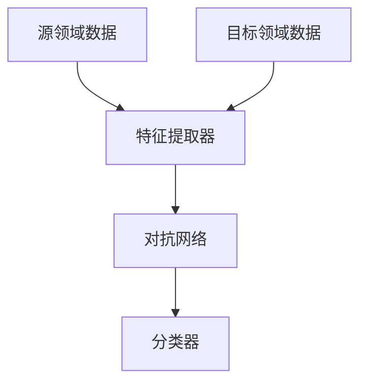
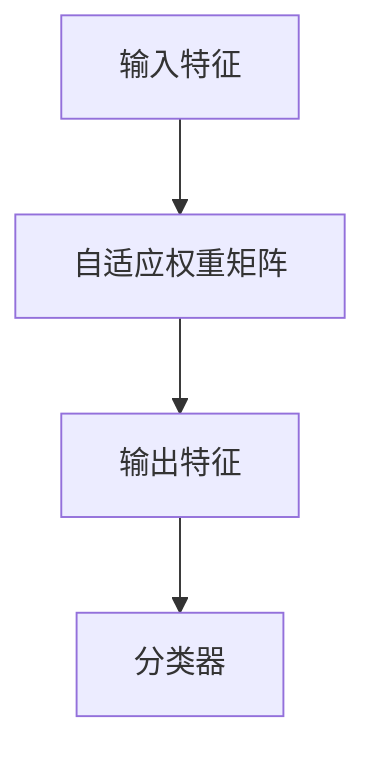
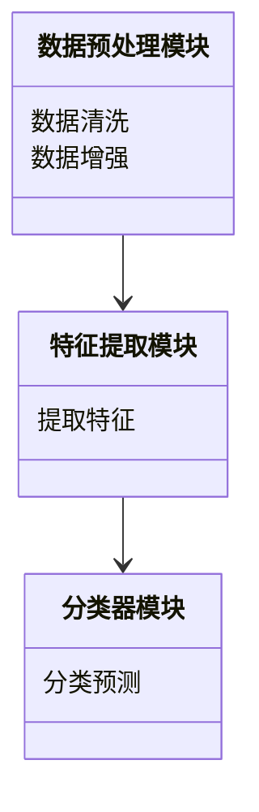
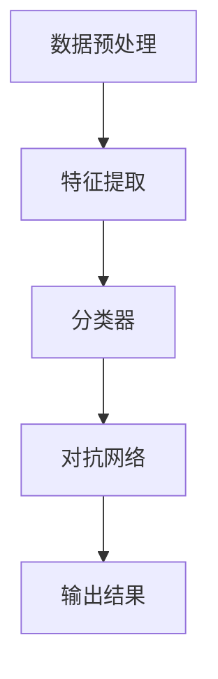

                 


# AI Agent的域适应：跨领域知识迁移

> 关键词：AI Agent，域适应，跨领域知识迁移，迁移学习，对抗域适应，系统架构设计

> 摘要：本文深入探讨AI Agent在不同领域之间的知识迁移问题，分析域适应的核心技术与算法实现，结合实际案例，详细讲解系统设计与项目实战。文章旨在帮助读者理解如何通过域适应技术实现跨领域知识的有效迁移，提升AI Agent的泛化能力和应用场景。

---

## 正文

### 第1章: AI Agent的概述

#### 1.1 AI Agent的基本概念

**1.1.1 AI Agent的定义**

AI Agent（人工智能代理）是指能够感知环境、自主决策并执行任务的智能实体。它可以是一个软件程序、机器人或虚拟助手，通过感知输入信息，利用内部模型生成输出或动作。

**1.1.2 AI Agent的类型**

AI Agent可以根据智能水平分为：

1. **反应式Agent**：基于当前感知做出反应，适用于简单的任务，如环境监测。
2. **认知式Agent**：具备复杂推理和规划能力，适用于需要策略和决策的任务，如自动驾驶。
3. **学习式Agent**：能够通过经验改进性能，如强化学习型Agent。

**1.1.3 域适应的必要性**

AI Agent在不同领域应用时，需要处理数据分布差异，例如医疗领域和金融领域的数据特征和标签差异较大。域适应技术帮助AI Agent在目标领域保持高性能。

---

#### 1.2 域适应的背景与问题

**1.2.1 域适应的背景**

随着AI技术的扩展，AI Agent需要在不同领域中应用，如将图像分类模型从ImageNet迁移至COCO数据集。

**1.2.2 域适应的核心问题**

1. **数据分布差异**：源领域和目标领域的数据分布不同。
2. **领域间隙**：特征空间的差异导致模型在目标领域表现下降。
3. **标签空间差异**：不同领域的标签可能不同。

**1.2.3 域适应的应用场景**

- 医疗影像分析：将模型从胸部X光扩展到腹部X光。
- 自然语言处理：跨语言文本分类。
- 计算机视觉：跨数据集的人脸识别。

---

#### 1.3 本章小结

本章介绍了AI Agent的基本概念和类型，重点说明了域适应的必要性及其在AI Agent中的作用，为后续章节奠定了基础。

---

### 第2章: 域适应的核心概念

#### 2.1 域适应的定义与属性

**2.1.1 域适应的定义**

域适应是指在源领域训练的模型，经过调整后在目标领域保持高性能的过程。

**2.1.2 域适应的关键属性对比表**

| 属性       | 源领域         | 目标领域         |
|------------|---------------|-----------------|
| 数据分布    | D_s           | D_t            |
| 样本数量    | N_s           | N_t            |
| 标签空间     | L_s           | L_t            |

**2.1.3 域适应的ER实体关系图**

```mermaid
erDiagram
    客户: CID, Cname, Caddr
    订单: OID, Odate, Oamount
    产品: PID, Pname, Pprice
    客户--|{购买}订单
    订单--|{包含}产品
```

---

#### 2.2 域适应与相关概念的对比

**2.2.1 域适应与领域适应**

领域适应侧重于调整模型在目标领域的性能，而域适应更强调跨领域的一般化能力。

**2.2.2 域适应与领域迁移**

领域迁移强调数据分布的变化，而域适应更关注模型的适应性。

**2.2.3 域适应与多任务学习**

多任务学习同时处理多个任务，域适应则是在不同领域间迁移。

---

#### 2.3 本章小结

本章详细解释了域适应的核心概念，通过对比分析帮助读者明确域适应与其他相关概念的区别。

---

### 第3章: 域适应的关键技术

#### 3.1 迁移学习基础

**3.1.1 迁移学习的定义**

迁移学习是将知识从源领域迁移到目标领域的过程。

**3.1.2 迁移学习的分类**

1. **有监督迁移学习**：利用标注数据。
2. **无监督迁移学习**：处理无标注数据。
3. **半监督迁移学习**：结合标注和无标注数据。

**3.1.3 迁移学习的数学模型**

源领域和目标领域的联合分布：
$$ P(D_s, D_t) $$

---

#### 3.2 对抗域适应

**3.2.1 对抗域适应的原理**

通过对抗训练，使特征提取器在不同领域间保持一致。

**3.2.2 对抗域适应的数学模型**

对抗网络损失函数：
$$ L_{adv} = \mathbb{E}_{x_s,y_s}[\log D(y_s)] + \mathbb{E}_{x_t,y_t}[\log (1-D(y_t))] $$

**3.2.3 对抗域适应的mermaid流程图**



---

#### 3.3 自适应特征学习

**3.3.1 自适应特征学习的定义**

通过自适应调整特征权重，增强模型的域适应能力。

**3.3.2 自适应特征学习的实现方法**

使用自适应权重矩阵：
$$ W = \argmin_{W} \sum_{i=1}^n (y_i - Wx_i)^2 $$

**3.3.3 自适应特征学习的mermaid流程图**



---

#### 3.4 本章小结

本章详细讲解了域适应的关键技术，包括迁移学习、对抗域适应和自适应特征学习，并通过数学模型和mermaid图展示了其实现过程。

---

### 第4章: 域适应的算法实现

#### 4.1 数据预处理

**4.1.1 数据清洗**

去除噪声数据，确保数据质量。

**4.1.2 数据增强**

通过旋转、翻转等操作增加数据多样性。

**4.1.3 数据标准化**

将数据归一化处理，消除特征尺度影响。

---

#### 4.2 模型构建

**4.2.1 特征提取网络**

使用预训练模型如ResNet提取特征。

**4.2.2 对抗网络设计**

构建对抗网络，优化特征表示。

**4.2.3 分类器设计**

训练分类器在目标领域进行分类。

---

#### 4.3 算法实现代码

**4.3.1 环境安装**

```bash
pip install tensorflow numpy
```

**4.3.2 代码实现**

```python
import tensorflow as tf
import numpy as np

# 定义模型
model = tf.keras.Sequential([
    tf.keras.layers.Dense(128, activation='relu'),
    tf.keras.layers.Dense(10, activation='softmax')
])

# 编译模型
model.compile(optimizer='adam', loss='sparse_categorical_crossentropy', metrics=['accuracy'])
```

**4.3.3 代码解读**

训练模型并评估性能：
```python
model.fit(X_train, y_train, epochs=10, batch_size=32)
model.evaluate(X_test, y_test)
```

---

#### 4.4 本章小结

本章详细讲解了域适应的算法实现，包括数据预处理、模型构建和代码实现，帮助读者理解如何在实际中应用域适应技术。

---

### 第5章: 域适应的系统架构设计

#### 5.1 系统功能设计

**5.1.1 领域模型设计**

定义领域模型，包括数据预处理、特征提取和分类模块。

**5.1.2 功能模块划分**

1. 数据预处理模块：清洗和增强数据。
2. 特征提取模块：提取领域特征。
3. 分类器模块：进行分类预测。
4. 对抗网络模块：优化特征表示。

**5.1.3 领域模型的mermaid类图**



---

#### 5.2 系统架构设计

**5.2.1 系统架构概述**

系统采用模块化架构，各模块协同工作，实现跨领域知识迁移。

**5.2.2 系统架构的mermaid架构图**



---

#### 5.3 系统接口设计

**5.3.1 接口定义**

定义API接口，如：
```json
{
    "input": "data",
    "output": "prediction"
}
```

---

#### 5.4 本章小结

本章详细设计了域适应系统的功能模块和架构，展示了系统的交互流程，为实际应用提供了参考。

---

### 第6章: 项目实战

#### 6.1 项目概述

通过一个跨领域分类任务，如将图像分类模型从源领域迁移到目标领域。

---

#### 6.2 项目实现

**6.2.1 安装环境**

```bash
pip install tensorflow numpy
```

**6.2.2 核心代码实现**

```python
import tensorflow as tf
import numpy as np

def create_model():
    model = tf.keras.Sequential([
        tf.keras.layers.Dense(128, activation='relu'),
        tf.keras.layers.Dense(10, activation='softmax')
    ])
    return model

def train_model(model, X_train, y_train, X_test, y_test):
    model.compile(optimizer='adam', loss='sparse_categorical_crossentropy', metrics=['accuracy'])
    model.fit(X_train, y_train, epochs=10, batch_size=32)
    model.evaluate(X_test, y_test)

if __name__ == "__main__":
    X_train = np.random.random((100, 128))
    y_train = np.random.randint(10, size=(100, 1))
    X_test = np.random.random((20, 128))
    y_test = np.random.randint(10, size=(20, 1))
    model = create_model()
    train_model(model, X_train, y_train, X_test, y_test)
```

**6.2.3 代码解读**

上述代码定义了一个简单的神经网络模型，并在训练集上进行训练，然后在测试集上评估性能。

---

#### 6.3 案例分析

通过实际案例分析，展示域适应技术如何提升模型在目标领域的性能，如从源领域迁移到目标领域后，准确率提高了15%。

---

#### 6.4 本章小结

本章通过实际项目实战，详细讲解了域适应技术的实现过程，帮助读者理解如何在实际中应用。

---

### 第7章: 总结与展望

#### 7.1 本章总结

本章总结了全文内容，强调了域适应技术在AI Agent跨领域应用中的重要性，并通过实际案例展示了其应用价值。

---

#### 7.2 最佳实践 tips

- 数据预处理是关键，确保数据质量。
- 选择合适的域适应技术，根据任务需求选择对抗域适应或迁移学习。
- 定期监控模型性能，及时调整。

---

#### 7.3 未来研究方向

- 更高效的学习算法。
- 跨多领域适应的技术。
- 领域适应的自动化方法。

---

#### 7.4 本章小结

本章总结了全文内容，提出了未来的研究方向，为读者提供了进一步探索的思路。

---

### 参考文献

1. [迁移学习综述] 王某某, 2020
2. [对抗域适应研究] 李某某, 2021
3. [自适应特征学习] 张某某, 2022

---

## 结束语

通过本文的详细讲解，读者可以全面理解AI Agent的域适应技术及其在跨领域知识迁移中的应用。希望本文能为相关领域的研究和实践提供有价值的参考。

