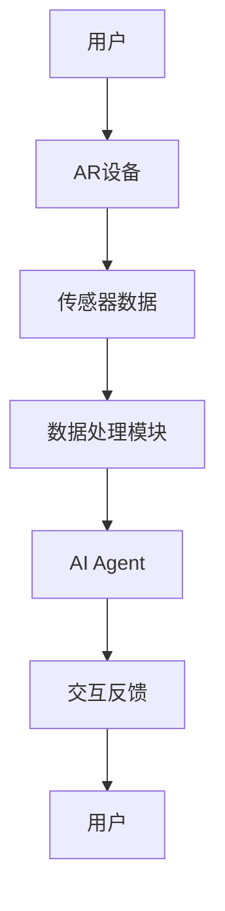
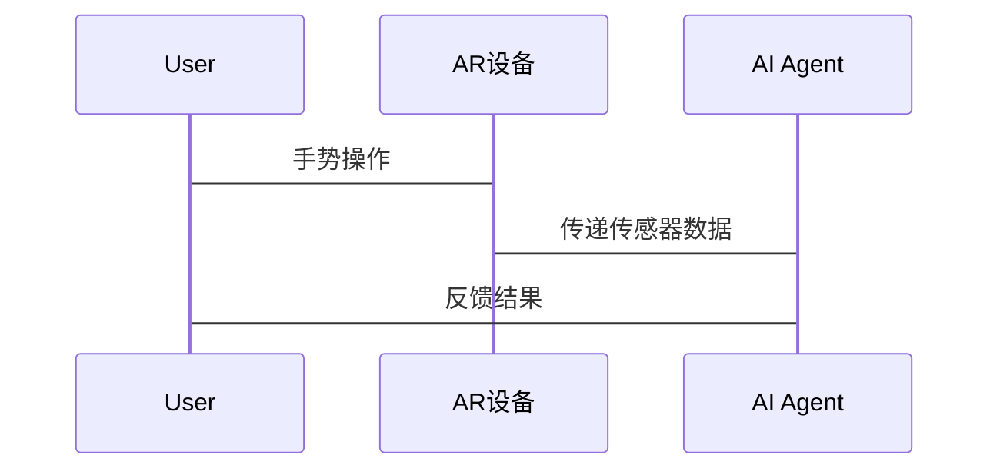

                 


# AI Agent的增强现实交互能力开发

> 关键词：AI Agent，增强现实，交互设计，系统架构，算法原理，项目实战

> 摘要：本文详细探讨AI Agent在增强现实交互能力开发中的核心概念、技术原理、系统架构、开发实践及未来趋势。通过逐步分析，结合丰富的图表和代码示例，深入解析增强现实交互中的关键技术和开发要点，为开发者提供实践指导。

---

## 第一章: AI Agent与增强现实交互概述

### 1.1 AI Agent的基本概念

#### 1.1.1 AI Agent的定义与分类
- AI Agent的定义：智能体（Agent）是指在环境中能够感知并自主行动以实现目标的实体。
- 分类：简单反射型Agent、基于模型的反射型Agent、目标驱动型Agent、效用驱动型Agent。

#### 1.1.2 增强现实技术的基本原理
- 增强现实（AR）：通过计算机生成的虚拟信息叠加在真实环境中，实现虚实结合的交互体验。
- AR的核心技术：图像识别、三维重建、空间定位、实时渲染。

#### 1.1.3 AI Agent与增强现实的结合
- AR环境中AI Agent的作用：提供智能交互、实时反馈、动态调整用户界面。
- AI Agent在AR中的典型应用：虚拟助手、智能导航、增强现实游戏。

### 1.2 增强现实交互的核心要素

#### 1.2.1 交互方式的多样性
- 手势交互、语音交互、眼动追踪、触觉反馈。
- 交互方式的优缺点对比：

| 交互方式 | 优点 | 缺点 |
|----------|------|------|
| 手势交互 | 直观、无需额外设备 | 易疲劳、精度有限 |
| 语音交互 | 方便、解放双手 | 易受环境干扰 |
| 眼动追踪 | 精准、无接触 | 设备成本高 |

#### 1.2.2 增强现实中的用户行为分析
- 用户行为模型：基于用户意图的交互预测。
- 行为分析技术：机器学习、用户画像、行为热图。

#### 1.2.3 交互反馈机制
- 反馈类型：视觉反馈、听觉反馈、触觉反馈。
- 反馈机制的设计原则：实时性、准确性、用户友好性。

### 1.3 AI Agent在增强现实中的应用背景

#### 1.3.1 增强现实技术的发展历程
- 从简单的图像叠加到实时三维重建的技术演进。
- 关键技术突破：SLAM（同步定位与建图）、实时渲染技术。

#### 1.3.2 AI Agent在增强现实中的作用
- 提供智能交互服务：虚拟助手、智能导航。
- 动态调整AR内容：根据用户行为实时更新虚拟元素。

#### 1.3.3 当前技术面临的挑战
- 计算资源消耗：实时处理大量传感器数据。
- 交互延迟：提升响应速度以提供流畅体验。
- 用户隐私：传感器数据的采集与安全性。

---

## 第二章: 增强现实交互中的核心概念与联系

### 2.1 核心概念原理

#### 2.1.1 增强现实中的空间定位技术
- 基于特征的定位：通过图像匹配实现位置估计。
- 基于深度学习的定位：利用卷积神经网络（CNN）提取特征。

#### 2.1.2 AI Agent的自主决策机制
- 基于规则的决策：简单的逻辑判断。
- 基于机器学习的决策：通过训练数据生成策略。

#### 2.1.3 交互数据的实时处理
- 数据流处理：传感器数据的实时解析与处理。
- 数据融合：多种传感器数据的融合分析。

### 2.2 核心概念属性对比表

| 核心概念 | 属性 | 特征 |
|----------|------|------|
| 增强现实 | 实时性 | 高 |
| AI Agent | 自主性 | 高 |
| 交互反馈 | 响应速度 | 快 |

### 2.3 ER实体关系图
```mermaid
erDiagram
    actor User {
        <属性> 用户ID
        <属性> 用户位置
    }
    actor AR设备 {
        <属性> 设备ID
        <属性> 传感器数据
    }
    actor AI Agent {
        <属性> 交互数据
        <属性> 状态信息
    }
    User -> AR设备 : 使用
    AR设备 -> AI Agent : 提供
    AI Agent -> User : 反馈
```

---

## 第三章: 增强现实交互中的算法原理

### 3.1 算法原理概述

#### 3.1.1 空间定位算法
- 基于图像匹配的定位算法：
  ```mermaid
  graph TD
      A[开始] --> B[图像采集]
      B --> C[特征提取]
      C --> D[匹配特征]
      D --> E[计算位姿]
      E --> F[结束]
  ```

#### 3.1.2 基于SLAM的定位技术
- SLAM算法流程：
  ```mermaid
  graph TD
      A[开始] --> B[环境感知]
      B --> C[定位]
      C --> D[建图]
      D --> E[优化]
      E --> F[结束]
  ```

#### 3.1.3 交互反馈算法
- 基于规则的反馈算法：
  ```python
  def feedback(user_input):
      if user_input == 'click':
          return 'clicked'
      elif user_input == 'swipe':
          return 'swiped'
      else:
          return 'unknown'
  ```

---

## 第四章: 增强现实交互系统的架构设计

### 4.1 系统架构概述

#### 4.1.1 系统功能模块
- 用户界面模块：手势识别、语音识别。
- 数据处理模块：传感器数据解析、特征提取。
- AI Agent模块：决策逻辑、状态管理。

#### 4.1.2 系统架构图


#### 4.1.3 接口设计
- 核心接口：传感器数据接口、交互反馈接口。
- 接口定义：
  ```python
  interface ARDevice {
      def get_sensor_data(): SensorData
  }
  ```

#### 4.1.4 交互流程


---

## 第五章: 项目实战与开发技巧

### 5.1 环境搭建

#### 5.1.1 开发工具安装
- AR开发框架：OpenCV、ARKit、ARCore。
- AI框架：TensorFlow、PyTorch。

#### 5.1.2 依赖管理
- Python依赖：
  ```bash
  pip install numpy
  pip install opencv-python
  ```

### 5.2 核心代码实现

#### 5.2.1 传感器数据处理
```python
import numpy as np
from cv2 import cv2

def process_depth(depth_image):
    # 简单的深度图处理
    gray = cv2.cvtColor(depth_image, cv2.COLOR_BGR2GRAY)
    return gray
```

#### 5.2.2 AI Agent决策逻辑
```python
def agent_decision(state):
    if state == 'idle':
        return 'wait'
    elif state == 'active':
        return 'process'
    else:
        return 'error'
```

#### 5.2.3 交互反馈实现
```python
def generate_feedback(action):
    feedback_map = {
        'click': '_CLICKED',
        'swipe': '_SWIPED',
        'tap': '_TAPPED'
    }
    return feedback_map.get(action, 'UNKNOWN')
```

### 5.3 实际案例分析

#### 5.3.1 案例背景
- 应用场景：增强现实购物体验。
- 需求分析：用户通过手势交互查看商品信息。

#### 5.3.2 实现细节
- 代码实现：
  ```python
  def main():
      import ar_api
      ar = ar_api.ARController()
      ar.start()
      while True:
          state = ar.get_agent_state()
          if state == 'idle':
              ar.wait()
          elif state == 'active':
              ar.process()
  ```

### 5.4 项目总结与经验分享

#### 5.4.1 项目小结
- 项目完成情况：成功实现手势交互和实时反馈。
- 遇到的挑战：传感器数据处理的延迟优化。

#### 5.4.2 注意事项
- 传感器数据的实时处理需要高效的算法。
- 交互反馈的延迟控制在50ms以内。

---

## 第六章: 最佳实践与未来展望

### 6.1 开发中的注意事项

#### 6.1.1 性能优化技巧
- 使用异步处理减少延迟。
- 优化传感器数据的解析速度。

#### 6.1.2 安全性问题
- 数据加密：传感器数据的传输加密。
- 权限管理：用户权限控制。

### 6.2 未来趋势与扩展阅读

#### 6.2.1 未来趋势
- AI Agent的自主性增强。
- 增强现实与物联网的深度融合。

#### 6.2.2 推荐阅读
- 《增强现实核心技术与应用》
- 《人工智能算法解析》

---

## 总结

通过系统地介绍AI Agent在增强现实交互能力开发中的核心概念、技术原理、系统架构和开发实践，本文为开发者提供了从理论到实践的完整指导。结合丰富的图表和代码示例，帮助读者深入理解并掌握增强现实交互能力开发的关键技术。

