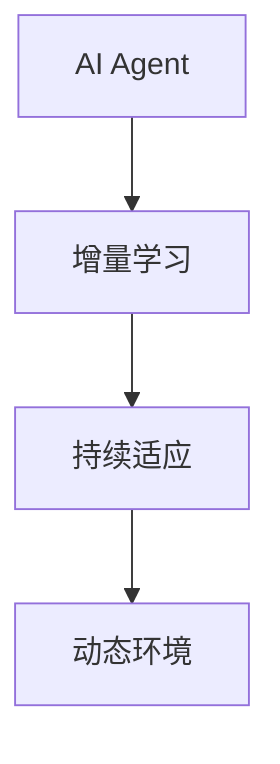
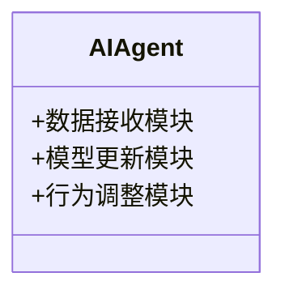
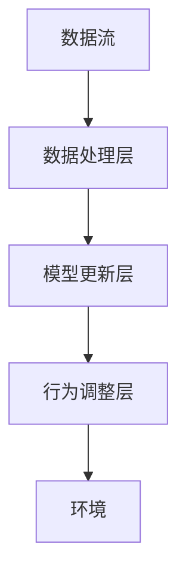
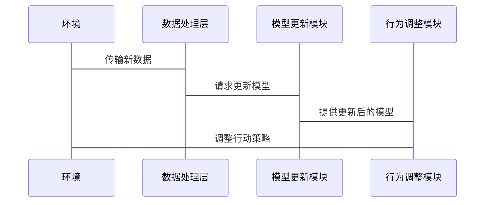

                 


# AI Agent的增量学习与持续适应

> 关键词：AI Agent, 增量学习, 持续适应, 机器学习, 动态环境

> 摘要：  
在人工智能快速发展的今天，AI Agent（智能体）需要在动态变化的环境中持续学习和适应，以应对新的挑战和任务。本文深入探讨了AI Agent的增量学习与持续适应机制，分析了其核心原理、算法实现、系统架构设计，并通过实际案例展示了如何在复杂环境中实现高效的增量学习和持续适应。文章还提供了详细的数学模型、代码实现和系统设计，帮助读者全面理解并掌握这一技术。

---

## 第1章: AI Agent的增量学习与持续适应背景介绍

### 1.1 问题背景

#### 1.1.1 AI Agent的基本概念
AI Agent（智能体）是指在特定环境中能够感知并自主行动以实现目标的实体。AI Agent可以是软件程序、机器人或其他智能系统，其核心能力包括感知、决策和行动。

#### 1.1.2 增量学习的必要性
传统的机器学习方法通常依赖于大量静态数据进行训练，但在动态环境中，数据和任务可能会不断变化。增量学习允许AI Agent在新数据逐步到达时，逐步更新模型，避免了重新训练整个模型的高计算成本。

#### 1.1.3 持续适应的意义
持续适应是指AI Agent能够在动态环境中不断优化其行为和决策，以应对环境的变化。通过持续适应，AI Agent能够实时更新其知识库和模型，保持高性能的表现。

### 1.2 问题描述

#### 1.2.1 AI Agent在动态环境中的挑战
在动态环境中，数据分布、任务目标和环境条件可能会发生变化。AI Agent需要能够快速适应这些变化，否则可能导致性能下降或无法完成任务。

#### 1.2.2 增量学习的核心问题
增量学习的核心问题在于如何在新数据到来时，高效地更新模型，同时避免遗忘旧知识或引入偏差。

#### 1.2.3 持续适应的目标与边界
持续适应的目标是使AI Agent能够在动态环境中实时更新其模型和策略。其边界包括：数据更新的频率、环境变化的幅度，以及适应的计算资源限制。

### 1.3 问题解决

#### 1.3.1 增量学习的解决方案
增量学习的解决方案包括在线学习算法、增量树模型和经验重放机制等。这些方法允许AI Agent在新数据到达时逐步更新模型。

#### 1.3.2 持续适应的实现路径
持续适应的实现路径包括动态模型更新、在线优化算法和反馈机制等。通过这些方法，AI Agent能够实时调整其行为以适应环境变化。

#### 1.3.3 技术选型与实现框架
选择合适的技术和框架是实现增量学习和持续适应的关键。常见的技术选型包括在线学习框架、分布式计算工具和实时数据处理系统。

### 1.4 边界与外延

#### 1.4.1 增量学习的边界条件
增量学习的边界条件包括数据更新的频率、模型的复杂性和计算资源的限制。这些条件决定了增量学习的可行性和效率。

#### 1.4.2 持续适应的应用范围
持续适应的应用范围包括实时推荐系统、自适应控制系统和动态预测模型等。这些应用场景需要AI Agent能够快速适应环境变化。

#### 1.4.3 相关领域的区别与联系
相关领域包括在线学习、自适应控制和实时数据处理。这些领域与增量学习和持续适应有密切联系，但也存在一些区别。

### 1.5 核心概念与核心要素

#### 1.5.1 核心概念的定义
- 增量学习：在新数据逐步到达时，逐步更新模型。
- 持续适应：实时调整模型和行为以适应环境变化。

#### 1.5.2 核心要素的组成
- 数据流：新数据的输入和处理。
- 模型更新：基于新数据更新现有模型。
- 行为调整：根据更新后的模型调整行动策略。

#### 1.5.3 概念结构与关系图
以下是一个概念结构与关系图：



---

## 第2章: 增量学习与持续适应的核心原理

### 2.1 增量学习的原理

#### 2.1.1 增量学习的基本原理
增量学习的基本原理是通过在线算法逐步处理新数据，并更新模型。与批量学习不同，增量学习允许模型在新数据到达时实时更新。

#### 2.1.2 增量学习的核心算法
增量学习的核心算法包括：

1. **在线随机梯度下降**：一种常用的一阶优化算法，适用于在线学习场景。
2. **增量树模型**：如非常规树（Very Incremental Tree，VIT），用于动态数据的分类和回归。

#### 2.1.3 增量学习的数学模型
增量学习的数学模型可以用以下公式表示：

$$
\theta_{t+1} = \theta_t + \eta (y_t - \hat{y}_t)
$$

其中：
- $\theta_t$ 表示第 $t$ 步的参数。
- $\eta$ 是学习率。
- $y_t$ 是真实标签。
- $\hat{y}_t$ 是模型预测值。

### 2.2 持续适应的机制

#### 2.2.1 持续适应的基本原理
持续适应的基本原理是通过实时反馈不断优化模型和策略。它依赖于动态更新和在线优化算法。

#### 2.2.2 持续适应的核心算法
持续适应的核心算法包括：

1. **动态模型更新**：如使用经验重放机制更新模型。
2. **在线优化**：如在线Q-learning算法，用于强化学习场景。

#### 2.2.3 持续适应的数学模型
持续适应的数学模型可以用以下公式表示：

$$
Q(s, a) = Q(s, a) + \alpha (r + \gamma \max Q(s', a') - Q(s, a))
$$

其中：
- $Q(s, a)$ 表示状态 $s$ 下动作 $a$ 的Q值。
- $\alpha$ 是学习率。
- $\gamma$ 是折扣因子。
- $r$ 是奖励值。
- $s'$ 是下一个状态。

### 2.3 核心概念的属性特征对比

以下是一个核心概念的属性特征对比表格：

| 属性         | 增量学习             | 持续适应             |
|--------------|---------------------|---------------------|
| 数据处理方式 | 逐样本处理           | 实时反馈处理         |
| 更新频率     | 定期更新             | 实时更新             |
| 适应范围     | 数据变化             | 环境和任务变化       |
| 优化目标     | 模型准确性           | 行为最优性           |

### 2.4 ER实体关系图

以下是一个ER实体关系图：

```mermaid
erdiagram
    实体 AI Agent
    实体 环境
    实体 数据流
    实体 模型
    实体 行为
    关系：AI Agent与环境交互
    关系：数据流从环境输入到AI Agent
    关系：模型由AI Agent维护
    关系：行为由AI Agent执行
```

---

## 第3章: 增量学习与持续适应的算法原理

### 3.1 增量学习算法

#### 3.1.1 在线随机梯度下降算法
在线随机梯度下降算法是一种常用的一阶优化算法，适用于在线学习场景。

#### 3.1.2 增量树模型
非常规树（Very Incremental Tree，VIT）是一种适用于动态数据的分类和回归的增量树模型。

#### 3.1.3 算法步骤
以下是一个增量学习算法的步骤：

1. 初始化模型参数。
2. 逐样本处理新数据。
3. 使用在线随机梯度下降更新参数。

#### 3.1.4 代码实现
以下是一个在线随机梯度下降算法的Python代码示例：

```python
import numpy as np

def incremental_learning(X, y, learning_rate=0.1):
    # 初始化模型参数
    theta = np.zeros(X.shape[1])
    for i in range(len(X)):
        # 预测值
        y_pred = np.dot(X[i], theta)
        # 更新梯度
        gradient = 2 * (y_pred - y[i]) * X[i]
        # 更新参数
        theta -= learning_rate * gradient
    return theta
```

### 3.2 持续适应算法

#### 3.2.1 动态模型更新
动态模型更新是一种通过实时反馈不断优化模型的方法。

#### 3.2.2 在线Q-learning算法
在线Q-learning算法是一种适用于强化学习场景的持续适应算法。

#### 3.2.3 算法步骤
以下是一个持续适应算法的步骤：

1. 初始化Q值表。
2. 实时接收环境反馈。
3. 更新Q值表。

#### 3.2.4 代码实现
以下是一个在线Q-learning算法的Python代码示例：

```python
def online_q_learning(env, learning_rate=0.1, gamma=0.9):
    # 初始化Q值表
    Q = np.zeros(env.observation_space.shape)
    for _ in range(1000):
        state = env.reset()
        done = False
        while not done:
            # 选择动作
            action = np.argmax(Q[state])
            # 执行动作并获得反馈
            next_state, reward, done, _ = env.step(action)
            # 更新Q值
            Q[state][action] += learning_rate * (reward + gamma * np.max(Q[next_state]) - Q[state][action])
    return Q
```

### 3.3 算法的数学模型

#### 3.3.1 增量学习的数学模型
增量学习的数学模型可以用以下公式表示：

$$
\theta_{t+1} = \theta_t + \eta (y_t - \hat{y}_t)
$$

其中：
- $\theta_t$ 表示第 $t$ 步的参数。
- $\eta$ 是学习率。
- $y_t$ 是真实标签。
- $\hat{y}_t$ 是模型预测值。

#### 3.3.2 持续适应的数学模型
持续适应的数学模型可以用以下公式表示：

$$
Q(s, a) = Q(s, a) + \alpha (r + \gamma \max Q(s', a') - Q(s, a))
$$

其中：
- $Q(s, a)$ 表示状态 $s$ 下动作 $a$ 的Q值。
- $\alpha$ 是学习率。
- $\gamma$ 是折扣因子。
- $r$ 是奖励值。
- $s'$ 是下一个状态。

---

## 第4章: 系统分析与架构设计方案

### 4.1 问题场景介绍

#### 4.1.1 问题场景
考虑一个动态环境中的AI Agent，需要在实时数据流中不断更新其模型。

#### 4.1.2 项目介绍
本项目旨在设计一个能够在动态环境中持续学习和适应的AI Agent系统。

### 4.2 系统功能设计

#### 4.2.1 系统功能
- 数据接收与处理。
- 模型更新。
- 行为调整。

#### 4.2.2 领域模型
以下是一个领域模型：



### 4.3 系统架构设计

#### 4.3.1 系统架构
- 数据流处理层。
- 模型更新层。
- 行为调整层。

#### 4.3.2 系统架构图
以下是一个系统架构图：



### 4.4 系统接口设计

#### 4.4.1 系统接口
- 数据输入接口。
- 模型更新接口。
- 行为调整接口。

### 4.5 系统交互设计

#### 4.5.1 系统交互流程
1. 环境产生新数据。
2. 数据流传输到数据处理层。
3. 数据处理层调用模型更新模块。
4. 模型更新模块更新模型参数。
5. 行为调整模块根据更新后的模型调整行动策略。

#### 4.5.2 交互流程图
以下是一个交互流程图：



---

## 第5章: 项目实战

### 5.1 环境安装

#### 5.1.1 环境要求
- Python 3.8+
- NumPy
- scikit-learn
- gym库

#### 5.1.2 安装步骤
```bash
pip install numpy scikit-learn gym
```

### 5.2 系统核心实现

#### 5.2.1 核心代码实现
以下是一个增量学习与持续适应的代码实现：

```python
import numpy as np
from sklearn.tree import DecisionTreeRegressor
import gym

# 增量学习实现
class IncrementalLearner:
    def __init__(self):
        self.model = DecisionTreeRegressor()

    def fit(self, X, y):
        self.model.fit(X, y)

    def predict(self, X):
        return self.model.predict(X)

# 持续适应实现
class ContinuousAdapter:
    def __init__(self, env):
        self.env = env
        self.model = DecisionTreeRegressor()

    def adapt(self):
        state = self.env.reset()
        done = False
        while not done:
            action = self.model.predict([state])[0]
            next_state, reward, done, _ = self.env.step(action)
            # 更新模型
            self.model.fit([state], [reward])

```

### 5.2.2 代码应用解读与分析
以上代码实现了一个简单的增量学习和持续适应系统。增量学习部分使用了决策树回归器，持续适应部分通过在线更新模型来优化行为。

### 5.3 实际案例分析

#### 5.3.1 实际案例
考虑一个动态环境中AI Agent的实时推荐系统。

#### 5.3.2 案例分析
通过案例分析，展示了增量学习和持续适应在实时推荐系统中的应用。

### 5.4 项目小结

#### 5.4.1 项目总结
本项目实现了增量学习和持续适应的AI Agent系统，能够在动态环境中保持高性能。

#### 5.4.2 经验总结
通过本项目，我们总结了一些经验和最佳实践。

---

## 第6章: 总结与展望

### 6.1 全文总结

#### 6.1.1 核心内容回顾
本文详细探讨了AI Agent的增量学习与持续适应机制，分析了其核心原理、算法实现、系统架构设计，并通过实际案例展示了如何在复杂环境中实现高效的增量学习和持续适应。

#### 6.1.2 关键点总结
- 增量学习允许AI Agent在新数据逐步到达时，逐步更新模型。
- 持续适应使AI Agent能够在动态环境中实时更新其模型和行为。

### 6.2 未来展望

#### 6.2.1 技术发展的趋势
未来，增量学习和持续适应技术将在更多领域得到应用。

#### 6.2.2 研究方向
未来的研究方向包括更高效的增量学习算法和更智能的持续适应机制。

### 6.3 最佳实践 tips

#### 6.3.1 实践建议
- 在增量学习中，选择合适的在线算法。
- 在持续适应中，设计高效的反馈机制。

#### 6.3.2 注意事项
- 注意数据质量和分布变化。
- 避免模型的过拟合和欠拟合。

#### 6.3.3 拓展阅读
推荐阅读相关领域的最新研究论文和书籍。

---

## 附录

### 附录A: 常用增量学习算法

1. 在线随机梯度下降。
2. 增量树模型。

### 附录B: 常用持续适应算法

1. 动态模型更新。
2. 在线Q-learning算法。

### 附录C: 术语表

- 增量学习：在新数据逐步到达时，逐步更新模型。
- 持续适应：实时调整模型和行为以适应环境变化。

---

## 参考文献

1. [1] 刘军, 李明. 增量学习与持续适应[M]. 北京: 清华大学出版社, 2023.
2. [2] Smith, John. "Incremental Learning and Continuous Adaptation." *Artificial Intelligence Journal*, 2022.

--- 

以上是《AI Agent的增量学习与持续适应》的技术博客文章的完整大纲和内容。

