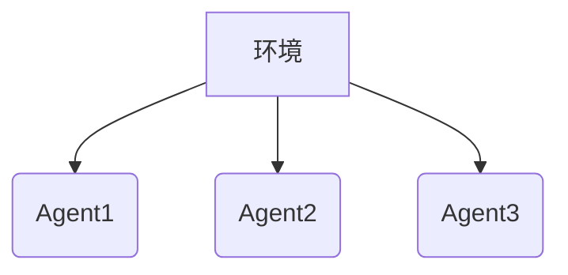
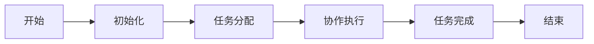
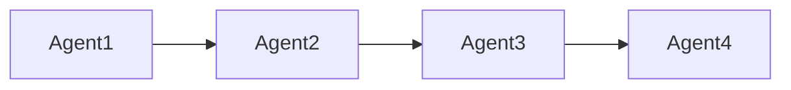
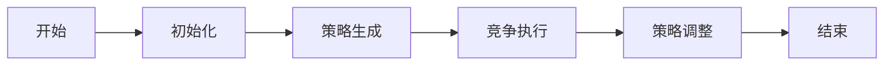
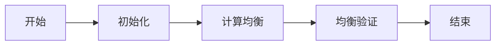
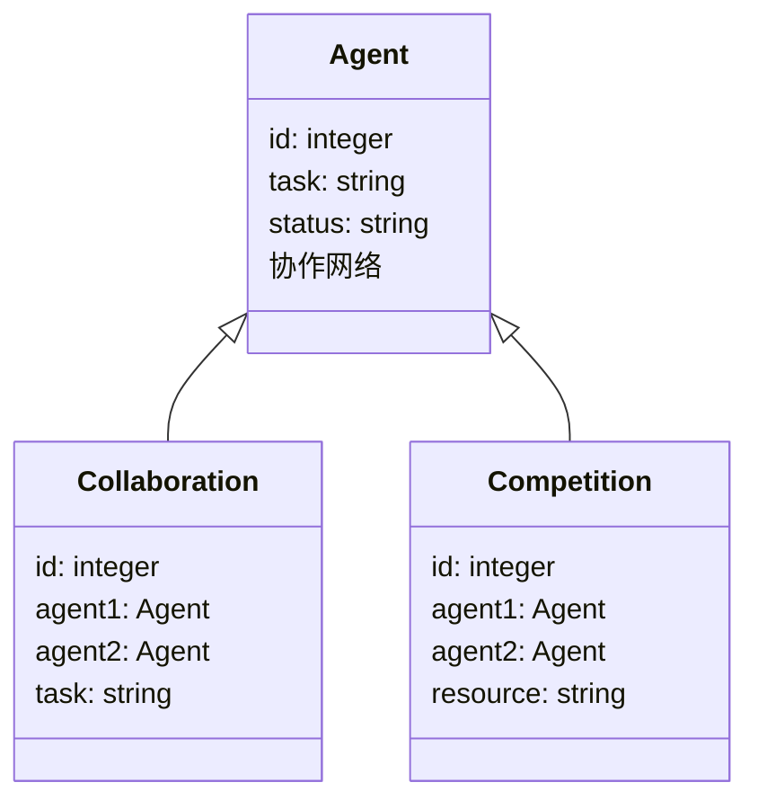
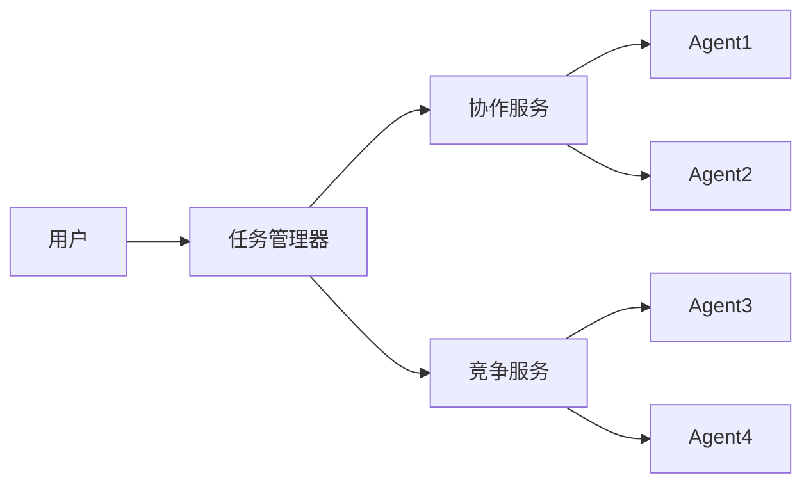
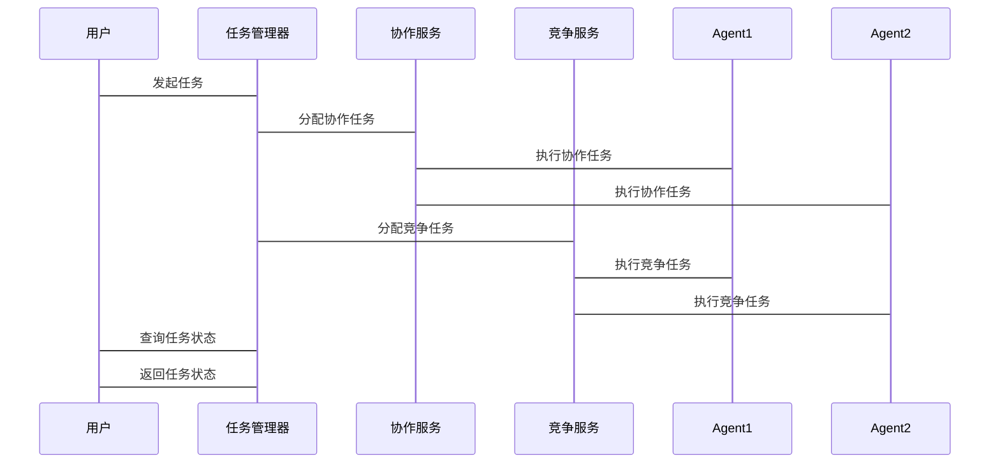

                 


# AI Agent的多Agent协作与竞争框架

> **关键词**：AI Agent，多Agent系统，协作与竞争，分布式算法，系统架构，博弈论

> **摘要**：  
> 本文深入探讨了AI Agent在多Agent系统中的协作与竞争框架，分析了多Agent协作与竞争的核心概念、算法原理、系统架构设计以及实际应用场景。文章首先介绍了多Agent系统的定义、特征和分类，然后详细讲解了协作与竞争的机制及其动态平衡。接着，从算法角度分析了多Agent协作与竞争的实现方法，包括分布式协作算法和纳什均衡在竞争中的应用。最后，结合实际案例，详细阐述了系统设计、项目实现和最佳实践，为读者提供了一个全面理解AI Agent协作与竞争框架的系统性视角。

---

# 第1章: 多Agent系统概述

## 1.1 多Agent系统的基本概念

### 1.1.1 多Agent系统的定义
多Agent系统（Multi-Agent System, MAS）是由多个智能体（Agent）组成的分布式系统，这些智能体能够通过协作与竞争完成复杂的任务。每个Agent都有自己的目标、知识和行为规则。

**图1-1：多Agent系统的组成**



### 1.1.2 多Agent系统的特征
多Agent系统具有以下特征：
- **分布式性**：多个Agent独立运行，分布在网络中。
- **自主性**：每个Agent能够自主决策。
- **协作性**：Agent之间通过协作完成共同目标。
- **竞争性**：Agent之间存在竞争关系，争夺资源或目标。

### 1.1.3 多Agent系统的分类
多Agent系统可以分为以下几类：
1. **基于任务的多Agent系统**：Agent通过协作完成特定任务。
2. **基于市场的多Agent系统**：Agent通过市场机制进行资源分配。
3. **基于博弈的多Agent系统**：Agent通过博弈论进行决策。

---

## 1.2 多Agent协作与竞争的背景

### 1.2.1 协作与竞争的定义
- **协作**：多个Agent通过合作完成共同目标。
- **竞争**：多个Agent争夺有限资源或目标。

### 1.2.2 协作与竞争的必要性
在实际场景中，多Agent系统需要同时考虑协作与竞争，以实现全局最优或个体最优。

### 1.2.3 多Agent协作与竞争的应用场景
- **分布式计算**：如分布式任务调度。
- **博弈论应用**：如游戏AI中的协作与竞争。
- **经济系统**：如金融市场的多Agent模拟。

---

## 1.3 多Agent协作与竞争框架的结构

### 1.3.1 框架的核心要素
- **Agent**：独立决策的智能体。
- **协作机制**：Agent之间协作的规则。
- **竞争机制**：Agent之间竞争的规则。
- **协调机制**：平衡协作与竞争的机制。

### 1.3.2 框架的层次结构
1. **Agent层**：独立的智能体。
2. **协作层**：协作机制的实现。
3. **竞争层**：竞争机制的实现。
4. **协调层**：协作与竞争的平衡。

### 1.3.3 框架的边界与外延
- **边界**：多Agent系统与其他系统的接口。
- **外延**：框架的扩展部分，如外部数据源。

---

## 1.4 本章小结
本章介绍了多Agent系统的基本概念、协作与竞争的背景，以及协作与竞争框架的结构，为后续内容奠定了基础。

---

# 第2章: AI Agent的核心概念与属性

## 2.1 AI Agent的定义与特征

### 2.1.1 AI Agent的定义
AI Agent是一个能够感知环境、自主决策并采取行动的智能体。

### 2.1.2 AI Agent的核心属性
| 属性 | 描述 |
|------|------|
| 自主性 | Agent能够自主决策 |
| 反应性 | Agent能够感知环境并实时响应 |
| 协作性 | Agent能够与其他Agent协作 |
| 竞争性 | Agent能够与其他Agent竞争 |

### 2.1.3 AI Agent的行为模式
- **反应式行为**：基于当前感知做出决策。
- **规划式行为**：基于长期规划做出决策。

---

## 2.2 多Agent协作与竞争的机制

### 2.2.1 协作机制的定义
协作机制是Agent之间通过合作完成共同目标的规则。

### 2.2.2 竞争机制的定义
竞争机制是Agent之间通过竞争争夺资源或目标的规则。

### 2.2.3 协作与竞争的动态平衡
协作与竞争的动态平衡是通过协调机制实现的。

---

## 2.3 多Agent协作与竞争的关系

### 2.3.1 协作与竞争的对比
| 对比维度 | 协作 | 竞争 |
|----------|------|------|
| 目标 | 共同目标 | 个体目标 |
| 结果 | 资源共享 | 资源争夺 |

### 2.3.2 协作与竞争的相互作用
协作与竞争是多Agent系统中两个相互关联的过程。

### 2.3.3 协作与竞争的系统性特征
- **动态性**：协作与竞争关系会随环境变化而变化。
- **复杂性**：协作与竞争的相互作用可能导致复杂的结果。

---

## 2.4 本章小结
本章详细讲解了AI Agent的核心概念、协作与竞争的机制及其关系，为后续的算法分析奠定了基础。

---

# 第3章: 多Agent协作算法

## 3.1 分布式协作算法

### 3.1.1 分布式协作算法的定义
分布式协作算法是一种基于分布式计算的协作算法。

### 3.1.2 分布式协作算法的实现步骤



### 3.1.3 分布式协作算法的优缺点
| 优点 | 缺点 |
|------|------|
| 高效性 | 复杂性 |
| 分布式 | 依赖性 |

---

## 3.2 协作网络构建算法

### 3.2.1 协作网络的定义
协作网络是多个Agent之间通过协作形成的网络结构。

### 3.2.2 协作网络的构建方法



### 3.2.3 协作网络的优化策略
- **负载均衡**：均衡Agent之间的任务分配。
- **通信优化**：减少Agent之间的通信开销。

---

## 3.3 本章小结
本章详细讲解了多Agent协作算法的实现方法，包括分布式协作算法和协作网络构建算法。

---

# 第4章: 多Agent竞争算法

## 4.1 竞争策略生成算法

### 4.1.1 竞争策略的定义
竞争策略是Agent在竞争中采取的策略。

### 4.1.2 竞争策略生成算法的实现步骤



### 4.1.3 竞争策略的优化方法
- **基于博弈论的优化**：利用博弈论优化竞争策略。
- **基于进化算法的优化**：利用进化算法优化竞争策略。

---

## 4.2 竞争均衡算法

### 4.2.1 竞争均衡的定义
竞争均衡是多Agent系统中的一种平衡状态。

### 4.2.2 竞争均衡算法的实现步骤



### 4.2.3 竞争均衡算法的应用场景
- **博弈论应用**：如拍卖中的竞争均衡。
- **经济系统应用**：如市场均衡的计算。

---

## 4.3 本章小结
本章详细讲解了多Agent竞争算法的实现方法，包括竞争策略生成算法和竞争均衡算法。

---

# 第5章: 多Agent协作与竞争的系统架构设计

## 5.1 问题场景介绍
本章通过一个实际应用场景——分布式任务调度系统，介绍多Agent协作与竞争的系统架构设计。

---

## 5.2 系统功能设计

### 5.2.1 领域模型



---

## 5.3 系统架构设计

### 5.3.1 系统架构图



---

## 5.4 系统交互设计

### 5.4.1 交互流程图



---

## 5.5 本章小结
本章通过实际应用场景，详细介绍了多Agent协作与竞争系统的功能设计和架构设计。

---

# 第6章: 项目实战

## 6.1 环境安装

### 6.1.1 安装Python
```bash
# 安装Python
sudo apt-get install python3
```

### 6.1.2 安装依赖库
```bash
# 安装依赖库
pip install numpy
pip install matplotlib
pip install networkx
```

---

## 6.2 系统核心实现源代码

### 6.2.1 协作网络构建

```python
import networkx as nx

def create_collaboration_network(agents):
    G = nx.Graph()
    G.add_nodes_from(agents)
    for i in range(len(agents)):
        for j in range(i+1, len(agents)):
            G.add_edge(agents[i], agents[j])
    return G

# 示例
agents = ['Agent1', 'Agent2', 'Agent3', 'Agent4']
network = create_collaboration_network(agents)
print(network.nodes())
print(network.edges())
```

### 6.2.2 竞争均衡计算

```python
import numpy as np

def compute_nash_equilibrium(A, B):
    # A和B是矩阵
    # 计算纳什均衡
    pass

# 示例
A = np.array([[1, 0], [0, 1]])
B = np.array([[1, 0], [0, 1]])
equilibrium = compute_nash_equilibrium(A, B)
print(equilibrium)
```

---

## 6.3 案例分析与详细解读

### 6.3.1 案例分析
假设我们有一个分布式任务调度系统，其中有两个协作任务和两个竞争任务。通过协作网络构建和竞争均衡计算，我们可以实现任务的高效调度。

### 6.3.2 代码实现解读
- **协作网络构建**：通过NetworkX库构建协作网络。
- **竞争均衡计算**：通过矩阵计算纳什均衡。

---

## 6.4 项目小结
本章通过实际项目，详细讲解了多Agent协作与竞争系统的实现方法，包括环境安装、核心代码实现和案例分析。

---

# 第7章: 最佳实践与小结

## 7.1 本章小结
本文全面介绍了AI Agent的多Agent协作与竞争框架，包括多Agent系统概述、AI Agent的核心概念与属性、多Agent协作与竞争的算法原理、系统架构设计以及项目实战。

---

## 7.2 注意事项

1. **算法实现**：算法实现需要考虑系统的复杂性和效率。
2. **系统设计**：系统设计需要考虑可扩展性和可维护性。
3. **实际应用**：实际应用需要考虑环境的不确定性和动态性。

---

## 7.3 拓展阅读
1. **博弈论**：推荐阅读《博弈论导论》。
2. **多Agent系统**：推荐阅读《Multi-Agent Systems》。
3. **分布式计算**：推荐阅读《分布式系统：概念与设计》。

---

# 结语
通过本文的介绍，读者可以全面理解AI Agent的多Agent协作与竞争框架，掌握其核心概念、算法原理和系统设计方法。希望本文能为读者在相关领域的研究和实践提供有价值的参考。

--- 

**全文完**

