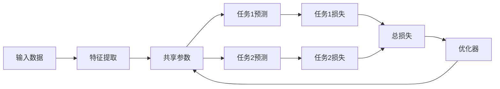

                 

# AI Agent的多任务学习与知识迁移

**关键词**：AI Agent，多任务学习，知识迁移，机器学习，深度学习

**摘要**：本文深入探讨AI Agent在多任务学习与知识迁移中的应用，分析多任务学习的核心原理、算法框架，以及知识迁移的实现机制。通过系统架构设计和项目实战，展示如何构建高效的AI Agent系统，并结合实际案例进行详细解读。

---

## 第1章 AI Agent与多任务学习概述

### 1.1 AI Agent的基本概念

#### 1.1.1 AI Agent的定义与特点
AI Agent（人工智能代理）是指能够感知环境、自主决策并执行任务的智能体。其特点包括：
- **自主性**：无需外部干预，自主完成任务。
- **反应性**：能实时感知环境变化并做出响应。
- **目标导向**：基于明确的目标执行任务。
- **学习能力**：通过数据和经验提升性能。

#### 1.1.2 AI Agent的核心功能与应用场景
AI Agent的核心功能包括感知、决策、执行和学习。应用场景广泛，如自动驾驶、智能助手、机器人控制等。

#### 1.1.3 多任务学习的定义与背景
多任务学习（Multi-Task Learning, MTL）是指同时学习多个相关任务，共享部分参数以提高学习效率和性能。

---

## 第2章 多任务学习的核心原理

### 2.1 多任务学习的理论基础

#### 2.1.1 参数共享与任务间关系
参数共享是MTL的核心，通过共享参数降低模型复杂度，提升泛化能力。

#### 2.1.2 任务间权重分配策略
任务间权重分配决定了每个任务对整体损失的贡献，常用方法包括加权损失和动态权重调整。

#### 2.1.3 多任务学习的优化目标
优化目标是在多个任务间找到平衡，常用目标函数：
$$ \min_{\theta} \sum_{i=1}^n \lambda_i L_i(\theta) $$

### 2.2 多任务学习的算法框架

#### 2.2.1 基于共享参数的多任务学习
算法流程如下：

#### 2.2.2 基于任务间关系的多任务学习
通过任务间相似性进行参数调整，常用相似性度量：
$$ \text{similarity}(T_i, T_j) = \frac{\sum_{k=1}^m w_{ik}w_{jk}}}{\sqrt{\sum_{k=1}^m w_{ik}^2} \sqrt{\sum_{k=1}^m w_{jk}^2}} $$

---

## 第3章 知识迁移的核心原理

### 3.1 知识迁移的定义与分类

#### 3.1.1 直接知识迁移
直接迁移是指将一个任务学到的知识直接应用于另一个任务。

#### 3.1.2 间接知识迁移
间接迁移是指通过中间任务或特征进行知识转移。

### 3.2 知识迁移在AI Agent中的作用

#### 3.2.1 提高学习效率
通过共享知识，减少数据需求和训练时间。

#### 3.2.2 增强任务适应性
使AI Agent能够快速适应新任务，提升性能。

---

## 第4章 知识迁移的实现机制

### 4.1 知识表示与提取

#### 4.1.1 知识表示方法
使用向量或符号表示知识，便于迁移。

#### 4.1.2 知识提取算法
通过聚类或分类算法提取任务间的共同特征。

### 4.2 知识表示的迁移策略

#### 4.2.1 基于注意力机制的知识迁移
通过注意力机制确定任务间的重要特征。

#### 4.2.2 知识蒸馏
将复杂任务的知识迁移到简单模型中。

---

## 第5章 系统架构设计

### 5.1 系统模块划分

#### 5.1.1 感知模块
负责环境数据的采集与处理。

#### 5.1.2 决策模块
基于多任务学习和知识迁移进行决策。

#### 5.1.3 执行模块
执行具体任务并反馈结果。

### 5.2 系统交互流程

#### 5.2.1 用户输入
用户通过自然语言或命令输入需求。

#### 5.2.2 任务分解
系统将输入分解为多个子任务。

#### 5.2.3 任务执行
通过多任务学习和知识迁移完成任务。

---

## 第6章 项目实战

### 6.1 环境配置

#### 6.1.1 安装依赖
安装Python、TensorFlow等工具。

#### 6.1.2 数据准备
收集和整理多任务数据集。

### 6.2 核心代码实现

#### 6.2.1 多任务学习模型
定义MTL模型并实现参数共享。

#### 6.2.2 知识迁移模块
实现知识提取和迁移功能。

### 6.3 案例分析

#### 6.3.1 实际应用
展示AI Agent在多任务场景下的应用效果。

#### 6.3.2 性能评估
对比单任务和多任务学习的性能差异。

---

## 第7章 总结与展望

### 7.1 核心内容回顾
总结AI Agent的多任务学习与知识迁移的关键点。

### 7.2 未来展望
探讨更高效的知识迁移方法和跨领域应用。

---

**参考文献**：
1. [Bottleneck Networks](https://arxiv.org/abs/1710.10184)
2. [Dkt](https://arxiv.org/abs/1904.05949)
3. [MACE](https://arxiv.org/abs/1803.06025)

---

**工具资源**：
1. [Hugging Face](https://huggingface.co/)
2. [Keras](https://keras.io/)
3. [TensorFlow](https://www.tensorflow.org/)

---

通过以上结构，您可以逐步展开每个部分，详细介绍AI Agent的多任务学习与知识迁移的原理、算法和应用，确保内容全面且易于理解。

