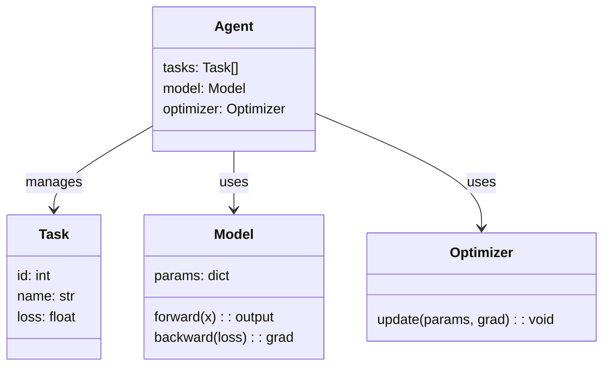
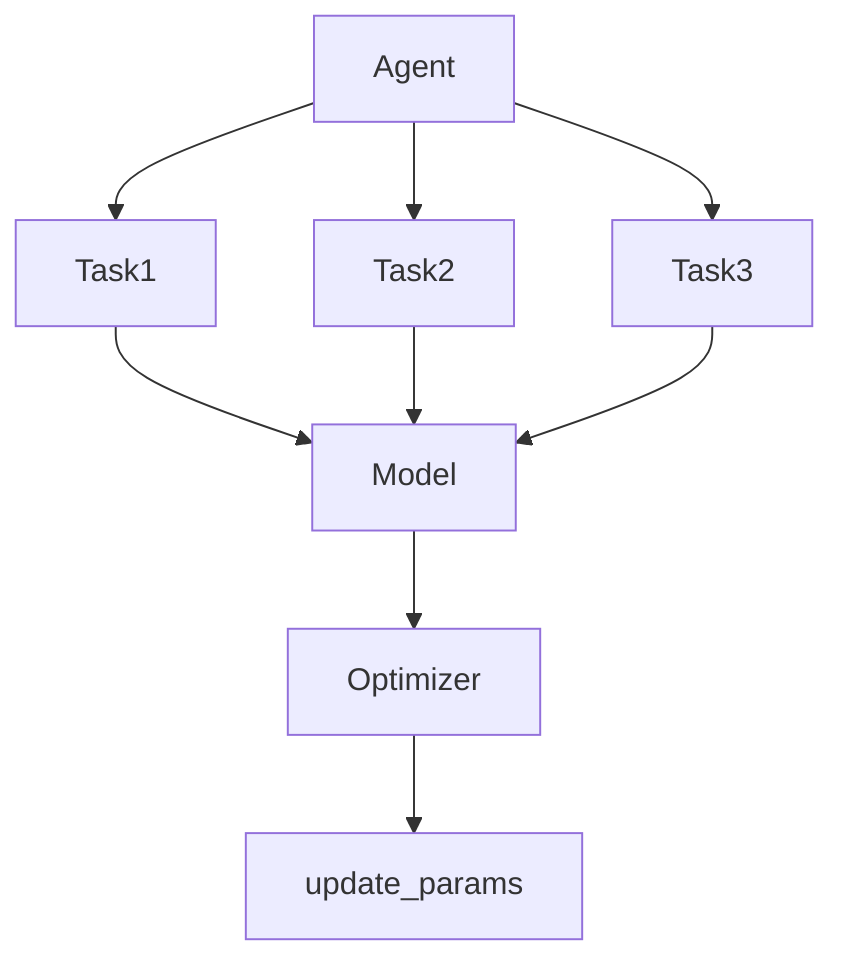
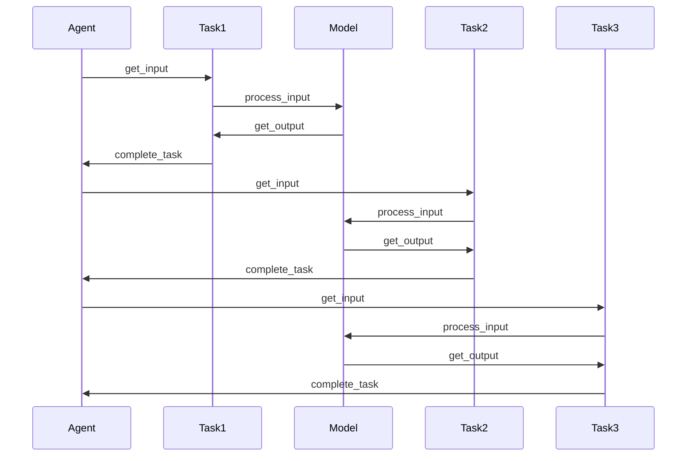
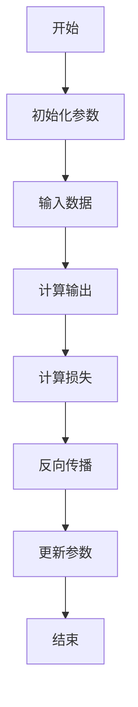

                 


# AI Agent的多任务学习能力：一专多能

> **关键词**：AI Agent，多任务学习，一专多能，技术博客，能力提升，系统架构

> **摘要**：  
AI Agent（智能体）作为一种能够感知环境、执行任务并做出决策的智能系统，其多任务学习能力是实现“一专多能”的关键。本文将从AI Agent的基本概念出发，深入探讨多任务学习的核心原理、算法实现、数学模型以及系统架构，并通过实际案例分析，帮助读者全面理解AI Agent如何通过多任务学习实现能力的全面提升。文章结构清晰，内容详实，旨在为AI领域从业者和研究者提供有价值的参考。

---

## 第1章 AI Agent与多任务学习概述

### 1.1 AI Agent的基本概念

#### 1.1.1 AI Agent的定义
AI Agent（智能体）是指能够感知环境、采取行动以实现目标的智能系统。它能够通过传感器获取信息，利用计算模型做出决策，并通过执行器与环境交互。AI Agent可以是软件程序、机器人或其他智能系统。

#### 1.1.2 AI Agent的核心特征
- **自主性**：能够在没有外部干预的情况下自主决策。
- **反应性**：能够实时感知环境并做出反应。
- **目标导向性**：具有明确的目标，行为围绕目标展开。
- **学习能力**：通过经验或数据优化自身能力。

#### 1.1.3 AI Agent的应用场景
- 智能助手（如Siri、Alexa）
- 自动驾驶系统
- 机器人控制
- 智慧城市中的自动化决策系统

### 1.2 多任务学习的基本概念

#### 1.2.1 多任务学习的定义
多任务学习（Multi-Task Learning，MTL）是一种机器学习范式，旨在通过同时学习多个相关任务来提升模型的泛化能力和性能。

#### 1.2.2 多任务学习的必要性
- **任务相关性**：多个任务之间可能存在共享特征或规律。
- **数据共享**：通过共享数据或模型参数，减少数据需求。
- **性能提升**：通过同时优化多个任务，模型表现优于单任务学习。

#### 1.2.3 多任务学习的挑战与机遇
- **挑战**：任务间可能存在冲突，模型难以平衡。
- **机遇**：通过共享参数或任务权重，提升模型的泛化能力。

### 1.3 AI Agent多任务学习的背景与意义

#### 1.3.1 多任务学习在AI Agent中的作用
AI Agent需要在复杂环境中完成多种任务，多任务学习能够帮助其快速适应不同场景。

#### 1.3.2 多任务学习提升AI Agent能力的路径
- **共享知识**：通过共享模型参数，减少训练数据的需求。
- **任务协同优化**：通过优化多个任务，提升整体性能。

#### 1.3.3 多任务学习在实际应用中的价值
- 提高效率：通过多任务学习，AI Agent可以在同一环境中完成多种任务。
- 降低数据需求：共享数据和模型参数，减少训练数据量。

### 1.4 本章小结
本章介绍了AI Agent的基本概念、多任务学习的定义及必要性，并探讨了多任务学习在AI Agent中的应用价值。

---

## 第2章 多任务学习的核心概念与原理

### 2.1 多任务学习的核心概念

#### 2.1.1 任务之间的关系
任务之间可能存在相关性或独立性，相关任务可以共享特征，独立任务则需要独立模型。

#### 2.1.2 任务的共享与独立性
- **共享特征**：多个任务共享某些特征，如图像分类中的颜色特征。
- **独立特征**：不同任务需要不同的特征，如语音识别中的音调特征。

#### 2.1.3 任务的复杂性与多样性
不同任务的复杂性和多样性会影响多任务学习的难易程度。

### 2.2 多任务学习的原理

#### 2.2.1 参数共享机制
多任务学习的核心思想是通过共享模型参数，同时优化多个任务。

#### 2.2.2 任务权重分配
为不同任务分配不同的权重，以平衡任务之间的冲突。

#### 2.2.3 任务间梯度平衡
通过调整梯度，平衡不同任务之间的优化过程。

### 2.3 多任务学习的数学模型

#### 2.3.1 基于权重共享的MTL模型
$$L_{total} = \sum_{i=1}^{n} \lambda_i L_i$$
其中，$\lambda_i$是任务$i$的权重，$L_i$是任务$i$的损失函数。

#### 2.3.2 基于任务权重分配的MTL模型
$$L_{total} = \sum_{i=1}^{n} w_i L_i$$
其中，$w_i$是任务$i$的权重，用于平衡不同任务的损失。

#### 2.3.3 基于梯度平衡的MTL模型
通过调整梯度，平衡不同任务之间的优化过程。

### 2.4 本章小结
本章详细讲解了多任务学习的核心概念和原理，包括任务关系、共享机制和数学模型。

---

## 第3章 多任务学习的算法原理

### 3.1 常见的多任务学习算法

#### 3.1.1 基于参数共享的MTL算法
- 参数共享是多任务学习的基本方法，通过共享部分参数，同时优化多个任务。

#### 3.1.2 基于任务权重分配的MTL算法
- 通过为每个任务分配不同的权重，平衡任务之间的冲突。

#### 3.1.3 基于任务间关系的MTL算法
- 根据任务之间的关系，调整模型的参数或权重。

### 3.2 多任务学习算法的实现步骤

#### 3.2.1 数据预处理
- 数据清洗、归一化、特征提取等。

#### 3.2.2 模型构建
- 构建共享参数的模型架构。

#### 3.2.3 损失函数设计
- 设计多任务损失函数，如加权平均损失。

#### 3.2.4 优化策略选择
- 使用合适的优化算法（如Adam）进行参数优化。

### 3.3 多任务学习算法的优缺点分析

#### 3.3.1 参数共享的优点
- 减少参数数量，降低计算成本。

#### 3.3.2 任务权重分配的缺点
- 需要额外设计权重分配机制。

#### 3.3.3 梯度平衡的挑战
- 需要平衡不同任务的梯度，防止某一任务主导优化过程。

### 3.4 本章小结
本章分析了多任务学习算法的实现步骤及其优缺点。

---

## 第4章 多任务学习的数学模型与公式

### 4.1 基于权重共享的MTL模型

#### 4.1.1 模型结构
$$y = f(x; \theta)$$
其中，$\theta$是共享参数。

#### 4.1.2 损失函数
$$L_{total} = \sum_{i=1}^{n} \lambda_i L_i$$

#### 4.1.3 优化目标
$$\min_{\theta} \sum_{i=1}^{n} \lambda_i L_i$$

### 4.2 基于任务权重分配的MTL模型

#### 4.2.1 模型结构
$$y_i = f(x_i; \theta)$$

#### 4.2.2 损失函数
$$L_{total} = \sum_{i=1}^{n} w_i L_i$$

#### 4.2.3 优化目标
$$\min_{\theta, w} \sum_{i=1}^{n} w_i L_i$$

### 4.3 本章小结
本章详细讲解了多任务学习的数学模型和公式，包括权重共享和任务权重分配的模型。

---

## 第5章 多任务学习的系统分析与架构设计方案

### 5.1 项目背景介绍
本项目旨在通过多任务学习提升AI Agent的多任务处理能力，使其能够在复杂环境中完成多种任务。

### 5.2 系统功能设计

#### 5.2.1 领域模型类图


#### 5.2.2 系统架构图


#### 5.2.3 系统交互序列图


### 5.3 本章小结
本章通过系统架构图和交互序列图，详细展示了多任务学习在AI Agent中的系统设计。

---

## 第6章 项目实战：基于多任务学习的AI Agent实现

### 6.1 环境安装
```bash
pip install numpy
pip install tensorflow
pip install matplotlib
```

### 6.2 核心代码实现

#### 6.2.1 多任务学习模型实现
```python
import numpy as np
import tensorflow as tf

class MultiTaskModel(tf.keras.Model):
    def __init__(self, input_shape, num_tasks):
        super().__init__()
        self.shared_layer = tf.keras.layers.Dense(64, activation='relu')
        self.task_layers = [tf.keras.layers.Dense(1, activation='sigmoid') for _ in range(num_tasks)]
        self.model = tf.keras.Sequential([
            tf.keras.layers.InputLayer(input_shape),
            self.shared_layer,
            tf.keras.layers.Dense(1, activation='sigmoid')
        ])
```

#### 6.2.2 损失函数实现
```python
def multi_task_loss(y_true, y_pred, tasks):
    loss = 0
    for i in range(len(tasks)):
        task_loss = tf.keras.losses.binary_crossentropy(y_true[i], y_pred[i])
        loss += task_loss
    return loss
```

#### 6.2.3 训练过程实现
```python
def train_model(model, optimizer, x_train, y_train, num_epochs):
    for epoch in range(num_epochs):
        with tf.GradientTape() as tape:
            y_pred = model.model(x_train)
            loss = multi_task_loss(y_train, y_pred, tasks)
        gradients = tape.gradient(loss, model.trainable_weights)
        optimizer.apply_gradients(zip(gradients, model.trainable_weights))
        print(f"Epoch {epoch+1}/{num_epochs}, Loss: {loss}")
```

### 6.3 代码应用解读与分析
- **模型结构**：通过共享层实现多任务学习，每个任务有一个独立的输出层。
- **损失函数**：通过加权平均的方式计算多个任务的损失。
- **训练过程**：使用梯度下降优化器，同时优化多个任务的损失。

### 6.4 实际案例分析
通过一个简单的图像分类任务，展示多任务学习的优势。

### 6.5 项目小结
本章通过实际代码实现，展示了多任务学习在AI Agent中的应用，帮助读者理解理论与实践的结合。

---

## 第7章 最佳实践与小结

### 7.1 本章小结
总结全文内容，回顾多任务学习的核心概念、算法原理和系统设计。

### 7.2 最佳实践 tips
- 合理设计任务权重，避免任务冲突。
- 使用合适的优化算法，平衡梯度。
- 通过实验验证，选择最优模型。

### 7.3 注意事项
- 多任务学习可能会增加模型复杂度，需注意过拟合。
- 任务之间的关系需要仔细分析，避免无效共享。

### 7.4 拓展阅读
- 建议阅读相关论文，了解多任务学习的最新进展。
- 学习其他多任务学习算法，如MCD、MTL等。

### 7.5 本章小结
本章总结了全文内容，并提供了实践建议和注意事项，帮助读者更好地理解和应用多任务学习。

---

## 附录

### 附录A 算法流程图


### 附录B 代码实现细节
```python
# 多任务学习模型实现细节
class MultiTaskModel(tf.keras.Model):
    def call(self, inputs):
        x = self.shared_layer(inputs)
        outputs = []
        for task_layer in self.task_layers:
            outputs.append(task_layer(x))
        return outputs
```

---

**全文完**

通过以上内容，读者可以系统地理解AI Agent的多任务学习能力，从理论到实践，逐步掌握多任务学习的核心原理和实现方法。

