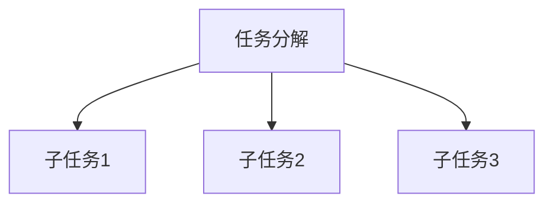
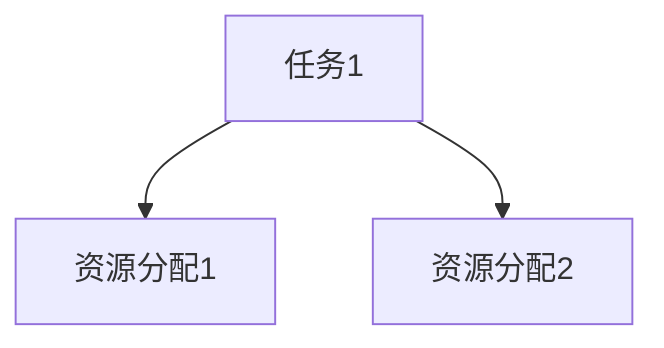
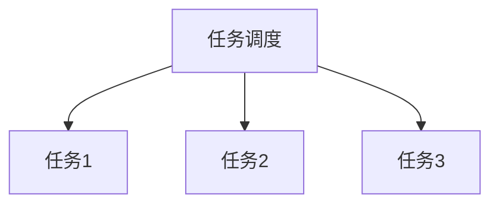
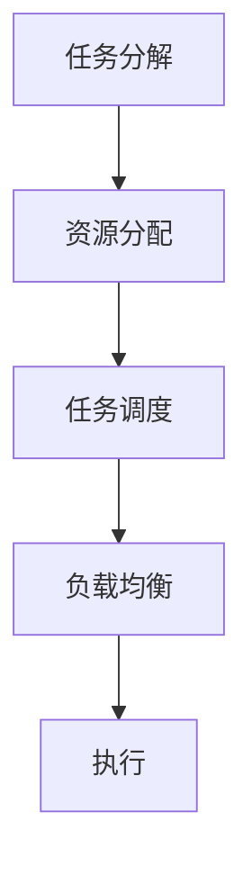

                 

# AI Agent的多任务并行处理能力

---

## 关键词：AI Agent, 多任务并行处理, 任务分解, 负载均衡, 任务调度

---

## 摘要

本文深入探讨了AI Agent在多任务并行处理中的能力，从基本概念到算法实现，再到系统设计和项目实战，全面解析了AI Agent如何高效处理多个任务。通过任务分解、资源分配、负载均衡和任务调度等方法，结合数学模型和算法实现，展示了AI Agent在多任务环境中的优势。文章还通过实际案例分析，总结了AI Agent多任务并行处理的关键点和最佳实践。

---

# 第一部分: AI Agent的多任务并行处理基础

## 第1章: AI Agent的基本概念与背景

### 1.1 AI Agent的定义与特点

#### 1.1.1 AI Agent的定义

AI Agent（人工智能代理）是一种能够感知环境并采取行动以实现目标的智能实体。它可以是一个软件程序、一个机器人，甚至是一个复杂的系统。AI Agent的核心目标是通过自主决策和行动来优化任务完成效率。

#### 1.1.2 AI Agent的核心特点

- **自主性**：AI Agent能够自主决策，无需外部干预。
- **反应性**：能够实时感知环境并做出反应。
- **目标导向**：所有行动都以实现特定目标为导向。
- **学习能力**：通过数据和经验不断优化自身性能。

#### 1.1.3 AI Agent与传统程序的区别

| 特性         | 传统程序               | AI Agent             |
|--------------|------------------------|----------------------|
| 决策方式     | 预先编写规则           | 自主学习和决策       |
| 环境适应性   | 固定规则，不适应变化     | 能够适应动态环境     |
| 任务处理     | 单任务或串行处理         | 多任务并行处理       |

---

### 1.2 多任务并行处理的背景与意义

#### 1.2.1 多任务处理的背景

在现代计算环境中，任务的复杂性和多样性不断增加，单任务处理的效率已经无法满足需求。多任务并行处理能够充分利用计算资源，提高整体效率。

#### 1.2.2 并行处理的重要性

- **提高效率**：通过并行处理，多个任务可以同时执行，缩短总执行时间。
- **资源利用**：充分利用计算资源，避免资源闲置。
- **增强性能**：在高性能计算领域，如AI训练和推理，多任务并行处理至关重要。

#### 1.2.3 AI Agent在多任务处理中的优势

AI Agent能够通过自主决策和学习，优化多任务并行处理的效率。它可以在复杂环境中动态调整任务优先级，确保资源的最优分配。

---

## 第2章: 多任务并行处理的核心概念

### 2.1 任务分解与并行执行

#### 2.1.1 任务分解的基本原理

任务分解是将一个复杂任务拆解为多个子任务，每个子任务可以在不同的计算单元上并行执行。任务分解的关键在于确保子任务之间尽可能独立，同时避免资源竞争。

#### 2.1.2 并行执行的实现方式

- **并行计算**：利用多核处理器或分布式计算资源同时执行多个任务。
- **流水线处理**：将任务分解为多个阶段，每个阶段由不同的计算单元处理。

#### 2.1.3 任务分解与并行的关系

任务分解是并行处理的基础。通过合理的任务分解，可以最大化并行处理的效率。以下是一个简单的任务分解示例：

---

### 2.2 资源分配与负载均衡

#### 2.2.1 资源分配的基本概念

资源分配是将计算资源（如CPU、内存、网络带宽）分配给不同的任务，以确保每个任务能够高效执行。合理的资源分配能够避免资源瓶颈，提高整体性能。

#### 2.2.2 负载均衡的实现方法

负载均衡是动态调整资源分配的过程，以应对任务负载的变化。常见的负载均衡算法包括：

- **静态负载均衡**：根据任务类型预先分配资源。
- **动态负载均衡**：根据实时负载动态调整资源分配。

#### 2.2.3 资源分配与负载均衡的优化

通过优化资源分配和负载均衡算法，可以提高多任务并行处理的效率。以下是一个简单的负载均衡示例：

---

### 2.3 任务调度与同步机制

#### 2.3.1 任务调度的基本原理

任务调度是根据任务优先级和资源情况，决定任务的执行顺序和分配方式。调度算法需要考虑任务的执行时间、依赖关系和资源限制。

#### 2.3.2 并行任务的同步机制

在并行处理中，任务之间可能需要同步，以确保数据的一致性和正确性。常见的同步机制包括锁机制、信号量和条件变量。

#### 2.3.3 调度算法与同步方法的对比

以下是一个简单的任务调度流程图：

---

## 第3章: AI Agent的多任务并行处理原理

### 3.1 任务分解与并行执行的原理

任务分解的数学模型可以表示为：

$$
T = \{t_1, t_2, ..., t_n\}
$$

其中，$T$ 是任务集合，$t_i$ 是子任务。

### 3.2 资源分配与负载均衡的数学模型

资源分配的数学模型可以表示为：

$$
R = \{r_1, r_2, ..., r_m\}
$$

其中，$R$ 是资源集合，$r_i$ 是资源。

### 3.3 任务调度与同步机制的数学模型

任务调度的数学模型可以表示为：

$$
S = \{s_1, s_2, ..., s_k\}
$$

其中，$S$ 是调度序列，$s_i$ 是调度动作。

---

## 第4章: 项目实战

### 4.1 项目介绍

#### 4.1.1 项目背景

本项目旨在开发一个多任务并行处理的AI Agent系统，用于优化计算任务的执行效率。

#### 4.1.2 项目目标

- 实现多任务并行处理。
- 优化资源分配和负载均衡。
- 提供高效的任务调度算法。

### 4.2 系统设计

#### 4.2.1 系统功能设计

- **任务分解模块**：将复杂任务分解为多个子任务。
- **资源分配模块**：根据任务需求分配资源。
- **任务调度模块**：根据任务优先级调度任务执行。
- **负载均衡模块**：动态调整资源分配。

#### 4.2.2 系统架构设计

---

## 第5章: 总结与展望

### 5.1 总结

本文详细探讨了AI Agent的多任务并行处理能力，从任务分解、资源分配到任务调度，全面解析了实现高效多任务处理的关键点。通过数学模型和算法实现，展示了AI Agent在多任务环境中的优势。

### 5.2 展望

未来，随着AI技术的不断发展，AI Agent的多任务并行处理能力将更加智能化和高效化。通过结合边缘计算和5G技术，AI Agent将在更多领域发挥重要作用。

---

通过本文的分析和探讨，读者可以全面理解AI Agent的多任务并行处理能力，并在实际项目中加以应用。

