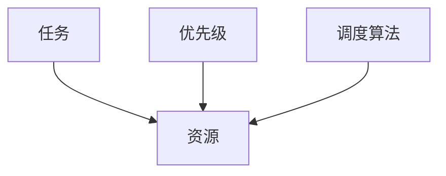
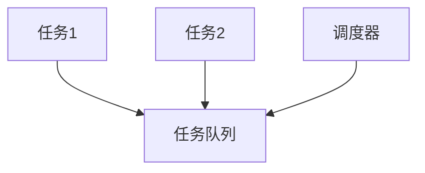
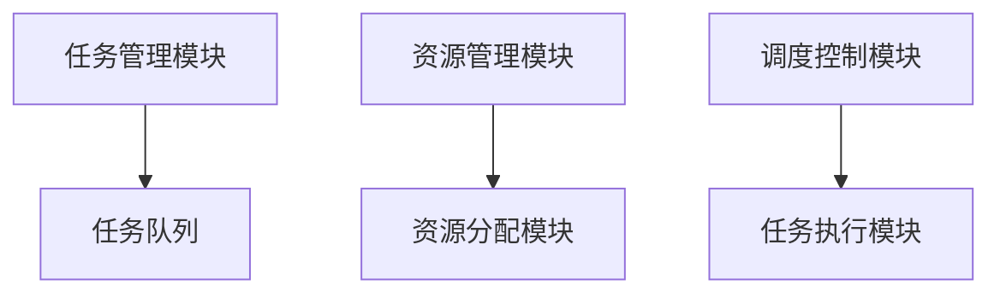

                 


```markdown
# AI Agent的多任务并行处理能力开发

> 关键词：AI Agent，多任务并行处理，任务调度，资源分配，算法原理，系统架构设计

> 摘要：本文深入探讨了AI Agent在多任务并行处理中的核心能力，分析了多任务并行处理的背景、核心概念、算法原理、系统架构设计，并通过实际案例展示了如何开发具备多任务并行处理能力的AI Agent。文章结合理论与实践，提供了详细的实现步骤和最佳实践，帮助读者全面掌握AI Agent的多任务并行处理能力开发。

---

# 第一部分: AI Agent的多任务并行处理能力开发背景

# 第1章: AI Agent的多任务并行处理概述

## 1.1 AI Agent的基本概念

### 1.1.1 AI Agent的定义与特点
AI Agent（人工智能代理）是一种能够感知环境、自主决策并执行任务的智能实体。它具备以下特点：
- **自主性**：能够在没有外部干预的情况下自主运行。
- **反应性**：能够实时感知环境并做出相应的反应。
- **目标导向性**：以实现特定目标为导向执行任务。
- **学习能力**：能够通过学习和经验优化自身的处理能力。

### 1.1.2 多任务并行处理的定义
多任务并行处理是指在同一时间段内同时处理多个任务的能力。在AI Agent中，多任务并行处理意味着能够在同一时间处理多个不同的任务，并根据任务优先级和资源分配进行动态调整。

### 1.1.3 AI Agent在多任务并行处理中的优势
AI Agent具备以下优势，使其在多任务并行处理中表现出色：
- **高效性**：通过并行处理多个任务，提高整体处理效率。
- **灵活性**：能够根据任务需求动态调整资源分配和任务优先级。
- **智能化**：通过学习和优化算法，提升多任务并行处理的效率和质量。

## 1.2 多任务并行处理的背景与应用

### 1.2.1 多任务并行处理的背景
随着AI技术的快速发展，AI Agent在各个领域的应用越来越广泛。在实际应用中，AI Agent常常需要同时处理多个任务，例如智能助手需要同时处理用户的语音请求、信息检索和任务调度。

### 1.2.2 多任务并行处理的应用场景
多任务并行处理在以下场景中尤为重要：
- **智能助手**：同时处理用户的多种请求，如信息查询、日程管理等。
- **自动驾驶**：同时处理环境感知、路径规划和决策制定等任务。
- **机器人控制**：同时处理运动控制、物体识别和任务执行等任务。

### 1.2.3 多任务并行处理的挑战
尽管多任务并行处理具有诸多优势，但在实际应用中也面临以下挑战：
- **任务优先级的动态变化**：任务的优先级可能根据环境变化而动态调整。
- **资源分配的复杂性**：需要合理分配计算资源以保证任务的高效执行。
- **任务之间的依赖关系**：任务之间可能存在依赖关系，需要合理安排任务执行顺序。

## 1.3 本章小结
本章介绍了AI Agent的基本概念和多任务并行处理的定义、优势及应用场景，并分析了多任务并行处理面临的挑战。这些内容为后续章节的深入分析奠定了基础。

---

# 第二部分: AI Agent的多任务并行处理核心概念

# 第2章: 多任务并行处理的核心概念与联系

## 2.1 多任务并行处理的核心概念

### 2.1.1 任务分解与组合
任务分解是指将一个复杂任务分解为多个子任务，每个子任务相对独立。任务组合则是将多个子任务组合成一个整体任务的过程。例如，在自动驾驶中，可以将任务分解为环境感知、路径规划和决策制定三个子任务。

### 2.1.2 任务优先级与调度
任务优先级是指任务在处理过程中的优先程度。任务调度是指根据任务优先级和资源分配情况，决定任务的执行顺序和分配方式。例如，在智能助手中，紧急任务的优先级高于普通任务。

### 2.1.3 资源分配与共享
资源分配是指将计算资源（如CPU、内存）分配给不同的任务，以保证任务的高效执行。资源共享是指多个任务共享同一资源，但需要合理分配资源使用时间以避免冲突。

## 2.2 多任务并行处理的ER实体关系图



上述关系图展示了任务与资源之间的关系，以及优先级和调度算法对资源分配的影响。

## 2.3 本章小结
本章详细讲解了多任务并行处理的核心概念，包括任务分解与组合、任务优先级与调度、资源分配与共享，并通过ER实体关系图展示了任务与资源之间的关系。这些内容为后续章节的算法设计和系统架构设计提供了理论基础。

---

# 第三部分: 多任务并行处理的算法原理

# 第3章: 多任务并行处理算法原理

## 3.1 任务调度算法



上述流程图展示了任务调度的基本流程：任务请求进入任务队列，调度器根据任务优先级选择任务进行处理。

## 3.2 资源分配算法

### 3.2.1 资源分配的数学模型
资源分配的数学模型如下：
$$ \text{资源分配} = \sum_{i=1}^{n} \frac{r_i}{t_i} $$
其中，$r_i$ 表示任务i的资源需求，$t_i$ 表示任务i的处理时间。

### 3.2.2 资源分配的优化策略
资源分配的优化策略包括：
1. **优先级调度**：根据任务优先级动态分配资源。
2. **负载均衡**：确保资源在不同任务之间的均衡分配。
3. **动态调整**：根据任务执行情况实时调整资源分配。

## 3.3 并行计算中的任务分配

### 3.3.1 并行计算的基本原理
并行计算是指同时执行多个任务，通过并行处理提高计算效率。例如，在多核处理器上，多个任务可以同时执行。

### 3.3.2 任务分配的优化策略
任务分配的优化策略包括：
1. **静态分配**：在任务开始前预先分配资源。
2. **动态分配**：根据任务执行情况实时分配资源。
3. **负载平衡**：确保任务在不同处理器之间的负载均衡。

### 3.3.3 并行计算中的负载均衡
负载均衡的实现方法包括：
- **静态负载均衡**：在任务开始前预先分配负载。
- **动态负载均衡**：根据任务执行情况实时调整负载分配。
- **自适应负载均衡**：根据系统负载动态调整资源分配策略。

## 3.4 本章小结
本章详细讲解了多任务并行处理的算法原理，包括任务调度算法、资源分配算法和并行计算中的任务分配策略。通过数学模型和算法流程图，读者可以更好地理解多任务并行处理的实现原理。

---

# 第四部分: 多任务并行处理的系统架构设计

# 第4章: 多任务并行处理系统架构设计

## 4.1 系统功能设计

### 4.1.1 任务管理模块
任务管理模块负责任务的接收、分解和调度。其功能包括：
1. **任务接收**：接收用户的任务请求。
2. **任务分解**：将复杂任务分解为多个子任务。
3. **任务调度**：根据任务优先级和资源情况调度任务执行。

### 4.1.2 资源管理模块
资源管理模块负责计算资源的分配和管理。其功能包括：
1. **资源分配**：根据任务需求分配计算资源。
2. **资源监控**：实时监控资源使用情况。
3. **资源回收**：任务完成后回收分配的资源。

### 4.1.3 调度控制模块
调度控制模块负责任务的优先级调度和资源分配。其功能包括：
1. **优先级计算**：根据任务需求计算任务优先级。
2. **调度策略**：根据优先级和资源情况制定调度策略。
3. **动态调整**：根据任务执行情况动态调整调度策略。

## 4.2 系统架构设计



上述架构图展示了多任务并行处理系统的整体架构，包括任务管理模块、资源管理模块和调度控制模块。

## 4.3 系统设计中的关键问题

### 4.3.1 任务之间的依赖关系
任务之间的依赖关系需要通过任务分解和调度算法进行处理。例如，任务A必须在任务B完成后才能执行。

### 4.3.2 资源分配的优先级
资源分配的优先级需要根据任务的重要性和紧急程度进行动态调整。例如，紧急任务的优先级高于普通任务。

### 4.3.3 调度算法的优化
调度算法的优化需要结合任务优先级和资源分配情况，制定最优的调度策略。例如，采用贪心算法进行资源分配。

## 4.4 本章小结
本章详细讲解了多任务并行处理系统的功能设计和架构设计，通过系统架构图展示了各模块之间的关系，并分析了系统设计中的关键问题。这些内容为后续章节的项目实战提供了理论支持。

---

# 第五部分: 多任务并行处理的项目实战

# 第5章: 多任务并行处理项目实战

## 5.1 项目背景与目标

### 5.1.1 项目背景
本项目旨在开发一个多任务并行处理的AI Agent，能够同时处理多个任务，并根据任务优先级和资源分配情况动态调整任务执行顺序。

### 5.1.2 项目目标
项目目标包括：
1. 实现任务分解与组合功能。
2. 实现任务优先级调度算法。
3. 实现资源分配与共享功能。
4. 实现任务之间的依赖关系处理。

## 5.2 项目环境配置

### 5.2.1 系统环境
- 操作系统：Linux
- 开发工具：PyCharm
- 语言：Python
- 第三方库：multiprocessing，threading

## 5.3 项目核心实现

### 5.3.1 核心代码实现

```python
import multiprocessing
import threading

class Task:
    def __init__(self, id, priority, duration):
        self.id = id
        self.priority = priority
        self.duration = duration

class Agent:
    def __init__(self):
        self.tasks = []
        self.resources = multiprocessing.Queue()
        self.scheduler = threading.Thread(target=self.schedule_tasks)

    def add_task(self, task):
        self.tasks.append(task)
        self.resources.put(task)

    def schedule_tasks(self):
        while True:
            while not self.resources.empty():
                task = self.resources.get()
                print(f"Processing task {task.id} with priority {task.priority}")
                # Simulate task execution
                import time
                time.sleep(task.duration)
                print(f"Task {task.id} completed")
            import time
            time.sleep(1)

if __name__ == "__main__":
    agent = Agent()
    agent.add_task(Task(1, 1, 2))
    agent.add_task(Task(2, 2, 1))
    agent.add_task(Task(3, 3, 3))
    agent.scheduler.start()
```

### 5.3.2 代码解读与分析
上述代码实现了一个简单的多任务并行处理系统，包括任务类和AI Agent类。Agent类负责任务的添加和调度，任务调度通过多线程实现。

### 5.3.3 项目运行结果
运行上述代码，可以观察到任务被动态添加到任务队列中，并根据优先级进行调度执行。任务执行结果将被输出到控制台。

## 5.4 项目小结
本章通过实际案例展示了如何开发一个多任务并行处理的AI Agent系统。通过核心代码实现和运行结果分析，读者可以更好地理解多任务并行处理的实现原理。

---

# 第六部分: 多任务并行处理的最佳实践

# 第6章: 多任务并行处理的最佳实践

## 6.1 开发中的注意事项
在开发多任务并行处理系统时，需要注意以下几点：
1. **任务优先级的动态调整**：根据任务需求和系统负载动态调整任务优先级。
2. **资源分配的优化**：合理分配计算资源，避免资源浪费和冲突。
3. **任务之间的依赖关系**：正确处理任务之间的依赖关系，确保任务执行顺序的正确性。

## 6.2 优化建议
以下是一些优化建议：
1. **采用负载均衡技术**：确保任务在不同处理器之间的负载均衡。
2. **使用高效的调度算法**：选择适合实际场景的调度算法，如贪心算法、优先级调度算法等。
3. **优化任务分解与组合**：合理分解和组合任务，提高任务执行效率。

## 6.3 项目小结
本章总结了开发多任务并行处理系统时的注意事项和优化建议，帮助读者在实际项目中避免常见错误，并提高系统的性能和效率。

---

# 第七部分: 总结与展望

## 7.1 总结
本文深入探讨了AI Agent的多任务并行处理能力开发，从背景、核心概念、算法原理到系统架构设计，再到项目实战和最佳实践，全面分析了多任务并行处理的实现过程。

## 7.2 展望
随着AI技术的不断发展，AI Agent的多任务并行处理能力将更加智能化和高效化。未来的研究方向包括：
- **更高效的调度算法**：开发更高效的调度算法，提高任务处理效率。
- **更智能的资源分配策略**：研究更智能的资源分配策略，优化资源利用率。
- **更强大的任务分解与组合技术**：开发更强大的任务分解与组合技术，提高任务执行效率。

---

# 参考文献
（此处列出参考文献）

---

通过本文的详细讲解和实际案例分析，读者可以全面掌握AI Agent的多任务并行处理能力开发的理论和实践知识。希望本文对读者有所帮助！
```

