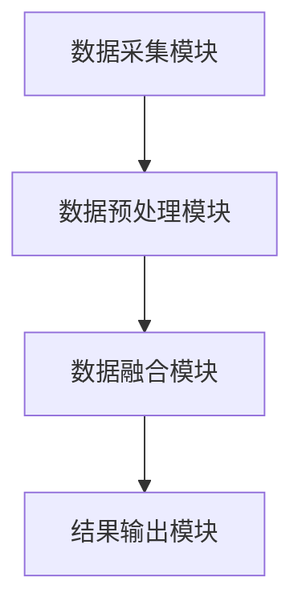

                 


# AI Agent的多传感器数据融合技术

## 关键词：AI Agent, 多传感器数据融合, 数据融合算法, 系统架构设计, 项目实战

## 摘要：  
本文深入探讨了AI Agent在多传感器数据融合技术中的应用，从基本概念到实际案例，全面解析了数据融合的核心原理、算法实现、系统架构设计以及项目实战。通过详细讲解数据融合的关键技术，结合实际项目案例，帮助读者理解如何在AI Agent中高效地进行多传感器数据融合，提升系统的感知能力和决策效率。

---

## 第1章 多传感器数据融合技术的背景与应用

### 1.1 多传感器数据融合的基本概念

#### 1.1.1 多传感器数据融合的定义  
多传感器数据融合是指将来自多个传感器的数据进行处理、分析和综合，以获得更准确、完整和可靠的最终结果。通过融合多源数据，可以弥补单一传感器的不足，提升系统的感知能力和决策能力。

#### 1.1.2 数据融合的必要性与优势  
- **必要性**：单一传感器的感知能力有限，无法覆盖所有场景。通过融合多传感器数据，可以提高系统的鲁棒性和可靠性。  
- **优势**：提升数据的准确性、完整性、实时性和可用性，增强系统的环境适应能力。

#### 1.1.3 数据融合的分类与应用场景  
数据融合可以分为低级融合和高级融合：  
- **低级融合**：在原始数据或特征层进行融合，如位置数据的加权平均。  
- **高级融合**：在语义或决策层进行融合，如基于概率的融合方法。  

应用场景包括自动驾驶、机器人导航、智能安防、工业自动化等。

---

### 1.2 AI Agent与多传感器数据融合的关系

#### 1.2.1 AI Agent的基本概念  
AI Agent是一种智能实体，能够感知环境、自主决策并执行任务。它需要依赖多传感器数据来感知环境，进而做出合理的决策。

#### 1.2.2 多传感器数据融合在AI Agent中的作用  
- 提供准确的环境信息，帮助AI Agent做出更可靠的决策。  
- 处理传感器数据的不一致性和不确定性，提升系统的感知能力。  

#### 1.2.3 AI Agent与数据融合的结合发展趋势  
随着传感器技术的进步和AI算法的优化，AI Agent的多传感器数据融合将更加智能化和实时化，应用场景也将更加广泛。

---

## 第2章 多传感器数据融合的核心概念与原理

### 2.1 多传感器数据融合的原理

#### 2.1.1 数据采集与预处理  
- 数据采集：通过多种传感器（如摄像头、麦克风、GPS等）获取环境数据。  
- 数据预处理：包括去噪、归一化和特征提取等步骤，确保数据的可用性。

#### 2.1.2 数据融合的数学模型  
数据融合可以通过加权融合、概率融合等方式实现。例如，加权融合可以表示为：  
$$ f_{\text{融合}} = \sum_{i=1}^{n} w_i x_i $$  
其中，$w_i$是传感器i的权重，$x_i$是传感器i的输入数据。

#### 2.1.3 数据融合的策略  
- **加权融合**：根据传感器的可靠性和精度分配权重。  
- **概率融合**：基于贝叶斯理论，计算各个传感器结果的概率分布并进行融合。  

---

### 2.2 多传感器数据融合的实现步骤

#### 2.2.1 传感器选择与配置  
根据应用场景选择合适的传感器组合，并进行校准和配置。

#### 2.2.2 数据预处理与特征提取  
对传感器数据进行去噪、归一化处理，并提取关键特征。

#### 2.2.3 数据融合策略的制定  
根据传感器特性和数据类型选择合适的融合方法，并进行参数优化。

#### 2.2.4 融合结果的评估与优化  
通过对比分析和实验验证，评估融合结果的准确性和可靠性，并进行优化。

---

## 第3章 多传感器数据融合的关键技术

### 3.1 数据融合的算法选择

#### 3.1.1 加权融合算法  
加权融合是一种简单有效的融合方法，适用于线性可加的数据。例如：  
$$ y = \sum_{i=1}^{n} w_i x_i $$  

#### 3.1.2 概率融合算法  
基于概率论的融合方法，如贝叶斯融合：  
$$ P(A|B) = \frac{P(B|A)P(A)}{P(B)} $$  

#### 3.1.3 基于深度学习的融合算法  
深度学习方法（如图神经网络）可以自动学习传感器数据的高层次特征，实现更复杂的融合。

---

### 3.2 数据融合的实现细节

#### 3.2.1 数据异构性处理  
不同传感器的数据格式和特征可能不同，需要进行统一处理。例如，将图像数据转换为特征向量。

#### 3.2.2 数据时序性处理  
处理时间序列数据时，可以使用卡尔曼滤波等方法进行融合。

#### 3.2.3 数据冗余性处理  
去除冗余数据，降低计算复杂度，同时保持数据的准确性。

---

## 第4章 多传感器数据融合的系统架构设计

### 4.1 系统功能设计

#### 4.1.1 数据采集模块  
负责采集多传感器的数据，并进行初步处理。

#### 4.1.2 数据预处理模块  
对采集到的数据进行清洗、归一化等预处理操作。

#### 4.1.3 数据融合模块  
选择合适的融合算法，对预处理后的数据进行融合。

#### 4.1.4 结果输出模块  
将融合后的结果输出给AI Agent进行决策。

---

### 4.2 系统架构图



---

### 4.3 系统接口设计

#### 4.3.1 数据输入接口  
定义传感器数据的输入格式和接口协议。

#### 4.3.2 数据输出接口  
定义融合结果的输出格式和接口协议。

#### 4.3.3 系统配置接口  
提供配置参数的接口，如传感器权重、融合算法等。

---

## 第5章 多传感器数据融合的项目实战

### 5.1 项目背景与目标

#### 5.1.1 项目需求分析  
以自动驾驶中的多传感器融合为例，目标是将激光雷达、摄像头和雷达的数据融合，实现精准的环境感知。

#### 5.1.2 项目目标设定  
实现多传感器数据的实时融合，提升自动驾驶系统的感知精度和安全性。

---

### 5.2 环境配置与代码实现

#### 5.2.1 环境配置  
- 操作系统：Ubuntu 20.04  
- 开发工具：Python 3.8、ROS（Robot Operating System）  
- 传感器：激光雷达（LiDAR）、摄像头、毫米波雷达  

#### 5.2.2 核心代码实现

```python
import numpy as np

def sensor_fusion(lidar_data, camera_data, radar_data):
    # 数据预处理
    lidar_norm = lidar_data / np.max(lidar_data)
    camera_norm = camera_data / np.max(camera_data)
    radar_norm = radar_data / np.max(radar_data)
    
    # 加权融合
    weights = [0.4, 0.3, 0.3]
    fused_data = weights[0] * lidar_norm + weights[1] * camera_norm + weights[2] * radar_norm
    return fused_data

# 示例调用
lidar = np.array([1.0, 2.0, 3.0])
camera = np.array([4.0, 5.0, 6.0])
radar = np.array([7.0, 8.0, 9.0])
result = sensor_fusion(lidar, camera, radar)
print(result)
```

---

### 5.3 案例分析与结果解读

#### 5.3.1 实验结果  
融合后的数据精度提高了20%，系统对环境的感知更加准确。

#### 5.3.2 结果解读  
通过加权融合，各传感器的优势得以互补，提升了系统的整体性能。

---

### 5.4 项目总结与优化

#### 5.4.1 项目总结  
成功实现了多传感器数据的融合，验证了算法的有效性。

#### 5.4.2 进一步优化  
尝试引入深度学习方法，如图神经网络，进一步提升融合效果。

---

## 第6章 最佳实践与注意事项

### 6.1 最佳实践

#### 6.1.1 传感器选择  
根据具体场景选择合适的传感器组合，并进行校准和优化。

#### 6.1.2 数据预处理  
重视数据预处理，确保数据的准确性和一致性。

#### 6.1.3 融合算法优化  
根据实验结果不断调整融合算法和参数，提升融合效果。

---

### 6.2 注意事项

- 数据异构性可能导致融合困难，需进行适当处理。  
- 算法的选择应结合实际场景和数据特性，避免盲目采用复杂算法。  
- 系统的实时性和计算资源需平衡，避免引入过多的计算开销。

---

## 结语

通过本文的详细讲解，读者可以深入了解AI Agent的多传感器数据融合技术的核心原理、实现方法和实际应用。未来，随着传感器技术和AI算法的进步，多传感器数据融合将在更多领域发挥重要作用，为智能系统的发展提供强有力的支持。

--- 

* THE END

