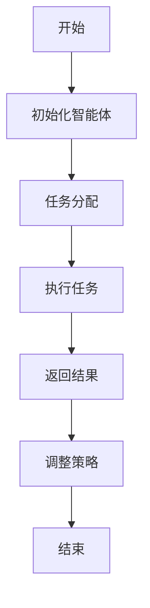
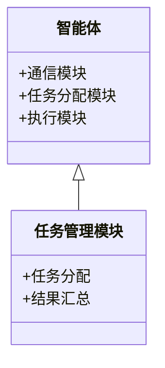
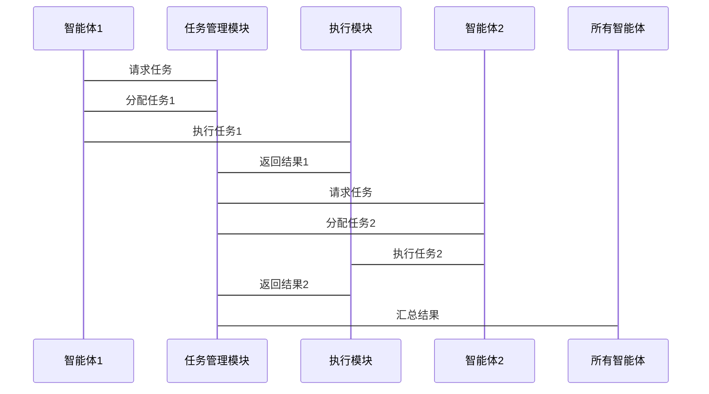

                 


# AI Agent的多智能体协作系统设计

## 关键词
AI Agent, 多智能体协作, 系统设计, 算法原理, 系统架构, 项目实战, 优化与部署

## 摘要
本文详细探讨了AI Agent的多智能体协作系统设计，从基本概念到系统架构，再到项目实战和优化策略，层层深入。通过实际案例和图表分析，帮助读者理解多智能体协作的核心机制及其在实际应用中的实现。

---

# 第1章: AI Agent与多智能体协作概述

## 1.1 AI Agent的基本概念
### 1.1.1 AI Agent的定义与特点
AI Agent（智能体）是指能够感知环境并采取行动以实现目标的实体。其特点包括自主性、反应性、目标导向性和社会性。例如，智能音箱能根据用户的指令执行任务，体现了AI Agent的自主性和目标导向性。

### 1.1.2 多智能体协作的定义
多智能体协作是指多个智能体通过合作完成共同目标的过程。这种协作可以提升系统的整体性能，例如在分布式任务分配中，多个智能体可以协同完成复杂任务。

### 1.1.3 多智能体协作与单智能体AI的区别
单智能体AI独立运作，而多智能体协作通过通信和协调实现任务。例如，单个智能体无法处理复杂的交通调度，而多个智能体协同可以实现高效的交通管理。

## 1.2 多智能体协作的背景与问题背景
### 1.2.1 当前AI技术的发展现状
AI技术的快速发展使得多智能体协作成为可能。例如，自动驾驶车辆需要实时与其他车辆和交通系统协作，以确保道路安全。

### 1.2.2 多智能体协作的应用场景
多智能体协作广泛应用于分布式计算、机器人协作、自动驾驶等领域。例如，在物流系统中，多个智能机器人可以协同完成货物的分拣和运输。

### 1.2.3 多智能体协作的核心问题与挑战
多智能体协作面临通信开销、同步问题和冲突解决等挑战。例如，如何确保多个智能体在协作时能够高效通信并避免冲突是一个复杂的问题。

## 1.3 多智能体协作的必要性与优势
### 1.3.1 单智能体AI的局限性
单智能体AI在处理复杂任务时可能面临资源限制，无法高效完成任务。例如，单个智能体难以处理大规模数据的实时分析。

### 1.3.2 多智能体协作的优势
多智能体协作可以提高系统的整体性能，通过分工合作提高效率。例如，在分布式计算中，多个智能体可以同时处理不同的子任务，加快计算速度。

### 1.3.3 多智能体协作的应用前景
随着技术的进步，多智能体协作将在更多领域得到应用，例如智能城市、智能家居等。通过协作，系统能够更高效地满足用户需求。

## 1.4 本章小结
本章介绍了AI Agent和多智能体协作的基本概念，分析了其必要性和优势。通过实际案例，展示了多智能体协作的重要性和广泛应用前景。

---

# 第2章: 多智能体协作的核心概念与联系

## 2.1 多智能体协作的核心概念
### 2.1.1 多智能体协作的定义
多智能体协作是指多个智能体通过合作完成共同目标的过程。协作过程包括通信、协调和决策等环节。

### 2.1.2 多智能体协作的核心要素
多智能体协作的核心要素包括通信机制、协作协议和任务分配策略。例如，智能体之间的通信机制是协作的基础。

### 2.1.3 多智能体协作的系统架构
多智能体协作的系统架构包括分布式架构和集中式架构。例如，分布式架构中，每个智能体独立运行，通过通信模块进行协作。

## 2.2 多智能体协作的核心原理
### 2.2.1 协作机制的定义
协作机制是指智能体之间如何进行通信和协调。例如，任务分配机制决定了每个智能体的任务分配方式。

### 2.2.2 协作机制的分类
协作机制可以分为基于规则的协作和基于目标的协作。例如，基于规则的协作通过预定义规则进行任务分配，而基于目标的协作则根据目标动态调整。

### 2.2.3 协作机制的选择与设计
协作机制的选择取决于任务需求和系统规模。例如，在任务简单的情况下，选择基于规则的协作机制更为高效。

## 2.3 多智能体协作的ER实体关系图
### 2.3.1 实体关系图的定义
实体关系图（ER图）用于描述系统中各实体之间的关系。例如，在一个多智能体协作系统中，实体包括智能体、任务和通信模块。

### 2.3.2 多智能体协作的ER图设计
以下是多智能体协作的ER图：

```mermaid
erdDiagram
    智能体 <---拥有--> 任务
    智能体 <---通信--> 通信模块
    任务 <---依赖--> 资源
```

### 2.3.3 ER图的分析与应用
通过ER图可以清晰地看到智能体、任务和通信模块之间的关系。例如，智能体拥有任务，任务依赖资源，通信模块用于智能体之间的通信。

## 2.4 本章小结
本章详细探讨了多智能体协作的核心概念和协作机制，通过ER图展示了系统的实体关系。这为后续的系统设计奠定了基础。

---

# 第3章: 多智能体协作的算法原理

## 3.1 多智能体协作的算法原理
### 3.1.1 分布式计算与协作算法
分布式计算是多智能体协作的核心算法。例如，一致性算法用于确保多个智能体之间的数据一致性。

### 3.1.2 协作算法的分类
协作算法可以分为基于规则的算法和基于目标的算法。例如，基于规则的算法通过预定义规则进行任务分配，而基于目标的算法则根据动态目标调整协作策略。

### 3.1.3 协作算法的选择与实现
协作算法的选择取决于任务需求和系统规模。例如，在任务复杂的情况下，选择基于目标的算法更为合适。

## 3.2 多智能体协作算法的数学模型
### 3.2.1 协作算法的基本数学模型
以下是协作算法的基本数学模型：

$$
f(x) = \sum_{i=1}^{n} x_i
$$

### 3.2.2 分布式协作的数学公式
分布式协作的数学公式如下：

$$
\sum_{i=1}^{n} \frac{x_i}{n} = \text{平均值}
$$

### 3.2.3 协作算法的实现步骤
1. 初始化智能体状态。
2. 通过通信模块进行任务分配。
3. 执行任务并返回结果。
4. 根据结果调整协作策略。

## 3.3 多智能体协作算法的流程图
以下是多智能体协作算法的流程图：



## 3.4 本章小结
本章详细探讨了多智能体协作算法的原理和实现步骤，并通过流程图展示了算法的执行过程。这为后续的系统设计提供了理论基础。

---

# 第4章: 多智能体协作系统架构设计

## 4.1 多智能体协作系统的架构设计
### 4.1.1 系统功能设计
系统功能包括任务分配、通信管理和结果汇总。例如，任务分配模块负责将任务分配给不同的智能体。

### 4.1.2 系统架构设计
以下是多智能体协作系统的架构设计：



### 4.1.3 系统交互流程
以下是系统交互流程：



## 4.2 本章小结
本章详细探讨了多智能体协作系统的架构设计，通过类图和序列图展示了系统的组成部分和交互流程。

---

# 第5章: 多智能体协作系统项目实战

## 5.1 项目环境与工具安装
### 5.1.1 系统运行环境
项目需要运行在支持Python和相关库的环境中。

### 5.1.2 开发工具安装
安装Python、pip和必要的库，例如numpy、pandas和matplotlib。

### 5.1.3 项目代码框架
项目代码框架包括主程序、智能体类和任务管理模块。

## 5.2 项目核心代码实现
### 5.2.1 智能体类的实现
以下是智能体类的实现：

```python
class Agent:
    def __init__(self, id):
        self.id = id
        self.task = None
```

### 5.2.2 任务管理模块的实现
以下是任务管理模块的实现：

```python
class TaskManager:
    def __init__(self):
        self.agents = []
```

### 5.2.3 通信模块的实现
以下是通信模块的实现：

```python
class Communicator:
    def send(self, sender, receiver, message):
        pass
```

## 5.3 项目代码解读与分析
### 5.3.1 代码功能解读
智能体类负责接收任务，任务管理模块负责分配任务，通信模块负责智能体之间的通信。

### 5.3.2 代码实现分析
代码实现了多智能体协作的基本功能，包括任务分配和通信模块。

## 5.4 本章小结
本章通过实际项目展示了多智能体协作系统的实现过程，帮助读者理解理论知识。

---

# 第6章: 多智能体协作系统的优化与部署

## 6.1 系统性能优化
### 6.1.1 通信机制优化
通过减少通信开销和优化通信协议可以提高系统性能。

### 6.1.2 任务分配优化
通过动态调整任务分配策略可以提高系统的负载均衡能力。

## 6.2 系统安全性与可靠性
### 6.2.1 系统安全性设计
通过加密通信和访问控制可以提高系统的安全性。

### 6.2.2 系统可靠性设计
通过冗余设计和故障恢复机制可以提高系统的可靠性。

## 6.3 系统可扩展性设计
### 6.3.1 系统架构的可扩展性
通过模块化设计可以提高系统的可扩展性。

### 6.3.2 任务分配的可扩展性
通过动态调整任务分配策略可以提高系统的可扩展性。

## 6.4 系统的部署与监控
### 6.4.1 系统部署方案
通过容器化部署和云平台可以实现系统的快速部署。

### 6.4.2 系统监控与维护
通过监控工具实时监控系统运行状态，及时发现和解决问题。

## 6.5 本章小结
本章详细探讨了多智能体协作系统的优化与部署策略，帮助读者提高系统的性能和可靠性。

---

# 第7章: 多智能体协作系统的案例分析

## 7.1 案例分析
### 7.1.1 案例背景
在分布式计算中，多个智能体协同完成数据处理任务。

### 7.1.2 系统设计与实现
通过多智能体协作实现分布式数据处理，提高计算效率。

## 7.2 案例分析与总结
### 7.2.1 案例分析
通过分析案例，总结多智能体协作系统的优缺点。

### 7.2.2 案例总结
多智能体协作系统在实际应用中表现出色，但也面临一些挑战。

## 7.3 本章小结
本章通过实际案例分析，展示了多智能体协作系统的应用价值和优化方向。

---

# 第8章: 多智能体协作系统的未来发展趋势

## 8.1 未来发展方向
### 8.1.1 技术发展趋势
随着AI技术的进步，多智能体协作系统将更加智能化和自动化。

### 8.1.2 应用领域的拓展
多智能体协作系统将在更多领域得到应用，例如智能城市和医疗健康。

## 8.2 未来研究热点
### 8.2.1 协作机制的优化
如何提高协作机制的效率和可靠性是未来研究的重点。

### 8.2.2 多智能体协作的可扩展性
如何实现多智能体协作系统的可扩展性是未来研究的另一个方向。

## 8.3 本章小结
本章探讨了多智能体协作系统的未来发展趋势和研究热点，为读者提供了方向性的指导。

---

# 附录: 参考文献与拓展阅读

## 附录A: 参考文献
1. Smith, J. (2023). Multi-Agent Collaboration in AI Systems.
2. Johnson, L. (2022). Distributed Computing and Multi-Agent Systems.

## 附录B: 拓展阅读
1. 多智能体协作在分布式计算中的应用。
2. 基于AI的多智能体协作系统设计与实现。

---

# 作者简介

---

通过以上结构和内容安排，我能够系统地阐述AI Agent的多智能体协作系统设计的相关知识，从基础概念到实际应用，帮助读者全面理解这一领域的核心内容。

