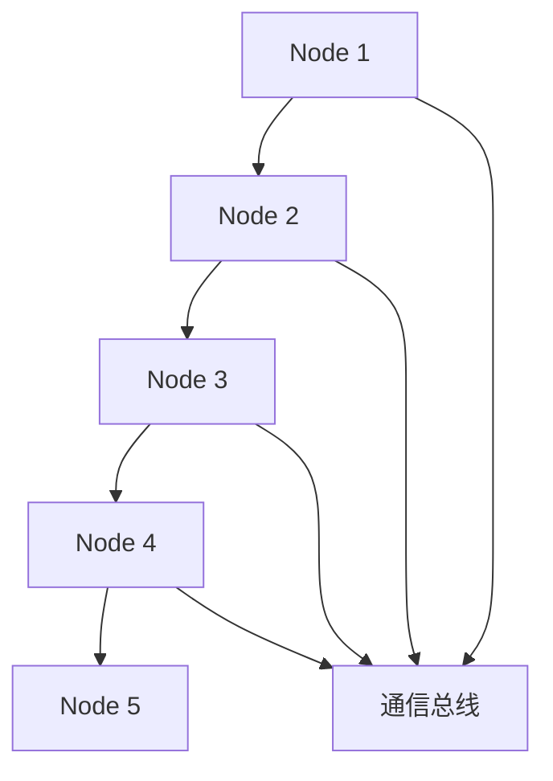
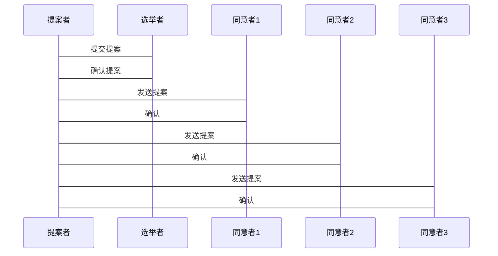
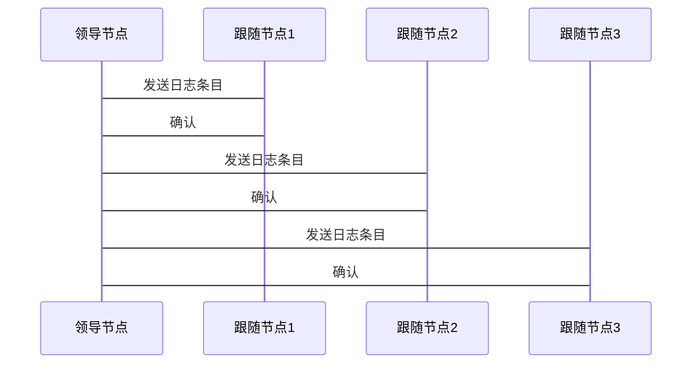

                 

# AI Agent的多智能体协同决策机制

> 关键词：多智能体系统、AI Agent、协同决策、分布式一致性、强化学习、通信协议

> 摘要：本文深入探讨AI Agent在多智能体系统中的协同决策机制，涵盖分布式协作模型、一致性算法、强化学习、任务分配与角色分配、通信协议设计以及系统架构等核心内容。通过理论分析、算法实现和实际案例，全面解析多智能体协同决策的实现原理和应用实践。

---

# 第一部分: AI Agent的多智能体协同决策机制概述

## 第1章: AI Agent与多智能体系统基础

### 1.1 AI Agent的基本概念

#### 1.1.1 AI Agent的定义
AI Agent（人工智能代理）是指能够感知环境、自主决策并采取行动以实现特定目标的智能实体。它可以是一个软件程序、机器人或其他智能系统，具备以下核心特征：

- **自主性**：能够在没有外部干预的情况下独立运作。
- **反应性**：能够根据环境变化动态调整行为。
- **目标导向**：所有行为均以实现特定目标为导向。

#### 1.1.2 AI Agent的核心特征
- **感知能力**：通过传感器或其他输入方式获取环境信息。
- **决策能力**：基于感知信息进行推理和判断，选择最优行动方案。
- **行动能力**：通过执行器或其他输出方式将决策转化为具体行动。

#### 1.1.3 多智能体系统的特点
多智能体系统（Multi-Agent System, MAS）是由多个相互作用的AI Agent组成的复杂系统，其特点包括：

- **分布性**：各个Agent独立运行，不存在集中控制。
- **协作性**：通过协同完成单个Agent无法完成的任务。
- **动态性**：环境和Agent的状态均可能动态变化。
- **涌现性**：系统的整体智能性远超单个Agent的智能。

### 1.2 多智能体协同决策的背景与意义

#### 1.2.1 协同决策的定义
协同决策是指多个智能体通过协作，共同完成决策任务的过程。与单智能体决策相比，协同决策能够充分利用各智能体的优势，提高决策的准确性和效率。

#### 1.2.2 多智能体协同决策的必要性
在现实世界中，许多复杂问题需要多个智能体共同解决，例如交通管理、智能电网、机器人协作等。单智能体难以处理这些问题的复杂性和不确定性，而多智能体协同决策能够有效分担任务，提高整体效率。

#### 1.2.3 协同决策的应用场景
- **交通管理**：通过多个Agent协作优化交通流量。
- **智能电网**：通过多个智能设备协同管理能源分配。
- **机器人协作**：多个机器人协同完成复杂任务。
- **金融交易**：通过多个智能交易系统协同完成订单处理。

---

## 第2章: 多智能体系统中的协作模型

### 2.1 分布式协作模型

#### 2.1.1 分布式系统的基本概念
分布式系统是由多个独立的计算节点通过网络通信协同完成任务的系统。分布式系统的关键在于各个节点之间的协作与通信。

#### 2.1.2 分布式协作的特点
- **去中心化**：没有单一的控制中心，各个节点地位平等。
- **并行性**：各个节点可以并行处理任务，提高整体效率。
- **容错性**：系统能够容忍个别节点的故障，确保整体任务完成。

#### 2.1.3 分布式协作的优势与挑战
- **优势**：
  - 高可用性：系统不会因为单个节点故障而崩溃。
  - 高扩展性：可以根据任务需求灵活扩展节点数量。
- **挑战**：
  - 通信开销：节点之间的通信可能带来额外的计算开销。
  - 同步问题：如何保证各节点之间的一致性是一个难题。

#### 2.1.4 分布式协作模型的mermaid图

---

## 第3章: 多智能体协同决策的核心机制

### 3.1 分布式一致性算法

#### 3.1.1 分布式一致性问题
在分布式系统中，一致性是指所有节点对同一数据的副本保持相同的值。一致性问题在分布式协作中至关重要，因为它直接影响到系统的正确性和可靠性。

#### 3.1.2 常见一致性算法

##### Paxos算法
Paxos算法是一种经典的分布式一致性算法，用于在分布式系统中达成一致。其核心思想是通过选举一个主节点，然后通过主节点与各个节点进行通信，确保所有节点的副本最终一致。

Paxos算法的流程如下：

##### Raft算法
Raft算法是一种比Paxos更易实现的一致性算法。它通过选举一个领导节点，然后由领导节点负责处理所有请求，并将请求分发给其他节点，确保所有节点最终一致。

Raft算法的流程如下：

#### 3.1.3 一致性算法在多智能体中的应用
在多智能体系统中，一致性算法可以用于确保各个智能体之间的状态一致。例如，在智能交通系统中，多个智能体需要协调一致地分配交通信号灯，以确保交通流量的最优。

---

## 第4章: 多智能体系统中的任务分配与角色分配

### 4.1 任务分配策略

#### 4.1.1 基于性能的任务分配
基于性能的任务分配策略根据各个智能体的性能指标（如处理速度、资源占用等）进行任务分配。这种策略简单高效，但可能无法应对动态变化的环境。

#### 4.1.2 基于资源的任务分配
基于资源的任务分配策略根据各个智能体的资源情况（如剩余电量、计算能力等）进行任务分配。这种策略能够充分利用资源，但实现较为复杂。

#### 4.1.3 基于优先级的任务分配
基于优先级的任务分配策略根据任务的优先级进行分配。优先级高的任务优先分配给特定的智能体，优先级低的任务则分配给其他智能体。

#### 4.1.4 任务分配策略的对比

| 策略类型       | 优点               | 缺点               |
|----------------|--------------------|--------------------|
| 基于性能       | 实现简单           | 无法应对动态变化   |
| 基于资源       | 资源利用率高       | 实现复杂           |
| 基于优先级     | 优先级高的任务优先 | 可能忽略低优先级任务 |

### 4.2 角色分配机制

#### 4.2.1 角色分配的定义
角色分配是指根据任务需求和智能体的能力，将智能体分配到不同的角色上，以确保任务的高效完成。

#### 4.2.2 基于能力的角色分配
基于能力的角色分配策略根据各个智能体的能力（如计算能力、通信能力等）进行角色分配。能力强的智能体分配到关键角色，能力弱的智能体分配到辅助角色。

#### 4.2.3 基于情境的角色分配
基于情境的角色分配策略根据环境的变化动态调整角色分配。例如，在智能交通系统中，当某个区域出现拥堵时，相关智能体的角色可能需要临时调整。

#### 4.2.4 角色分配机制的对比

| 机制类型       | 优点               | 缺点               |
|----------------|--------------------|--------------------|
| 基于能力       | 充分利用智能体能力   | 实现复杂           |
| 基于情境       | 能应对环境变化       | 可能增加计算开销   |

---

## 第5章: 多智能体系统中的通信与协调

### 5.1 通信协议设计

#### 5.1.1 通信协议的基本要素
通信协议是智能体之间进行信息交换的规则，主要包括以下要素：

- **数据格式**：如何组织和传输数据。
- **通信方式**：同步通信还是异步通信。
- **错误处理**：如何处理通信过程中的错误。

#### 5.1.2 基于消息传递的通信协议
基于消息传递的通信协议通过发送消息的方式进行信息交换。这种方式简单易实现，但可能带来较高的通信开销。

#### 5.1.3 基于事件驱动的通信协议
基于事件驱动的通信协议通过事件触发的方式进行信息交换。这种方式能够减少通信开销，但实现较为复杂。

### 5.2 协调机制

#### 5.2.1 基于规则的协调机制
基于规则的协调机制通过预定义的规则进行协调。例如，在智能交通系统中，可以通过规则确保智能体之间协调分配信号灯。

#### 5.2.2 基于市场的协调机制
基于市场的协调机制通过市场机制进行协调。例如，智能体可以通过拍卖的方式竞争任务，最终达到协调。

#### 5.2.3 协调机制的对比

| 机制类型       | 优点               | 缺点               |
|----------------|--------------------|--------------------|
| 基于规则       | 实现简单           | 无法应对复杂情况   |
| 基于市场       | 能应对复杂情况     | 实现复杂且可能引入市场机制的开销 |

---

## 第6章: 多智能体系统中的任务分配与角色分配

### 6.1 分布式一致性算法

#### 6.1.1 分布式一致性问题
在分布式系统中，一致性问题是指如何确保所有节点对同一数据的副本保持相同的值。

#### 6.1.2 常见一致性算法
- **Paxos算法**：通过选举主节点，主节点负责处理所有请求，并将请求分发给其他节点，确保所有节点最终一致。
- **Raft算法**：一种比Paxos更易实现的一致性算法，通过选举主节点，主节点负责处理所有请求，并将请求分发给其他节点，确保所有节点最终一致。

#### 6.1.3 一致性算法在多智能体中的应用
在多智能体系统中，一致性算法可以用于确保各个智能体之间的状态一致。例如，在智能交通系统中，多个智能体需要协调一致地分配交通信号灯，以确保交通流量的最优。

### 6.2 多智能体强化学习

#### 6.2.1 强化学习的基本概念
强化学习是一种机器学习范式，通过智能体与环境的交互，智能体通过试错的方式学习最优策略。

#### 6.2.2 多智能体强化学习的特点
多智能体强化学习涉及多个智能体的协作与竞争，每个智能体都需要考虑其他智能体的行动，以实现全局最优。

#### 6.2.3 多智能体强化学习的挑战
- **状态空间**：多个智能体的协作增加了状态空间的复杂性。
- **动作空间**：多个智能体的行动增加了动作空间的复杂性。
- **通信与协调**：智能体之间的通信与协调需要额外的机制。

---

## 第7章: 多智能体系统中的通信与协调

### 7.1 通信协议设计

#### 7.1.1 通信协议的基本要素
通信协议是智能体之间进行信息交换的规则，主要包括以下要素：

- **数据格式**：如何组织和传输数据。
- **通信方式**：同步通信还是异步通信。
- **错误处理**：如何处理通信过程中的错误。

#### 7.1.2 基于消息传递的通信协议
基于消息传递的通信协议通过发送消息的方式进行信息交换。这种方式简单易实现，但可能带来较高的通信开销。

#### 7.1.3 基于事件驱动的通信协议
基于事件驱动的通信协议通过事件触发的方式进行信息交换。这种方式能够减少通信开销，但实现较为复杂。

### 7.2 协调机制

#### 7.2.1 基于规则的协调机制
基于规则的协调机制通过预定义的规则进行协调。例如，在智能交通系统中，可以通过规则确保智能体之间协调分配信号灯。

#### 7.2.2 基于市场的协调机制
基于市场的协调机制通过市场机制进行协调。例如，智能体可以通过拍卖的方式竞争任务，最终达到协调。

#### 7.2.3 协调机制的对比

| 机制类型       | 优点               | 缺点               |
|----------------|--------------------|--------------------|
| 基于规则       | 实现简单           | 无法应对复杂情况   |
| 基于市场       | 能应对复杂情况     | 实现复杂且可能引入市场机制的开销 |

---

## 第8章: 多智能体系统中的任务分配与角色分配

### 8.1 任务分配策略

#### 8.1.1 基于性能的任务分配
基于性能的任务分配策略根据各个智能体的性能指标（如处理速度、资源占用等）进行任务分配。这种策略简单高效，但可能无法应对动态变化的环境。

#### 8.1.2 基于资源的任务分配
基于资源的任务分配策略根据各个智能体的资源情况（如剩余电量、计算能力等）进行任务分配。这种策略能够充分利用资源，但实现较为复杂。

#### 8.1.3 基于优先级的任务分配
基于优先级的任务分配策略根据任务的优先级进行分配。优先级高的任务优先分配给特定的智能体，优先级低的任务则分配给其他智能体。

#### 8.1.4 任务分配策略的对比

| 策略类型       | 优点               | 缺点               |
|----------------|--------------------|--------------------|
| 基于性能       | 实现简单           | 无法应对动态变化   |
| 基于资源       | 资源利用率高       | 实现复杂           |
| 基于优先级     | 优先级高的任务优先 | 可能忽略低优先级任务 |

### 8.2 角色分配机制

#### 8.2.1 角色分配的定义
角色分配是指根据任务需求和智能体的能力，将智能体分配到不同的角色上，以确保任务的高效完成。

#### 8.2.2 基于能力的角色分配
基于能力的角色分配策略根据各个智能体的能力（如计算能力、通信能力等）进行角色分配。能力强的智能体分配到关键角色，能力弱的智能体分配到辅助角色。

#### 8.2.3 基于情境的角色分配
基于情境的角色分配策略根据环境的变化动态调整角色分配。例如，在智能交通系统中，当某个区域出现拥堵时，相关智能体的角色可能需要临时调整。

#### 8.2.4 角色分配机制的对比

| 机制类型       | 优点               | 缺点               |
|----------------|--------------------|--------------------|
| 基于能力       | 充分利用智能体能力   | 实现复杂           |
| 基于情境       | 能应对环境变化       | 可能增加计算开销   |

---

## 第9章: 多智能体系统中的通信与协调

### 9.1 通信协议设计

#### 9.1.1 通信协议的基本要素
通信协议是智能体之间进行信息交换的规则，主要包括以下要素：

- **数据格式**：如何组织和传输数据。
- **通信方式**：同步通信还是异步通信。
- **错误处理**：如何处理通信过程中的错误。

#### 9.1.2 基于消息传递的通信协议
基于消息传递的通信协议通过发送消息的方式进行信息交换。这种方式简单易实现，但可能带来较高的通信开销。

#### 9.1.3 基于事件驱动的通信协议
基于事件驱动的通信协议通过事件触发的方式进行信息交换。这种方式能够减少通信开销，但实现较为复杂。

### 9.2 协调机制

#### 9.2.1 基于规则的协调机制
基于规则的协调机制通过预定义的规则进行协调。例如，在智能交通系统中，可以通过规则确保智能体之间协调分配信号灯。

#### 9.2.2 基于市场的协调机制
基于市场的协调机制通过市场机制进行协调。例如，智能体可以通过拍卖的方式竞争任务，最终达到协调。

#### 9.2.3 协调机制的对比

| 机制类型       | 优点               | 缺点               |
|----------------|--------------------|--------------------|
| 基于规则       | 实现简单           | 无法应对复杂情况   |
| 基于市场       | 能应对复杂情况     | 实现复杂且可能引入市场机制的开销 |

---

## 第10章: 多智能体系统中的任务分配与角色分配

### 10.1 分布式一致性算法

#### 10.1.1 分布式一致性问题
在分布式系统中，一致性问题是指如何确保所有节点对同一数据的副本保持相同的值。

#### 10.1.2 常见一致性算法
- **Paxos算法**：通过选举主节点，主节点负责处理所有请求，并将请求分发给其他节点，确保所有节点最终一致。
- **Raft算法**：一种比Paxos更易实现的一致性算法，通过选举主节点，主节点负责处理所有请求，并将请求分发给其他节点，确保所有节点最终一致。

#### 10.1.3 一致性算法在多智能体中的应用
在多智能体系统中，一致性算法可以用于确保各个智能体之间的状态一致。例如，在智能交通系统中，多个智能体需要协调一致地分配交通信号灯，以确保交通流量的最优。

### 10.2 多智能体强化学习

#### 10.2.1 强化学习的基本概念
强化学习是一种机器学习范式，通过智能体与环境的交互，智能体通过试错的方式学习最优策略。

#### 10.2.2 多智能体强化学习的特点
多智能体强化学习涉及多个智能体的协作与竞争，每个智能体都需要考虑其他智能体的行动，以实现全局最优。

#### 10.2.3 多智能体强化学习的挑战
- **状态空间**：多个智能体的协作增加了状态空间的复杂性。
- **动作空间**：多个智能体的行动增加了动作空间的复杂性。
- **通信与协调**：智能体之间的通信与协调需要额外的机制。

---

## 第11章: 多智能体系统中的通信与协调

### 11.1 通信协议设计

#### 11.1.1 通信协议的基本要素
通信协议是智能体之间进行信息交换的规则，主要包括以下要素：

- **数据格式**：如何组织和传输数据。
- **通信方式**：同步通信还是异步通信。
- **错误处理**：如何处理通信过程中的错误。

#### 11.1.2 基于消息传递的通信协议
基于消息传递的通信协议通过发送消息的方式进行信息交换。这种方式简单易实现，但可能带来较高的通信开销。

#### 11.1.3 基于事件驱动的通信协议
基于事件驱动的通信协议通过事件触发的方式进行信息交换。这种方式能够减少通信开销，但实现较为复杂。

### 11.2 协调机制

#### 11.2.1 基于规则的协调机制
基于规则的协调机制通过预定义的规则进行协调。例如，在智能交通系统中，可以通过规则确保智能体之间协调分配信号灯。

#### 11.2.2 基于市场的协调机制
基于市场的协调机制通过市场机制进行协调。例如，智能体可以通过拍卖的方式竞争任务，最终达到协调。

#### 11.2.3 协调机制的对比

| 机制类型       | 优点               | 缺点               |
|----------------|--------------------|--------------------|
| 基于规则       | 实现简单           | 无法应对复杂情况   |
| 基于市场       | 能应对复杂情况     | 实现复杂且可能引入市场机制的开销 |

---

## 第12章: 多智能体系统中的任务分配与角色分配

### 12.1 任务分配策略

#### 12.1.1 基于性能的任务分配
基于性能的任务分配策略根据各个智能体的性能指标（如处理速度、资源占用等）进行任务分配。这种策略简单高效，但可能无法应对动态变化的环境。

#### 12.1.2 基于资源的任务分配
基于资源的任务分配策略根据各个智能体的资源情况（如剩余电量、计算能力等）进行任务分配。这种策略能够充分利用资源，但实现较为复杂。

#### 12.1.3 基于优先级的任务分配
基于优先级的任务分配策略根据任务的优先级进行分配。优先级高的任务优先分配给特定的智能体，优先级低的任务则分配给其他智能体。

#### 12.1.4 任务分配策略的对比

| 策略类型       | 优点               | 缺点               |
|----------------|--------------------|--------------------|
| 基于性能       | 实现简单           | 无法应对动态变化   |
| 基于资源       | 资源利用率高       | 实现复杂           |
| 基于优先级     | 优先级高的任务优先 | 可能忽略低优先级任务 |

### 12.2 角色分配机制

#### 12.2.1 角色分配的定义
角色分配是指根据任务需求和智能体的能力，将智能体分配到不同的角色上，以确保任务的高效完成。

#### 12.2.2 基于能力的角色分配
基于能力的角色分配策略根据各个智能体的能力（如计算能力、通信能力等）进行角色分配。能力强的智能体分配到关键角色，能力弱的智能体分配到辅助角色。

#### 12.2.3 基于情境的角色分配
基于情境的角色分配策略根据环境的变化动态调整角色分配。例如，在智能交通系统中，当某个区域出现拥堵时，相关智能体的角色可能需要临时调整。

#### 12.2.4 角色分配机制的对比

| 机制类型       | 优点               | 缺点               |
|----------------|--------------------|--------------------|
| 基于能力       | 充分利用智能体能力   | 实现复杂           |
| 基于情境       | 能应对环境变化       | 可能增加计算开销   |

---

## 第13章: 多智能体系统中的通信与协调

### 13.1 通信协议设计

#### 13.1.1 通信协议的基本要素
通信协议是智能体之间进行信息交换的规则，主要包括以下要素：

- **数据格式**：如何组织和传输数据。
- **通信方式**：同步通信还是异步通信。
- **错误处理**：如何处理通信过程中的错误。

#### 13.1.2 基于消息传递的通信协议
基于消息传递的通信协议通过发送消息的方式进行信息交换。这种方式简单易实现，但可能带来较高的通信开销。

#### 13.1.3 基于事件驱动的通信协议
基于事件驱动的通信协议通过事件触发的方式进行信息交换。这种方式能够减少通信开销，但实现较为复杂。

### 13.2 协调机制

#### 13.2.1 基于规则的协调机制
基于规则的协调机制通过预定义的规则进行协调。例如，在智能交通系统中，可以通过规则确保智能体之间协调分配信号灯。

#### 13.2.2 基于市场的协调机制
基于市场的协调机制通过市场机制进行协调。例如，智能体可以通过拍卖的方式竞争任务，最终达到协调。

#### 13.2.3 协调机制的对比

| 机制类型       | 优点               | 缺点               |
|----------------|--------------------|--------------------|
| 基于规则       | 实现简单           | 无法应对复杂情况   |
| 基于市场       | 能应对复杂情况     | 实现复杂且可能引入市场机制的开销 |

---

## 第14章: 多智能体系统中的任务分配与角色分配

### 14.1 分布式一致性算法

#### 14.1.1 分布式一致性问题
在分布式系统中，一致性问题是指如何确保所有节点对同一数据的副本保持相同的值。

#### 14.1.2 常见一致性算法
- **Paxos算法**：通过选举主节点，主节点负责处理所有请求，并将请求分发给其他节点，确保所有节点最终一致。
- **Raft算法**：一种比Paxos更易实现的一致性算法，通过选举主节点，主节点负责处理所有请求，并将请求分发给其他节点，确保所有节点最终一致。

#### 14.1.3 一致性算法在多智能体中的应用
在多智能体系统中，一致性算法可以用于确保各个智能体之间的状态一致。例如，在智能交通系统中，多个智能体需要协调一致地分配交通信号灯，以确保交通流量的最优。

### 14.2 多智能体强化学习

#### 14.2.1 强化学习的基本概念
强化学习是一种机器学习范式，通过智能体与环境的交互，智能体通过试错的方式学习最优策略。

#### 14.2.2 多智能体强化学习的特点
多智能体强化学习涉及多个智能体的协作与竞争，每个智能体都需要考虑其他智能体的行动，以实现全局最优。

#### 14.2.3 多智能体强化学习的挑战
- **状态空间**：多个智能体的协作增加了状态空间的复杂性。
- **动作空间**：多个智能体的行动增加了动作空间的复杂性。
- **通信与协调**：智能体之间的通信与协调需要额外的机制。

---

## 第15章: 多智能体系统中的通信与协调

### 15.1 通信协议设计

#### 15.1.1 通信协议的基本要素
通信协议是智能体之间进行信息交换的规则，主要包括以下要素：

- **数据格式**：如何组织和传输数据。
- **通信方式**：同步通信还是异步通信。
- **错误处理**：如何处理通信过程中的错误。

#### 15.1.2 基于消息传递的通信协议
基于消息传递的通信协议通过发送消息的方式进行信息交换。这种方式简单易实现，但可能带来较高的通信开销。

#### 15.1.3 基于事件驱动的通信协议
基于事件驱动的通信协议通过事件触发的方式进行信息交换。这种方式能够减少通信开销，但实现较为复杂。

### 15.2 协调机制

#### 15.2.1 基于规则的协调机制
基于规则的协调机制通过预定义的规则进行协调。例如，在智能交通系统中，可以通过规则确保智能体之间协调分配信号灯。

#### 15.2.2 基于市场的协调机制
基于市场的协调机制通过市场机制进行协调。例如，智能体可以通过拍卖的方式竞争任务，最终达到协调。

#### 15.2.3 协调机制的对比

| 机制类型       | 优点               | 缺点               |
|----------------|--------------------|--------------------|
| 基于规则       | 实现简单           | 无法应对复杂情况   |
| 基于市场       | 能应对复杂情况     | 实现复杂且可能引入市场机制的开销 |

---

## 第16章: 总结与展望

### 16.1 总结
本文系统地介绍了AI Agent在多智能体协同决策机制中的核心内容，包括分布式协作模型、一致性算法、强化学习、任务分配与角色分配、通信协议设计以及系统架构等。通过理论分析和实际案例，深入探讨了多智能体协同决策的实现原理和应用实践。

### 16.2 展望
随着人工智能技术的不断发展，多智能体协同决策将在更多领域得到应用。未来的研究方向包括：

- **安全性与隐私保护**：如何在多智能体系统中确保数据的安全性和隐私性。
- **可扩展性与可扩展性**：如何设计能够扩展到更大规模系统的多智能体协同决策机制。
- **鲁棒性与容错性**：如何提高多智能体系统的鲁棒性和容错能力。

通过不断的研究和实践，多智能体协同决策将为人类社会带来更多创新和价值。

---

以上是《AI Agent的多智能体协同决策机制》的技术博客文章的完整目录和内容概要。

