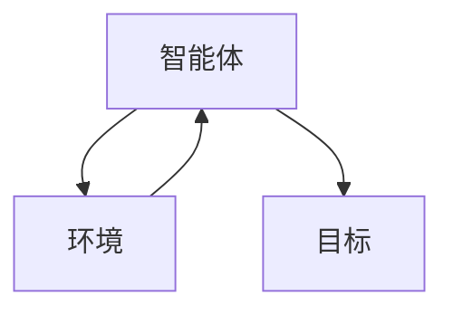

                 


# AI Agent的多智能体竞争与合作机制

> 关键词：AI Agent、多智能体系统、竞争机制、合作机制、博弈论、系统架构

> 摘要：本文深入探讨了AI Agent在多智能体系统中的竞争与合作机制，分析了其核心概念、算法原理、系统架构设计以及实际应用场景。通过详细的理论推导、数学模型构建、系统架构设计和项目实战案例，全面阐述了如何在多智能体环境中实现有效的竞争与合作，为相关领域的研究和实践提供了系统的参考。

---

# 第一部分: AI Agent的多智能体竞争与合作机制背景介绍

## 第1章: 多智能体系统概述

### 1.1 多智能体系统的基本概念

#### 1.1.1 多智能体系统的定义
多智能体系统（Multi-Agent System，MAS）是由多个智能体（Agent）组成的分布式系统，这些智能体通过协作或竞争完成特定目标。智能体能够感知环境、自主决策，并与其他智能体或外部系统进行交互。

#### 1.1.2 多智能体系统的特征
- **自主性**：智能体能够自主决策，无需外部干预。
- **反应性**：智能体能够实时感知环境并做出反应。
- **协作性**：智能体之间可以协作完成复杂任务。
- **分布式性**：智能体分布在网络中，不依赖单个中心节点。

#### 1.1.3 多智能体系统的应用场景
- 智能交通管理
- 智能电网
- 智能推荐系统
- 自动驾驶

### 1.2 AI Agent的基本概念

#### 1.2.1 AI Agent的定义
AI Agent是一种能够感知环境、采取行动以实现目标的智能实体。Agent可以是软件程序、机器人或其他智能设备。

#### 1.2.2 AI Agent的核心特征
- **目标导向**：Agent的行为以实现特定目标为导向。
- **反应性**：能够感知环境并实时调整行为。
- **主动性**：主动采取行动，而非被动响应。

#### 1.2.3 AI Agent与传统程序的区别
- AI Agent具有自主性和目标导向，而传统程序通常遵循固定的逻辑。
- AI Agent能够适应环境变化，而传统程序在固定条件下运行。

### 1.3 多智能体系统中的竞争与合作背景

#### 1.3.1 竞争与合作的定义
- **竞争机制**：智能体之间争夺有限资源或目标的过程。
- **合作机制**：智能体之间协同完成任务的行为。

#### 1.3.2 竞争与合作的必要性
- 在复杂环境中，智能体需要通过竞争和合作来优化资源分配和任务完成。
- 单独依赖竞争可能导致资源枯竭，而单独依赖合作可能导致效率低下。

#### 1.3.3 竞争与合作的边界与外延
- 竞争与合作的边界在于资源的分配和任务的优先级。
- 外延涉及智能体的自我利益与集体利益的平衡。

## 第2章: 多智能体系统的核心概念与联系

### 2.1 多智能体系统的结构与组成

#### 2.1.1 实体与关系的ER图
```mermaid
erDiagram
    actor 智能体 {
        <<Agent>>
    }
    actor 环境 {
        <<Environment>>
    }
    actor 目标 {
        <<Goal>>
    }
    智能体 --> 环境: 感知
    智能体 --> 目标: 追踪
    环境 --> 智能体: 反馈
```

#### 2.1.2 多智能体系统的层次结构
- **感知层**：智能体感知环境信息。
- **决策层**：智能体基于感知信息做出决策。
- **执行层**：智能体执行决策动作。

#### 2.1.3 实体关系的Mermaid图


### 2.2 竞争与合作机制的核心要素

#### 2.2.1 竞争机制的属性特征
| 属性 | 特征 |
|------|------|
| 竞争目标 | 资源分配、任务完成 |
| 竞争规则 | 资源分配规则、优先级规则 |
| 竞争结果 | 赢家、输家 |

#### 2.2.2 合作机制的属性特征
| 属性 | 特征 |
|------|------|
| 合作目标 | 集体目标实现 |
| 合作规则 | 协作规则、分工规则 |
| 合作结果 | 任务完成、资源优化 |

#### 2.2.3 竞争与合作的对比分析
- 竞争强调个体利益，合作强调集体利益。
- 竞争可能导致资源分配不均，合作可能导致效率低下。
- 需要平衡个体与集体利益。

### 2.3 竞争与合作机制的数学模型

#### 2.3.1 竞争与合作的关系式
$$ C = \alpha \cdot 竞争强度 + \beta \cdot 合作强度 $$

其中，$\alpha$ 和 $\beta$ 是权重系数，表示竞争与合作的相对重要性。

#### 2.3.2 竞争与合作的均衡点
$$ 竞争强度 = 合作强度 $$

当竞争强度等于合作强度时，系统达到均衡状态。

#### 2.3.3 竞争与合作的动态平衡模型
$$ \frac{dC}{dt} = k \cdot (1 - C) $$

其中，$k$ 是常数，表示系统的收敛速度。

---

接下来的部分将涵盖算法原理、系统架构设计、项目实战和总结。每部分将按照相同的结构进行详细讲解，确保内容的完整性和深度。通过这种系统性的分析，我们能够全面理解AI Agent在多智能体系统中的竞争与合作机制，并将其应用于实际场景中。

