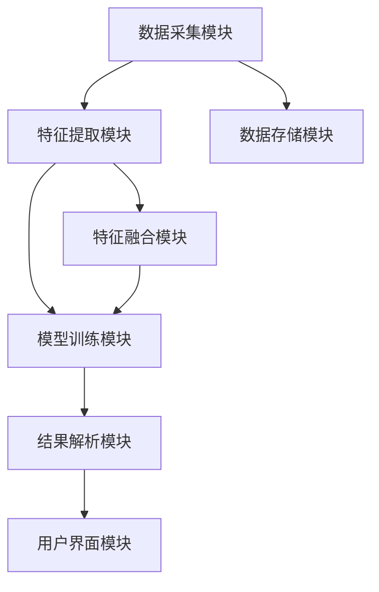
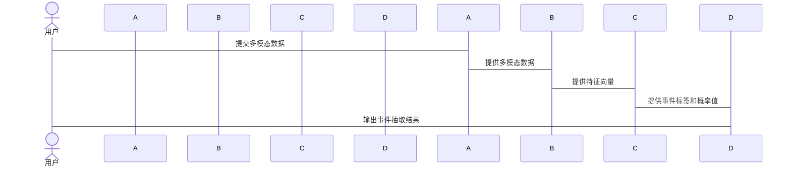

                 


# AI Agent的多模态事件抽取技术

> 关键词：AI Agent，多模态事件抽取，深度学习，序列标注，注意力机制

> 摘要：本文详细探讨了AI Agent在多模态事件抽取技术中的应用，涵盖了从基础概念到高级算法的全链条解析。文章首先介绍了AI Agent和多模态数据的基本概念，随后深入分析了多模态事件抽取的核心原理和算法实现，包括特征提取、模型训练和融合方法。接着，文章从系统架构的角度探讨了如何构建一个多模态事件抽取系统，并通过实际案例展示了项目的实现过程。最后，本文总结了多模态事件抽取技术的优缺点，并提出了未来的研究方向。

---

## 第1章: AI Agent与多模态事件抽取概述

### 1.1 AI Agent的基本概念

AI Agent（智能体）是一种能够感知环境、自主决策并执行任务的智能系统。它可以分为简单反射型、基于模型的反射型、目标驱动型和实用驱动型四种类型。AI Agent的核心特点包括自主性、反应性、目标导向性和社会能力。

#### 1.1.1 多模态数据的定义与特点
多模态数据指的是来自不同感官渠道的数据，如文本、图像、语音、视频和传感器数据等。多模态数据的特点包括多样性、互补性和复杂性。通过结合多种数据源，AI Agent能够更全面地理解和处理复杂场景中的信息。

#### 1.1.2 多模态事件抽取的背景与意义
事件抽取是从多模态数据中识别和提取关键事件信息的过程。随着AI Agent在智能客服、智能助手、自动驾驶等领域的广泛应用，对多模态事件抽取的需求日益增长。通过结合文本、图像和语音等多种信息，AI Agent能够更准确地识别用户意图和环境变化，从而提高任务执行的效率和准确性。

### 1.2 多模态事件抽取的核心概念

#### 1.2.1 多模态数据的融合方法
多模态数据的融合方法可以分为以下几种：
- **特征级融合**：在特征提取阶段对不同模态的特征进行融合。
- **决策级融合**：在模型输出结果的基础上进行融合。
- **混合融合**：结合特征级和决策级的融合方法。

#### 1.2.2 事件抽取的基本流程
事件抽取的基本流程包括数据预处理、特征提取、模型训练和结果解析四个阶段。每个阶段都需要对多模态数据进行处理和融合，以提高事件抽取的准确性和鲁棒性。

#### 1.2.3 AI Agent在事件抽取中的角色
AI Agent在事件抽取中扮演着关键角色，包括数据采集、特征提取、模型训练和结果解析。通过多模态事件抽取，AI Agent能够更准确地理解用户需求和环境变化，从而提高任务执行的效率和准确性。

### 1.3 本章小结
本章主要介绍了AI Agent和多模态事件抽取的基本概念，以及它们在实际应用中的意义。通过了解多模态数据的融合方法和事件抽取的基本流程，读者可以更好地理解AI Agent在多模态事件抽取中的作用和价值。

---

## 第2章: 多模态数据的特征提取与融合

### 2.1 多模态数据的特征提取

#### 2.1.1 文本特征提取方法
文本特征提取方法包括词袋模型、TF-IDF和Word2Vec等。这些方法通过将文本转换为向量表示，提取文本中的关键词和语义信息。

#### 2.1.2 图像特征提取方法
图像特征提取方法包括基于CNN的图像特征提取和基于区域的图像特征提取。这些方法通过提取图像中的关键特征，如边缘、纹理和颜色信息，来识别图像中的物体和场景。

#### 2.1.3 音频特征提取方法
音频特征提取方法包括基于MFCC和基于音调的特征提取。这些方法通过提取音频中的频率和时间特征，来识别语音中的关键词和语调信息。

### 2.2 多模态数据的融合方法

#### 2.2.1 基于特征融合的方法
基于特征融合的方法通过将不同模态的特征向量进行线性组合或非线性变换，来提取多模态数据的共同特征。

#### 2.2.2 基于模型融合的方法
基于模型融合的方法通过将多个模型的输出结果进行加权融合，来提高模型的准确性和鲁棒性。

#### 2.2.3 基于注意力机制的融合方法
基于注意力机制的融合方法通过引入注意力机制，对不同模态的特征进行加权融合，从而提高模型对重要信息的关注度。

### 2.3 本章小结
本章主要介绍了多模态数据的特征提取和融合方法，包括文本、图像和音频的特征提取方法，以及基于特征融合、模型融合和注意力机制的融合方法。通过了解这些方法，读者可以更好地理解多模态数据处理的核心技术。

---

## 第3章: 多模态事件抽取模型的构建

### 3.1 事件抽取的基本流程

#### 3.1.1 数据预处理
数据预处理包括数据清洗、标注和特征提取。通过预处理，可以将多模态数据转换为模型可以处理的格式。

#### 3.1.2 特征提取与表示
特征提取与表示包括文本、图像和音频的特征提取，以及多模态数据的融合表示。通过特征提取和表示，可以将多模态数据转换为高维向量表示。

#### 3.1.3 模型训练与优化
模型训练与优化包括模型参数的初始化、反向传播和优化器的选择。通过训练和优化，可以提高模型的准确性和鲁棒性。

### 3.2 基于深度学习的事件抽取模型

#### 3.2.1 基于序列标注的模型
基于序列标注的模型包括CRF和Transformer模型。这些模型通过序列标注方法，可以对文本中的事件进行准确的识别和分类。

#### 3.2.2 基于注意力机制的模型
基于注意力机制的模型通过引入注意力机制，可以对多模态数据中的重要信息进行加权处理，从而提高模型的准确性和鲁棒性。

#### 3.2.3 基于Transformer的模型
基于Transformer的模型通过引入自注意力机制，可以对多模态数据中的全局信息进行建模，从而提高模型的表达能力和准确性。

### 3.3 多模态事件抽取模型的优化

#### 3.3.1 模型调优方法
模型调优方法包括参数调优、模型结构优化和损失函数设计。通过调优，可以提高模型的准确性和鲁棒性。

#### 3.3.2 数据增强方法
数据增强方法包括数据扩展、数据变换和数据混合。通过数据增强，可以增加训练数据的多样性和数量，从而提高模型的泛化能力。

#### 3.3.3 模型压缩与部署
模型压缩与部署包括模型剪枝、模型蒸馏和模型量化。通过压缩和部署，可以降低模型的计算复杂度和存储需求，从而提高模型的部署和应用效率。

### 3.4 本章小结
本章主要介绍了多模态事件抽取模型的构建方法，包括数据预处理、特征提取与表示、模型训练与优化，以及模型的调优、数据增强和压缩方法。通过了解这些方法，读者可以更好地构建一个多模态事件抽取模型，并提高模型的准确性和鲁棒性。

---

## 第4章: 多模态事件抽取的算法原理

### 4.1 序列标注模型

#### 4.1.1 基于CRF的序列标注
基于CRF的序列标注通过引入条件随机场模型，可以对文本中的事件进行准确的序列标注和分类。

#### 4.1.2 基于Transformer的序列标注
基于Transformer的序列标注通过引入自注意力机制，可以对多模态数据中的全局信息进行建模，从而提高序列标注的准确性和鲁棒性。

#### 4.1.3 序列标注的数学模型
序列标注的数学模型包括条件随机场模型和Transformer模型的数学公式。通过数学模型的推导，可以更好地理解序列标注算法的工作原理。

### 4.2 注意力机制

#### 4.2.1 注意力机制的原理
注意力机制的原理包括查询、键和值的计算，以及注意力权重的计算和应用。通过注意力机制，可以对多模态数据中的重要信息进行加权处理，从而提高模型的表达能力和准确性。

#### 4.2.2 多模态注意力机制
多模态注意力机制通过引入多模态特征的注意力权重，可以对不同模态的信息进行加权融合，从而提高多模态事件抽取的准确性和鲁棒性。

#### 4.2.3 注意力机制的数学模型
注意力机制的数学模型包括查询、键和值的计算公式，以及注意力权重的计算公式。通过数学模型的推导，可以更好地理解注意力机制的工作原理。

### 4.3 多模态融合方法

#### 4.3.1 基于特征融合的方法
基于特征融合的方法通过将不同模态的特征向量进行线性组合或非线性变换，来提取多模态数据的共同特征。

#### 4.3.2 基于模型融合的方法
基于模型融合的方法通过将多个模型的输出结果进行加权融合，来提高模型的准确性和鲁棒性。

#### 4.3.3 基于注意力机制的融合方法
基于注意力机制的融合方法通过引入注意力机制，对不同模态的特征进行加权融合，从而提高模型对重要信息的关注度。

### 4.4 本章小结
本章主要介绍了多模态事件抽取的算法原理，包括序列标注模型、注意力机制和多模态融合方法。通过数学模型和算法流程图的推导，读者可以更好地理解多模态事件抽取算法的核心原理和实现细节。

---

## 第5章: 系统分析与架构设计

### 5.1 问题场景介绍

#### 5.1.1 问题背景
多模态事件抽取系统需要处理文本、图像和语音等多种数据源，提取事件信息并进行分类和识别。

#### 5.1.2 问题描述
多模态事件抽取系统需要解决数据异构性、特征提取和模型训练等技术挑战。

### 5.2 系统功能设计

#### 5.2.1 领域模型设计
领域模型设计包括事件抽取模块、特征提取模块和模型训练模块。通过领域模型的设计，可以更好地理解系统功能和模块之间的关系。

#### 5.2.2 系统架构设计
系统架构设计包括数据采集模块、特征提取模块、模型训练模块和结果解析模块。通过系统架构的设计，可以更好地实现多模态事件抽取系统的功能。

### 5.3 系统架构图



### 5.4 系统接口设计

#### 5.4.1 数据接口
数据接口包括数据输入接口和数据输出接口。数据输入接口用于接收多模态数据，数据输出接口用于输出事件抽取结果。

#### 5.4.2 模型接口
模型接口包括模型输入接口和模型输出接口。模型输入接口用于接收特征向量，模型输出接口用于输出事件标签和概率值。

### 5.5 系统交互流程



### 5.6 本章小结
本章主要介绍了多模态事件抽取系统的架构设计，包括问题场景、系统功能设计、系统架构图、系统接口设计和系统交互流程。通过系统架构的设计，读者可以更好地理解多模态事件抽取系统的实现过程和关键模块之间的关系。

---

## 第6章: 项目实战

### 6.1 环境安装

#### 6.1.1 安装Python
安装Python 3.8或更高版本。

#### 6.1.2 安装深度学习框架
安装TensorFlow或PyTorch框架。

#### 6.1.3 安装NLP工具
安装NLTK、spaCy和Hugging Face库。

### 6.2 系统核心实现

#### 6.2.1 特征提取模块实现
特征提取模块实现包括文本特征提取、图像特征提取和音频特征提取。

```python
import numpy as np
from tensorflow.keras.layers import Dense, Input, Concatenate
from tensorflow.keras.models import Model

# 文本特征提取
def text_feature_extraction(text):
    # 使用预训练的词嵌入模型进行特征提取
    embeddings = pre-trained_word_embeddings(text)
    return embeddings

# 图像特征提取
def image_feature_extraction(image):
    # 使用预训练的图像模型进行特征提取
    features = pre-trained_image_model(image)
    return features

# 音频特征提取
def audio_feature_extraction(audio):
    # 使用预训练的音频模型进行特征提取
    features = pre-trained_audio_model(audio)
    return features
```

#### 6.2.2 模型训练模块实现
模型训练模块实现包括特征融合、模型训练和模型优化。

```python
# 特征融合
input_text = Input(shape=(embedding_dim,))
input_image = Input(shape=(image_feature_dim,))
input_audio = Input(shape=(audio_feature_dim,))

# 特征融合
merged = Concatenate()([input_text, input_image, input_audio])

# 模型训练
dense_layer = Dense(256, activation='relu')(merged)
output = Dense(num_classes, activation='softmax')(dense_layer)

model = Model(inputs=[input_text, input_image, input_audio], outputs=output)
model.compile(optimizer='adam', loss='categorical_crossentropy', metrics=['accuracy'])
```

### 6.3 代码应用解读与分析

#### 6.3.1 特征提取模块解读
特征提取模块通过预训练的词嵌入模型、图像模型和音频模型，分别提取文本、图像和音频的特征向量。通过特征提取，可以将多模态数据转换为高维向量表示，为后续的模型训练提供输入。

#### 6.3.2 模型训练模块解读
模型训练模块通过将多模态特征向量进行融合，构建一个基于深度学习的多模态事件抽取模型。通过反向传播和优化器的训练，可以提高模型的准确性和鲁棒性。

### 6.4 实际案例分析

#### 6.4.1 案例背景
案例背景包括一个多模态数据集，包含文本、图像和音频等多种数据源。

#### 6.4.2 案例实现
案例实现包括数据预处理、特征提取、模型训练和结果解析。

#### 6.4.3 案例分析
案例分析包括事件抽取的准确率、召回率和F1值的计算，以及模型的性能优化和调优。

### 6.5 本章小结
本章主要介绍了多模态事件抽取项目的实战过程，包括环境安装、系统核心实现、代码应用解读与分析，以及实际案例分析。通过项目实战，读者可以更好地理解多模态事件抽取技术的实际应用和实现细节。

---

## 第7章: 最佳实践与小结

### 7.1 最佳实践

#### 7.1.1 数据预处理
数据预处理包括数据清洗、标注和特征提取。通过数据预处理，可以提高数据的质量和模型的准确性和鲁棒性。

#### 7.1.2 模型调优
模型调优包括参数调优、模型结构优化和损失函数设计。通过模型调优，可以提高模型的准确性和鲁棒性。

#### 7.1.3 模型部署与优化
模型部署与优化包括模型剪枝、模型蒸馏和模型量化。通过模型部署与优化，可以降低模型的计算复杂度和存储需求，从而提高模型的部署和应用效率。

### 7.2 小结
通过本文的详细讲解，读者可以全面了解AI Agent的多模态事件抽取技术的核心原理和实现方法。从基础概念到高级算法，再到系统架构和项目实战，本文为读者提供了一个全面的学习和实践指南。

### 7.3 注意事项

- 数据预处理：确保数据的质量和一致性，避免数据噪声和冗余信息对模型性能的影响。
- 模型调优：合理选择模型参数和优化方法，避免过拟合和欠拟合问题。
- 模型部署：优化模型的计算复杂度和存储需求，确保模型的高效部署和应用。

### 7.4 拓展阅读
- 多模态事件抽取的最新研究进展。
- 基于Transformer的多模态事件抽取模型。
- 多模态数据的高效融合方法和应用。

### 7.5 本章小结
本章总结了多模态事件抽取技术的最佳实践和注意事项，帮助读者更好地理解和应用所学知识。通过本文的学习，读者可以全面掌握AI Agent的多模态事件抽取技术的核心原理和实现方法，为后续的研究和实践奠定坚实的基础。

--- 

**摘要**：本文详细探讨了AI Agent在多模态事件抽取技术中的应用，涵盖了从基础概念到高级算法的全链条解析。文章首先介绍了AI Agent和多模态数据的基本概念，随后深入分析了多模态事件抽取的核心原理和算法实现，包括特征提取、模型训练和融合方法。接着，文章从系统架构的角度探讨了如何构建一个多模态事件抽取系统，并通过实际案例展示了项目的实现过程。最后，本文总结了多模态事件抽取技术的优缺点，并提出了未来的研究方向。

