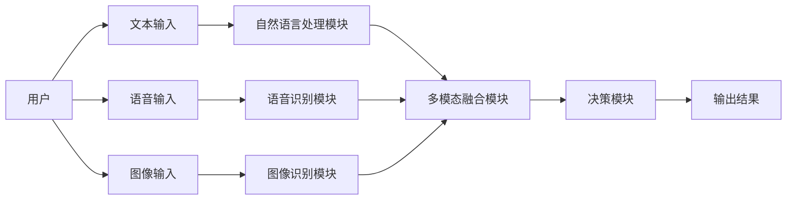
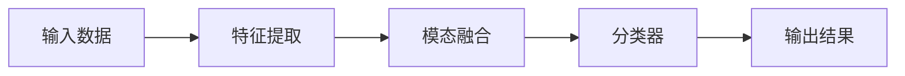
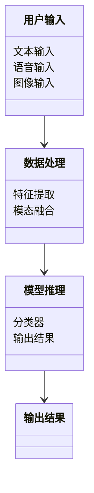
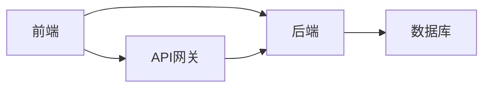
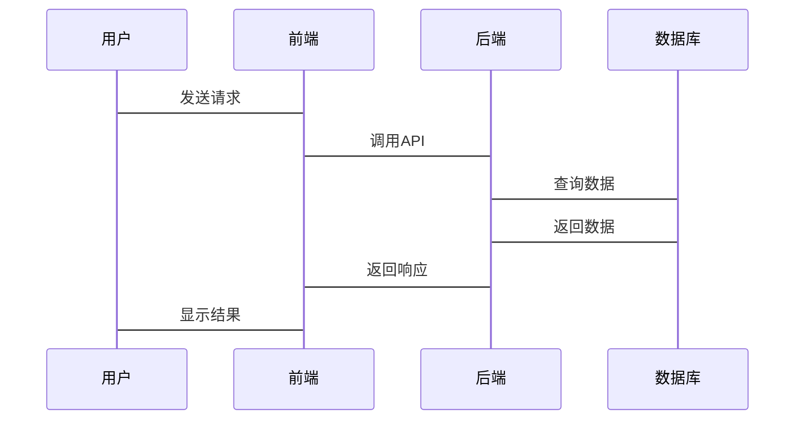

                 


# AI Agent的多模态交互能力开发

## 关键词
AI Agent, 多模态交互, 自然语言处理, 计算机视觉, 人机交互, 多模态数据融合, 深度学习模型

## 摘要
本文深入探讨了AI Agent的多模态交互能力的开发，从基础概念到核心算法，再到系统架构设计和项目实战，全面解析了多模态交互的关键技术与实现方法。通过详细讲解多模态数据的融合与处理、多模态模型的构建与训练、系统架构设计以及实际项目案例，本文为开发者提供了从理论到实践的完整指南，帮助他们在AI Agent领域中实现高效的多模态交互能力。

---

## 第1章: AI Agent与多模态交互概述

### 1.1 AI Agent的基本概念
#### 1.1.1 AI Agent的定义与特点
AI Agent（人工智能代理）是一种能够感知环境、自主决策并采取行动以实现目标的智能实体。其特点包括：
- **自主性**：能够在没有外部干预的情况下独立运作。
- **反应性**：能够实时感知环境并做出反应。
- **目标导向性**：所有行为都围绕特定目标展开。
- **学习能力**：通过经验或数据不断优化自身性能。

#### 1.1.2 多模态交互的定义与特点
多模态交互是指通过多种信息载体（如文本、语音、图像、视频等）进行信息交换的过程。其特点包括：
- **多样性**：支持多种交互方式。
- **丰富性**：能够传递更复杂的信息。
- **自然性**：更接近人类的自然交互方式。

#### 1.1.3 AI Agent与多模态交互的关系
AI Agent通过多模态交互能够更全面地理解用户需求，提供更智能、更个性化的服务。多模态交互为AI Agent提供了更丰富的输入方式和更自然的输出方式，使其能够更好地与人类用户进行高效互动。

### 1.2 多模态交互的核心技术
#### 1.2.1 多模态数据处理技术
多模态数据处理技术包括数据的采集、预处理、融合与分析。常见的多模态数据处理方法有：
- **模态对齐**：将不同模态的数据对齐到同一个时间或空间框架。
- **特征提取**：从多模态数据中提取有用的特征。
- **数据融合**：将不同模态的数据进行融合，以获得更全面的信息。

#### 1.2.2 多模态模型的构建与训练
多模态模型的构建与训练需要结合多种数据类型，常见的方法包括：
- **多模态表示学习**：将不同模态的数据映射到同一个低维空间。
- **端到端训练**：通过深度学习模型直接对多模态数据进行端到端训练。
- **联合优化**：在训练过程中同时优化多种模态的数据表现。

#### 1.2.3 多模态交互的实现方式
多模态交互的实现方式包括：
- **文本与语音交互**：通过自然语言处理技术实现对话交互。
- **图像与视频交互**：通过计算机视觉技术实现视觉交互。
- **跨模态交互**：在不同模态之间实现信息的协同与融合。

### 1.3 AI Agent在多模态交互中的应用
#### 1.3.1 多模态交互在自然语言处理中的应用
- **智能对话系统**：通过多模态数据实现更智能的对话交互。
- **情感分析**：结合语音和文本数据进行情感分析。

#### 1.3.2 多模态交互在计算机视觉中的应用
- **图像识别与生成**：通过结合文本和图像数据实现更准确的图像识别。
- **视频分析**：通过多模态数据进行视频内容的理解与分析。

#### 1.3.3 多模态交互在人机交互中的应用
- **虚拟助手**：通过多模态交互提供更智能的用户服务。
- **增强现实**：通过多模态数据实现更真实的增强现实体验。

---

## 第2章: 多模态交互的核心概念与原理

### 2.1 多模态数据的融合与处理
#### 2.1.1 多模态数据的表示与编码
多模态数据的表示与编码是多模态交互的基础。常见的编码方法包括：
- **向量表示**：将数据表示为高维向量。
- **符号表示**：使用符号或标签表示数据。
- **混合表示**：结合向量和符号表示。

#### 2.1.2 多模态数据的融合方法
多模态数据的融合方法包括：
- **早期融合**：在数据预处理阶段进行融合。
- **晚期融合**：在特征提取阶段进行融合。
- **混合融合**：结合早期和晚期融合的方法。

#### 2.1.3 多模态数据的特征提取
多模态数据的特征提取是通过提取数据中的关键特征来表示数据。常见的特征提取方法包括：
- **主成分分析（PCA）**：用于降维和特征提取。
- **深度学习模型**：如卷积神经网络（CNN）和循环神经网络（RNN）用于特征提取。

#### 2.1.4 多模态数据的特征对比
| 特征类型 | 文本 | 语音 | 图像 |
|----------|------|------|------|
| 特征维度 | 词向量 | 频率谱 | 像素值 |
| 特征长度 | 变长 | 固定 | 固定 |
| 特征复杂度 | 中等 | 较低 | 较高 |

#### 2.1.5 多模态数据的ER实体关系图


### 2.2 多模态交互的模型构建
#### 2.2.1 多模态模型的架构设计
多模态模型的架构设计需要考虑多种数据类型的输入和输出。常见的架构设计包括：
- **模态分离架构**：分别处理不同模态的数据，然后进行融合。
- **模态联合架构**：将不同模态的数据同时输入到模型中进行联合处理。
- **层次化架构**：在不同层次上进行模态融合。

#### 2.2.2 多模态模型的训练与优化
多模态模型的训练与优化需要结合多种数据类型，常见的训练方法包括：
- **多任务学习**：在模型中同时学习多个任务。
- **对抗训练**：通过对抗网络进行模型优化。
- **迁移学习**：利用已有的知识进行迁移学习。

#### 2.2.3 多模态模型的评估与测试
多模态模型的评估与测试需要从多个角度进行评估，常见的评估指标包括：
- **准确率**：模型输出结果的正确性。
- **召回率**：模型输出结果的全面性。
- **F1分数**：综合准确率和召回率的指标。
- **鲁棒性**：模型在不同环境下的表现。

#### 2.2.4 多模态模型的数学表达
多模态模型的数学表达通常涉及到多种数据类型的输入和输出。例如，对于文本和图像的多模态分类任务，可以表示为：
$$ P(y|x) = f(x) $$
其中，$x$ 是输入数据，$y$ 是输出标签，$f$ 是多模态模型。

### 2.3 多模态交互的实现流程
#### 2.3.1 数据输入与预处理
多模态交互的实现流程包括数据输入与预处理、模型推理与输出、结果反馈与优化。数据预处理包括数据清洗、标准化、特征提取等。

#### 2.3.2 模型推理与输出
模型推理与输出是多模态交互的核心部分。模型通过输入数据进行推理，输出结果。例如，对于文本和图像的多模态分类任务，模型可以输出分类结果和置信度。

#### 2.3.3 结果反馈与优化
结果反馈与优化是通过用户反馈不断优化模型的表现。例如，用户对模型输出的结果进行评价，模型根据反馈进行参数调整和优化。

---

## 第3章: 多模态交互的算法与数学模型

### 3.1 多模态交互的算法流程
#### 3.1.1 多模态数据的输入与预处理
多模态数据的输入与预处理是算法流程的第一步。例如，对于文本数据，需要进行分词、词向量化等预处理步骤。

#### 3.1.2 多模态数据的特征提取
特征提取是通过提取数据中的关键特征来表示数据。例如，对于图像数据，可以使用卷积神经网络（CNN）进行特征提取。

#### 3.1.3 多模态数据的融合与分类
多模态数据的融合与分类是通过将不同模态的特征进行融合，然后进行分类。例如，可以使用深度学习模型进行端到端的多模态分类。

#### 3.1.4 多模态数据的分类算法流程图


### 3.2 多模态交互的数学模型
#### 3.2.1 多模态数据的表示
多模态数据的表示可以通过向量或符号来表示。例如，文本数据可以表示为词向量，图像数据可以表示为像素值。

#### 3.2.2 多模态数据的融合方法
多模态数据的融合方法包括模态对齐、特征提取和数据融合。例如，可以通过将文本和图像数据进行模态对齐，然后进行特征融合。

#### 3.2.3 多模态数据的分类模型
多模态数据的分类模型可以通过深度学习模型来实现。例如，可以使用多层感知机（MLP）或卷积神经网络（CNN）进行分类。

#### 3.2.4 多模态数据的分类数学模型
$$ P(y|x) = \text{softmax}(Wx + b) $$
其中，$x$ 是输入数据，$y$ 是输出标签，$W$ 和 $b$ 是模型的参数。

### 3.3 多模态交互的Python代码实现
#### 3.3.1 环境安装
需要安装以下库：
- `numpy`
- `pandas`
- `scikit-learn`
- `tensorflow`

#### 3.3.2 核心代码实现
```python
import numpy as np
from sklearn.metrics import accuracy_score
from tensorflow.keras.models import Model
from tensorflow.keras.layers import Input, Dense, Concatenate

# 定义输入层
input_text = Input(shape=(100,))
input_image = Input(shape=(64,64,3))

# 文本特征提取
text_features = Dense(32, activation='relu')(input_text)
text_features = Dense(16, activation='relu')(text_features)

# 图像特征提取
image_features = Conv2D(32, (3,3), activation='relu')(input_image)
image_features = Conv2D(16, (3,3), activation='relu')(image_features)
image_features = Flatten()(image_features)

# 模态融合
features = Concatenate()([text_features, image_features])

# 分类器
output = Dense(10, activation='softmax')(features)

# 定义模型
model = Model(inputs=[input_text, input_image], outputs=output)

# 编译模型
model.compile(optimizer='adam', loss='sparse_categorical_crossentropy', metrics=['accuracy'])
```

#### 3.3.3 代码解读与分析
上述代码定义了一个多模态分类模型，包括文本和图像输入层、特征提取层、模态融合层和分类器。模型通过Concatenate层将文本和图像特征进行融合，然后通过Dense层进行分类。

---

## 第4章: 系统分析与架构设计

### 4.1 问题场景介绍
#### 4.1.1 问题背景
在实际应用中，多模态交互需要考虑多种数据类型和复杂的场景。例如，在智能客服系统中，需要处理文本、语音和图像等多种数据类型。

#### 4.1.2 问题描述
多模态交互系统需要能够同时处理多种数据类型，并提供高效的交互体验。例如，用户可以通过文本、语音或图像与系统进行交互。

#### 4.1.3 问题解决
通过多模态数据的融合与处理，可以提高系统的交互效率和用户体验。例如，通过结合文本和图像数据，可以实现更准确的用户意图识别。

#### 4.1.4 边界与外延
多模态交互系统的边界包括输入数据的格式和类型，输出结果的格式和类型。外延包括系统支持的模态类型和系统的扩展性。

### 4.2 系统功能设计
#### 4.2.1 领域模型设计
领域模型设计是通过类图展示系统的功能模块。例如，可以将系统划分为数据输入、数据处理、模型推理和结果输出四个模块。

#### 4.2.2 领域模型类图


#### 4.2.3 系统架构设计
系统架构设计是通过架构图展示系统的整体结构。例如，可以将系统划分为前端、后端和数据存储三个部分。

#### 4.2.4 系统架构图


#### 4.2.5 系统接口设计
系统接口设计是通过接口定义模块之间的交互。例如，前端与后端之间的接口可以通过RESTful API进行交互。

#### 4.2.6 系统交互序列图


---

## 第5章: 项目实战

### 5.1 环境安装
需要安装以下库：
- `numpy`
- `pandas`
- `scikit-learn`
- `tensorflow`

### 5.2 系统核心实现源代码
#### 5.2.1 核心代码实现
```python
import numpy as np
from sklearn.metrics import accuracy_score
from tensorflow.keras.models import Model
from tensorflow.keras.layers import Input, Dense, Concatenate

# 定义输入层
input_text = Input(shape=(100,))
input_image = Input(shape=(64,64,3))

# 文本特征提取
text_features = Dense(32, activation='relu')(input_text)
text_features = Dense(16, activation='relu')(text_features)

# 图像特征提取
image_features = Conv2D(32, (3,3), activation='relu')(input_image)
image_features = Conv2D(16, (3,3), activation='relu')(image_features)
image_features = Flatten()(image_features)

# 模态融合
features = Concatenate()([text_features, image_features])

# 分类器
output = Dense(10, activation='softmax')(features)

# 定义模型
model = Model(inputs=[input_text, input_image], outputs=output)

# 编译模型
model.compile(optimizer='adam', loss='sparse_categorical_crossentropy', metrics=['accuracy'])
```

#### 5.2.2 代码解读与分析
上述代码定义了一个多模态分类模型，包括文本和图像输入层、特征提取层、模态融合层和分类器。模型通过Concatenate层将文本和图像特征进行融合，然后通过Dense层进行分类。

#### 5.2.3 实际案例分析
以智能客服系统为例，用户可以通过文本、语音或图像与系统进行交互。系统通过多模态数据的融合与处理，实现更准确的用户意图识别和问题解答。

---

## 第6章: 最佳实践、小结与展望

### 6.1 最佳实践
#### 6.1.1 开发建议
- **数据预处理**：确保数据的高质量和一致性。
- **模型优化**：通过数据增强、超参数调优等方法优化模型性能。
- **系统测试**：进行全面的系统测试，确保系统的稳定性和可靠性。

#### 6.1.2 技术选型
- **工具选择**：选择合适的工具和库，如TensorFlow、PyTorch等。
- **算法选择**：根据具体场景选择合适的算法，如深度学习模型、传统机器学习模型等。

#### 6.1.3 实际应用
- **用户体验**：注重用户体验，提供更自然、更高效的交互方式。
- **系统性能**：优化系统的性能，提高响应速度和处理能力。

### 6.2 小结
本文全面介绍了AI Agent的多模态交互能力的开发，从基础概念到核心算法，再到系统架构设计和项目实战，为开发者提供了从理论到实践的完整指南。通过详细讲解多模态数据的融合与处理、多模态模型的构建与训练、系统架构设计以及实际项目案例，帮助读者更好地理解和掌握相关技术。

### 6.3 注意事项
- **数据隐私**：注意数据的隐私和安全问题。
- **系统兼容性**：确保系统的兼容性和扩展性。
- **用户反馈**：及时收集用户反馈，不断优化系统性能。

### 6.4 拓展阅读
- **深度学习模型**：进一步学习深度学习模型，如Transformer、BERT等。
- **多模态数据处理**：深入研究多模态数据的处理技术，如自监督学习、对比学习等。
- **系统架构设计**：学习更复杂的系统架构设计，如微服务架构、分布式系统等。

---

通过本文的深入讲解，读者可以全面掌握AI Agent的多模态交互能力的开发技术，并能够将其应用于实际项目中。希望本文能够为开发者提供有价值的参考和指导。

