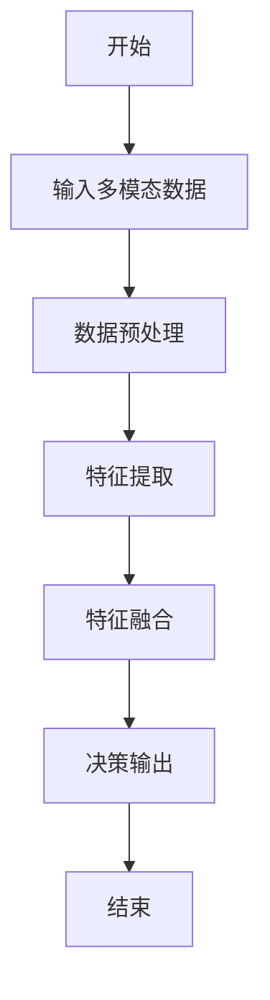
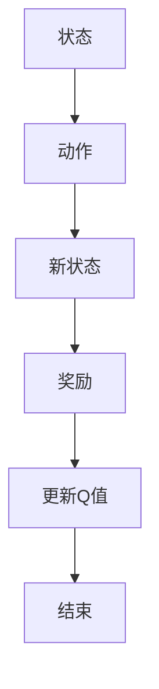
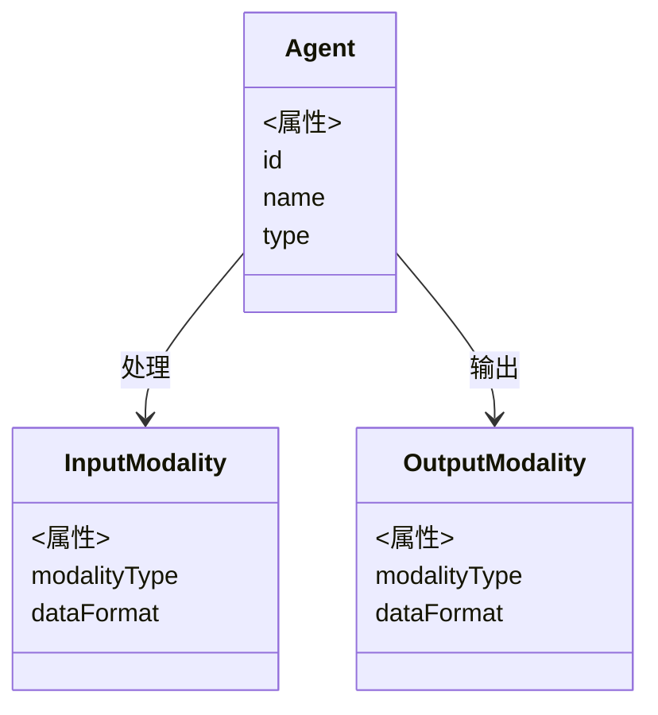
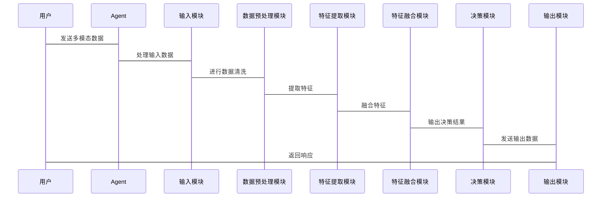

                 


# AI Agent的多模态交互设计

> 关键词：AI Agent，多模态交互，自然语言处理，计算机视觉，强化学习，系统架构设计

> 摘要：本文深入探讨了AI Agent的多模态交互设计，从背景与概念、核心概念与联系、算法原理与实现、系统分析与架构设计、项目实战到最佳实践，全面解析了多模态交互在AI Agent中的重要性与实现方法。通过详细的技术分析与实际案例，展示了如何设计和实现一个多模态交互的AI Agent系统。

---

# 第一部分: AI Agent的多模态交互设计背景与概念

## 第1章: AI Agent的基本概念与多模态交互的背景

### 1.1 AI Agent的定义与类型

#### 1.1.1 AI Agent的基本定义
AI Agent（人工智能代理）是指能够感知环境、自主决策并执行任务的智能实体。它可以是一个软件程序、机器人或其他智能系统，旨在通过与用户或环境的交互来实现特定目标。

#### 1.1.2 AI Agent的类型与特点
AI Agent可以根据功能和应用场景分为以下几类：
- **简单反射型Agent**：基于固定的规则执行任务，适用于简单的场景。
- **基于模型的反射型Agent**：具有环境模型，能够根据模型进行决策。
- **目标驱动型Agent**：以特定目标为导向，主动规划和执行任务。
- **效用驱动型Agent**：通过最大化效用函数来优化决策。

#### 1.1.3 AI Agent的应用场景与发展趋势
AI Agent广泛应用于智能助手、自动驾驶、智能客服等领域。随着技术的发展，AI Agent正朝着更智能、更自主的方向发展，能够处理复杂多变的任务。

---

### 1.2 多模态交互的基本概念

#### 1.2.1 多模态交互的定义
多模态交互是指通过多种信息载体（如文本、语音、图像、视频等）进行的交互方式。它结合了不同模态的信息，能够更全面地理解和响应用户的需求。

#### 1.2.2 多模态交互的核心优势
- **信息互补性**：不同模态的信息可以相互补充，提高交互的准确性和可靠性。
- **用户体验优化**：通过多样化的交互方式，提升用户的使用体验。
- **复杂任务处理**：能够处理单一模态交互无法完成的复杂任务。

#### 1.2.3 多模态交互在AI Agent中的重要性
在AI Agent中，多模态交互能够帮助Agent更准确地理解用户意图，提供更个性化的服务，并在复杂场景中做出更智能的决策。

---

### 1.3 多模态交互设计的背景与意义

#### 1.3.1 当前AI交互技术的发展现状
随着深度学习和自然语言处理技术的进步，AI交互技术得到了快速发展。然而，单一模态的交互方式在复杂场景中往往显得力不从心。

#### 1.3.2 多模态交互设计的必要性
为了提高AI Agent的智能性和用户体验，多模态交互设计成为必要。通过整合多种信息载体，AI Agent能够更全面地感知和理解环境。

#### 1.3.3 多模态交互设计对AI Agent性能的提升作用
通过多模态交互设计，AI Agent可以更准确地识别用户意图，提供更个性化的服务，并在复杂场景中做出更智能的决策。

---

## 1.4 本章小结
本章主要介绍了AI Agent的基本概念和多模态交互的重要性和必要性。通过分析AI Agent的类型和应用场景，以及多模态交互的核心优势，为后续章节的深入探讨奠定了基础。

---

## 第2章: 多模态交互的核心概念与联系

### 2.1 多模态交互的核心概念原理

#### 2.1.1 多模态数据的采集与处理
多模态数据的采集包括文本、语音、图像等多种形式。处理过程涉及数据清洗、特征提取和数据融合等步骤。

#### 2.1.2 多模态数据的融合与分析
多模态数据的融合可以通过加权融合、注意力机制等方法实现。分析过程需要结合上下文信息，进行语义理解和意图识别。

#### 2.1.3 多模态交互的实时性与响应性
为了提供良好的用户体验，多模态交互需要具备实时性和快速响应能力。这要求系统在数据处理和决策过程中优化效率。

---

### 2.2 多模态交互的核心要素对比分析

#### 2.2.1 不同模态数据的特征对比
以下是不同模态数据的特征对比：

| 模态类型 | 特征描述 | 优点 | 缺点 |
|----------|----------|------|------|
| 文本      | 精确表达意图 | 高效性 | 易误解 |
| 语音      | 表达情感 | 亲切感 | 易受环境干扰 |
| 图像      | 丰富的视觉信息 | 直观性 | 数据量大 |

#### 2.2.2 各种模态数据在AI Agent中的作用
- **文本**：用于自然语言理解，提取用户意图。
- **语音**：用于情感识别，增强交互的亲切感。
- **图像**：用于视觉识别，提供额外的上下文信息。

#### 2.2.3 模态数据之间的关联性分析
不同模态数据之间存在一定的关联性，例如，文本和语音可以结合上下文信息进行语义理解，图像和文本可以用于多模态检索。

---

### 2.3 多模态交互的ER实体关系图

```mermaid
er
actor(Agent) {
  id
  name
  type
}
actor(InputModality) {
  id
  modalityType
  dataFormat
}
actor(OutputModality) {
  id
  modalityType
  dataFormat
}
```

---

### 2.4 本章小结
本章详细探讨了多模态交互的核心概念和各种模态数据的特征对比。通过ER实体关系图，展示了不同模态数据在AI Agent中的关联性，为后续章节的算法设计和系统实现提供了理论基础。

---

## 第3章: 多模态交互的算法原理与实现

### 3.1 多模态数据融合算法

#### 3.1.1 多模态数据融合的基本原理
多模态数据融合通过将不同模态的数据进行整合，以提高信息的准确性和丰富性。常用的融合方法包括加权融合、注意力机制和生成对抗网络。

#### 3.1.2 多模态数据融合的常用算法
- **加权融合**：对不同模态的数据进行加权，综合得到最终结果。
- **注意力机制**：通过自注意力网络，聚焦重要的模态信息。
- **生成对抗网络**：通过生成和判别网络，优化多模态数据的融合效果。

#### 3.1.3 基于深度学习的多模态融合方法
基于深度学习的多模态融合方法包括以下步骤：
1. **特征提取**：通过卷积神经网络（CNN）或循环神经网络（RNN）提取不同模态的特征。
2. **特征融合**：将提取的特征进行融合，可以采用加性融合、乘性融合或注意力机制。
3. **决策输出**：根据融合后的特征进行分类或回归，输出最终结果。

---

### 3.2 多模态交互的算法流程图



---

### 3.3 基于强化学习的多模态交互算法

#### 3.3.1 强化学习的基本原理
强化学习是一种通过试错方法优化决策的算法。AI Agent通过与环境的交互，获得奖励或惩罚，逐步优化自身的决策策略。

#### 3.3.2 多模态交互中的强化学习应用
在多模态交互中，强化学习可以用于优化Agent的响应策略。例如，在对话系统中，Agent可以根据用户的反馈调整回答的语气和内容。

#### 3.3.3 基于Q-learning的多模态交互算法
Q-learning是一种常用的强化学习算法。以下是其实现流程：



---

### 3.4 本章小结
本章详细介绍了多模态交互的算法原理与实现方法。通过分析多模态数据融合算法和强化学习算法，展示了如何通过算法优化提升AI Agent的交互能力。

---

## 第4章: 系统分析与架构设计

### 4.1 问题场景介绍

#### 4.1.1 问题背景
在多模态交互系统中，AI Agent需要同时处理文本、语音和图像等多种模态的数据。系统设计需要考虑数据采集、处理和融合的效率。

#### 4.1.2 问题描述
AI Agent需要在复杂场景中准确理解用户意图，并通过多模态信息提供个性化的服务。

#### 4.1.3 问题解决
通过设计高效的系统架构和优化算法，可以提升AI Agent的多模态交互能力。

---

### 4.2 系统功能设计

#### 4.2.1 领域模型设计
以下是AI Agent的领域模型设计：



#### 4.2.2 系统架构设计
以下是多模态交互系统的架构图：


#### 4.2.3 系统接口设计
系统接口设计需要考虑不同模态数据的输入和输出格式。例如，文本输入可以是字符串，图像输入可以是像素矩阵。

#### 4.2.4 系统交互流程图
以下是系统交互的流程图：



---

### 4.3 本章小结
本章通过系统分析与架构设计，展示了如何通过高效的系统架构和优化的算法设计，提升AI Agent的多模态交互能力。

---

## 第5章: 项目实战——多模态交互系统实现

### 5.1 项目介绍

#### 5.1.1 项目背景
本项目旨在设计和实现一个多模态交互系统，能够通过文本、语音和图像等多种模态进行交互。

#### 5.1.2 项目目标
实现一个多模态交互系统，能够准确理解用户意图并提供个性化的服务。

---

### 5.2 环境安装与配置

#### 5.2.1 环境要求
- **操作系统**：Linux/Windows/MacOS
- **编程语言**：Python 3.8+
- **框架与库**：
  - PyTorch：用于深度学习模型训练
  - OpenCV：用于图像处理
  - SpeechRecognition：用于语音识别

#### 5.2.2 安装依赖
```bash
pip install torch opencv-python speechrecognition
```

---

### 5.3 核心代码实现

#### 5.3.1 数据预处理模块
```python
import cv2
import numpy as np

def preprocess_image(image_path):
    img = cv2.imread(image_path)
    img = cv2.resize(img, (224, 224))
    img = img.astype(np.float32) / 255.0
    return img
```

#### 5.3.2 特征提取模块
```python
import torch
import torch.nn as nn

class TextEncoder(nn.Module):
    def __init__(self, vocab_size, embedding_dim):
        super().__init__()
        self.embedding = nn.Embedding(vocab_size, embedding_dim)
    
    def forward(self, input):
        return self.embedding(input)

class ImageEncoder(nn.Module):
    def __init__(self, input_dim, hidden_dim):
        super().__init__()
        self.fc = nn.Linear(input_dim, hidden_dim)
    
    def forward(self, input):
        return self.fc(input)
```

#### 5.3.3 特征融合模块
```python
class FeatureFuser(nn.Module):
    def __init__(self, text_dim, image_dim, output_dim):
        super().__init__()
        self.fc = nn.Linear(text_dim + image_dim, output_dim)
    
    def forward(self, text_feat, image_feat):
        fused = torch.cat([text_feat, image_feat], dim=1)
        return self.fc(fused)
```

#### 5.3.4 决策模块
```python
class DecisionMaker(nn.Module):
    def __init__(self, input_dim, output_dim):
        super().__init__()
        self.fc = nn.Linear(input_dim, output_dim)
    
    def forward(self, input):
        return torch.softmax(self.fc(input), dim=1)
```

---

### 5.4 代码解读与分析

#### 5.4.1 数据预处理模块
- `preprocess_image`函数用于读取图像并进行归一化处理，使其适合模型输入。

#### 5.4.2 特征提取模块
- `TextEncoder`和`ImageEncoder`分别用于提取文本和图像的特征。文本特征通过词嵌入提取，图像特征通过全连接层提取。

#### 5.4.3 特征融合模块
- `FeatureFuser`将文本和图像特征进行拼接，并通过全连接层输出融合特征。

#### 5.4.4 决策模块
- `DecisionMaker`通过全连接层和softmax函数输出决策结果。

---

### 5.5 实际案例分析

#### 5.5.1 案例背景
用户输入一条包含文本和图像的查询，AI Agent需要根据文本和图像信息进行理解并做出响应。

#### 5.5.2 案例实现
```python
# 输入文本和图像
text_input = "这是一张猫的图片"
image_input = preprocess_image("cat.jpg")

# 提取特征
text_feat = text_encoder(text_input)
image_feat = image_encoder(image_input)

# 融合特征
fused_feat = feature_fuser(text_feat, image_feat)

# 输出决策
output = decision_maker(fused_feat)
print(output)
```

---

### 5.6 本章小结
本章通过具体的项目实战，展示了如何设计和实现一个多模态交互系统。通过代码实现和案例分析，帮助读者理解多模态交互设计的核心技术。

---

## 第6章: 最佳实践与小结

### 6.1 小结

#### 6.1.1 多模态交互设计的核心要点
- **数据融合**：通过多模态数据的融合，提升信息的准确性和丰富性。
- **算法优化**：结合深度学习和强化学习，优化多模态交互的决策能力。
- **系统架构**：设计高效的系统架构，确保多模态交互的实时性和响应性。

#### 6.1.2 多模态交互设计的注意事项
- **数据质量**：确保多模态数据的质量，避免噪声干扰。
- **算法选择**：根据具体场景选择合适的算法，避免过度复杂化。
- **用户体验**：注重用户体验设计，提升交互的直观性和便捷性。

---

### 6.2 注意事项

#### 6.2.1 数据处理
在实际应用中，需要注意多模态数据的异构性和多样性，合理设计数据处理流程。

#### 6.2.2 算法优化
在算法设计中，需要考虑计算效率和模型的可解释性，避免过拟合和欠拟合问题。

#### 6.2.3 系统集成
在系统集成中，需要注意不同模块之间的接口设计和数据流的优化，确保系统的高效运行。

---

### 6.3 拓展阅读

#### 6.3.1 推荐书籍
- 《Deep Learning》
- 《Reinforcement Learning》

#### 6.3.2 推荐论文
- "Multi-modal deep learning for visual recognition"
- "Reinforcement learning for multi-modal dialogue systems"

---

## 本章小结
本章总结了多模态交互设计的核心要点和注意事项，并提供了拓展阅读的推荐资源，帮助读者进一步深入学习和实践。

---

## 结语
通过本文的系统讲解和实际案例分析，读者可以全面了解AI Agent的多模态交互设计的核心技术与实现方法。希望本文能够为相关领域的研究和实践提供有价值的参考。

---

