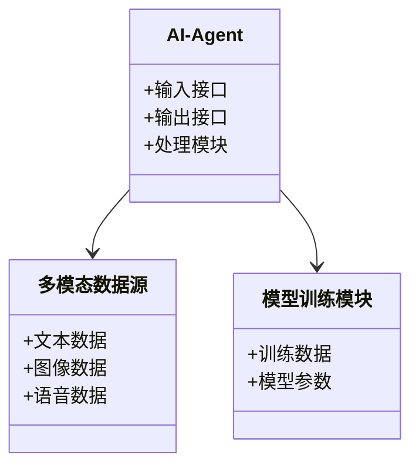

                 


# AI Agent的多模态场景理解技术

## 关键词：AI Agent, 多模态场景理解, 多模态数据融合, 注意力机制, 图神经网络, 系统架构设计

## 摘要：  
AI Agent（人工智能代理）作为连接人与数字世界的桥梁，其多模态场景理解能力是实现智能化交互的核心。本文从AI Agent的基本概念出发，详细探讨多模态数据的特征与融合策略，分析多模态场景理解的算法原理，解析系统架构设计，结合实际案例展示项目实战，并总结最佳实践。通过本文，读者将全面掌握AI Agent在多模态场景理解中的技术要点和应用方法。

---

# 第1章: AI Agent与多模态场景理解概述

## 1.1 AI Agent的基本概念

### 1.1.1 什么是AI Agent
AI Agent是一种能够感知环境、自主决策并执行任务的智能实体。它通过接收输入、分析信息、做出决策并输出结果，实现与用户或环境的交互。AI Agent可以是软件程序，也可以是物理设备，其核心在于智能化的处理能力。

### 1.1.2 AI Agent的核心特征
- **自主性**：AI Agent能够自主决策，无需外部干预。
- **反应性**：能够实时感知环境并做出响应。
- **学习能力**：通过数据和经验不断优化自身能力。
- **交互性**：支持多种模态的输入输出交互。

### 1.1.3 多模态场景理解的定义
多模态场景理解是指AI Agent能够同时处理多种数据模态（如文本、图像、语音等），并基于这些信息理解复杂的场景含义。这种能力使得AI Agent能够更准确地理解用户需求和环境信息。

---

## 1.2 多模态数据的特征与挑战

### 1.2.1 多模态数据的类型
| 数据模态 | 特征描述                  |
|----------|--------------------------|
| 文本      | 结构化信息，语义丰富      |
| 图像      | 高维数据，细节丰富      |
| 语音      | 时间序列数据，情感丰富  |
| 视频      | 结合图像和时间信息       |
| 其他      | 包括传感器数据等         |

### 1.2.2 多模态数据的融合方式
多模态数据的融合方式可以分为以下几类：
1. **特征级融合**：将不同模态的特征向量进行合并。
2. **决策级融合**：将不同模态的决策结果进行综合。
3. **混合式融合**：结合特征级和决策级的融合方法。

### 1.2.3 多模态场景理解的难点
1. **数据异构性**：不同模态的数据具有不同的特征维度和表示方式。
2. **数据冗余**：某些信息可能在多个模态中重复出现。
3. **数据隐私**：多模态数据的处理可能涉及隐私问题。

---

## 1.3 AI Agent在多模态场景中的应用

### 1.3.1 多模态场景理解的典型应用
1. **智能客服**：通过文本和语音理解用户需求。
2. **自动驾驶**：结合视觉、雷达和激光雷达数据进行场景理解。
3. **智能家居**：通过语音和传感器数据实现智能控制。

### 1.3.2 AI Agent在不同场景中的表现
AI Agent在不同场景中的表现受到数据质量和模型能力的影响。例如，在复杂场景中，多模态数据的融合能够显著提高理解精度。

### 1.3.3 未来发展趋势
随着AI技术的进步，多模态场景理解将更加智能化和个性化，AI Agent将能够处理更复杂和多样化的场景。

---

## 1.4 本章小结

本章介绍了AI Agent的基本概念和多模态场景理解的核心概念，分析了多模态数据的特征与融合策略，并探讨了AI Agent在多模态场景中的典型应用和未来发展趋势。

---

# 第2章: 多模态数据的特征分析与融合策略

## 2.1 多模态数据的特征提取

### 2.1.1 文本特征提取
文本特征提取通常包括词袋模型和词嵌入（如Word2Vec、BERT）。

### 2.1.2 图像特征提取
图像特征提取常用的方法包括CNN和Transformer架构。

### 2.1.3 语音特征提取
语音特征提取通常采用MFCC（Mel-Frequency Cepstral Coefficients）和神经网络模型。

---

## 2.2 多模态数据的融合方法

### 2.2.1 基于特征融合的方法
将不同模态的特征向量进行线性组合或非线性变换。

### 2.2.2 基于注意力机制的融合方法
通过注意力机制对不同模态的重要性进行加权。

### 2.2.3 基于对比学习的融合方法
通过对比学习提取具有判别性的特征。

---

## 2.3 数据融合的挑战与解决方案

### 2.3.1 数据异构性问题
通过模态转换和对齐技术解决数据异构性问题。

### 2.3.2 数据冗余问题
通过特征选择和降维技术减少数据冗余。

### 2.3.3 数据隐私问题
通过联邦学习和差分隐私技术保护数据隐私。

---

## 2.4 本章小结

本章详细分析了多模态数据的特征提取方法，并探讨了多模态数据融合的策略与挑战。

---

# 第3章: 多模态场景理解的算法原理

## 3.1 多模态注意力机制

### 3.1.1 自注意力机制
自注意力机制通过计算序列中每个元素与其他元素的相关性来生成权重。

### 3.1.2 多模态自注意力机制
多模态自注意力机制将不同模态的特征进行交互，生成联合注意力权重。

### 3.1.3 多模态注意力网络的实现
通过多模态注意力网络实现跨模态信息的融合。

---

## 3.2 对比学习在多模态融合中的应用

### 3.2.1 对比学习的基本原理
对比学习通过最大化正样本对的相似性来增强特征的区分度。

### 3.2.2 多模态对比学习的实现
通过多模态对比学习实现跨模态特征的对齐。

### 3.2.3 对比学习的优势与挑战
对比学习能够提高模型的泛化能力，但需要处理负样本的采样问题。

---

## 3.3 图神经网络在多模态场景中的应用

### 3.3.1 图神经网络的基本原理
图神经网络通过节点之间的关系进行信息传播。

### 3.3.2 多模态图神经网络的构建
将多模态数据映射到图结构中，构建多模态图神经网络。

### 3.3.3 图神经网络在场景理解中的应用
图神经网络可以用于社交网络分析、推荐系统等领域。

---

## 3.4 本章小结

本章详细分析了多模态场景理解的算法原理，包括注意力机制、对比学习和图神经网络。

---

# 第4章: 多模态场景理解的系统架构设计

## 4.1 系统功能设计

### 4.1.1 数据采集与预处理
通过传感器和接口采集多模态数据，并进行预处理。

### 4.1.2 模态融合与理解
将不同模态的数据进行融合，并通过模型进行场景理解。

### 4.1.3 决策与输出
根据理解结果做出决策，并输出相应的结果。

---

## 4.2 系统架构设计

### 4.2.1 领域模型（类图）


### 4.2.2 系统架构（架构图）


### 4.2.3 系统接口设计
系统接口包括数据输入接口、模型训练接口和结果输出接口。

---

## 4.3 本章小结

本章详细分析了多模态场景理解的系统架构设计，包括功能设计、架构图和接口设计。

---

# 第5章: 项目实战

## 5.1 项目背景与目标

### 5.1.1 项目背景
本项目旨在实现一个多模态场景理解的AI Agent系统。

### 5.1.2 项目目标
通过多模态数据融合实现场景理解，并进行实际应用。

---

## 5.2 系统核心实现

### 5.2.1 环境安装
安装Python、TensorFlow、Keras等开发环境。

### 5.2.2 核心代码实现
```python
import tensorflow as tf
from tensorflow.keras import layers

# 定义多模态注意力机制
def multi_modal_attention(text_features, image_features):
    # 文本注意力
    text_attention = layers.Attention()([text_features, text_features])
    # 图像注意力
    image_attention = layers.Attention()([image_features, image_features])
    # 融合注意力
    fused_features = layers.Concatenate()([text_attention, image_attention])
    return fused_features
```

### 5.2.3 代码解读与分析
上述代码定义了多模态注意力机制，通过文本和图像特征的注意力计算实现特征融合。

---

## 5.3 实际案例分析

### 5.3.1 案例描述
以智能客服为例，实现文本和语音的多模态场景理解。

### 5.3.2 案例分析
通过多模态数据融合提高智能客服的准确率和响应速度。

---

## 5.4 项目小结

本章通过实际案例展示了多模态场景理解的项目实现，包括环境安装、代码实现和案例分析。

---

# 第6章: 最佳实践与总结

## 6.1 小结

本文详细介绍了AI Agent的多模态场景理解技术，包括核心概念、算法原理和系统架构设计。

---

## 6.2 注意事项

在实际应用中，需要注意数据隐私和模型的泛化能力。

---

## 6.3 拓展阅读

推荐阅读多模态数据处理和AI Agent相关的最新技术文献。

---

## 6.4 本章结束

通过本文的学习，读者可以全面掌握AI Agent的多模态场景理解技术，并能够在实际项目中进行应用。

--- 

# 结语

AI Agent的多模态场景理解技术是一项复杂而重要的任务，随着技术的发展，其应用将越来越广泛。希望本文能够为读者提供有价值的技术指导和实践参考。

