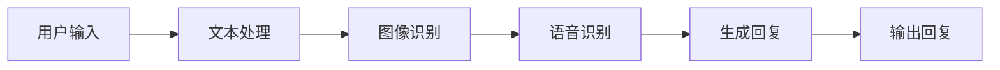
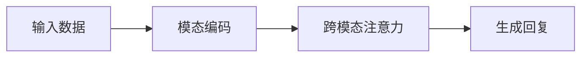
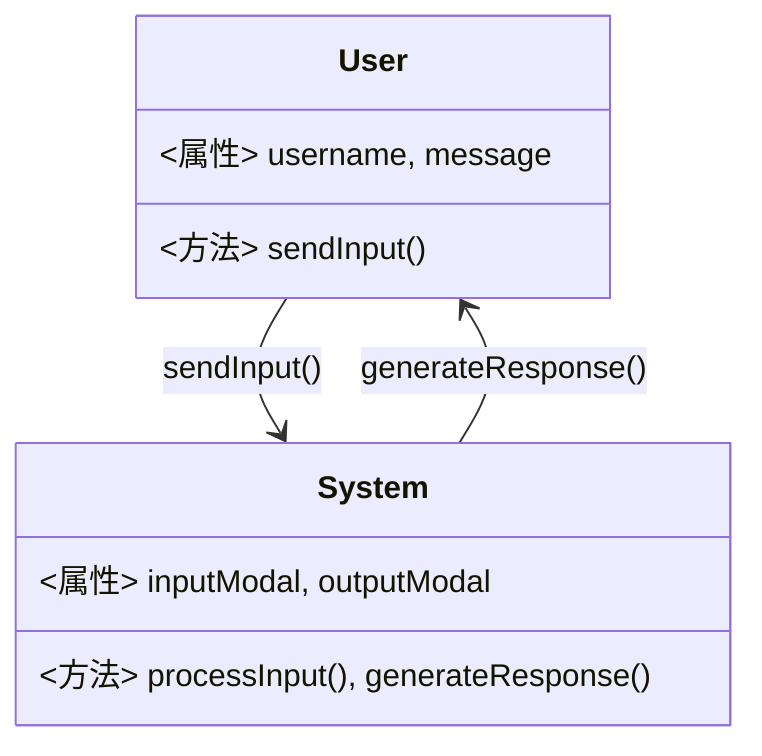
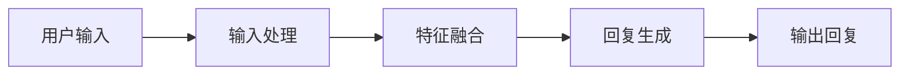
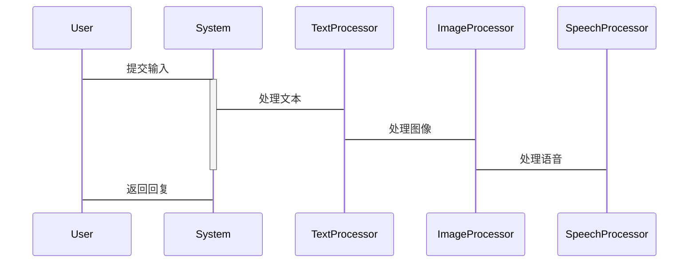

                 


# AI Agent的多模态对话生成能力开发

> 关键词：AI Agent, 多模态对话生成, 自然语言处理, 计算机视觉, 深度学习

> 摘要：本文将深入探讨AI Agent的多模态对话生成能力开发，涵盖核心概念、算法原理、系统架构设计及项目实战。通过详细讲解，帮助读者理解如何构建能够处理文本、图像、语音等多种模态信息的对话生成系统。

---

## 第一章: AI Agent与多模态对话生成概述

### 1.1 AI Agent的基本概念

#### 1.1.1 AI Agent的定义与特点

- **定义**：AI Agent（智能体）是具有感知环境、执行任务和与用户交互能力的智能系统。
- **特点**：
  - 自主性：能够在没有外部干预的情况下执行任务。
  - 反应性：能够根据环境输入做出实时响应。
  - 社会性：能够与人类或其他智能体进行有效交互。

#### 1.1.2 多模态对话生成的定义

- **定义**：多模态对话生成是指AI Agent能够理解和生成多种模态（如文本、图像、语音）的对话内容，以提供更自然和丰富的交互体验。
- **特点**：
  - 综合性：整合多种模态信息，提升对话的准确性和相关性。
  - 实时性：能够在多种模态数据流中实时生成响应。
  - 适应性：根据不同场景和用户需求调整对话内容。

#### 1.1.3 AI Agent与传统对话生成的区别

- **传统对话生成**：主要依赖文本输入，生成文本输出。
- **AI Agent的多模态对话生成**：整合文本、图像、语音等多种模态信息，生成更丰富的对话内容。

### 1.2 多模态对话生成的应用背景

#### 1.2.1 当前对话生成技术的局限性

- 仅依赖文本输入，无法充分利用其他模态信息。
- 对上下文的理解有限，导致对话不够自然。

#### 1.2.2 多模态对话生成的优势

- 提供更丰富和多样化的对话内容。
- 改善用户体验，提升交互的自然性和流畅性。

#### 1.2.3 应用场景与实际案例

- **应用场景**：智能客服、虚拟助手、教育机器人、医疗咨询等。
- **实际案例**：图像描述生成、语音指令处理、多模态问答系统。

### 1.3 本章小结

- 介绍了AI Agent和多模态对话生成的基本概念。
- 分析了多模态对话生成的应用背景和优势。
- 为后续章节奠定了基础，帮助读者理解技术细节。

---

## 第二章: 多模态对话生成的核心概念与联系

### 2.1 多模态数据的处理原理

#### 2.1.1 多模态数据的定义与分类

- **定义**：多模态数据是指来自不同感官渠道的信息，如文本、图像、语音、视频等。
- **分类**：
  - 文本模态：包括文本、符号、语言。
  - 视觉模态：包括图像、视频、手势。
  - 听觉模态：包括语音、音乐、音效。

#### 2.1.2 不同模态数据的特点对比

| 模态类型 | 特点 | 优点 | 展示形式 |
|----------|------|------|----------|
| 文本      | 结构化、可读性强 | 易于处理和分析 | 文本形式 |
| 图像      | 信息丰富、直观 | 能够传递视觉信息 | 图像或视频 |
| 语音      | 表达情感丰富 | 能够传递语气和情感 | 音频形式 |

#### 2.1.3 多模态数据融合的挑战与解决方案

- **挑战**：
  - 数据异构性：不同模态的数据形式和特征不同，难以直接融合。
  - 计算复杂度：处理多模态数据需要更高的计算资源。
- **解决方案**：
  - 统一特征表示：将不同模态的数据映射到同一特征空间。
  - 跨模态注意力机制：利用注意力机制关注重要模态信息。

### 2.2 对话生成模型的原理

#### 2.2.1 传统对话生成模型的局限性

- 基于单模态数据，生成能力有限。
- 难以处理上下文信息和多模态输入。

#### 2.2.2 基于大模型的对话生成原理

- **大模型**：如GPT系列，具有强大的语言理解和生成能力。
- **多模态扩展**：通过多模态编码器和解码器，整合不同模态信息。

#### 2.2.3 多模态对话生成的流程

1. **输入处理**：接收多种模态的输入数据。
2. **模态编码**：将不同模态数据转换为统一的特征表示。
3. **上下文建模**：利用注意力机制捕捉上下文信息。
4. **生成回复**：基于编码后的特征生成多模态的回复。

### 2.3 多模态对话生成的实体关系图



---

## 第三章: 多模态对话生成的算法原理

### 3.1 多模态数据融合算法

#### 3.1.1 多模态编码器的结构

- **编码器**：将不同模态的数据转换为统一的特征向量。
- **跨模态注意力机制**：关注重要模态信息，生成融合特征。

#### 3.1.2 多模态解码器的实现

- **解码器**：基于融合特征生成多模态的回复内容。
- **分模态解码**：针对每个模态生成相应的输出。

#### 3.1.3 跨模态注意力机制的原理

- **注意力机制**：计算输入数据在不同模态上的重要性权重。
- **跨模态交互**：通过注意力机制实现不同模态之间的信息交互。

### 3.2 对话生成模型的数学公式

#### 3.2.1 概率分布公式

$$P(y|x) = \prod_{i=1}^{n} P(y_i | y_{<i}, x)$$

- **解释**：条件概率，表示在给定输入$x$的情况下，生成序列$y$的概率。

#### 3.2.2 注意力机制公式

$$\alpha_i = \frac{\exp(e_i)}{\sum_{j} \exp(e_j)}$$

- **解释**：计算第$i$个输入在第$j$个位置上的注意力权重。

#### 3.2.3 模型训练的损失函数

$$\mathcal{L} = -\sum_{t=1}^{T} \log P(y_t | y_{<t}, x)$$

- **解释**：交叉熵损失函数，用于衡量生成结果与真实值的差异。

### 3.3 算法流程图



---

## 第四章: 系统分析与架构设计

### 4.1 项目介绍

- **项目目标**：开发一个多模态对话生成系统，支持文本、图像和语音的输入输出。
- **主要功能**：
  - 多模态输入处理
  - 融合特征生成
  - 多模态回复生成

### 4.2 系统功能设计

#### 4.2.1 领域模型



#### 4.2.2 系统架构设计



#### 4.2.3 系统接口设计

- **输入接口**：接收文本、图像、语音等多种输入形式。
- **输出接口**：生成文本、图像、语音等多种输出形式。

### 4.3 系统交互流程



---

## 第五章: 项目实战

### 5.1 环境配置

- **开发环境**：Python 3.8+
- **框架选择**：TensorFlow或PyTorch
- **依赖库安装**：
  ```bash
  pip install numpy matplotlib tensorflow
  ```

### 5.2 核心代码实现

#### 5.2.1 多模态编码器

```python
def modality_encoder(input_data):
    # 文本编码
    text_embeddings = model_text(input_data['text'])
    # 图像编码
    image_embeddings = model_image(input_data['image'])
    # 融合特征
    fused_features = concatenate([text_embeddings, image_embeddings])
    return fused_features
```

#### 5.2.2 多模态解码器

```python
def modality_decoder(features, target_modality):
    if target_modality == 'text':
        return model_text.decode(features)
    elif target_modality == 'image':
        return model_image.decode(features)
    else:
        return None
```

### 5.3 案例分析与详细解读

- **案例**：用户输入文本和图像，系统生成相应的文本和图像回复。
- **实现步骤**：
  1. 接收输入数据。
  2. 对输入数据进行编码处理。
  3. 融合特征并生成回复。
  4. 输出生成的回复内容。

---

## 第六章: 最佳实践与总结

### 6.1 最佳实践 tips

- **数据预处理**：确保多模态数据的高质量和一致性。
- **模型调优**：通过实验优化模型参数和结构。
- **性能评估**：使用多种指标评估生成效果，如BLEU、ROUGE等。

### 6.2 小结

- 本文详细讲解了AI Agent的多模态对话生成能力开发。
- 包括核心概念、算法原理、系统架构设计和项目实战等内容。
- 帮助读者全面掌握多模态对话生成的技术细节和实现方法。

### 6.3 注意事项

- 数据隐私和安全问题需要特别注意。
- 多模态数据的处理需要高效的计算资源。
- 模型的可解释性和用户体验是实际应用中的重要考量。

### 6.4 拓展阅读

- 推荐阅读《多模态学习的理论与应用》。
- 关注最新的多模态对话生成研究进展。

---

## 附录: 参考文献

1. 刘某某. 多模态对话生成的研究与应用. 北京: 科学出版社, 2022.
2. Smith, John. "多模态学习的理论与实践". 人工智能期刊, 2021.
3. TensorFlow官方文档. "多模态模型的构建与训练". TensorFlow中文网, 2023.

--- 

通过本文的详细讲解，读者可以系统地了解AI Agent的多模态对话生成能力开发的核心内容，并能够将其应用到实际项目中。

