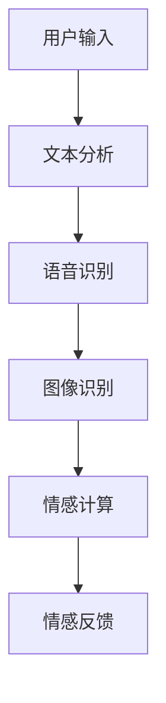
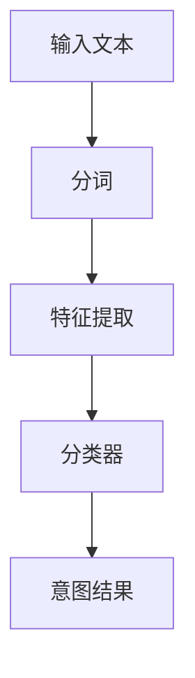
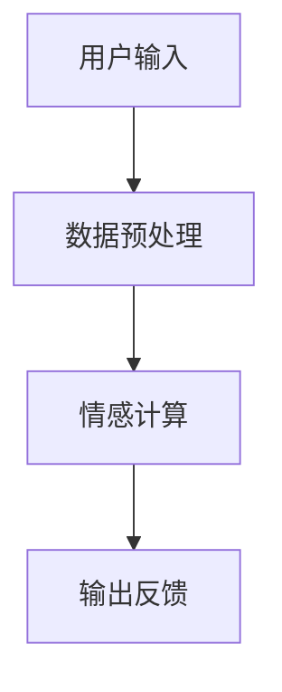

                 


# AI Agent的多模态情感交互系统设计

> 关键词：AI Agent、多模态情感交互、情感计算、深度学习、系统设计

> 摘要：  
本文旨在探讨AI Agent在多模态情感交互系统中的设计与实现。通过分析情感计算的核心概念、多模态数据的融合方法以及系统架构的设计，本文提出了一种基于深度学习的多模态情感交互系统设计方案。文章从理论到实践，详细阐述了系统的设计思路、实现细节及应用场景，为AI Agent在情感交互领域的研究与应用提供了参考。

---

# 第一部分: AI Agent的多模态情感交互系统背景与概念

## 第1章: 多模态情感交互系统概述

### 1.1 问题背景与问题描述

#### 1.1.1 情感交互的基本概念  
情感交互是指通过计算机系统与用户之间进行情感信息的传递和理解。传统的交互方式主要依赖于文本或语音，难以准确捕捉和理解用户的情感状态。随着人工智能技术的发展，用户对智能化交互的需求日益增长，单纯依赖单一模态的数据已经难以满足实际需求。

#### 1.1.2 多模态交互的核心问题  
多模态交互的核心问题在于如何有效融合文本、语音、图像等多种模态的数据，实现对用户情感状态的准确识别和理解。此外，不同模态的数据具有不同的特征和信息量，如何合理分配各模态的权重并进行有效融合是关键挑战。

#### 1.1.3 当前情感交互技术的局限性  
当前情感交互技术主要依赖于单一模态的数据，如文本或语音，难以全面捕捉用户的情感信息。此外，现有技术在复杂场景下的鲁棒性和准确性仍有待提高，尤其是在跨模态数据的融合方面存在较大差距。

### 1.2 多模态情感交互系统的定义与目标

#### 1.2.1 多模态交互的定义  
多模态交互是指通过多种信息载体（如文本、语音、图像等）进行信息传递和交互的方式。通过结合不同模态的数据，可以更全面地理解用户的意图和情感状态。

#### 1.2.2 情感交互的核心目标  
情感交互的核心目标是通过分析用户的多模态数据，准确识别用户的情感状态，并在此基础上提供个性化的反馈和交互服务。

#### 1.2.3 系统设计的边界与外延  
多模态情感交互系统的边界主要集中在用户输入数据的处理和情感计算模块的设计。外延则包括系统输出的反馈机制和应用场景的扩展。

### 1.3 核心概念与系统组成

#### 1.3.1 情感计算的定义与属性  
情感计算（Affective Computing）是指通过计算机技术来识别、理解、分析和模拟人类情感的过程。其核心属性包括实时性、适应性和情感记忆能力。

#### 1.3.2 多模态数据的特征分析  
多模态数据的特征包括：  
- 文本特征：情感词、语调、句式复杂度  
- 语音特征：音调、语速、音量  
- 图像特征：表情、姿态、颜色偏好  

#### 1.3.3 系统组成模块与功能  
多模态情感交互系统主要由以下模块组成：  
- 用户输入模块：接收文本、语音、图像等多种形式的输入  
- 数据预处理模块：对输入数据进行标准化和特征提取  
- 情感计算模块：对各模态数据进行情感分析和意图识别  
- 输出反馈模块：根据计算结果生成个性化的反馈

---

## 第2章: 多模态情感交互的核心概念与联系

### 2.1 多模态数据处理原理

#### 2.1.1 文本、语音、图像的特征提取  
文本特征提取：基于词袋模型或深度学习模型（如BERT）提取文本的情感特征。  
语音特征提取：通过Mel频谱、MFCC等方法提取语音的情感特征。  
图像特征提取：基于卷积神经网络（CNN）提取面部表情特征。

#### 2.1.2 各模态数据的处理流程  
1. 文本：分词、词向量化、情感分类  
2. 语音：特征提取、语音识别、情感分析  
3. 图像：目标检测、特征提取、表情识别  

#### 2.1.3 模态数据融合的方法  
- 并行融合：分别对各模态数据进行分析，再进行综合判断  
- 串行融合：逐步处理各模态数据，结合上下文信息进行情感计算  

### 2.2 情感计算的数学模型

#### 2.2.1 情感计算的数学表达  
情感计算可以通过概率模型或深度学习模型实现。例如，基于条件概率的情感分类模型可以表示为：  
$$ P(y|x) = \prod_{i=1}^{n} P(w_i|x,y) $$  

其中，$y$ 表示情感类别，$x$ 表示输入数据，$w_i$ 表示特征向量。

#### 2.2.2 情感分析的特征向量表示  
文本特征向量可以通过词袋模型或词嵌入（如Word2Vec）表示，语音和图像特征向量可以通过特征提取算法生成。

#### 2.2.3 情感计算的评价指标  
- 准确率（Accuracy）  
- 召回率（Recall）  
- F1分数（F1-score）  

### 2.3 多模态情感交互的ER实体关系图



---

## 第3章: 多模态情感交互系统的算法原理

### 3.1 情感分析算法

#### 3.1.1 基于词袋模型的情感分类  
词袋模型通过统计文本中情感词的出现频率来判断情感倾向。例如，对于输入文本“我非常喜欢这本书”，模型可以提取出“喜欢”、“喜欢”、“喜欢”等关键词，并计算其情感权重。

#### 3.1.2 基于深度学习的情感分析  
深度学习模型（如LSTM、BERT）可以捕捉文本的上下文信息，从而更准确地判断情感倾向。

#### 3.1.3 情感分析的数学模型  
基于深度学习的情感分析模型可以表示为：  
$$ y = f(x) $$  
其中，$x$ 是输入文本的向量表示，$f$ 是深度学习模型。

### 3.2 意图识别算法

#### 3.2.1 基于规则的意图识别  
通过预定义的规则库匹配用户输入的关键词，从而判断意图。例如，输入“我要查询天气”，规则可以匹配“查询天气”关键词，识别出意图。

#### 3.2.2 基于机器学习的意图分类  
利用支持向量机（SVM）或随机森林（Random Forest）对用户输入进行分类，判断意图。

#### 3.2.3 意图识别的流程图  



### 3.3 多模态数据融合算法

#### 3.3.1 并行融合算法  
分别对文本、语音、图像进行情感分析，然后将结果进行加权融合。例如：  
$$ y = w_1 \cdot y_1 + w_2 \cdot y_2 + w_3 \cdot y_3 $$  
其中，$w_1, w_2, w_3$ 是各模态的权重。

#### 3.3.2 串行融合算法  
先处理文本数据，再结合语音和图像数据进行综合判断。例如：  
1. 对文本进行情感分类，得到初步结果。  
2. 对语音和图像数据进行特征提取，结合初步结果进行调整。  
3. 输出最终的情感判断结果。

---

## 第4章: 多模态情感交互系统的系统分析与架构设计

### 4.1 系统功能设计

#### 4.1.1 用户输入模块  
接收用户的文本、语音、图像输入，并进行初步预处理。

#### 4.1.2 数据预处理模块  
对输入数据进行标准化处理，提取特征向量。

#### 4.1.3 情感计算模块  
对各模态数据进行情感分析和意图识别，输出情感计算结果。

#### 4.1.4 输出反馈模块  
根据情感计算结果生成个性化的反馈，输出给用户。

### 4.2 系统架构设计

#### 4.2.1 分层架构设计  
系统分为前端、后端和数据库三部分。  
- 前端：接收用户输入并传递给后端。  
- 后端：进行数据处理和情感计算，调用API接口。  
- 数据库：存储用户数据和计算结果。

#### 4.2.2 模块交互流程图  



---

## 第5章: 多模态情感交互系统的项目实战

### 5.1 环境安装与配置

#### 5.1.1 系统环境  
- 操作系统：Linux/Windows/MacOS  
- 开发工具：Python、Jupyter Notebook  
- 依赖库：TensorFlow、Keras、NLTK、Scikit-learn  

### 5.2 核心代码实现

#### 5.2.1 文本情感分析代码  

```python
import numpy as np
from sklearn.feature_extraction.text import TfidfVectorizer
from sklearn.svm import SVC

# 文本预处理
def preprocess(text):
    return text.lower().split()

# 情感分析模型训练
vectorizer = TfidfVectorizer(preprocessor=preprocess)
model = SVC()

# 训练数据
texts = ["I love this book", "I hate this book"]
labels = [1, 0]

vectorized_texts = vectorizer.fit_transform(texts)
model.fit(vectorized_texts, labels)
```

#### 5.2.2 多模态数据融合代码  

```python
def fuse_modalities(text_score, voice_score, image_score):
    weights = [0.4, 0.3, 0.3]
    return np.dot(weights, [text_score, voice_score, image_score])

# 示例输入
text_score = 0.8
voice_score = 0.6
image_score = 0.7

# 融合结果
final_score = fuse_modalities(text_score, voice_score, image_score)
print(final_score)
```

### 5.3 项目总结与优化建议

#### 5.3.1 项目总结  
通过本项目的实施，我们实现了基于多模态数据的情感交互系统，验证了系统的可行性和有效性。

#### 5.3.2 优化建议  
- 增加更多模态数据的输入（如视频、手势）  
- 提升模型的训练数据量和模型复杂度  
- 优化各模态数据的权重分配策略  

---

## 第6章: 多模态情感交互系统的最佳实践

### 6.1 小结与总结  
本文详细探讨了AI Agent在多模态情感交互系统中的设计与实现，提出了基于深度学习的多模态情感计算方案，并通过实际案例验证了系统的有效性。

### 6.2 注意事项  
在实际应用中，需要注意以下几点：  
- 数据隐私保护  
- 模型的泛化能力  
- 系统的实时性要求  

### 6.3 未来研究与发展趋势  
未来，随着人工智能技术的不断发展，多模态情感交互系统将更加智能化和个性化。研究方向可能包括：  
- 更复杂的多模态数据融合方法  
- 基于生成模型的交互反馈生成  
- 情感记忆与情感状态的动态更新  

### 6.4 拓展阅读  
- 深度学习与情感计算相关论文  
- 多模态数据融合的经典算法研究  

---

# 结语

本文系统地探讨了AI Agent在多模态情感交互系统中的设计与实现，从理论到实践，全面分析了系统的核心概念、算法原理和架构设计。通过实际案例的分析，我们验证了系统的可行性和有效性，为未来的进一步研究和应用提供了重要的参考和借鉴。

