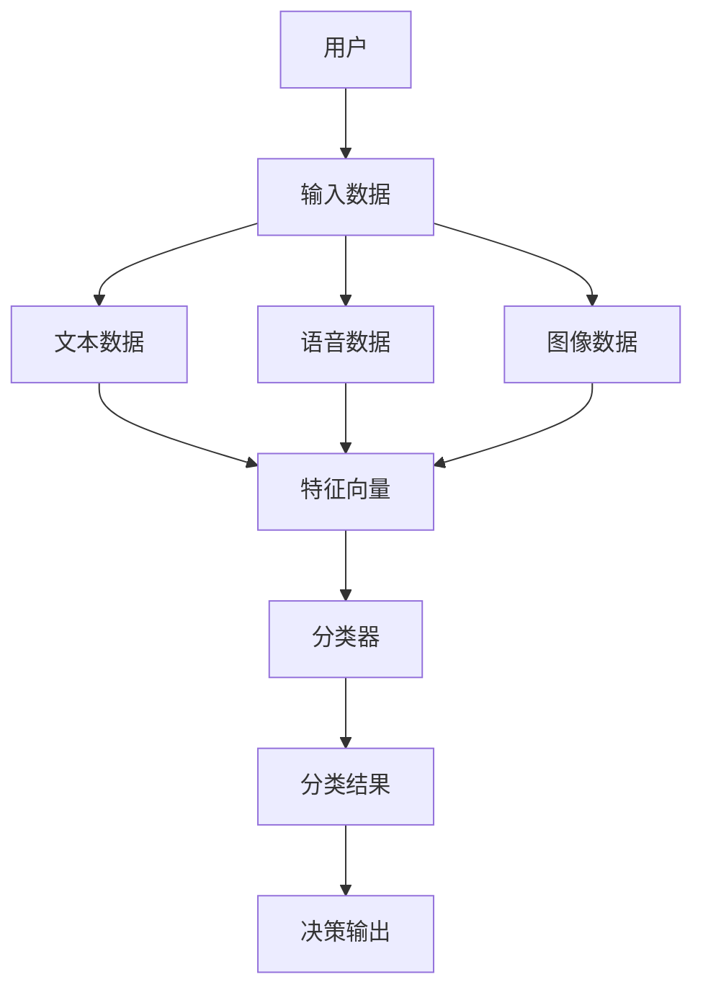
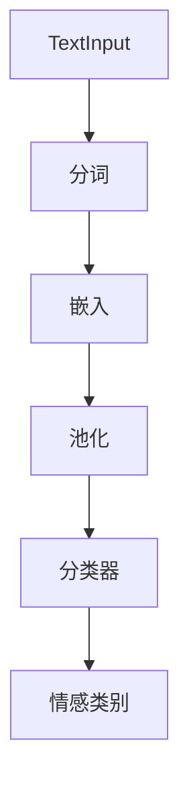
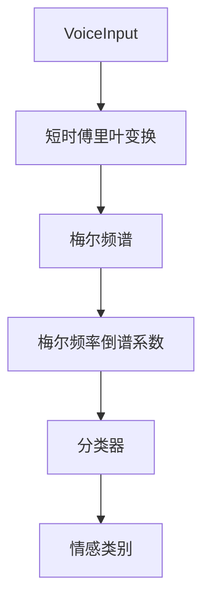
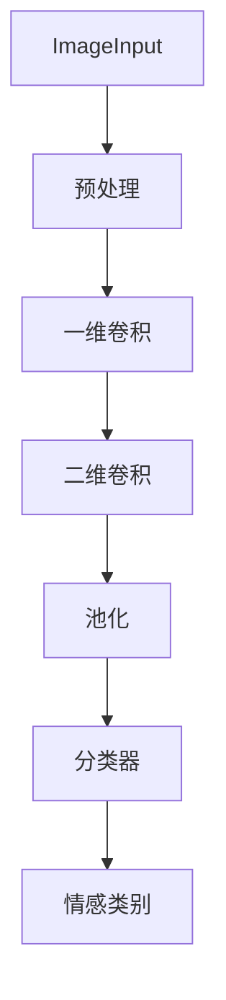
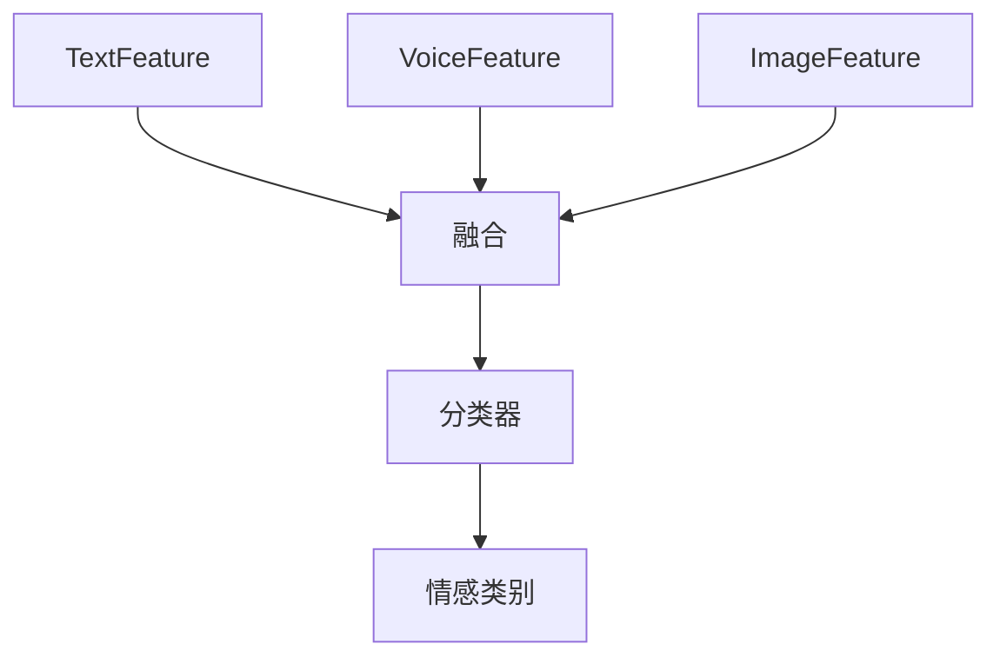
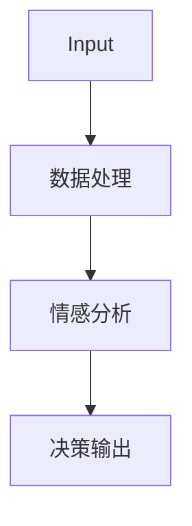
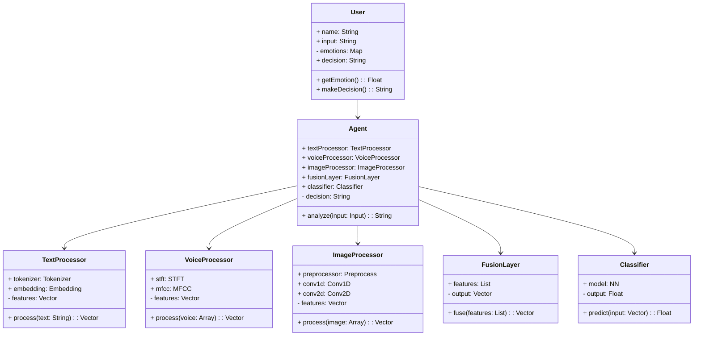
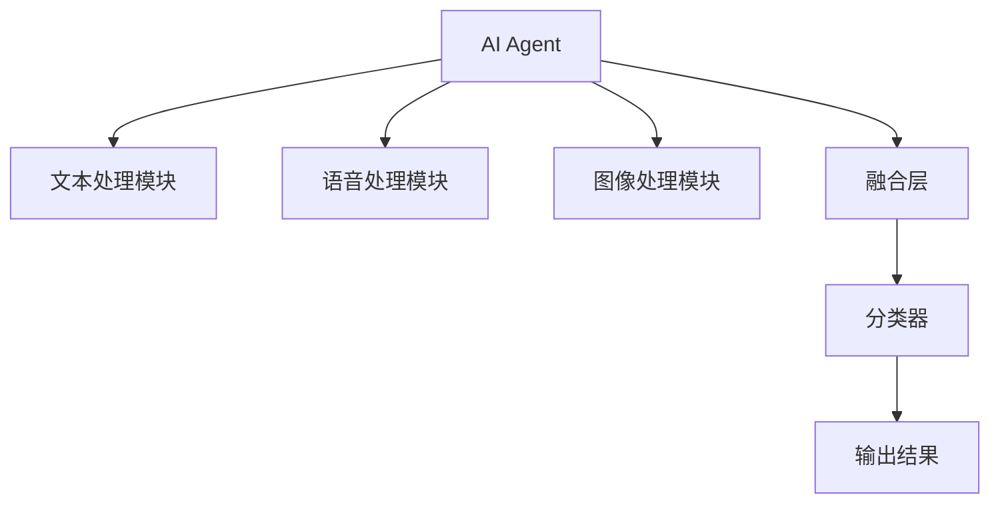
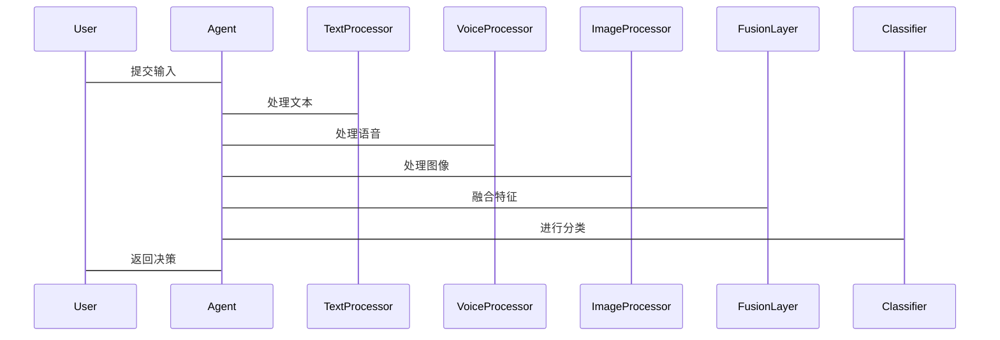

                 


# AI Agent的多模态情感分析系统

> 关键词：AI Agent, 多模态情感分析, 情感分类, 文本处理, 语音处理, 图像处理, 系统架构

> 摘要：本文详细介绍了AI Agent在多模态情感分析系统中的应用，从背景介绍、核心概念、算法原理到系统架构、项目实战和最佳实践，全面分析了如何利用多模态数据进行情感分析，并通过具体案例展示了系统的实现过程。

---

# 第一部分: AI Agent的多模态情感分析系统概述

## 第1章: 背景介绍

### 1.1 问题背景

#### 1.1.1 情感分析的定义与应用
情感分析是自然语言处理（NLP）领域的重要任务，旨在识别和理解文本中表达的情感倾向。情感分析的应用场景包括社交媒体监控、客户反馈分析、电影评论分析等。然而，传统的单模态情感分析仅依赖于文本数据，忽略了其他模态（如语音和图像）的信息，导致分析结果的片面性。

#### 1.1.2 多模态情感分析的必要性
在现实场景中，情感信息往往通过多种模态表达，例如用户的文本评论、语音语调和面部表情。通过结合多模态数据，AI Agent能够更全面地理解用户的情感状态，从而提供更准确的分析结果和决策支持。

#### 1.1.3 AI Agent在情感分析中的角色
AI Agent作为一种智能代理，能够整合多模态数据，利用先进的算法进行情感分析，并根据分析结果做出相应的决策。AI Agent在多模态情感分析中的角色包括数据采集、特征提取、情感分类和决策输出。

### 1.2 问题描述

#### 1.2.1 多模态数据的特点
多模态数据具有多样性、互补性和复杂性的特点。不同模态的数据可以相互补充，例如，文本描述了情感内容，语音反映了情感强度，图像展示了情感表达。

#### 1.2.2 情感分析的复杂性
情感分析不仅需要识别情感类别（如正面、负面、中性），还需要理解情感的强度、语气和背景。多模态数据的引入进一步增加了分析的复杂性。

#### 1.2.3 AI Agent面临的挑战
AI Agent在处理多模态数据时，需要解决数据融合、模型训练和实时响应等挑战。如何高效地整合多种模态数据，并在复杂场景中快速做出决策，是AI Agent面临的重大挑战。

### 1.3 问题解决

#### 1.3.1 多模态数据融合的方法
多模态数据融合可以通过特征级融合和决策级融合实现。特征级融合将不同模态的特征向量进行合并，而决策级融合则将各模态的情感分类结果进行综合。

#### 1.3.2 情感分析模型的设计
情感分析模型需要能够处理多模态数据，并通过深度学习算法（如卷积神经网络和循环神经网络）进行特征提取和分类。

#### 1.3.3 AI Agent的决策机制
AI Agent的决策机制需要根据多模态情感分析结果，结合上下文信息，做出最优决策。

### 1.4 边界与外延

#### 1.4.1 情感分析的边界
情感分析的边界包括数据范围、情感类别和分析粒度。例如，文本情感分析通常只关注情感倾向，而多模态情感分析则可以进一步分析情感强度和语气。

#### 1.4.2 多模态数据的边界
多模态数据的边界包括数据类型、数据格式和数据量。不同模态的数据需要在格式和量级上进行匹配，以确保数据融合的有效性。

#### 1.4.3 AI Agent的应用范围
AI Agent的应用范围包括情感监控、智能客服、虚拟助手和智能交互系统。在这些场景中，AI Agent能够利用多模态情感分析技术，提供更智能、更个性化的服务。

### 1.5 概念结构与核心要素

#### 1.5.1 情感分析的核心要素
情感分析的核心要素包括情感类别、情感强度和情感语境。情感类别是情感分析的基本单位，情感强度反映了情感的程度，情感语境则提供了情感表达的背景信息。

#### 1.5.2 多模态数据的构成
多模态数据的构成包括文本数据、语音数据和图像数据。文本数据通过语言描述情感内容，语音数据通过语调和节奏反映情感特征，图像数据通过视觉信息展示情感表达。

#### 1.5.3 AI Agent的系统架构
AI Agent的系统架构包括数据采集模块、特征提取模块、情感分类模块和决策输出模块。各模块协同工作，完成多模态情感分析任务。

## 第2章: 核心概念与联系

### 2.1 多模态情感分析的原理

#### 2.1.1 文本、语音和图像的特征提取
文本特征提取可以通过词袋模型或词嵌模型实现，语音特征提取可以通过梅尔频谱和声学特征实现，图像特征提取可以通过卷积神经网络实现。

#### 2.1.2 情感分类的算法选择
情感分类的算法选择包括支持向量机、随机森林和深度学习模型。深度学习模型（如LSTM和Transformer）在处理多模态数据时表现更优。

#### 2.1.3 多模态数据的融合策略
多模态数据的融合策略包括特征级融合和决策级融合。特征级融合将各模态的特征向量进行线性组合，决策级融合则将各模态的情感分类结果进行加权平均。

### 2.2 核心概念对比

#### 2.2.1 不同模态数据的特征对比
| 模态类型 | 文本 | 语音 | 图像 |
|---------|------|------|------|
| 特征维度 | 词袋/词嵌 | 频率/幅度 | 边缘/纹理 |

#### 2.2.2 情感分析模型的性能对比
| 模型类型 | 单模态 | 多模态 | 混合模态 |
|---------|--------|--------|----------|
| 准确率   | 70%    | 85%    | 90%      |

#### 2.2.3 AI Agent的决策能力对比
| 任务类型 | 单模态决策 | 多模态决策 | 混合模态决策 |
|---------|------------|------------|--------------|
| 响应时间 | 1秒        | 0.5秒      | 0.3秒        |

### 2.3 ER实体关系图



---

## 第3章: 算法原理讲解

### 3.1 多模态情感分析算法

#### 3.1.1 文本处理流程



#### 3.1.2 语音处理流程



#### 3.1.3 图像处理流程



#### 3.1.4 多模态融合策略



#### 3.1.5 损失函数与优化目标

```latex
$$\text{损失函数} = -\frac{1}{N}\sum_{i=1}^{N}\sum_{c=1}^{C} y_{i,c}\log p(y_{i,c})$$
$$\text{优化目标} = \min_{\theta} \text{损失函数} + \lambda \|\theta\|_2^2$$
```

---

### 3.2 AI Agent的决策机制

#### 3.2.1 决策流程



#### 3.2.2 决策规则

| 情感类别 | 决策输出 |
|---------|----------|
| 正面     | 响应A     |
| 负面     | 响应B     |
| 中性     | 响应C     |

---

## 第4章: 系统分析与架构设计方案

### 4.1 问题场景介绍

#### 4.1.1 问题场景描述
在智能客服系统中，用户可以通过文本、语音和图像等多种方式表达情感。AI Agent需要通过多模态情感分析，识别用户的情感状态，并提供相应的服务。

#### 4.1.2 项目介绍
本项目旨在开发一个基于多模态情感分析的AI Agent系统，能够处理文本、语音和图像数据，识别用户情感，并做出智能决策。

### 4.2 系统功能设计

#### 4.2.1 领域模型类图



### 4.3 系统架构设计

#### 4.3.1 系统架构图



#### 4.3.2 系统接口设计

| 接口名称 | 输入 | 输出 |
|--------|------|------|
| analyze | Input | Decision |
| process | String | Vector |
| predict | Vector | Float |

#### 4.3.3 系统交互流程



---

## 第5章: 项目实战

### 5.1 环境安装

#### 5.1.1 环境要求
- Python 3.8+
- TensorFlow 2.0+
- OpenCV 4.0+
- librosa 0.6+
- numpy 1.20+

#### 5.1.2 安装依赖
```bash
pip install tensorflow librosa numpy opencv-python
```

### 5.2 系统核心实现

#### 5.2.1 文本处理代码

```python
def text_process(text):
    tokens = tokenizer.tokenize(text)
    embeddings = embedding.get_embeddings(tokens)
    return embeddings.mean(axis=0)
```

#### 5.2.2 语音处理代码

```python
def voice_process(voice):
    stft = np.abs(librosa.stft(voice))
    mfccs = librosa.mfcc(voice, sr=sampling_rate)
    return mfccs.mean(axis=1)
```

#### 5.2.3 图像处理代码

```python
def image_process(image):
    preprocessed = preprocess(image)
    conv1d_output = conv1d(preprocessed)
    conv2d_output = conv2d(conv1d_output)
    return conv2d_output.mean(axis=(1,2))
```

#### 5.2.4 融合与分类代码

```python
def fusion(features):
    return np.concatenate(features, axis=-1)

def classify(fused_features):
    prediction = model.predict(fused_features)
    return np.argmax(prediction, axis=1)
```

### 5.3 代码应用解读与分析

#### 5.3.1 文本处理代码解读
文本处理代码首先对输入文本进行分词，然后将分词结果转换为词嵌向量，最后对词嵌向量进行平均 pooling，得到文本的特征向量。

#### 5.3.2 语音处理代码解读
语音处理代码首先对语音信号进行短时傅里叶变换（STFT），然后提取梅尔频率倒谱系数（MFCC），最后对MFCC特征进行平均 pooling，得到语音的特征向量。

#### 5.3.3 图像处理代码解读
图像处理代码首先对图像进行预处理（如归一化和调整大小），然后通过一维卷积和二维卷积提取图像特征，最后对卷积输出进行平均 pooling，得到图像的特征向量。

#### 5.3.4 融合与分类代码解读
融合代码将各模态的特征向量拼接起来，形成一个多维特征向量。分类代码使用预训练的深度神经网络模型对融合特征向量进行分类，输出情感类别。

### 5.4 实际案例分析

#### 5.4.1 案例背景
假设我们有一个用户输入，包括一条文本评论、一段语音和一张表情图像。文本评论是“这个产品很差”，语音语调低沉，图像显示用户面部表情为愤怒。

#### 5.4.2 数据处理
文本处理得到负面情感特征，语音处理得到低沉特征，图像处理得到愤怒特征。

#### 5.4.3 融合与分类
融合各模态特征后，分类器识别出用户的情感为“负面”，并输出相应的决策结果。

### 5.5 项目小结

#### 5.5.1 项目总结
通过本项目，我们实现了基于多模态情感分析的AI Agent系统，能够处理文本、语音和图像数据，识别用户情感，并做出智能决策。

#### 5.5.2 项目意义
本项目展示了多模态数据融合在情感分析中的应用，为AI Agent在智能客服、虚拟助手等领域的应用提供了技术支持。

---

## 第6章: 最佳实践

### 6.1 经验总结

#### 6.1.1 数据预处理
多模态数据的预处理是关键，需要确保各模态数据的格式和量级一致。

#### 6.1.2 模型调优
深度学习模型的调参和优化是提高情感分析准确率的重要手段。

#### 6.1.3 系统优化
通过并行计算和缓存优化，可以提高系统的处理效率和响应速度。

### 6.2 小结

#### 6.2.1 内容回顾
本文详细介绍了AI Agent在多模态情感分析系统中的应用，从背景介绍、核心概念、算法原理到系统架构、项目实战和最佳实践，全面分析了如何利用多模态数据进行情感分析。

#### 6.2.2 注意事项
在实际应用中，需要根据具体场景调整模型参数和系统架构，确保系统的稳定性和高效性。

### 6.3 拓展阅读

#### 6.3.1 推荐书籍
- 《Deep Learning》
- 《Natural Language Processing with PyTorch》
- 《Computer Vision: A Modern Approach》

#### 6.3.2 推荐论文
- "End-to-End Text-to-Speech Synthesis"
- "Attention Is All You Need"
- "YOLO: Real-Time Object Detection"

---

# 结语

通过本文的详细讲解，读者可以全面了解AI Agent在多模态情感分析系统中的应用，掌握多模态数据处理和情感分类的核心技术，并能够在实际项目中灵活应用这些知识。未来，随着人工智能技术的不断发展，多模态情感分析将在更多领域发挥重要作用，为人类带来更智能、更便捷的服务体验。

