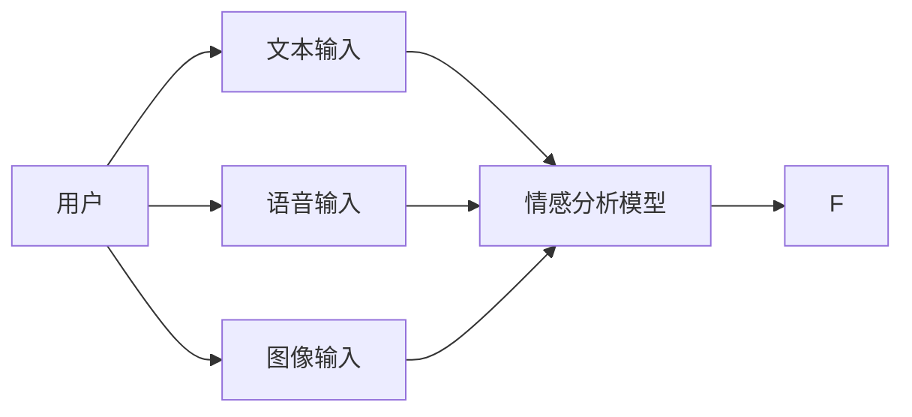
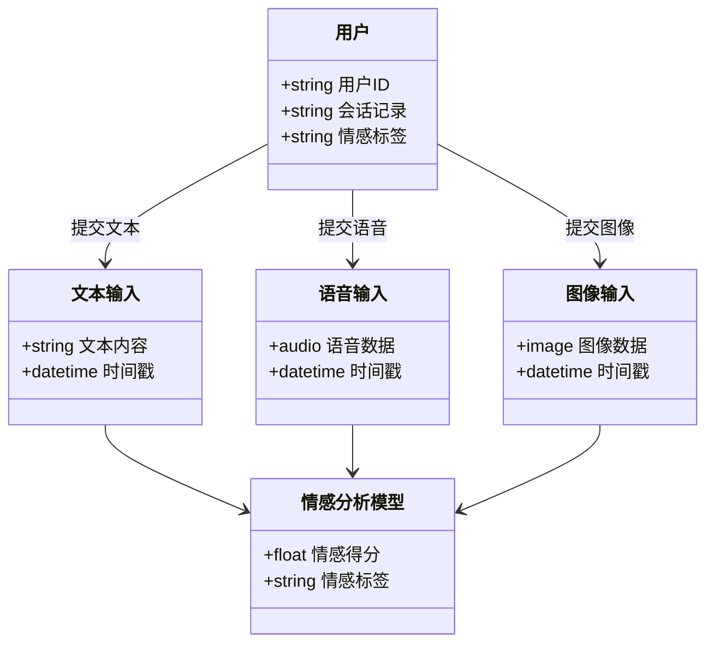
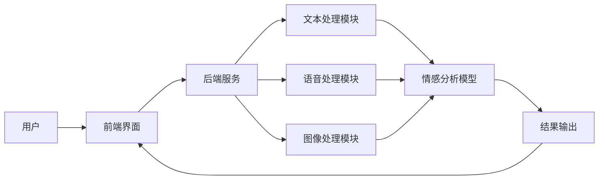
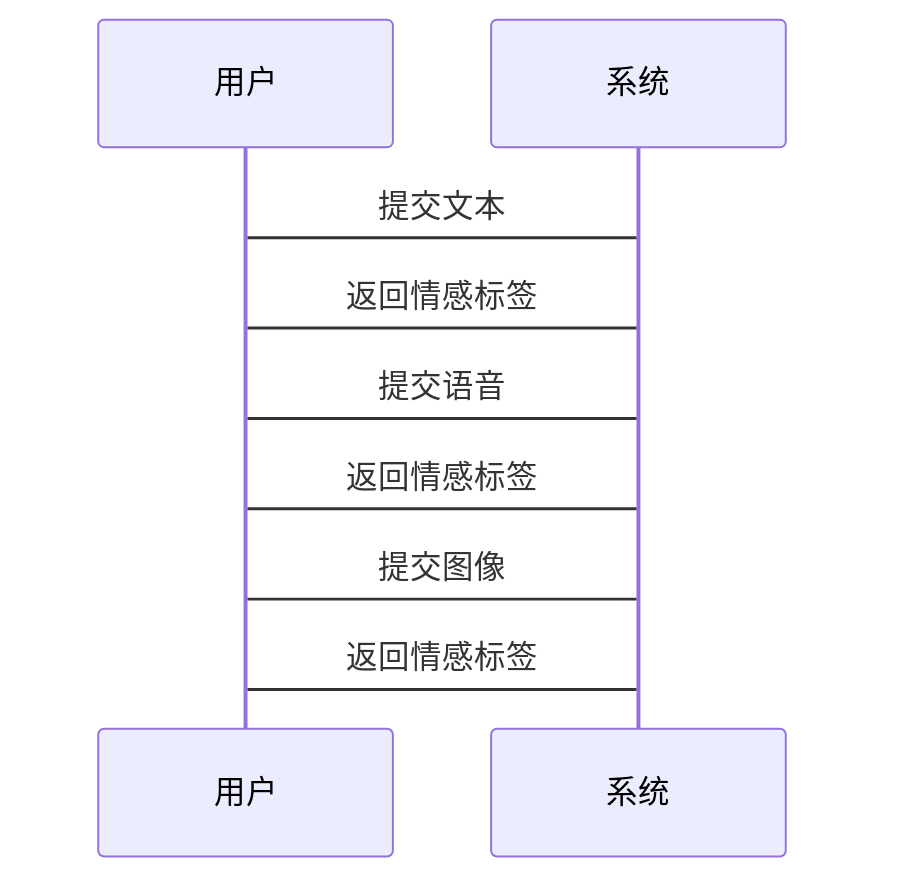

                 


# AI Agent的多模态情感识别技术

## 关键词：AI Agent、多模态情感识别、深度学习、自然语言处理、语音识别、计算机视觉、情感计算

## 摘要：本文详细探讨了AI Agent在多模态情感识别技术中的应用，从背景介绍到核心算法，再到系统设计与实战案例，全面分析了多模态情感识别的原理、实现方法及其在实际场景中的应用。文章内容涵盖多模态数据融合方法、深度学习模型、系统架构设计以及项目实战，为读者提供了全面的技术指南。

---

# 第一部分: AI Agent的多模态情感识别技术背景介绍

## 第1章: 多模态情感识别的背景与问题背景

### 1.1 问题背景
#### 1.1.1 情感识别技术的发展历程
从单一模态到多模态，情感识别技术的演进路径。

#### 1.1.2 多模态数据的引入与意义
多模态数据如何弥补单一模态的不足，提升情感识别的准确性和鲁棒性。

#### 1.1.3 AI Agent在情感识别中的角色定位
AI Agent作为情感识别的载体，如何通过多模态数据实现更智能的情感理解。

### 1.2 问题描述
#### 1.2.1 单模态情感识别的局限性
分析单一模态情感识别的局限性，如文本分析的片面性、语音分析的语境依赖性等。

#### 1.2.2 多模态数据融合的必要性
多模态数据如何协同工作，提升情感识别的精度和可靠性。

#### 1.2.3 AI Agent中情感识别的核心问题
如何高效地处理多模态数据，实现情感识别的实时性和准确性。

### 1.3 问题解决
#### 1.3.1 多模态数据融合的方法
介绍基于特征融合、决策融合和晚期融合的多模态数据融合策略。

#### 1.3.2 AI Agent情感识别的实现路径
从数据采集、特征提取到模型训练的完整实现流程。

#### 1.3.3 技术挑战与解决方案
分析数据异构性、时序同步性等技术挑战，并提出相应的解决方案。

### 1.4 边界与外延
#### 1.4.1 情感识别的边界定义
明确情感识别的范围，避免概念混淆。

#### 1.4.2 多模态数据的范围界定
界定多模态数据的来源和类型，确保数据的适用性和有效性。

#### 1.4.3 AI Agent功能的扩展性探讨
探讨AI Agent在情感识别之外的其他功能扩展可能性。

### 1.5 概念结构与核心要素
#### 1.5.1 多模态情感识别的核心要素
包括数据采集、特征提取、数据融合、情感推理等关键要素。

#### 1.5.2 AI Agent的功能模块划分
从数据输入、处理到输出的模块划分，确保功能的清晰性和可扩展性。

#### 1.5.3 技术实现的逻辑框架
从输入到输出的逻辑流程，确保技术实现的系统性和条理性。

## 第2章: 多模态情感识别的核心概念与联系

### 2.1 核心概念原理
#### 2.1.1 多模态数据的定义与特点
多模态数据的定义、特点及其在情感识别中的应用。

#### 2.1.2 情感识别的基本原理
情感识别的定义、原理及其在多模态环境下的实现方法。

#### 2.1.3 AI Agent中的情感识别机制
AI Agent如何通过多模态数据实现情感识别，包括数据处理、特征提取、模型训练等环节。

### 2.2 模态特征对比
#### 2.2.1 文本模态的特征分析
文本数据的特点、情感特征提取方法及其优缺点。

#### 2.2.2 语音模态的特征分析
语音数据的特征提取方法、情感特征的表现形式及其挑战。

#### 2.2.3 图像模态的特征分析
图像数据的特征提取方法、情感特征的表现形式及其挑战。

### 2.3 ER实体关系图


---

# 第二部分: 多模态情感识别的核心算法原理

## 第3章: 多模态情感识别的算法原理

### 3.1 多模态数据融合算法
#### 3.1.1 多模态数据融合的定义与分类
从特征融合、决策融合和晚期融合的角度分类。

#### 3.1.2 基于深度学习的多模态融合模型
介绍多模态双向长短期记忆网络（M-BiLSTM）模型，用于情感分类。

#### 3.1.3 模型实现流程
从数据预处理、特征提取、模型训练到结果输出的完整流程。

### 3.2 情感识别的数学模型
#### 3.2.1 情感分类的损失函数
使用交叉熵损失函数进行情感分类任务。

#### 3.2.2 注意力机制在多模态数据中的应用
介绍基于多模态注意力机制的情感识别模型，提升模型对重要特征的关注。

#### 3.2.3 多模态融合的数学表达式
$$ L_{total} = L_{text} + L_{语音} + L_{图像} $$

### 3.3 算法实现代码
#### 3.3.1 环境安装
```
pip install numpy
pip install matplotlib
pip install scikit-learn
pip install tensorflow
pip install keras
```

#### 3.3.2 核心代码实现
```python
import numpy as np
from tensorflow.keras.models import Model
from tensorflow.keras.layers import Input, LSTM, Dense, Dropout, Bidirectional

# 定义多模态数据输入
text_input = Input(shape=(max_len,))
voice_input = Input(shape=(voice_len,))
image_input = Input(shape=(image_len,))

# 文本特征提取
text_feature = Bidirectional(LSTM(64, return_sequences=True))(text_input)
text_feature = Dropout(0.5)(text_feature)
text_feature = Dense(32, activation='relu')(text_feature)

# 语音特征提取
voice_feature = Bidirectional(LSTM(64, return_sequences=True))(voice_input)
voice_feature = Dropout(0.5)(voice_feature)
voice_feature = Dense(32, activation='relu')(voice_feature)

# 图像特征提取
image_feature = Bidirectional(LSTM(64, return_sequences=True))(image_input)
image_feature = Dropout(0.5)(image_feature)
image_feature = Dense(32, activation='relu')(image_feature)

# 多模态特征融合
merged_feature = Concatenate()([text_feature, voice_feature, image_feature])
merged_feature = Dense(64, activation='relu')(merged_feature)
merged_feature = Dropout(0.5)(merged_feature)

# 情感分类输出
output = Dense(num_classes, activation='softmax')(merged_feature)

# 定义模型
model = Model(inputs=[text_input, voice_input, image_input], outputs=output)
model.compile(optimizer='adam', loss='categorical_crossentropy', metrics=['accuracy'])
```

#### 3.3.3 算法实现流程
从数据预处理到模型训练，详细解释每一步骤的具体实现。

### 3.4 算法的数学模型
$$ P(y|X) = \prod_{i=1}^{n} P(y|x_i) $$

---

# 第三部分: 系统分析与架构设计方案

## 第4章: 多模态情感识别系统的分析与设计

### 4.1 系统分析
#### 4.1.1 问题场景介绍
AI Agent在客服系统中的应用，如何通过多模态情感识别提升用户体验。

#### 4.1.2 系统功能设计
介绍系统的主要功能模块，包括数据采集、特征提取、数据融合、情感推理等。

### 4.2 系统架构设计
#### 4.2.1 领域模型设计
使用Mermaid类图展示领域模型。



#### 4.2.2 系统架构设计
使用Mermaid架构图展示系统架构。



### 4.3 系统接口设计
#### 4.3.1 接口设计
定义系统的主要接口，如文本输入接口、语音输入接口、图像输入接口和情感输出接口。

#### 4.3.2 交互流程
使用Mermaid序列图展示用户与系统之间的交互流程。



---

# 第四部分: 项目实战

## 第5章: 多模态情感识别项目实战

### 5.1 环境安装
#### 5.1.1 安装依赖
```
pip install numpy
pip install matplotlib
pip install scikit-learn
pip install tensorflow
pip install keras
pip install soundfile
pip install opencv-python
```

### 5.2 系统核心代码实现
#### 5.2.1 文本处理模块
```python
import soundfile as sf
import numpy as np

def process_audio(audio_path):
    data, sample_rate = sf.read(audio_path)
    return data, sample_rate
```

#### 5.2.2 语音处理模块
```python
import cv2

def process_image(image_path):
    img = cv2.imread(image_path)
    return img
```

#### 5.2.3 图像处理模块
```python
import tensorflow as tf
from tensorflow.keras.models import load_model

def process_text(text):
    model = load_model('sentiment_model.h5')
    prediction = model.predict(tf.constant(text, dtype=tf.string))
    return prediction
```

### 5.3 代码应用解读与分析
详细解释每个模块的功能和实现逻辑，分析代码的优缺点和改进空间。

### 5.4 实际案例分析
#### 5.4.1 案例背景
AI Agent在客服系统中的应用，如何通过多模态情感识别提升用户体验。

#### 5.4.2 数据准备
如何准备多模态数据，包括文本、语音和图像数据的采集与标注。

#### 5.4.3 模型训练与优化
如何训练和优化情感分析模型，提升准确率和召回率。

### 5.5 项目小结
总结项目的实现过程，分析技术难点和解决方案，展望未来的改进方向。

---

# 第五部分: 总结与展望

## 第6章: 总结与展望

### 6.1 核心内容回顾
总结全文的核心内容，强调多模态情感识别技术的重要性和应用价值。

### 6.2 技术局限性
分析当前技术的局限性，如数据异构性、模型复杂性等。

### 6.3 未来发展方向
展望未来的发展方向，如更高效的数据融合方法、更智能的模型架构设计等。

---

# 结语

通过本文的系统介绍，读者可以全面了解AI Agent在多模态情感识别技术中的应用，掌握从理论到实践的完整实现过程。希望本文能为相关领域的研究和实践提供有价值的参考和指导。

