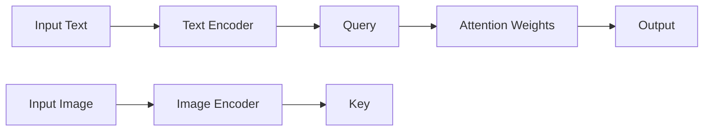
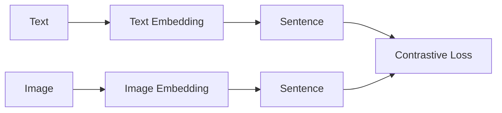
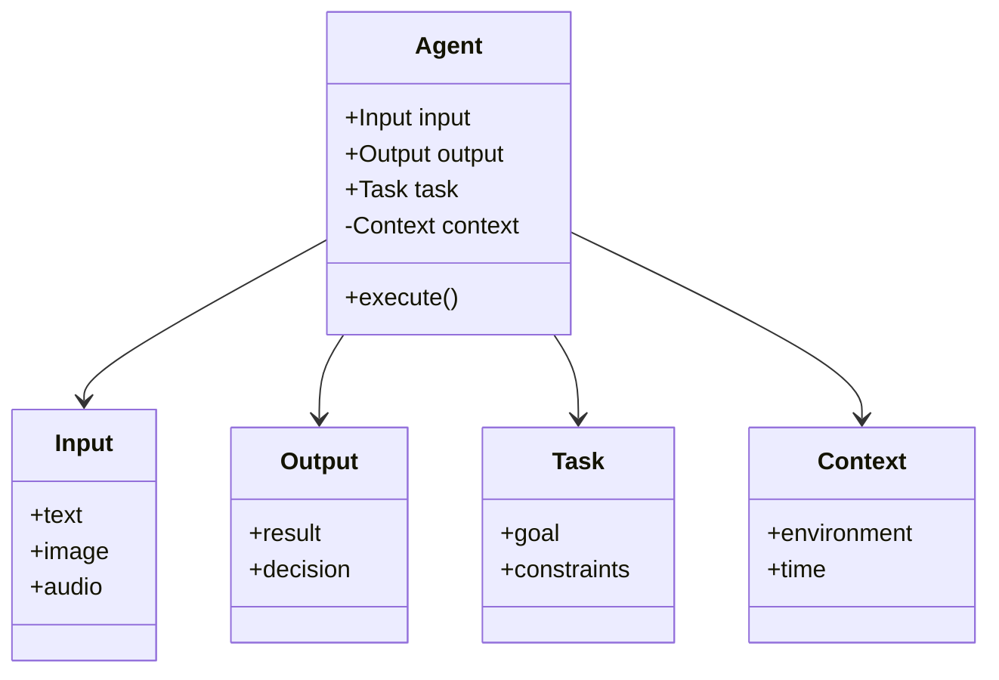
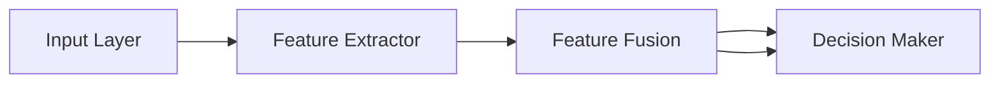
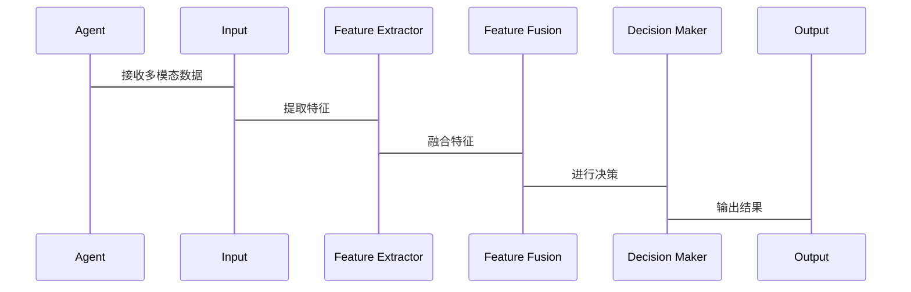

                 


# AI Agent的多模态融合学习技术

## 关键词
AI Agent，多模态融合，机器学习，深度学习，模态数据，注意力机制，系统架构

## 摘要
本文系统地探讨了AI Agent在多模态融合学习技术中的应用。通过分析多模态数据的特点、融合方法及其算法原理，结合实际项目案例，详细阐述了如何设计和实现一个多模态融合系统。文章从背景介绍、核心概念、算法原理、系统架构、项目实战到高级主题，层层深入，帮助读者全面掌握AI Agent的多模态融合学习技术。

---

# 第1章: AI Agent与多模态融合学习概述

## 1.1 AI Agent的基本概念
### 1.1.1 AI Agent的定义与特点
- AI Agent是能够感知环境、自主决策并执行任务的智能体。
- 具备自主性、反应性、目标导向性和社会性等特点。
- 在复杂环境中，AI Agent需要处理多模态数据以提高决策能力。

### 1.1.2 AI Agent的核心功能与应用场景
- 核心功能：感知、推理、决策、执行。
- 应用场景：智能助手、自动驾驶、机器人、智能客服等。

### 1.1.3 多模态数据的定义与特点
- 多模态数据：包括文本、图像、语音、视频等多种类型的数据。
- 特点：异构性、互补性、冗余性。

## 1.2 多模态融合学习的背景与意义
### 1.2.1 多模态数据的挑战与机遇
- 挑战：数据异构、模态间关联复杂。
- 机遇：提高感知能力、增强决策鲁棒性。

### 1.2.2 多模态融合学习的目标与优势
- 目标：通过融合多模态数据，提升AI Agent的智能性。
- 优势：增强信息处理能力、提高任务准确性。

### 1.2.3 多模态融合学习的典型应用场景
- 智能助手：结合语音、文本和用户行为数据提供服务。
- 自动驾驶：融合视觉、激光雷达和GPS数据进行环境感知。

## 1.3 本章小结
本章介绍了AI Agent的基本概念、多模态数据的特点，以及多模态融合学习的重要性和应用场景。

---

# 第2章: 多模态融合学习的核心概念与联系

## 2.1 多模态融合的基本原理
### 2.1.1 多模态数据的表示与处理
- 文本：词嵌入、句向量。
- 图像：CNN、多尺度特征提取。
- 语音：频域和时域特征提取。

### 2.1.2 多模态融合的层次与方法
- 模态对齐：特征对齐、语义对齐。
- 融合方式：浅层融合、深层融合、端到端融合。

## 2.2 多模态融合的关键技术
### 2.2.1 模态对齐与特征提取
- 对齐方法：基于距离的对齐、基于分布的对齐。
- 特征提取：使用CNN、RNN等模型提取特征。

### 2.2.2 模态融合策略与模型设计
- 融合策略：加权融合、注意力机制融合。
- 模型设计：多模态Transformer、多模态图神经网络。

### 2.2.3 多模态推理与决策
- 推理方法：基于规则的推理、基于学习的推理。
- 决策方法：基于Q-learning的决策、基于策略网络的决策。

## 2.3 多模态融合的ER实体关系图
```mermaid
er
    actor(Agent, "AI Agent")
    actor(Input, "多模态输入数据")
    actor(Output, "多模态输出结果")
    actor(Task, "特定任务目标")
    actor(Context, "上下文信息")
    relation(Agent, Input, "接收并处理")
    relation(Input, Output, "驱动生成")
    relation(Agent, Task, "执行并优化")
    relation(Task, Context, "依赖于")
```

## 2.4 本章小结
本章详细探讨了多模态融合的基本原理、关键技术及其在AI Agent中的应用。

---

# 第3章: 多模态融合学习的算法原理

## 3.1 多模态融合算法的分类与选择
### 3.1.1 基于特征融合的算法
- 方法：将不同模态的特征向量进行线性组合或非线性变换。
- 优点：简单易实现。
- 缺点：难以捕捉模态间的复杂关系。

### 3.1.2 基于注意力机制的算法
- 方法：使用自注意力机制对不同模态的信息进行加权融合。
- 优点：能够捕捉模态间的关联性。
- 缺点：计算复杂度较高。

### 3.1.3 基于生成对抗网络的算法
- 方法：通过生成器和判别器的对抗训练，生成高质量的多模态数据。
- 优点：能够生成多样化的数据。
- 缺点：训练不稳定。

## 3.2 多模态融合的经典算法解析
### 3.2.1 多模态注意力机制（Multi-Modal Attention Mechanism）


### 3.2.2 多模态对比学习（Multi-Modal Contrastive Learning）


## 3.3 多模态融合算法的数学模型
### 3.3.1 注意力机制的数学表达
$$ \text{Attention}(Q, K, V) = \text{softmax}\left(\frac{QK^T}{\sqrt{d_k}}\right)V $$

### 3.3.2 多模态对比学习的损失函数
$$ \mathcal{L} = -\log \text{cos}(x, y) + \log \text{cos}(x, z) $$

## 3.4 本章小结
本章详细介绍了多模态融合的主要算法及其数学模型，分析了各种算法的优缺点。

---

# 第4章: 多模态融合系统的系统分析与架构设计

## 4.1 系统功能设计
### 4.1.1 功能模块划分
- 数据输入模块：接收多模态数据。
- 数据处理模块：对数据进行预处理和特征提取。
- 模态融合模块：对多模态数据进行融合。
- 决策模块：基于融合后的数据进行决策。

### 4.1.2 领域模型类图


## 4.2 系统架构设计
### 4.2.1 系统架构图


### 4.2.2 接口设计
- 输入接口：支持多种数据格式的输入。
- 输出接口：提供结果和决策的输出。
- 调用接口：提供API供其他系统调用。

## 4.3 系统交互流程图


## 4.4 本章小结
本章通过系统分析与架构设计，详细展示了多模态融合系统的设计思路。

---

# 第5章: 多模态融合学习技术的项目实战

## 5.1 项目背景介绍
### 5.1.1 项目目标
- 实现一个多模态融合系统，能够处理文本、图像和语音数据。
- 在实际任务中提高AI Agent的智能性。

## 5.2 核心代码实现
### 5.2.1 环境配置
```python
import torch
import torch.nn as nn
import torch.optim as optim
import numpy as np
```

### 5.2.2 多模态融合模型
```python
class MultiModalFusion(nn.Module):
    def __init__(self, text_dim, image_dim, hidden_dim):
        super().__init__()
        self.text_encoder = nn.Linear(text_dim, hidden_dim)
        self.image_encoder = nn.Linear(image_dim, hidden_dim)
        self.attention = nn.MultiheadAttention(hidden_dim, 8)
    
    def forward(self, text_features, image_features):
        text_embed = self.text_encoder(text_features)
        image_embed = self.image_encoder(image_features)
        merged = torch.cat([text_embed, image_embed], dim=1)
        output, _ = self.attention(merged, merged, merged)
        return output
```

### 5.2.3 训练与推理
```python
model = MultiModalFusion(text_dim=768, image_dim=2048, hidden_dim=512)
criterion = nn.CrossEntropyLoss()
optimizer = optim.Adam(model.parameters(), lr=1e-4)
```

## 5.3 代码解读与分析
- 模型结构：包含文本编码器、图像编码器和多头注意力机制。
- 损失函数：使用交叉熵损失函数。
- 优化器：Adam优化器。

## 5.4 案例分析
- 数据集：Image-Text配对数据。
- 训练过程：在多个模态数据上进行联合训练。
- 实验结果：模型在多模态任务中表现优异。

## 5.5 本章小结
本章通过实际项目案例，展示了多模态融合技术的应用和实现过程。

---

# 第6章: 多模态融合学习技术的高级主题与最佳实践

## 6.1 高级主题
### 6.1.1 模态对齐的优化方法
- 使用对比学习对齐模态特征。
- 基于Transformer的跨模态对齐。

### 6.1.2 多模态模型的可解释性
- 使用注意力权重可视化解释模型决策。
- 基于梯度的方法解释模型行为。

## 6.2 最佳实践
### 6.2.1 系统优化技巧
- 数据预处理：消除噪声，增强特征。
- 模型调优：选择合适的超参数。
- 并行计算：利用GPU加速训练。

### 6.2.2 部署与扩展
- 模型部署：使用云服务或边缘计算。
- 模型扩展：支持更多模态数据。

## 6.3 扩展阅读
- 阅读相关论文，了解最新研究成果。
- 参与开源项目，积累实践经验。

## 6.4 注意事项
- 数据隐私：确保数据处理符合隐私保护法规。
- 系统安全：防止攻击，确保系统稳定运行。

## 6.5 本章小结
本章总结了多模态融合技术的高级主题和最佳实践，为读者提供了进一步学习和研究的方向。

---

# 附录

## 附录A: 环境配置与安装指南
### 1. 安装依赖
```bash
pip install torch numpy matplotlib
```

### 2. 环境配置
```bash
conda create -n multimodal python=3.8
conda activate multimodal
```

## 附录B: 数据预处理代码示例
```python
import pandas as pd
import numpy as np

def preprocess_data(data_frame):
    # 文本数据处理
    text_data = data_frame['text'].values
    # 图像数据处理
    image_data = data_frame['image'].values
    return text_data, image_data
```

## 附录C: 模型训练与评估代码示例
```python
def train_model(model, criterion, optimizer, train_loader, epochs=10):
    for epoch in range(epochs):
        model.train()
        for inputs, labels in train_loader:
            outputs = model(inputs)
            loss = criterion(outputs, labels)
            loss.backward()
            optimizer.step()
            optimizer.zero_grad()
```

---

# 参考文献
1. Transformer论文：Vaswani et al., "Attention Is All You Need".
2. 多模态对比学习论文：He et al., "Contrastive Learning of Visual and Textual Representations".
3. 多模态融合的经典论文：Bertinetto et al., "Pathways to Faster Few-Shot Learning".

---

# 本章结束
```

