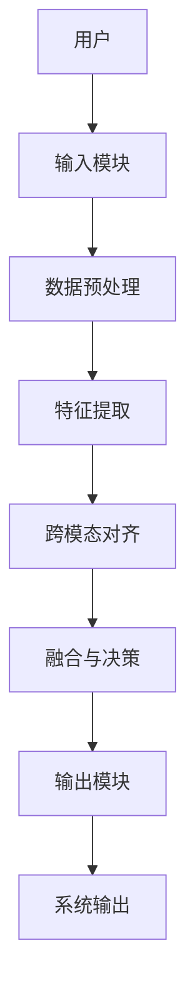

                 


好的，我明白了。我将按照您提供的《AI Agent的多模态融合技术》目录大纲，逐步展开每个章节的内容，确保每个部分都详细具体，符合技术博客的专业性和可读性要求。接下来，我将按照章节逐一撰写详细内容。

---

# AI Agent的多模态融合技术

## 关键词：AI Agent, 多模态融合, 多模态数据, 跨模态对齐, 注意力机制, 系统架构, 项目实战

## 摘要：  
随着人工智能技术的快速发展，AI Agent（智能体）在多个领域中的应用越来越广泛。为了提升AI Agent的智能性和实用性，多模态融合技术成为关键。本文将从多模态融合技术的背景、核心概念、算法原理、系统架构到项目实战，全面解析AI Agent的多模态融合技术。通过详细的技术分析和实际案例，帮助读者理解多模态融合在AI Agent中的应用及其重要意义。

---

## 第1章: 多模态融合技术的背景与意义

### 1.1 多模态融合的背景介绍

#### 1.1.1 多模态数据的定义与特点  
多模态数据指的是来自不同感官或渠道的信息，例如文本、图像、语音、视频、传感器数据等。这些数据具有多样性、互补性和冗余性，能够提供更全面的信息描述。例如，图像可以提供视觉信息，文本提供语义信息，语音提供情感信息，三者的结合可以更准确地理解用户意图。

#### 1.1.2 多模态融合技术的演进历程  
多模态融合技术的发展经历了单模态独立处理、简单特征融合、深度学习驱动的融合三个阶段。早期主要对单一模态数据进行处理，随着技术进步，逐步发展为跨模态信息交互与联合建模。

#### 1.1.3 多模态融合技术的现状与趋势  
当前，多模态融合技术在自然语言处理、计算机视觉、语音处理等领域取得了显著进展。未来，随着AI Agent的普及，多模态融合技术将更加注重实时性、轻量化和场景化。

#### 1.1.4 多模态融合技术的应用场景  
- **智能助手与对话系统**：结合文本、语音和图像信息，提升对话理解和生成能力。  
- **智慧城市与智能交通**：融合传感器数据、视频流和地理位置信息，优化交通管理。  
- **医疗健康与远程诊断**：结合医学图像、病历文本和生理数据，辅助医生诊断。  
- **游戏开发与虚拟现实**：整合图形、语音和动作数据，提升用户体验。  

---

### 1.2 AI Agent的基本概念

#### 1.2.1 AI Agent的定义与分类  
AI Agent是一种能够感知环境、自主决策并执行任务的智能实体。根据功能和应用场景，AI Agent可以分为以下几类：  
- **简单反射型AI Agent**：基于规则的简单响应，如早期的聊天机器人。  
- **基于模型的AI Agent**：通过构建环境模型进行决策，如自动驾驶中的路径规划系统。  
- **目标驱动型AI Agent**：具有明确目标，主动采取行动以实现目标。  
- **实用驱动型AI Agent**：通过优化策略实现目标，如智能音箱的语音助手。  

#### 1.2.2 AI Agent的核心功能与特点  
AI Agent的核心功能包括感知、决策、规划、执行和反馈。其特点在于：  
1. **自主性**：能够自主决策，无需人工干预。  
2. **反应性**：能够实时感知环境变化并做出响应。  
3. **目标导向**：以特定目标为导向，优化行为策略。  
4. **学习能力**：能够通过数据和经验不断优化性能。  

#### 1.2.3 AI Agent与传统AI的区别  
AI Agent的核心是“智能体”，它强调与环境的交互和自主性，而传统AI更多关注数据处理和模式识别。AI Agent具备更强的实时性和适应性，能够动态调整策略以应对复杂环境。

---

### 1.3 多模态融合技术在AI Agent中的意义

#### 1.3.1 多模态融合技术的优势  
1. **提升信息处理能力**：通过融合多种模态信息，AI Agent能够更全面地理解用户需求。  
2. **增强决策能力**：多模态数据的结合可以提供更丰富的上下文信息，辅助AI Agent做出更准确的决策。  
3. **提高用户体验**：通过多模态交互，用户与AI Agent的互动更加自然，体验更优。  

#### 1.3.2 多模态融合技术的挑战  
1. **数据异构性**：不同模态的数据格式和特征维度差异较大，难以直接融合。  
2. **计算复杂性**：多模态数据的处理需要较高的计算资源。  
3. **模型设计难度**：如何设计高效的多模态融合模型是技术难点。  

#### 1.3.3 多模态融合技术的应用前景  
随着5G、物联网和边缘计算的发展，多模态融合技术在AI Agent中的应用前景广阔，尤其是在智能助手、智慧城市、医疗健康等领域具有重要潜力。

---

## 1.4 本章小结  
本章介绍了多模态融合技术的背景、核心概念、优势和挑战，以及在AI Agent中的应用场景。多模态融合技术通过整合多种信息源，显著提升了AI Agent的智能性和实用性，为未来的智能化应用奠定了基础。

---

## 第2章: 多模态融合的核心概念与联系

### 2.1 多模态融合的核心概念

#### 2.1.1 多模态数据的整合方式  
多模态数据的整合方式包括：  
1. **特征级融合**：在特征提取阶段对不同模态的特征进行融合。  
2. **决策级融合**：在决策阶段对不同模态的输出结果进行融合。  
3. **混合级融合**：结合特征级和决策级的融合方法。  

#### 2.1.2 多模态融合的层次结构  
多模态融合的层次结构通常包括：数据采集、预处理、特征提取、融合、决策输出五个阶段。  

#### 2.1.3 多模态融合的实现方法  
1. **基于规则的方法**：根据预定义的规则进行融合。  
2. **基于统计的方法**：利用概率统计模型进行融合。  
3. **基于学习的方法**：通过机器学习模型（如神经网络）进行融合。  

---

### 2.2 多模态融合的关键技术

#### 2.2.1 数据对齐技术  
数据对齐是多模态融合中的关键步骤，目的是将不同模态的数据对齐到同一个语义空间中。常用方法包括：  
1. **模态对齐**：通过投影或嵌入技术将不同模态的数据映射到同一空间。  
2. **时间对齐**：对时间序列数据进行同步处理。  
3. **空间对齐**：对图像或视频数据进行几何对齐。  

#### 2.2.2 跨模态对齐技术  
跨模态对齐是多模态融合的核心技术，旨在建立不同模态数据之间的语义对应关系。常用方法包括：  
1. **对比学习**：通过对比不同模态的特征，学习跨模态对应关系。  
2. **注意力机制**：利用注意力网络关注重要特征，实现跨模态对齐。  

#### 2.2.3 联合学习技术  
联合学习是多模态融合的重要方法，通过同时学习多个模态的数据，提升模型的表达能力。常用方法包括：  
1. **多任务学习**：在多个任务上联合优化，共享模态特征。  
2. **对抗学习**：通过对抗网络实现跨模态特征的对齐与融合。  

---

### 2.3 多模态融合的挑战与解决方案

#### 2.3.1 数据异构性问题  
数据异构性是指不同模态数据的格式、维度和分布差异较大，难以直接融合。解决方案包括：  
1. **模态转换**：将不同模态的数据转换为统一格式。  
2. **模态嵌入**：通过嵌入技术将不同模态的数据映射到同一空间。  

#### 2.3.2 模态冲突问题  
模态冲突是指不同模态数据之间存在矛盾或不一致，导致融合结果不准确。解决方案包括：  
1. **冲突检测**：通过对比不同模态的数据，检测冲突点。  
2. **加权融合**：根据模态的重要性进行加权融合。  

#### 2.3.3 模态权重分配问题  
模态权重分配是指在融合过程中，不同模态数据的权重如何分配。解决方案包括：  
1. **基于数据的权重分配**：根据数据特征自动计算权重。  
2. **基于任务的权重分配**：根据任务需求手动设定权重。  

---

### 2.4 多模态融合的数学模型与公式

#### 2.4.1 多模态对齐的数学模型  
多模态对齐的目标是将不同模态的特征对齐到同一空间。数学模型如下：  
$$ f_i = W_i x_i + b_i $$  
其中，$x_i$ 是第$i$模态的输入特征，$W_i$ 和 $b_i$ 是对应的参数。  

#### 2.4.2 跨模态注意力机制的公式  
跨模态注意力机制用于计算不同模态特征之间的关联性。注意力权重计算公式为：  
$$ \alpha_{i,j} = \text{softmax}(\frac{Q_i K_j^T}{\sqrt{d}}) $$  
其中，$Q_i$ 是查询向量，$K_j$ 是键向量，$d$ 是维度。  

#### 2.4.3 多模态融合的损失函数  
多模态融合的损失函数通常包括重建损失和对齐损失。损失函数为：  
$$ L = L_{\text{recon}} + \lambda L_{\text{align}} $$  
其中，$L_{\text{recon}}$ 是重建损失，$L_{\text{align}}$ 是对齐损失，$\lambda$ 是调节系数。  

---

### 2.5 本章小结  
本章详细介绍了多模态融合的核心概念、关键技术以及挑战与解决方案。通过数学模型和公式，阐述了多模态融合的技术原理，为后续章节的算法实现奠定了基础。

---

## 第3章: 多模态融合算法的原理与实现

### 3.1 多模态融合算法概述

#### 3.1.1 多模态融合算法的分类  
多模态融合算法主要分为以下几类：  
1. **基于特征的融合**：直接对特征向量进行融合。  
2. **基于表示的融合**：通过学习表示向量进行融合。  
3. **基于注意力的融合**：利用注意力机制进行特征加权融合。  

#### 3.1.2 多模态融合算法的优缺点对比  
| 算法类型        | 优点                          | 缺点                          |
|-----------------|-------------------------------|-----------------------------|
| 基于特征的融合   | 实现简单，计算效率高          | 特征维度高，容易过拟合        |
| 基于表示的融合   | 表达能力强，鲁棒性好          | 实现复杂，计算资源消耗大      |
| 基于注意力的融合 | 能够关注重要特征，效果优异    | 参数较多，训练难度较大        |

---

### 3.2 多模态融合算法的实现步骤

#### 3.2.1 数据预处理  
数据预处理包括：  
1. 数据清洗：去除噪声数据。  
2. 数据归一化：将不同模态的数据归一化到同一范围。  

#### 3.2.2 特征提取  
特征提取是多模态融合的关键步骤，常用方法包括：  
1. **文本特征提取**：使用BERT等预训练模型提取文本特征。  
2. **图像特征提取**：使用ResNet等卷积神经网络提取图像特征。  
3. **语音特征提取**：使用MFCC提取语音特征。  

#### 3.2.3 跨模态对齐  
跨模态对齐的实现步骤包括：  
1. **特征对齐**：将不同模态的特征映射到同一空间。  
2. **注意力计算**：计算不同模态特征的注意力权重。  

#### 3.2.4 融合与决策  
融合与决策步骤包括：  
1. **特征融合**：根据注意力权重对特征进行加权融合。  
2. **决策输出**：基于融合后的特征进行最终决策。  

---

### 3.3 多模态融合算法的Python实现

#### 3.3.1 环境安装  
需要安装以下Python库：  
- `numpy`：用于数值计算。  
- `tensorflow` 或 `pytorch`：用于深度学习模型训练。  
- `matplotlib`：用于可视化。  

#### 3.3.2 核心代码实现  
以下是一个简单的多模态融合算法的Python实现示例：  

```python
import numpy as np
import tensorflow as tf

# 定义特征提取函数
def extract_features(data, model):
    return model(data)

# 定义跨模态对齐网络
class CrossModalAligner(tf.keras.Model):
    def __init__(self, input_dim1, input_dim2):
        super(CrossModalAligner, self).__init__()
        self.embed1 = tf.keras.layers.Dense(64, activation='relu')
        self.embed2 = tf.keras.layers.Dense(64, activation='relu')
        self.attention = tf.keras.layers.Dense(1, activation='sigmoid')

    def call(self, input1, input2):
        embed1 = self.embed1(input1)
        embed2 = self.embed2(input2)
        concat = tf.keras.layers.concatenate([embed1, embed2])
        attention = self.attention(concat)
        return attention * embed1 + attention * embed2

# 初始化模型
aligner = CrossModalAligner(input_dim1=128, input_dim2=256)

# 编译模型
aligner.compile(optimizer='adam', loss='binary_crossentropy')

# 训练模型
aligner.fit([input1, input2], labels, epochs=10, batch_size=32)
```

---

### 3.4 本章小结  
本章详细介绍了多模态融合算法的原理与实现步骤，并通过Python代码示例展示了算法的具体实现。通过本章内容，读者可以掌握多模态融合算法的基本实现方法。

---

## 第4章: 多模态融合技术的系统分析与架构设计

### 4.1 系统分析与问题场景

#### 4.1.1 问题场景介绍  
以智能客服系统为例，用户通过多模态交互（文本、语音、图像）与AI Agent进行交流，系统需要实时解析用户意图并提供服务。

#### 4.1.2 系统功能设计  
系统功能包括：  
1. **多模态数据采集**：支持文本、语音、图像等多种数据的采集。  
2. **数据预处理**：对采集的数据进行清洗和归一化处理。  
3. **特征提取与对齐**：提取特征并进行跨模态对齐。  
4. **融合与决策**：对特征进行融合，并根据融合结果做出决策。  
5. **结果输出**：将决策结果输出给用户。  

---

### 4.2 系统架构设计

#### 4.2.1 系统架构图  
以下是一个多模态融合系统的架构图：  



#### 4.2.2 功能模块设计  
1. **输入模块**：负责接收多种模态的数据输入。  
2. **数据预处理模块**：对输入数据进行清洗和归一化。  
3. **特征提取模块**：提取不同模态的特征向量。  
4. **跨模态对齐模块**：对齐不同模态的特征。  
5. **融合与决策模块**：融合特征并做出决策。  
6. **输出模块**：将决策结果输出给用户。  

---

### 4.3 系统接口设计

#### 4.3.1 系统接口描述  
1. **输入接口**：支持文本、语音、图像等多种格式的数据输入。  
2. **输出接口**：支持文本、语音、图像等多种格式的数据输出。  

#### 4.3.2 交互流程  
1. 用户输入多模态数据。  
2. 系统对输入数据进行预处理。  
3. 特征提取模块提取特征。  
4. 跨模态对齐模块对齐特征。  
5. 融合与决策模块做出决策。  
6. 输出模块将结果返回给用户。  

---

### 4.4 本章小结  
本章通过系统分析与架构设计，详细描述了多模态融合技术在AI Agent中的应用。通过功能模块和系统架构的设计，为实际项目提供了参考。

---

## 第5章: 多模态融合技术的项目实战

### 5.1 项目实战环境安装

#### 5.1.1 环境安装步骤  
1. 安装Python和必要的开发工具。  
2. 安装所需的Python库（如numpy、tensorflow、pytorch等）。  
3. 安装数据处理工具（如OpenCV、 librosa等）。  

---

### 5.2 核心代码实现

#### 5.2.1 数据预处理代码  
```python
import numpy as np
import librosa

# 加载音频文件
audio, sr = librosa.load('input.wav', sr=None, duration=3)

# 分割音频数据
segments = np.array_split(audio, 3)
```

#### 5.2.2 特征提取代码  
```python
# 提取MFCC特征
mfccs = librosa.feature.mfcc(audio, sr=sr)
```

#### 5.2.3 跨模态对齐代码  
```python
import tensorflow as tf

# 定义跨模态对齐网络
class CrossModalAligner(tf.keras.Model):
    def __init__(self, input_dim1, input_dim2):
        super(CrossModalAligner, self).__init__()
        self.embed1 = tf.keras.layers.Dense(64, activation='relu')
        self.embed2 = tf.keras.layers.Dense(64, activation='relu')
        self.attention = tf.keras.layers.Dense(1, activation='sigmoid')

    def call(self, input1, input2):
        embed1 = self.embed1(input1)
        embed2 = self.embed2(input2)
        concat = tf.keras.layers.concatenate([embed1, embed2])
        attention = self.attention(concat)
        return attention * embed1 + attention * embed2

# 初始化模型
aligner = CrossModalAligner(input_dim1=128, input_dim2=256)

# 编译模型
aligner.compile(optimizer='adam', loss='binary_crossentropy')

# 训练模型
aligner.fit([input1, input2], labels, epochs=10, batch_size=32)
```

---

### 5.3 项目实战案例分析

#### 5.3.1 案例分析  
以一个多模态情感分析系统为例，系统需要结合文本、语音和图像数据，分析用户的情感倾向。通过特征提取、对齐和融合，系统能够准确识别用户的情感状态。

#### 5.3.2 项目总结  
通过本项目，读者可以掌握多模态融合技术在实际应用中的实现方法，包括数据预处理、特征提取、对齐与融合等关键步骤。

---

### 5.4 本章小结  
本章通过一个实际项目案例，详细展示了多模态融合技术的实现过程。通过代码示例和案例分析，帮助读者更好地理解和应用多模态融合技术。

---

## 第6章: 多模态融合技术的最佳实践与总结

### 6.1 多模态融合技术的意义与价值

#### 6.1.1 多模态融合技术的意义  
多模态融合技术通过整合多种信息源，显著提升了AI Agent的智能性和实用性，为未来的智能化应用奠定了基础。

#### 6.1.2 多模态融合技术的价值  
1. **提升用户体验**：通过多模态交互，用户与AI Agent的互动更加自然。  
2. **增强系统能力**：多模态融合技术能够提升系统的感知和决策能力。  
3. **拓展应用场景**：多模态融合技术为AI Agent在多个领域的应用提供了可能。  

---

### 6.2 多模态融合技术的最佳实践

#### 6.2.1 小结  
多模态融合技术的核心在于数据的对齐与融合，通过合理的算法设计和系统架构，可以显著提升系统的性能。

#### 6.2.2 注意事项  
1. **数据质量**：确保输入数据的准确性和完整性。  
2. **模型选择**：根据具体需求选择合适的多模态融合算法。  
3. **计算资源**：多模态融合需要较高的计算资源，需合理配置硬件。  

#### 6.2.3 拓展阅读  
1. **经典论文**：阅读多模态融合领域的经典论文，了解最新研究进展。  
2. **开源库与工具**：关注多模态融合的开源库和工具，如tensorflow、pytorch等。  
3. **行业案例**：研究多模态融合技术在不同领域的实际应用案例。  

---

### 6.3 本章小结  
本章总结了多模态融合技术的意义与价值，并提出了最佳实践建议。通过小结和注意事项，帮助读者更好地理解和应用多模态融合技术。

---

## 附录: 多模态融合技术相关资源

### 附录A: 开源库与工具  
1. **TensorFlow**：Google的深度学习框架。  
2. **PyTorch**：Facebook的深度学习框架。  
3. **OpenCV**：图像处理库。  
4. **librosa**：语音信号处理库。  

### 附录B: 推荐阅读书籍与论文  
1. **《Deep Learning》**：Ian Goodfellow等著。  
2. **《Multi-modal Data Fusion: A Survey》**：经典多模态融合综述论文。  

---

## 结语  
通过本篇文章的详细讲解，读者可以全面了解AI Agent的多模态融合技术的核心概念、算法原理、系统架构以及实际应用。希望本文能够为读者提供有价值的参考，帮助他们在多模态融合技术领域取得更好的研究成果和应用效果。

