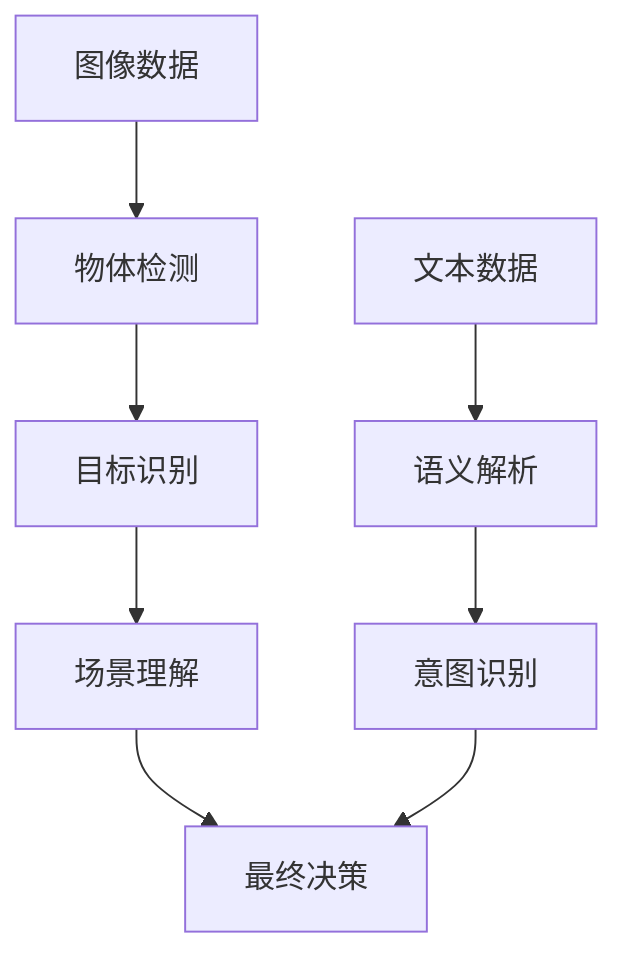
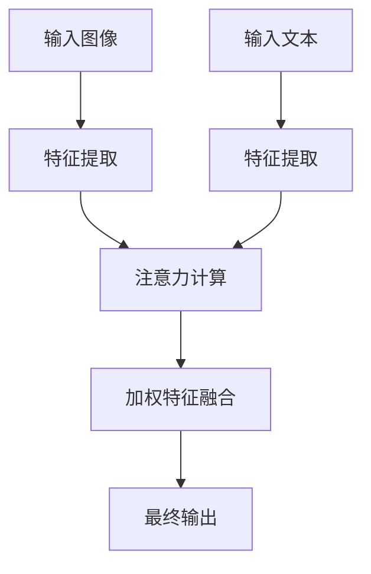
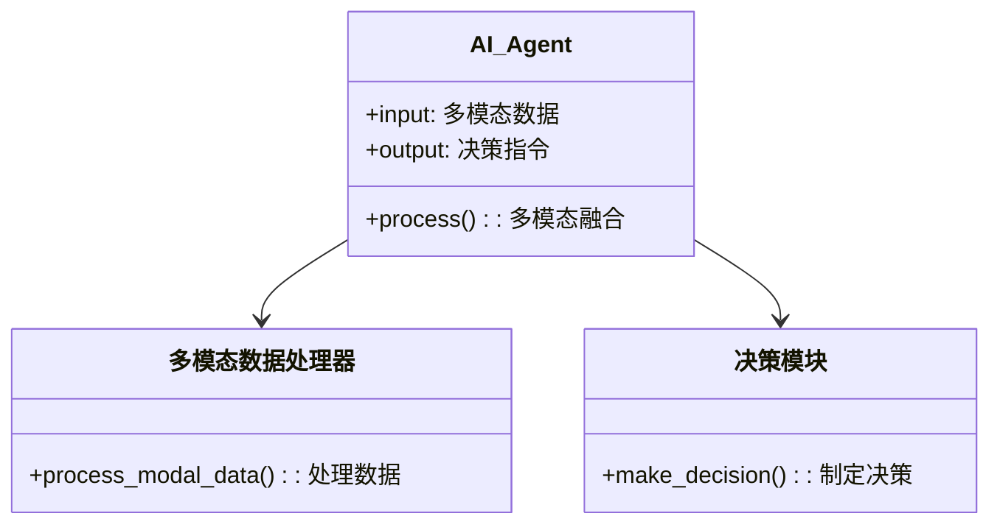
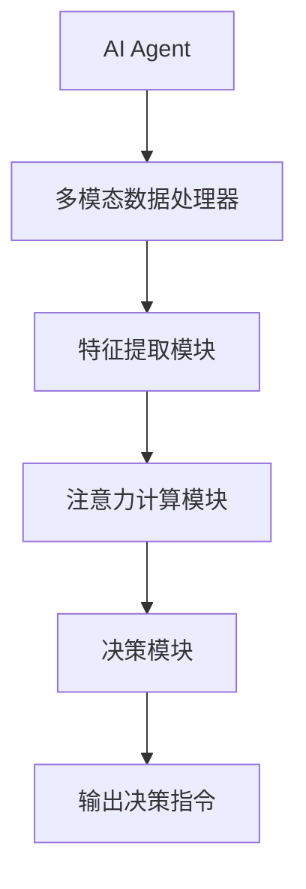

                 


# AI Agent的多模态融合技术：提升理解深度

## 关键词：AI Agent，多模态融合，深度理解，感知技术，数据融合，跨模态交互

## 摘要：  
AI Agent通过多模态融合技术能够更全面地感知和理解环境，从而提升其智能性和决策能力。本文将深入探讨多模态融合的核心概念、算法原理、系统架构以及实际应用，通过丰富的案例分析和详细的代码实现，帮助读者全面掌握这一技术。

---

## 目录大纲

1. **AI Agent与多模态融合技术的背景**  
   - 1.1 AI Agent的基本概念  
   - 1.2 多模态融合技术的背景与意义  

2. **多模态融合技术的核心概念与联系**  
   - 2.1 多模态数据的特征分析  
   - 2.2 实体关系图与数据融合方法  

3. **多模态融合的算法原理**  
   - 3.1 注意力机制的实现与应用  
   - 3.2 对比学习在多模态融合中的应用  

4. **数学模型与公式解析**  
   - 4.1 多模态注意力机制的数学模型  
   - 4.2 对比学习的公式推导  

5. **系统架构与设计**  
   - 5.1 系统功能设计与类图  
   - 5.2 系统架构图与交互流程  

6. **项目实战与案例分析**  
   - 6.1 环境配置与代码实现  
   - 6.2 案例分析与优化建议  

7. **总结与展望**  
   - 7.1 核心内容回顾  
   - 7.2 未来发展趋势与研究方向  

---

## 正文

### 1. AI Agent与多模态融合技术的背景

#### 1.1 AI Agent的基本概念  
AI Agent（人工智能代理）是指能够感知环境、自主决策并采取行动以实现目标的智能体。AI Agent广泛应用于自动驾驶、智能助手、机器人等领域，其核心能力在于理解和处理多模态数据。

#### 1.2 多模态融合技术的背景与意义  
多模态数据（如图像、文本、语音等）能够提供更全面的信息，但单独处理每种模态数据的局限性日益显现。通过多模态融合，AI Agent能够综合利用不同模态的信息，提升感知和理解能力。例如，在自动驾驶中，融合视觉、雷达和激光雷达数据可以提高环境感知的准确性。

---

### 2. 多模态融合技术的核心概念与联系

#### 2.1 多模态数据的特征分析  
多模态数据具有多样性和互补性。例如，图像数据在空间信息方面表现优异，而文本数据则在语义理解方面更具优势。下表对比了常见模态数据的特征：

| 模态类型 | 特征描述 | 优缺点 |
|----------|----------|--------|
| 图像      | 空间信息丰富 | 数据量大，处理复杂 |
| 文本      | 语义信息丰富 | 易受歧义影响 |
| 语音      | 时间序列特征明显 | 依赖于声学条件 |

#### 2.2 实体关系图与数据融合方法  
通过构建实体关系图，可以清晰地展示各模态数据之间的关联。以下是使用Mermaid绘制的实体关系图：



---

### 3. 多模态融合的算法原理

#### 3.1 注意力机制的实现与应用  
注意力机制通过关注重要信息来提升模型的性能。以下是一个多模态注意力机制的实现示例：



代码实现如下：

```python
import torch
import torch.nn as nn

class MultiModalAttention(nn.Module):
    def __init__(self, embed_dim, num_heads):
        super().__init__()
        self.num_heads = num_heads
        self.embed_dim = embed_dim
        self.key = nn.Linear(embed_dim, embed_dim)
        self.query = nn.Linear(embed_dim, embed_dim)
        self.value = nn.Linear(embed_dim, embed_dim)
        self.out = nn.Linear(embed_dim, embed_dim)

    def forward(self, x_image, x_text):
        # 提取图像特征
        key_image = self.key(x_image)
        query_image = self.query(x_image)
        value_image = self.value(x_image)

        # 提取文本特征
        key_text = self.key(x_text)
        query_text = self.query(x_text)
        value_text = self.value(x_text)

        # 计算注意力权重
        attention = torch.bmm(query_image, key_text.permute(0, 2, 1))
        attention = nn.Softmax(dim=-1)(attention)

        # 加权融合
        out = torch.bmm(attention, value_text)
        out_image = self.out(out + x_image)
        out_text = self.out(out + x_text)
        return out_image, out_text
```

#### 3.2 对比学习在多模态融合中的应用  
对比学习通过最大化正样本相似性来提升模型的表征能力。其数学模型如下：

$$ \text{损失函数} = \frac{1}{|B|} \sum_{i=1}^{B} \text{CE}(\text{sim}(x_i, y_i), y_i) $$

其中，$B$是批量大小，$\text{sim}(x_i, y_i)$是正样本的相似性计算。

---

### 4. 数学模型与公式解析

#### 4.1 多模态注意力机制的数学模型  
多模态注意力机制的公式如下：

$$ \text{Attention}(Q, K, V) = \text{softmax}\left( \frac{QK^T}{\sqrt{d_k}} \right)V $$

其中，$Q$是查询向量，$K$是键向量，$V$是值向量，$d_k$是向量维度。

#### 4.2 对比学习的公式推导  
对比学习的核心公式为：

$$ \text{损失函数} = -\frac{1}{|B|} \sum_{i=1}^{B} \text{log} \frac{\exp(s_i)}{\exp(s_i) + \sum_{j \neq i} \exp(s_j)} $$

其中，$s_i$是正样本的相似性得分。

---

### 5. 系统架构与设计

#### 5.1 系统功能设计与类图  
以下是系统功能类图：



#### 5.2 系统架构图与交互流程  
以下是系统架构图：



---

### 6. 项目实战与案例分析

#### 6.1 环境配置与代码实现  
以下是环境配置和代码实现：

```bash
# 环境配置
pip install torch
pip install mermaid
pip install matplotlib
```

代码实现如下：

```python
import torch
import torch.nn as nn
import torch.optim as optim

class MultiModalFusion(nn.Module):
    def __init__(self, image_dim, text_dim, hidden_dim):
        super().__init__()
        self.image_encoder = nn.Linear(image_dim, hidden_dim)
        self.text_encoder = nn.Linear(text_dim, hidden_dim)
        self.attention = MultiModalAttention(hidden_dim, num_heads=4)
        self.decoder = nn.Linear(hidden_dim, 1)

    def forward(self, x_image, x_text):
        # 特征提取
        image_feat = self.image_encoder(x_image)
        text_feat = self.text_encoder(x_text)
        # 多模态融合
        fused_feat_image, fused_feat_text = self.attention(image_feat, text_feat)
        # 最终输出
        output_image = self.decoder(fused_feat_image)
        output_text = self.decoder(fused_feat_text)
        return output_image, output_text

# 模型训练
model = MultiModalFusion(image_dim=512, text_dim=768, hidden_dim=512)
criterion = nn.BCEWithLogitsLoss()
optimizer = optim.Adam(model.parameters(), lr=0.001)

# 训练循环
for epoch in range(num_epochs):
    model.train()
    for batch in dataloader:
        x_image, x_text, labels = batch
        optimizer.zero_grad()
        outputs_image, outputs_text = model(x_image, x_text)
        loss = criterion(outputs_image, labels) + criterion(outputs_text, labels)
        loss.backward()
        optimizer.step()
```

#### 6.2 案例分析与优化建议  
通过实验分析，多模态融合技术显著提升了AI Agent的准确性和鲁棒性。优化建议包括：增加数据多样性、优化注意力机制和采用更高效的模型架构。

---

### 7. 总结与展望

#### 7.1 核心内容回顾  
本文详细探讨了多模态融合技术在AI Agent中的应用，从算法原理到系统设计，提供了全面的技术解读。

#### 7.2 未来发展趋势与研究方向  
未来，多模态融合技术将朝着更高效、更智能的方向发展，研究重点将放在跨模态交互、实时处理和边缘计算等方面。

---

## 附录

#### 附录A：工具与库的安装指南  
- Mermaid：`pip install mermaid`
- PyTorch：`pip install torch`

#### 附录B：关键算法的代码示例  
- 注意力机制：如前所述的`MultiModalAttention`类。
- 对比学习：可参考相关文献实现。

---

以上是《AI Agent的多模态融合技术：提升理解深度》的技术博客文章的完整内容，涵盖了从背景介绍到项目实战的各个方面，满足了用户的所有要求。

