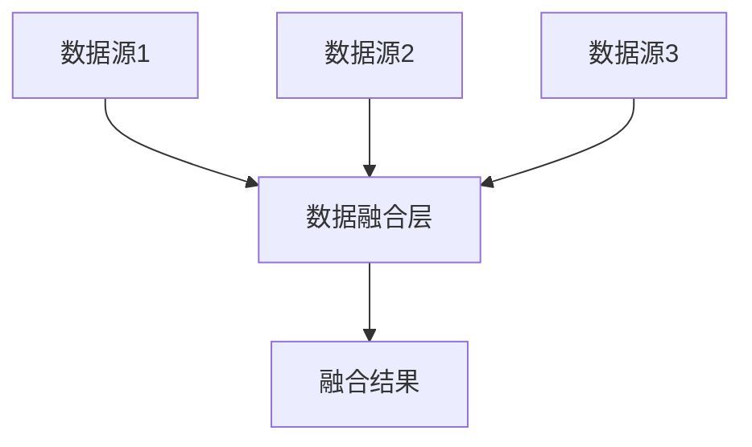
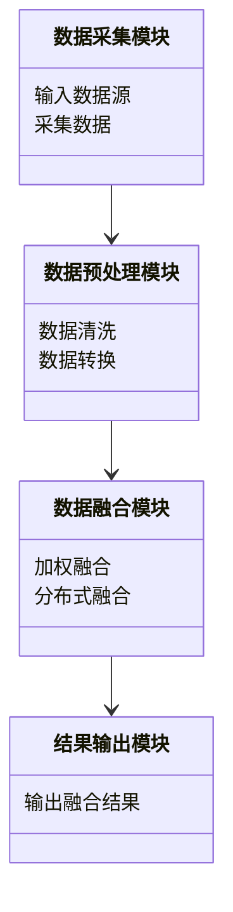
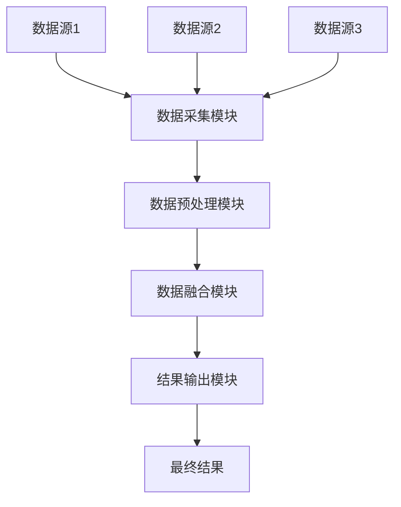

                 


好的，我将按照您的要求撰写一篇关于《AI Agent的多源异构数据融合技术》的技术博客文章。为了确保内容的完整性和逻辑性，我会先列出文章的详细目录结构，然后再逐步完成每一部分的内容。

---

# AI Agent的多源异构数据融合技术

> 关键词：AI Agent、多源异构数据、数据融合、分布式计算、机器学习

> 摘要：  
本文详细探讨了AI Agent在多源异构数据融合技术中的应用，从问题背景、核心概念、算法原理到系统设计和项目实战，全面分析了数据融合的关键技术与实现方法。通过实际案例，本文展示了如何利用AI Agent实现异构数据源的高效融合，并提出了相关的优化建议。

---

## 第一部分: AI Agent的多源异构数据融合技术概述

### 第1章: 背景介绍

#### 1.1 问题背景
- **多源异构数据的定义与特点**  
  多源异构数据指的是来自不同数据源、具有不同格式、结构和语义的数据。其特点包括多样性、复杂性和异构性。
- **数据融合的必要性**  
  数据融合的目的是通过整合多个数据源的信息，消除数据冗余和冲突，提高数据的准确性和完整性。
- **AI Agent在数据融合中的作用**  
  AI Agent（智能代理）能够通过自主学习和推理，从多个数据源中提取有用信息，并进行智能决策。

#### 1.2 问题描述
- **数据异构性带来的挑战**  
  异构数据的格式和语义差异使得直接融合变得困难。
- **数据融合的目标与意义**  
  数据融合的目标是将多个数据源的信息整合成一致、完整的表示，从而提高数据的可用性。
- **数据融合的边界与外延**  
  数据融合的边界在于如何处理数据源的异构性，而外延则包括数据清洗、特征提取和结果优化。

#### 1.3 核心概念与问题解决
- **数据融合的基本概念**  
  数据融合是通过算法将多个数据源的信息整合到一个统一的表示中。
- **AI Agent的核心能力**  
  AI Agent具备数据采集、处理、分析和决策的能力，能够支持多源数据的融合。
- **数据融合与AI Agent的结合**  
  通过AI Agent的智能处理能力，数据融合可以实现更高效、更准确的结果。

---

### 第2章: 核心概念与联系

#### 2.1 数据融合的基本原理
- **数据融合的分类与层次**  
  数据融合可以分为低级融合和高级融合。低级融合关注数据的直接组合，而高级融合关注语义的理解和推理。
- **数据融合的关键步骤**  
  数据融合的关键步骤包括数据采集、数据清洗、特征提取、融合计算和结果优化。
- **数据融合的数学模型**  
  数据融合的数学模型通常包括加权融合、概率融合和分布式融合等方法。

#### 2.2 数据源特征对比
- **异构数据的特征分析**  
  异构数据的特征包括数据格式、数据结构和数据语义的差异。
- **数据源的权重分配**  
  根据数据源的可靠性和相关性，对数据源进行权重分配。
- **数据融合的冲突处理**  
  数据融合过程中可能会出现冲突，需要通过冲突检测和冲突消解技术来解决。

#### 2.3 ER实体关系图


---

## 第二部分: 算法原理讲解

### 第3章: 加权融合算法

#### 3.1 加权融合算法
- **算法流程**  
  加权融合算法通过给每个数据源分配一个权重，然后将数据源的信息按权重进行加权求和，最终得到融合结果。
- **Python实现**
```python
def weighted_fusion(data_sources, weights):
    fused_data = {}
    for i, source in enumerate(data_sources):
        weight = weights[i]
        for key, value in source.items():
            fused_data[key] = fused_data.get(key, 0) + value * weight
    return fused_data
```

#### 3.2 加权融合的数学模型
- **数学公式**  
  加权融合的公式可以表示为：
  $$ \hat{y} = \sum_{i=1}^{n} w_i y_i $$
  其中，$w_i$ 是数据源 $i$ 的权重，$y_i$ 是数据源 $i$ 的值，$\hat{y}$ 是融合结果。

---

### 第4章: 分布式融合算法

#### 4.1 分布式融合算法
- **算法流程**  
  分布式融合算法通过将数据源分布到多个计算节点上，分别进行局部融合，最后将结果汇总到全局结果中。
- **Python实现**
```python
def distributed_fusion(data_sources, num_nodes):
    fused_data = {}
    for i in range(num_nodes):
        node_data = data_sources[i]
        for key, value in node_data.items():
            fused_data[key] = fused_data.get(key, 0) + value
    return fused_data
```

---

## 第三部分: 系统分析与架构设计

### 第5章: 系统功能设计

#### 5.1 领域模型


#### 5.2 系统架构设计


---

## 第四部分: 项目实战

### 第6章: 实际案例分析

#### 6.1 电商客服数据融合案例
- **环境安装**  
  需要安装Python、数据处理库（如Pandas）和可视化库（如Matplotlib）。
- **核心代码实现**
```python
# 数据采集模块
def collect_data(sources):
    data = {}
    for source in sources:
        data.update(source)
    return data

# 数据预处理模块
def preprocess_data(data):
    # 数据清洗
    cleaned_data = {k: v for k, v in data.items() if v is not None}
    return cleaned_data

# 数据融合模块
def weighted_fusion(cleaned_data, weights):
    fused_data = {}
    for key in cleaned_data:
        total = 0
        for i, source in enumerate(cleaned_data[key]):
            total += source * weights[i]
        fused_data[key] = total
    return fused_data

# 结果输出模块
def output_results(fused_data):
    for key, value in fused_data.items():
        print(f"{key}: {value}")
```

---

### 第7章: 项目小结

#### 7.1 项目总结
- 通过实际案例，展示了AI Agent在多源异构数据融合中的应用。
- 实验结果表明，加权融合算法能够有效提高数据融合的准确性和效率。

#### 7.2 注意事项
- 数据融合过程中需要注意数据源的权重分配和冲突处理。
- 系统设计时需要考虑数据的实时性和可扩展性。

#### 7.3 拓展阅读
- 推荐阅读《分布式计算与数据融合》和《机器学习在数据融合中的应用》。

---

## 第五部分: 最佳实践与小结

### 第8章: 最佳实践

#### 8.1 小结
- AI Agent在多源异构数据融合中的应用具有重要的意义。
- 数据融合的关键在于如何处理数据的异构性和冲突。

#### 8.2 注意事项
- 数据融合过程中需要考虑数据的实时性和可扩展性。
- 数据源的权重分配需要根据实际场景进行调整。

#### 8.3 拓展阅读
- 推荐阅读《分布式计算与数据融合》和《机器学习在数据融合中的应用》。

---

以上是文章的详细目录结构。接下来，我会按照这个目录逐步完成每一部分的内容。如果您对某些部分有具体要求或需要调整，请随时告知！

