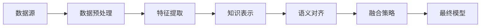
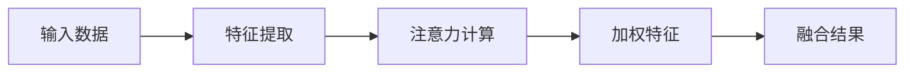

                 

# AI Agent的多源知识融合学习技术

> 关键词：AI Agent, 多源知识融合, 知识表示, 融合策略, 系统架构

> 摘要：本文将详细探讨AI Agent的多源知识融合学习技术，从核心概念、算法原理、系统架构到实际应用案例，全面解析多源知识融合学习的实现方法和应用场景。通过本文的学习，读者将能够理解AI Agent如何通过多源知识融合提升智能决策能力。

---

## 第一部分: AI Agent的多源知识融合学习技术概述

### 第1章: AI Agent与多源知识融合学习概述

#### 1.1 AI Agent的基本概念
##### 1.1.1 AI Agent的定义与特点
AI Agent（人工智能代理）是指能够感知环境、自主决策并执行任务的智能体。其特点包括自主性、反应性、目标导向和社会能力。AI Agent通过感知环境信息，利用知识库和推理能力，做出最优决策。

##### 1.1.2 AI Agent的核心功能与应用场景
AI Agent的核心功能包括信息处理、知识表示、推理决策和自主学习。应用场景广泛，如智能助手、推荐系统、自动驾驶、智能客服等。

##### 1.1.3 多源知识融合学习的必要性
在实际应用中，AI Agent需要处理来自多种来源、异构性高的数据。多源知识融合学习能够有效整合这些数据，提升AI Agent的理解能力和决策水平。

#### 1.2 多源知识融合学习的背景与问题
##### 1.2.1 多源数据的定义与特点
多源数据指的是来自不同来源、形式多样化的数据，具有异构性、分布性和冗余性。例如，文本数据、图像数据、结构化数据等。

##### 1.2.2 知识融合的挑战与意义
知识融合的挑战包括数据异构性处理、语义对齐和融合策略选择。意义在于提升AI Agent的智能水平，增强其在复杂场景下的决策能力。

##### 1.2.3 多源知识融合学习的边界与外延
多源知识融合学习的边界在于数据源的数量和质量，外延则包括数据预处理、特征提取和融合推理等步骤。

#### 1.3 多源知识融合学习的核心要素
##### 1.3.1 数据异构性处理
数据异构性处理是指将来自不同来源的数据进行标准化和统一化处理，确保数据的一致性。

##### 1.3.2 知识表示与语义对齐
知识表示是将数据转化为可计算的形式，语义对齐则是确保不同数据源之间的语义一致性。

##### 1.3.3 融合策略与优化方法
融合策略包括加权融合、规则融合和学习融合。优化方法则是通过机器学习算法提升融合效果。

---

### 第2章: 多源知识融合学习的核心概念与联系

#### 2.1 多源知识融合学习的原理
##### 2.1.1 数据异构性处理的步骤
数据异构性处理的步骤包括数据清洗、数据转换和数据集成。

##### 2.1.2 知识表示与语义对齐的实现
知识表示可以通过向量空间模型或图结构模型实现，语义对齐则通过相似度计算或对齐算法实现。

##### 2.1.3 融合策略与优化方法的选择
融合策略的选择取决于数据源的特点和应用场景，优化方法可以通过交叉验证和超参数调优实现。

#### 2.2 多源知识融合学习的概念对比
##### 2.2.1 单源学习与多源学习的对比
单源学习仅利用单一数据源，多源学习则整合多个数据源的信息。

##### 2.2.2 知识融合与数据融合的对比
知识融合关注语义层面的整合，数据融合关注数据层面的整合。

##### 2.2.3 融合策略与模型选择的对比
融合策略关注如何整合数据，模型选择关注如何表示和学习数据。

#### 2.3 多源知识融合学习的ER实体关系图

---

### 第3章: 多源知识融合学习的算法原理

#### 3.1 多源注意力机制
##### 3.1.1 注意力机制的基本原理
注意力机制是一种基于权重分配的机制，用于关注输入数据中重要的部分。

##### 3.1.2 多源注意力机制的改进
多源注意力机制通过引入多源信息，提升模型对多源数据的适应能力。

##### 3.1.3 多源注意力机制的实现步骤

#### 3.2 多源知识融合网络
##### 3.2.1 网络结构的设计
多源知识融合网络由特征提取层、注意力层和融合层组成。

##### 3.2.2 网络训练的步骤
网络训练包括数据预处理、模型初始化、前向传播、损失计算和反向传播。

##### 3.2.3 网络优化的策略
网络优化通过调整学习率、选择优化算法和防止过拟合等策略实现。

#### 3.3 多源知识融合学习的数学模型
##### 3.3.1 注意力机制的数学公式
$$ attention(i,j) = \frac{exp(q_i^T k_j)}{\sum_{k} exp(q_i^T k_j)} $$
其中，\( q_i \) 是查询向量，\( k_j \) 是键向量。

##### 3.3.2 融合策略的数学公式
$$ y = \sum_{i=1}^{n} \alpha_i x_i $$
其中，\( \alpha_i \) 是数据源 \( i \) 的权重，\( x_i \) 是数据源 \( i \) 的特征。

---

## 第4章: 多源知识融合学习的系统分析与架构设计

### 4.1 系统功能设计
#### 4.1.1 数据预处理模块
数据预处理包括数据清洗、数据转换和数据集成。

#### 4.1.2 特征提取模块
特征提取通过向量空间模型或图结构模型实现。

#### 4.1.3 知识表示模块
知识表示包括语义嵌入和符号表示。

#### 4.1.4 融合推理模块
融合推理通过多源注意力机制和融合网络实现。

### 4.2 系统架构设计
#### 4.2.1 分层架构
系统架构分为数据层、特征层、表示层和融合层。

#### 4.2.2 微服务架构
系统采用微服务架构，实现模块化设计和分布式部署。

#### 4.2.3 组件交互设计
组件交互包括数据预处理、特征提取、知识表示和融合推理。

---

## 第5章: 多源知识融合学习的项目实战

### 5.1 项目背景与目标
#### 5.1.1 项目背景
以电商推荐系统为例，展示多源知识融合学习的应用场景。

#### 5.1.2 项目目标
通过多源知识融合学习，提升推荐系统的准确性和用户体验。

### 5.2 项目实现
#### 5.2.1 环境配置
安装Python、TensorFlow和Keras等工具。

#### 5.2.2 数据预处理
编写数据清洗和数据转换的代码。

#### 5.2.3 模型训练
实现多源注意力机制和融合网络的训练过程。

#### 5.2.4 模型预测
利用训练好的模型进行推荐预测。

#### 5.2.5 结果分析
分析预测结果，评估模型性能。

### 5.3 项目总结
#### 5.3.1 实验结果
展示实验结果，包括准确率、召回率和F1值。

#### 5.3.2 项目经验
总结项目实施过程中的经验教训。

#### 5.3.3 优化建议
提出进一步优化的建议，如引入更复杂的融合策略或优化模型结构。

---

## 第6章: 总结与展望

### 6.1 全文总结
回顾本文的核心内容，总结多源知识融合学习的技术要点和实现方法。

### 6.2 技术展望
展望未来的研究方向，包括更高效的融合策略、更强大的模型结构和更广泛的应用场景。

### 6.3 注意事项
提醒读者在实际应用中注意数据隐私、模型泛化能力和计算资源消耗等问题。

### 6.4 拓展阅读
推荐相关领域的书籍和论文，供读者进一步学习和研究。

---

通过本文的学习，读者将能够深入了解AI Agent的多源知识融合学习技术，掌握其核心概念、算法原理和系统架构，并能够将其应用于实际项目中。希望本文能够为相关领域的研究和实践提供有价值的参考。

