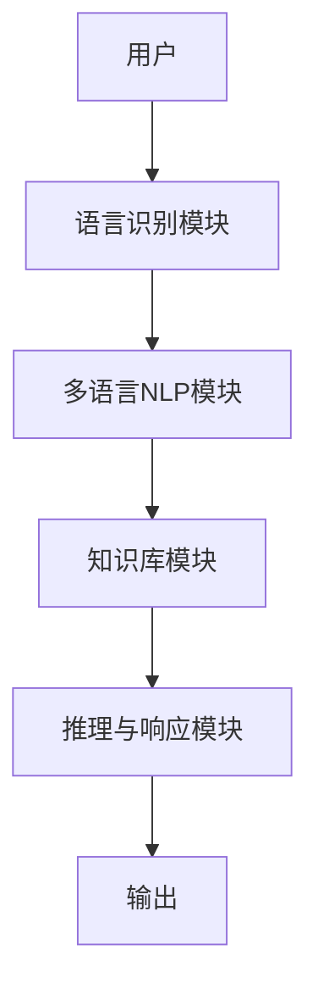

                 


# AI Agent的多语言支持：跨国企业应用策略

## 关键词
AI Agent, 多语言支持, 自然语言处理, 跨国企业, 应用策略

## 摘要
随着全球化的发展，跨国企业对AI Agent的多语言支持需求日益增加。本文详细探讨了AI Agent在多语言环境中的应用策略，包括技术实现、系统架构设计、项目实战和最佳实践。通过分析自然语言处理技术，多语言模型训练，以及系统架构优化，本文为跨国企业提供了有效的解决方案。

---

# AI Agent的多语言支持：跨国企业应用策略

## 第一部分：背景与挑战

### 第1章：AI Agent的核心概念与多语言支持的重要性

#### 1.1 AI Agent的定义与特点
AI Agent（人工智能代理）是一种能够感知环境、自主决策并执行任务的智能实体。它通过自然语言处理（NLP）、机器学习（ML）和大数据分析等技术，为用户提供智能化服务。AI Agent的特点包括：
- **自主性**：能够独立决策。
- **反应性**：能实时响应用户需求。
- **学习能力**：能通过数据优化自身性能。

#### 1.2 多语言支持的背景与挑战
跨国企业在全球范围内运营，需要与不同语言背景的客户、员工和合作伙伴进行交互。AI Agent的多语言支持能力直接影响用户体验和业务效率。以下是多语言支持的主要挑战：
- **语言多样性**：全球范围内有数千种语言，支持所有语言技术上难度大。
- **文化差异**：不同语言背后有不同的文化背景，影响交互方式。
- **技术复杂性**：多语言模型的训练和优化需要大量计算资源。

#### 1.3 跨国企业的具体需求
跨国企业对AI Agent的多语言支持需求包括：
- **客户支持**：提供多语言的客服咨询。
- **内部协作**：支持跨国团队的多语言沟通。
- **市场营销**：多语言内容生成与分发。

---

## 第二部分：AI Agent的多语言支持技术实现

### 第2章：自然语言处理（NLP）技术与多语言模型

#### 2.1 多语言NLP的核心技术
多语言NLP通过训练模型理解多种语言，主要技术包括：
- **预训练模型**：使用如BERT、GPT等预训练模型，进行多语言微调。
- **语言识别**：自动识别输入语言并切换模型。

#### 2.2 多语言模型训练与优化
训练多语言模型需要：
1. **数据收集**：收集多语言数据，确保数据平衡。
2. **模型微调**：在预训练模型基础上，针对特定语言进行微调。
3. **跨语言迁移学习**：利用一种语言的信息来提升其他语言的性能。

#### 2.3 多语言模型的性能优化
通过以下方法优化模型：
- **数据增强**：增加训练数据的多样性。
- **模型压缩**：减少模型大小，提升推理速度。
- **分布式训练**：利用多GPU并行计算加速训练。

### 第3章：AI Agent的系统架构与设计

#### 3.1 系统功能模块划分
AI Agent的系统架构主要由以下模块组成：
- **语言识别模块**：识别输入语言。
- **多语言NLP模块**：处理多种语言的文本。
- **知识库模块**：存储多语言知识。
- **推理与响应模块**：生成多语言的响应。

#### 3.2 系统架构图
以下是一个AI Agent系统架构的Mermaid图：



#### 3.3 接口设计
系统接口设计需要考虑：
- **API接口**：提供RESTful API，支持多种语言请求。
- **数据格式**：统一JSON格式，便于解析。

---

## 第三部分：AI Agent的多语言支持项目实战

### 第4章：项目实战：设计一个支持多语言的AI Agent系统

#### 4.1 项目环境与工具安装
- **编程语言**：Python 3.8+
- **框架**：使用spaCy进行NLP处理。
- **深度学习库**：TensorFlow或PyTorch。

#### 4.2 核心代码实现
以下是AI Agent的多语言NLP模块的实现示例：

```python
import spacy

# 加载多语言模型
nlp = spacy.load("multi语言模型名称")

def detect_language(text):
    doc = nlp(text)
    return doc.lang_

def translate_and_process(text, target_lang):
    doc = nlp(text)
    translated = str(doc.translate(target_lang))
    return translated
```

#### 4.3 项目功能测试
测试内容包括：
- **语言识别测试**：测试模型能否正确识别多种语言。
- **翻译与处理测试**：测试多语言文本的处理能力。
- **系统性能测试**：测试在高并发情况下的响应速度。

#### 4.4 实际案例分析
案例分析：
- **应用场景**：跨国企业客户支持。
- **实施效果**：减少了人工客服的工作量，提升了客户满意度。

---

## 第四部分：最佳实践与总结

### 第5章：AI Agent多语言支持的优化策略

#### 5.1 技术选型建议
- **选择适合的多语言模型**：根据需求选择开源模型或商业模型。
- **优化模型性能**：通过数据增强和模型压缩提升性能。

#### 5.2 系统安全与稳定性
- **数据安全**：确保用户数据的隐私和安全。
- **系统容错设计**：设计容错机制，防止系统崩溃。

#### 5.3 未来发展趋势
- **多模态AI Agent**：结合视觉和语言信息，提供更智能的服务。
- **边缘计算应用**：在边缘设备上部署AI Agent，提升响应速度。

### 第6章：小结与注意事项

#### 6.1 小结
本文详细探讨了AI Agent在多语言环境中的应用策略，从技术实现到系统设计，再到项目实战，为跨国企业提供了系统的解决方案。

#### 6.2 注意事项
- **数据质量**：确保训练数据的多样性和准确性。
- **模型更新**：定期更新模型，保持其性能。
- **用户反馈**：收集用户反馈，不断优化系统。

---

## 附录
### 附录A：相关工具与库
- **spaCy**：用于NLP处理。
- **Transformers**：用于多语言模型训练。

### 附录B：术语表
- **NLP**：Natural Language Processing，自然语言处理。
- **AI Agent**：人工智能代理。

---

通过本文的系统介绍，读者可以全面了解AI Agent的多语言支持技术，并将其应用到跨国企业的实际场景中，提升企业的智能化水平和竞争力。

