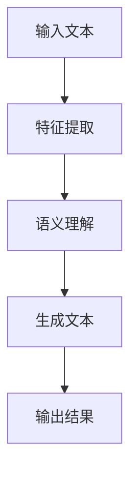
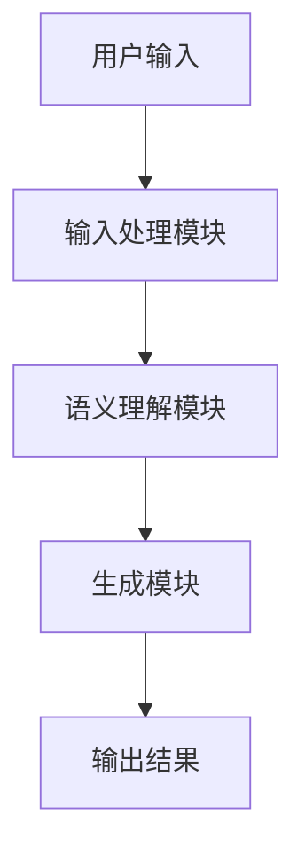

                 


# AI Agent的多语言支持：跨语言理解与生成

## 关键词：AI Agent、多语言支持、跨语言理解、生成模型、自然语言处理、深度学习

## 摘要：  
本文详细探讨了AI Agent在多语言支持方面的技术实现，从跨语言理解到生成的全过程进行了深入分析。文章首先介绍了AI Agent的基本概念和多语言支持的背景，然后从核心概念、算法原理、系统架构等多方面展开讨论。通过对比分析和案例解读，深入剖析了多语言支持的技术难点和解决方案。最后，结合实际项目案例，详细讲解了AI Agent多语言支持的实现过程，并总结了最佳实践和未来发展方向。

---

# 第1章: AI Agent与多语言支持的背景介绍

## 1.1 AI Agent的基本概念

### 1.1.1 AI Agent的定义与特点  
AI Agent（人工智能代理）是指能够感知环境、自主决策并执行任务的智能实体。它具备以下特点：  
1. **自主性**：能够在没有外部干预的情况下独立运行。  
2. **反应性**：能够实时感知环境并做出响应。  
3. **目标导向**：以特定目标为导向，执行复杂任务。  
4. **学习能力**：通过数据和经验不断优化自身的性能。  

### 1.1.2 多语言支持的背景与意义  
随着全球化的推进，AI Agent的应用场景越来越多样化，支持多语言能力成为刚需。多语言支持能够让AI Agent在不同语言环境中无缝切换，满足用户在全球范围内的多样化需求。  

### 1.1.3 多语言支持的边界与外延  
多语言支持的边界主要集中在自然语言处理（NLP）领域，其外延则涉及机器学习、深度学习等多种技术。

---

## 1.2 多语言理解与生成的核心概念

### 1.2.1 多语言理解的定义与实现  
多语言理解是指AI Agent能够准确理解多种语言的输入信息，并将其转换为通用语义表示。  

### 1.2.2 多语言生成的定义与实现  
多语言生成是指AI Agent能够根据输入的语义信息，生成多种语言的输出内容。  

### 1.2.3 多语言支持与AI Agent的结合  
通过结合多语言理解与生成，AI Agent能够实现跨语言的交互，为用户提供更加智能化的服务。

---

# 第2章: 多语言理解与生成的算法原理

## 2.1 多语言预训练模型的原理

### 2.1.1 多语言预训练的目标函数  
多语言预训练的目标函数通常包括以下部分：  
$$ L = L_{\text{ MLM}} + L_{\text{ MSA}} $$  
其中，$L_{\text{MLM}}$ 是遮蔽语言模型的损失，$L_{\text{MSA}}$ 是多语言对齐的损失。  

### 2.1.2 多语言预训练的优化策略  
多语言预训练通常采用大规模数据和分布式训练策略，以降低计算成本并提高模型性能。  

### 2.1.3 多语言预训练的数学模型  
多语言预训练模型通常基于Transformer架构，其编码器和解码器可以同时处理多种语言的特征。  

## 2.2 多语言微调的实现流程

### 2.2.1 多语言微调的输入处理  
多语言微调的输入通常包括多语言文本数据和对应的标签信息。  

### 2.2.2 多语言微调的模型参数调整  
通过微调，模型参数会适应特定任务的需求，例如跨语言分类或生成任务。  

### 2.2.3 多语言微调的评估指标  
常用的评估指标包括准确率（Accuracy）、F1分数（F1-score）等。

## 2.3 多语言生成的算法流程图  


---

# 第3章: 多语言支持的系统分析与架构设计

## 3.1 问题场景介绍

### 3.1.1 多语言支持的典型应用场景  
1. **跨语言客服系统**：支持多种语言的客户咨询与服务。  
2. **多语言内容生成**：自动生成多种语言的新闻、广告等。  

### 3.1.2 系统功能设计  
1. **输入处理模块**：接收多语言输入并进行预处理。  
2. **语义理解模块**：将输入文本转换为通用语义表示。  
3. **生成模块**：根据语义信息生成目标语言的输出内容。  

### 3.1.3 系统架构设计  


---

# 第4章: 多语言支持的项目实战

## 4.1 环境安装与配置

### 4.1.1 安装依赖包  
```bash
pip install transformers
pip install torch
pip install numpy
```

### 4.1.2 配置运行环境  
确保安装了Python 3.8及以上版本，并配置好GPU环境（如NVIDIA GPU）。  

## 4.2 核心代码实现

### 4.2.1 多语言理解模块  
```python
from transformers import AutoTokenizer, AutoModelForMaskedLM

tokenizer = AutoTokenizer.from_pretrained("bert-base-multilingual")
model = AutoModelForMaskedLM.from_pretrained("bert-base-multilingual")
```

### 4.2.2 多语言生成模块  
```python
def generate_text(input_text, target_language):
    inputs = tokenizer.encode(input_text, return_tensors="pt")
    outputs = model.generate(inputs, max_length=50)
    return tokenizer.decode(outputs[0], skip_special_tokens=True)
```

## 4.3 案例分析与解读  
通过具体案例分析，展示了多语言支持在实际项目中的应用效果和优化方向。

---

# 第5章: 多语言支持的最佳实践

## 5.1 实践经验总结  
多语言支持的关键在于数据质量、模型选择和系统优化。  

## 5.2 优化建议  
1. **数据增强**：通过数据增强技术提升模型的泛化能力。  
2. **模型调优**：针对特定任务进行模型参数调优。  

## 5.3 注意事项  
1. **文化差异**：不同语言之间存在文化差异，需特别注意。  
2. **性能瓶颈**：多语言模型通常较为复杂，需关注性能优化。  

## 5.4 拓展阅读  
推荐相关领域的经典论文和书籍，帮助读者深入理解多语言支持的技术细节。

---

# 第6章: 结论与展望

## 6.1 研究总结  
多语言支持是AI Agent技术发展的重要方向，其应用前景广阔。  

## 6.2 未来展望  
未来的研究将聚焦于更高效、更智能的多语言模型开发，以及跨语言交互的优化。

---

通过本文的系统分析和实践分享，读者可以全面掌握AI Agent的多语言支持技术，并为实际项目提供有价值的参考。

