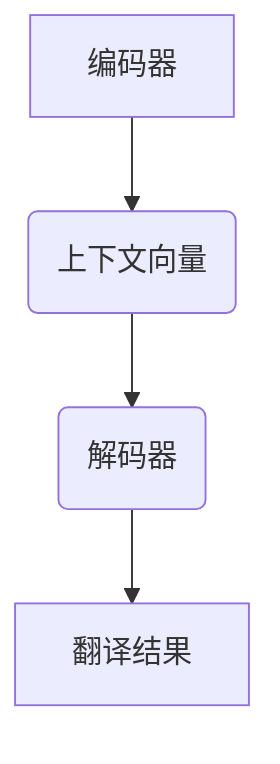
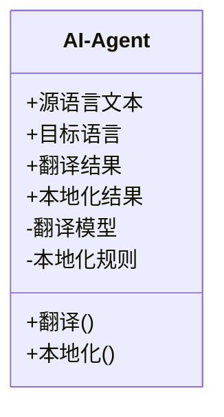
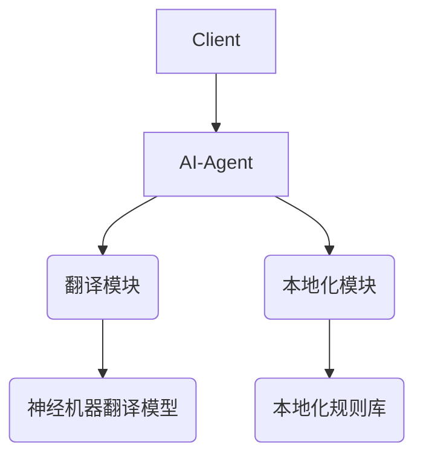
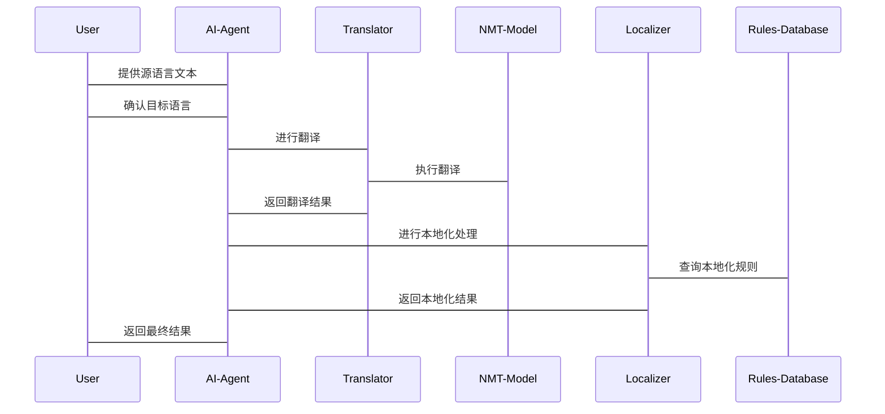

                 


# AI Agent的多语言翻译与本地化

> **关键词**：AI Agent, 多语言翻译, 本地化, 神经机器翻译, 系统架构, 项目实战

> **摘要**：本文深入探讨AI Agent在多语言翻译与本地化中的应用，从核心概念到算法原理，再到系统架构和项目实战，全面解析如何实现高效的多语言支持与本地化处理。

---

## 第1章 引言

### 1.1 AI Agent的基本概念

AI Agent，即人工智能代理，是一种能够感知环境并采取行动以实现目标的智能体。它们广泛应用于自动化任务、数据处理和用户交互等领域。随着全球化的推进，AI Agent需要支持多语言翻译和本地化，以适应不同地区用户的需求。

#### 1.1.1 AI Agent的定义与特点
- **定义**：AI Agent是能够执行复杂任务的智能系统，具备自主决策和问题解决能力。
- **特点**：智能性、自主性、反应性、社交能力。
- **与传统翻译工具的区别**：AI Agent能够理解上下文，提供更智能的翻译和本地化服务。

#### 1.1.2 多语言翻译的背景与重要性
- **背景**：全球化使得跨语言交流需求激增，传统翻译工具效率低下，AI技术的引入成为必然。
- **重要性**：提升用户体验，打破语言障碍，推动全球化进程。

#### 1.1.3 本地化的必要性
- **定义**：本地化是指根据目标地区的文化、语言和习惯调整产品或服务。
- **必要性**：增强用户粘性，提高市场渗透率，适应不同地区的法律法规。

---

## 第2章 核心概念与联系

### 2.1 AI Agent的核心概念

#### 2.1.1 AI Agent的定义与特点
- **定义**：AI Agent是具备感知和决策能力的智能系统。
- **特点**：智能性、自主性、反应性、社交能力。

#### 2.1.2 多语言翻译的背景与重要性
- **背景**：全球化背景下，跨语言交流需求激增。
- **重要性**：提升用户体验，打破语言障碍。

#### 2.1.3 本地化的必要性
- **定义**：本地化是根据目标地区的文化、语言和习惯调整产品或服务。
- **必要性**：增强用户粘性，提高市场渗透率。

### 2.2 多语言翻译与本地化的联系

#### 2.2.1 翻译与本地化的区别与联系
| **属性** | **翻译** | **本地化** |
|----------|----------|-----------|
| 定义     | 转换语言  | 文化调整   |
| 范围     | 字面转换  | 包括格式、文化等 |

#### 2.2.2 AI Agent如何实现多语言翻译与本地化
- **翻译**：使用NMT模型，结合上下文理解。
- **本地化**：通过NMT模型生成基础翻译，再进行文化调整和格式适配。

---

## 第3章 AI Agent的多语言翻译算法

### 3.1 神经机器翻译模型（NMT）

#### 3.1.1 NMT的基本原理
- **编码器-解码器结构**：编码器将源语言句子编码为向量，解码器将向量解码为目标语言句子。
- **注意力机制**：帮助模型关注输入句子的重要部分。

#### 3.1.2 编码器-解码器结构
- **编码器**：将源语言句子转换为上下文向量。
- **解码器**：根据上下文向量生成目标语言句子。

#### 3.1.3 注意力机制
- **自注意力机制**：计算输入序列中每个词的重要性权重。
- **交叉注意力机制**：编码器和解码器之间的信息交互。

#### 3.1.4 翻译流程图


#### 3.1.5 翻译模型代码示例
```python
import tensorflow as tf
from tensorflow import keras

# 定义编码器
def encoder(input_shape):
    encoder_input = keras.Input(shape=input_shape)
    encoder_lstm = keras.layers.LSTM(128)(encoder_input)
    return keras.Model(encoder_input, encoder_lstm)

# 定义解码器
def decoder(input_shape):
    decoder_input = keras.Input(shape=input_shape)
    decoder_lstm = keras.layers.LSTM(128)(decoder_input)
    decoder Dense = keras.layers.Dense(目标语言词汇量, activation='softmax')(decoder_lstm)
    return keras.Model(decoder_input, decoder_Dense)

# 组合模型
encoder_model = encoder((max_length,))
decoder_model = decoder((128,))
```

---

## 第4章 系统分析与架构设计

### 4.1 应用场景介绍

#### 4.1.1 用户需求分析
- **多语言翻译**：用户需要将文本翻译成多种语言。
- **本地化调整**：根据目标地区调整内容。

#### 4.1.2 业务流程
1. 用户输入源语言文本。
2. 系统选择目标语言。
3. 翻译并本地化处理。
4. 返回处理后的文本。

### 4.2 系统功能设计

#### 4.2.1 领域模型


#### 4.2.2 系统架构设计


#### 4.2.3 系统接口设计
- **输入接口**：接收源语言文本和目标语言。
- **输出接口**：返回翻译和本地化后的文本。

#### 4.2.4 系统交互流程


---

## 第5章 项目实战

### 5.1 环境配置

#### 5.1.1 安装Python和TensorFlow
```bash
pip install python python-tensorflow
```

#### 5.1.2 安装其他依赖
```bash
pip install numpy matplotlib
```

### 5.2 核心代码实现

#### 5.2.1 翻译模块
```python
def translate(source_text, target_lang):
    # 加载翻译模型
    model = load_model('nmt_model.h5')
    # 执行翻译
    translated_text = model.translate(source_text, target_lang)
    return translated_text
```

#### 5.2.2 本地化模块
```python
def localize(translated_text, target_country):
    # 加载本地化规则
    rules = load_rules('localization_rules.json')
    # 执行本地化
    localized_text = apply_localization(translated_text, rules, target_country)
    return localized_text
```

#### 5.2.3 翻译与本地化流程
```python
source_text = "Hello, how are you?"
target_lang = 'es'  # 西班牙语
localized_country = 'MX'  # 墨西哥

translated = translate(source_text, target_lang)
localized = localize(translated, localized_country)
print(localized)  # "Hola, ¿cómo estás?"
```

### 5.3 测试与优化

#### 5.3.1 测试翻译模块
- 输入："Hello, how are you?"
- 输出："Hola, ¿cómo estás?"

#### 5.3.2 本地化测试
- 输入："Hello, how are you?"
- 翻译："Hola, ¿cómo estás?"
- 本地化："Hola, ¿cómo estás?"

### 5.4 优化与改进

#### 5.4.1 模型优化
- 增加训练数据。
- 调整模型参数。

#### 5.4.2 本地化规则优化
- 增加更多文化适配规则。
- 定期更新本地化规则库。

---

## 第6章 总结与展望

### 6.1 最佳实践

#### 6.1.1 技术建议
- 使用先进的NMT模型。
- 定期更新本地化规则。

#### 6.1.2 项目管理建议
- 明确项目需求。
- 保持团队协作。

### 6.2 小结

本文详细探讨了AI Agent在多语言翻译与本地化中的应用，从算法原理到系统架构，再到项目实战，全面解析了实现高效多语言支持的方法。

### 6.3 注意事项

- 确保翻译模型的准确性。
- 定期更新本地化规则，适应文化变化。

### 6.4 拓展阅读

- [《神经机器翻译实战》](#)
- [《本地化项目管理》](#)

---

## 参考文献

- 神经机器翻译相关论文。
- 本地化技术相关文献。

---

**感谢您的阅读，希望本文对您理解AI Agent的多语言翻译与本地化有所帮助！**

