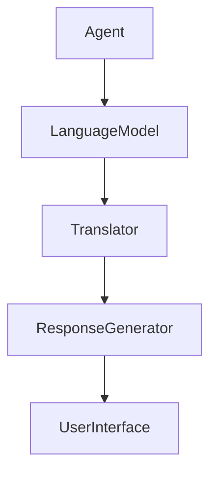

                 


# AI Agent的多语言翻译能力：突破语言障碍

## 关键词：AI Agent, 多语言翻译, 语言模型, 翻译算法, 系统架构设计, 项目实战, 最佳实践

## 摘要：AI Agent的多语言翻译能力是实现跨语言交流的重要技术，本文从背景、核心概念、算法原理、系统架构设计、项目实战和最佳实践等多方面进行详细分析，深入探讨如何突破语言障碍，提升AI Agent的多语言翻译能力。

---

## 第一部分: AI Agent的多语言翻译能力概述

### 第1章: AI Agent与多语言翻译能力的背景介绍

#### 1.1 问题背景与描述

##### 1.1.1 当前AI Agent的发展现状

AI Agent（人工智能代理）是一种能够感知环境、自主决策并执行任务的智能体。近年来，随着深度学习和自然语言处理技术的快速发展，AI Agent在各个领域得到了广泛应用，例如智能客服、智能助手、自动驾驶等。然而，AI Agent的核心能力之一是与人类用户的交互能力，而语言是人类交流的核心工具。在多语言环境下，AI Agent需要能够理解并生成多种语言的自然语言文本，以满足全球用户的多样化需求。

##### 1.1.2 多语言翻译能力的重要性

在国际化和全球化背景下，AI Agent需要能够支持多种语言的翻译能力，以实现跨语言的交流。多语言翻译能力不仅是AI Agent的核心功能之一，也是提升用户体验的关键因素。例如，一个AI Agent可能需要在不同语言的用户之间充当翻译的角色，或者在处理多语言文档时进行翻译和理解。

##### 1.1.3 语言障碍对AI Agent的挑战

语言障碍是AI Agent在跨语言交流中面临的主要挑战之一。传统的翻译工具和语言模型通常只能处理单一语言或少数几种语言，且翻译效果有限。AI Agent需要具备实时翻译、多语言理解与生成、语言模型的切换与优化等能力，以应对复杂的多语言环境。

#### 1.2 问题解决与边界

##### 1.2.1 多语言翻译能力的核心目标

多语言翻译能力的核心目标是使AI Agent能够理解并生成多种语言的自然语言文本，并在不同语言之间进行实时翻译，同时保持语义的准确性和表达的流畅性。

##### 1.2.2 AI Agent的边界与外延

AI Agent的多语言翻译能力的边界主要体现在以下几个方面：
- **输入输出范围**：AI Agent能够处理的语言类型和文本长度。
- **翻译精度**：AI Agent在翻译过程中能够达到的准确率和语义理解能力。
- **性能限制**：AI Agent在处理多语言翻译任务时的响应时间和资源消耗。

AI Agent的多语言翻译能力的外延包括以下几个方面：
- **语言模型的扩展**：支持更多语言的翻译和生成。
- **语义理解的增强**：通过上下文理解更复杂的语义关系。
- **多模态交互**：结合图像、语音等多种模态信息进行翻译和交互。

##### 1.2.3 多语言翻译能力的实现路径

实现AI Agent的多语言翻译能力需要从以下几个方面入手：
1. **多语言语言模型的构建**：训练支持多种语言的大型语言模型。
2. **跨语言理解与生成技术**：研究如何在不同语言之间实现准确的翻译和生成。
3. **语言切换与优化**：优化AI Agent在不同语言之间的切换和适应能力。
4. **性能优化**：提升AI Agent在多语言翻译任务中的响应速度和资源利用率。

---

### 第2章: AI Agent多语言翻译能力的核心概念

#### 2.1 核心概念与原理

##### 2.1.1 AI Agent的基本概念

AI Agent是一种能够感知环境、自主决策并执行任务的智能体。AI Agent的核心能力包括感知能力、决策能力、执行能力和交互能力。在多语言翻译能力方面，AI Agent需要具备以下能力：
- **多语言理解**：能够理解多种语言的自然语言文本。
- **多语言生成**：能够生成多种语言的自然语言文本。
- **实时翻译**：能够在不同语言之间进行实时翻译。

##### 2.1.2 多语言翻译能力的定义

多语言翻译能力是指AI Agent能够理解并生成多种语言的自然语言文本，并在不同语言之间进行实时翻译的能力。这种能力需要结合语言模型、机器翻译技术和自然语言处理技术，以实现准确的语义理解和流畅的翻译效果。

##### 2.1.3 语言模型与AI Agent的结合

语言模型是AI Agent实现多语言翻译能力的核心技术之一。通过预训练的多语言语言模型，AI Agent可以理解多种语言的语义关系，并生成符合目标语言语法和表达习惯的文本。语言模型的训练数据通常包括多种语言的大量文本数据，以确保模型能够覆盖不同语言的语义和语法特征。

#### 2.2 核心概念对比与分析

##### 2.2.1 不同语言模型的对比分析

以下是几种常见的语言模型在多语言翻译能力方面的对比分析：

| 语言模型 | 多语言支持 | 翻译精度 | 资源需求 |
|----------|------------|----------|----------|
| GPT-3    | 较弱        | 中等      | 高        |
| MT5       | 强          | 高        | 高        |
| Mbart     | 强          | 中等      | 中等      |
| PaLM      | 强          | 高        | 高        |

从上表可以看出，MT5和PaLM在多语言翻译能力方面表现较为优秀，而GPT-3和Mbart则在某些方面存在不足。

##### 2.2.2 AI Agent与传统翻译工具的差异

AI Agent与传统翻译工具的主要差异体现在以下几个方面：
- **智能化**：AI Agent能够理解上下文并进行推理，而传统翻译工具通常仅限于简单的文本转换。
- **实时性**：AI Agent能够实现实时翻译和交互，而传统翻译工具通常需要用户手动操作。
- **多模态**：AI Agent可以结合图像、语音等多种模态信息进行翻译和交互，而传统翻译工具通常仅支持文本翻译。

##### 2.2.3 多语言翻译能力的实现方式

实现AI Agent的多语言翻译能力可以通过以下几种方式：
1. **基于多语言语言模型的翻译**：利用预训练的多语言语言模型直接进行翻译和生成。
2. **跨语言表示学习**：通过学习不同语言之间的共同表示，实现跨语言的理解和生成。
3. **多语言翻译模型的集成**：结合多种语言模型的优势，提升翻译效果和准确性。

---

### 第3章: AI Agent多语言翻译能力的算法原理

#### 3.1 算法原理概述

##### 3.1.1 神经机器翻译的基本原理

神经机器翻译（NMT）是基于神经网络的机器翻译技术，其核心思想是通过构建编码器-解码器结构，将源语言的文本编码为一个向量表示，然后解码为目标语言的文本。神经机器翻译的主要优点是能够捕捉语言的语义关系，生成流畅的翻译结果。

##### 3.1.2 Transformer模型的核心思想

Transformer模型是一种基于自注意力机制的深度学习模型，广泛应用于自然语言处理任务。其核心思想是通过自注意力机制捕捉文本中的语义关系，然后通过前馈神经网络生成目标语言的文本。Transformer模型的结构包括编码器和解码器两个部分，编码器负责将源语言的文本编码为向量表示，解码器负责将编码后的向量解码为目标语言的文本。

##### 3.1.3 多语言翻译的优化策略

为了提升多语言翻译的效果，可以采取以下优化策略：
- **多语言预训练**：通过预训练多语言语言模型，提升模型对多种语言的语义理解能力。
- **跨语言迁移学习**：利用一种语言的翻译数据，提升其他语言的翻译效果。
- **语言适应性优化**：针对不同语言的特点，进行模型的微调和优化。

#### 3.2 算法实现细节

##### 3.2.1 Transformer模型的结构分析

以下是Transformer模型的结构分析：

```mermaid
graph TD
    Encoder -> SubLayer1
    SubLayer1 -> SubLayer2
    SubLayer2 -> SubLayer3
    ...
    SubLayerN -> Decoder
    Decoder -> SubLayer1
    SubLayer1 -> SubLayer2
    ...
    SubLayerM -> Output
```

其中，Encoder是编码器，由多个SubLayer组成，每个SubLayer包括多头注意力和前馈网络。Decoder是解码器，同样由多个SubLayer组成，每个SubLayer包括自注意力和前馈网络。

##### 3.2.2 多语言翻译的训练策略

以下是多语言翻译的训练策略：

```python
def train_multi_language_model():
    # 加载多语言数据集
    data = load_multi_language_data()
    # 初始化模型
    model = TransformerModel()
    # 定义损失函数
    criterion = nn.CrossEntropyLoss()
    # 定义优化器
    optimizer = Adam(model.parameters(), lr=learning_rate)
    # 训练过程
    for epoch in range(num_epochs):
        for batch in data:
            inputs, targets = batch
            outputs = model(inputs)
            loss = criterion(outputs, targets)
            loss.backward()
            optimizer.step()
            model.zero_grad()
    return model
```

##### 3.2.3 模型的评估与优化

为了评估多语言翻译模型的性能，可以使用以下指标：
- **BLEU**：BLEU（Bilingual Evaluation Understudy）是一种常用的机器翻译评估指标，基于n-gram匹配计算。
- **ROUGE**：ROUGE（Recall-Oriented Understudy for Gisting Evaluation）是一种基于召回率的机器翻译评估指标。
- **METEOR**：METEOR（Meteor Evaluation of Translation）是一种结合了BLEU和ROUGE的评估指标。

---

### 第4章: AI Agent多语言翻译能力的系统架构设计

#### 4.1 系统架构概述

##### 4.1.1 系统的整体架构

以下是AI Agent多语言翻译能力的系统架构：



其中，Agent是AI Agent的核心模块，负责接收用户的输入并调用语言模型进行翻译和生成。Translator是翻译模块，负责将源语言文本翻译为目标语言文本。ResponseGenerator是响应生成模块，负责生成符合目标语言的自然语言文本。UserInterface是用户交互界面，负责与用户的交互。

##### 4.1.2 各模块的功能划分

- **Agent**：负责接收用户的输入并调用语言模型进行翻译和生成。
- **LanguageModel**：负责理解输入文本并生成目标语言的文本。
- **Translator**：负责将源语言文本翻译为目标语言文本。
- **ResponseGenerator**：负责生成符合目标语言的自然语言文本。
- **UserInterface**：负责与用户的交互。

##### 4.1.3 模块之间的交互关系

- Agent接收用户的输入后，调用LanguageModel进行翻译和生成。
- LanguageModel将输入文本翻译为目标语言文本，并返回给Agent。
- Agent将翻译后的文本传递给ResponseGenerator，生成符合目标语言的自然语言文本。
- ResponseGenerator将生成的文本返回给UserInterface，供用户查看。

#### 4.2 系统功能设计

##### 4.2.1 多语言翻译的核心功能

- **文本翻译**：将源语言文本翻译为目标语言文本。
- **文本生成**：生成符合目标语言的自然语言文本。
- **语言切换**：支持用户在不同语言之间进行切换。

##### 4.2.2 AI Agent的交互界面设计

- **用户输入**：支持用户输入多语言文本。
- **翻译结果展示**：展示翻译后的文本。
- **语言选择**：支持用户选择目标语言。

##### 4.2.3 翻译结果的优化与反馈

- **翻译结果优化**：根据用户反馈优化翻译结果。
- **用户反馈**：用户可以对翻译结果进行评分和评论。
- **模型优化**：根据用户反馈优化语言模型。

---

### 第5章: AI Agent多语言翻译能力的项目实战

#### 5.1 项目环境安装与配置

##### 5.1.1 开发环境的选择

推荐使用以下开发环境：
- **操作系统**：Linux或macOS
- **编程语言**：Python 3.8+
- **深度学习框架**：TensorFlow或PyTorch
- **语言模型**：Hugging Face的预训练语言模型

##### 5.1.2 依赖库的安装

以下是需要安装的依赖库：

```bash
pip install transformers
pip install torch
pip install numpy
pip install matplotlib
pip install mermaid
```

##### 5.1.3 环境配置的注意事项

- **GPU支持**：确保安装了支持GPU的深度学习框架。
- **内存要求**：根据模型大小调整内存配置。
- **数据集准备**：准备好多语言文本数据集。

#### 5.2 核心代码实现

##### 5.2.1 神经机器翻译模型的实现

以下是神经机器翻译模型的实现代码：

```python
class TransformerModel(nn.Module):
    def __init__(self, src_vocab_size, tgt_vocab_size):
        super(TransformerModel, self).__init__()
        self.encoder = nn.Embedding(src_vocab_size, d_model)
        self.decoder = nn.Embedding(tgt_vocab_size, d_model)
        self.transformer = nn.Transformer(d_model=d_model, nhead=nhead)
        self.fc = nn.Linear(d_model, tgt_vocab_size)

    def forward(self, src, tgt):
        src_emb = self.encoder(src)
        tgt_emb = self.decoder(tgt)
        output = self.transformer(src_emb, tgt_emb)
        output = self.fc(output)
        return output
```

##### 5.2.2 AI Agent的交互逻辑实现

以下是AI Agent的交互逻辑实现代码：

```python
class AIAssistant:
    def __init__(self, language_model):
        self.language_model = language_model

    def translate(self, text, source_lang, target_lang):
        translated = self.language_model.translate(text, source_lang, target_lang)
        return translated

    def generate_response(self, text, target_lang):
        response = self.language_model.generate(text, target_lang)
        return response
```

##### 5.2.3 翻译结果的优化与展示

以下是翻译结果优化与展示的代码：

```python
def optimize_translation(text, source_lang, target_lang):
    model = TransformerModel(...)
    optimized_text = model.optimize(text, source_lang, target_lang)
    return optimized_text
```

#### 5.3 实际案例分析

##### 5.3.1 案例描述

假设用户输入了一段中文文本，需要将其翻译成英文。

##### 5.3.2 案例实现

以下是实现代码：

```python
text = "你好，我是一个AI Agent。"
source_lang = "zh"
target_lang = "en"
agent = AIAssistant(language_model)
translated = agent.translate(text, source_lang, target_lang)
print(translated)  # Output: "Hello, I'm an AI Agent."
```

##### 5.3.3 案例分析

通过上述代码，我们可以看到AI Agent能够将中文文本准确地翻译成英文文本，并且生成的文本符合目标语言的语法和表达习惯。

---

### 第6章: AI Agent多语言翻译能力的最佳实践

#### 6.1 最佳实践 tips

- **模型选择**：选择适合多语言翻译任务的语言模型。
- **数据质量**：确保训练数据的多样性和质量。
- **性能优化**：通过并行计算和模型剪枝等技术优化模型性能。
- **用户反馈**：根据用户反馈不断优化翻译效果。

#### 6.2 小结

AI Agent的多语言翻译能力是实现跨语言交流的重要技术，本文从背景、核心概念、算法原理、系统架构设计、项目实战和最佳实践等多方面进行了详细分析。通过本文的分析，读者可以深入了解AI Agent多语言翻译能力的核心原理和实现方法。

#### 6.3 注意事项

- **模型训练**：确保模型训练数据的多样性和平衡性。
- **性能优化**：通过模型压缩和优化技术提升模型的运行效率。
- **用户体验**：关注用户的使用体验，不断优化翻译效果。

#### 6.4 拓展阅读

- **多语言翻译的最新研究**：阅读相关领域的最新研究论文。
- **AI Agent的应用场景**：了解AI Agent在其他领域的应用。
- **深度学习技术的进展**：关注深度学习技术的最新进展。

---

通过本文的详细分析，读者可以深入了解AI Agent多语言翻译能力的核心原理和实现方法，为实际应用提供重要的参考和指导。

