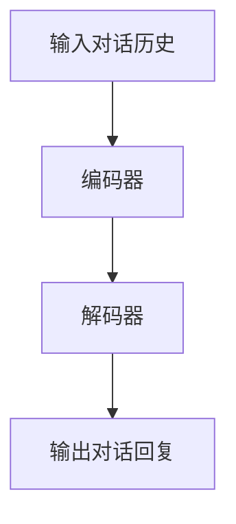
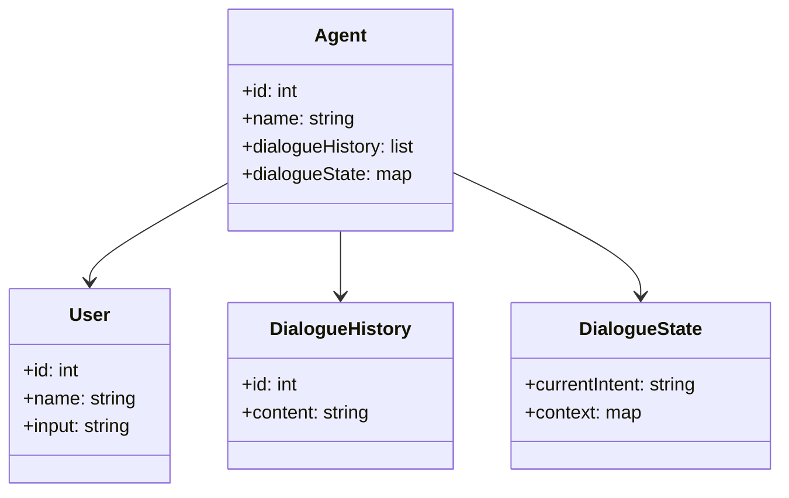
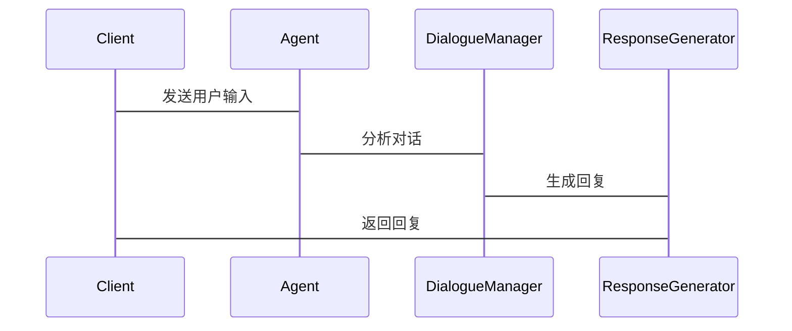

                 


# AI Agent的多轮对话管理系统设计

**关键词：** AI Agent, 多轮对话, 对话管理, 系统设计, 算法原理, 项目实战

**摘要：**  
本文系统地探讨了AI Agent在多轮对话管理中的设计与实现。从基础概念到高级算法，从系统架构到项目实战，全面解析多轮对话管理的核心原理和实际应用。文章结合理论与实践，通过丰富的案例和详细的代码示例，帮助读者深入理解并掌握AI Agent多轮对话管理的设计方法。

---

# 第一部分: AI Agent的多轮对话管理系统设计基础

# 第1章: AI Agent与多轮对话管理概述

## 1.1 AI Agent的基本概念
### 1.1.1 什么是AI Agent
AI Agent（人工智能代理）是指能够感知环境并采取行动以实现目标的智能实体。它具备自主性、反应性、目标导向性和社会性等核心特征。

### 1.1.2 AI Agent的核心特征
- **自主性**：能够在没有外部干预的情况下自主运行。
- **反应性**：能够实时感知环境变化并做出响应。
- **目标导向性**：具备明确的目标，并通过行动实现目标。
- **社会性**：能够与其他Agent或用户进行交互和协作。

### 1.1.3 多轮对话管理的定义
多轮对话管理是指在多个交互回合中，AI Agent能够理解用户的意图，并根据对话历史和上下文生成连贯且合理的回复。

---

## 1.2 多轮对话管理的背景与意义
### 1.2.1 当前对话系统的发展现状
传统的单轮对话系统难以处理复杂的上下文关系，而多轮对话管理能够实现更自然和高效的用户交互。

### 1.2.2 多轮对话管理的必要性
在智能客服、虚拟助手、智能音箱等场景中，多轮对话管理能够提升用户体验和系统的智能性。

### 1.2.3 多轮对话管理的应用场景
- 智能客服：处理用户的问题并提供解决方案。
- 虚拟助手：帮助用户完成日程管理、信息查询等任务。
- 智能音箱：通过语音交互实现智能家居控制。

---

## 1.3 本章小结
本章介绍了AI Agent的基本概念和多轮对话管理的背景与意义，为后续章节奠定了基础。

---

# 第2章: AI Agent多轮对话管理的核心概念

## 2.1 对话管理的基本原理
### 2.1.1 对话流程的分解
多轮对话管理包括理解用户输入、生成回复、维护对话状态等关键步骤。

### 2.1.2 对话状态的表示
对话状态通常包括用户意图、对话历史、上下文信息等，可以通过状态机或上下文树等方式进行表示。

### 2.1.3 对话策略的制定
对话策略是指AI Agent在不同对话状态下选择最优回复的规则，常见的策略包括基于规则的策略和基于机器学习的策略。

---

## 2.2 多轮对话中的关键问题
### 2.2.1 对话历史的处理
如何有效存储和利用对话历史是多轮对话管理的核心挑战之一。

### 2.2.2 上下文的理解与关联
AI Agent需要理解当前对话与之前对话的关联性，并根据上下文生成合理的回复。

### 2.2.3 对话目标的动态调整
在对话过程中，用户的需求可能会发生变化，AI Agent需要动态调整对话目标以满足用户需求。

---

## 2.3 核心概念的ER实体关系图
```mermaid
er
    actor(Agent, id, name)
    actor(User, id, name)
    actor(DialogueHistory, id, content)
    actor(DialogueState, id, content)
    actor(DialogueStrategy, id, content)
    relation(Agent --> DialogueHistory)
    relation(Agent --> DialogueState)
    relation(Agent --> DialogueStrategy)
```

---

## 2.4 本章小结
本章详细讲解了AI Agent多轮对话管理的核心概念，包括对话流程、状态表示和策略制定，并通过ER图展示了各实体之间的关系。

---

# 第3章: 多轮对话管理的算法原理

## 3.1 基于生成式模型的对话管理
### 3.1.1 生成式模型的基本原理
生成式模型通过生成概率分布来预测下一个单词，常用的技术包括Transformer和GPT系列模型。

### 3.1.2 基于Transformer的对话生成


### 3.1.3 梯度下降优化算法
生成式模型通常使用交叉熵损失函数进行优化，优化目标是最小化生成文本与真实文本的差异。
$$ \text{损失函数} = -\sum_{i=1}^{n} \log P(y_i|x) $$

---

## 3.2 基于检索式模型的对话管理
### 3.2.1 检索式模型的基本原理
检索式模型通过将用户输入映射到已有的对话库中，找到最匹配的回复。

### 3.2.2 基于向量空间的相似度计算
使用余弦相似度或欧氏距离等方法计算输入与库中回复的相似度。
$$ \text{余弦相似度} = \frac{\vec{u} \cdot \vec{v}}{|\vec{u}| |\vec{v}|} $$

### 3.2.3 基于BM25的检索算法
BM25是一种常用的文本检索算法，适用于大规模对话库的检索。

---

## 3.3 对比分析
### 3.3.1 生成式与检索式模型的优缺点
- **生成式模型**：灵活性高，但生成质量不稳定。
- **检索式模型**：生成质量高，但依赖于高质量的对话库。

### 3.3.2 混合模型的可行性
结合生成式和检索式模型的优势，可以设计混合模型，提升对话管理的准确性和灵活性。

---

## 3.4 本章小结
本章详细讲解了多轮对话管理的两种主要算法：生成式模型和检索式模型，并通过对比分析探讨了它们的优缺点。

---

# 第4章: 多轮对话管理的系统分析与架构设计

## 4.1 问题场景介绍
本章以一个智能客服系统为例，分析多轮对话管理的系统架构。

## 4.2 系统功能设计
### 4.2.1 领域模型设计


### 4.2.2 系统架构设计


### 4.2.3 系统接口设计
- 用户输入接口：处理用户的自然语言输入。
- 对话管理接口：维护对话状态并生成回复。
- 响应生成接口：根据对话状态生成自然语言回复。

---

## 4.3 系统交互设计


---

## 4.4 本章小结
本章通过智能客服系统的例子，详细分析了多轮对话管理的系统架构和交互流程。

---

# 第5章: 多轮对话管理的项目实战

## 5.1 环境安装
- 安装Python和相关库（如TensorFlow、Keras、NLTK等）。

## 5.2 核心代码实现
### 5.2.1 对话管理模块
```python
class DialogueManager:
    def __init__(self):
        self.dialogue_history = []
        self.current_state = {}

    def process_input(self, input_str):
        # 处理用户输入并更新对话状态
        self.dialogue_history.append(input_str)
        # 更新当前状态
        self.current_state = self.update_state(input_str)
        return self.current_state

    def update_state(self, input_str):
        # 根据输入更新状态
        pass
```

### 5.2.2 响应生成模块
```python
class ResponseGenerator:
    def __init__(self, model):
        self.model = model

    def generate_response(self, state):
        # 根据当前状态生成回复
        pass
```

---

## 5.3 实际案例分析
### 5.3.1 案例一：智能客服对话
- 用户输入：我的订单在哪里？
- 系统回复：请提供订单号，我帮您查询。

### 5.3.2 案例二：多轮对话
- 用户输入：我想买手机。
- 系统回复：您想要什么价位的手机？
- 用户输入：3000元左右。
- 系统回复：推荐您这款手机，性能不错。

---

## 5.4 本章小结
本章通过具体的代码实现和案例分析，展示了多轮对话管理的实际应用。

---

# 第6章: 多轮对话管理的最佳实践与总结

## 6.1 最佳实践
- **数据质量**：确保对话库的质量和多样性。
- **模型优化**：结合生成式和检索式模型，提升生成效果。
- **用户体验**：注重对话的连贯性和自然性。

## 6.2 小结
本文系统地介绍了AI Agent多轮对话管理的设计与实现，从基础概念到算法原理，再到系统架构和项目实战，全面解析了多轮对话管理的核心内容。

## 6.3 注意事项
- 对话管理需要结合具体场景进行调整。
- 数据隐私和安全问题需要高度重视。

## 6.4 拓展阅读
- 《对话系统中的上下文理解》
- 《基于强化学习的对话管理》

---

# 结语
通过本文的学习，读者可以深入理解AI Agent多轮对话管理的核心原理和实际应用，为后续的实践和研究打下坚实基础。

