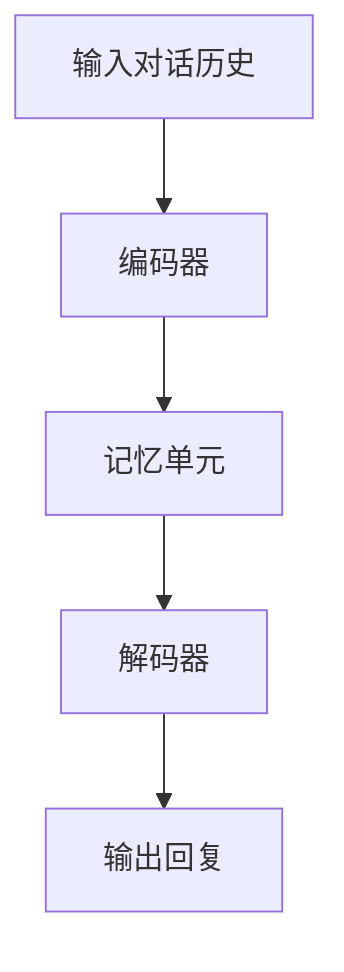
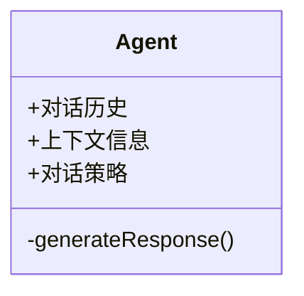
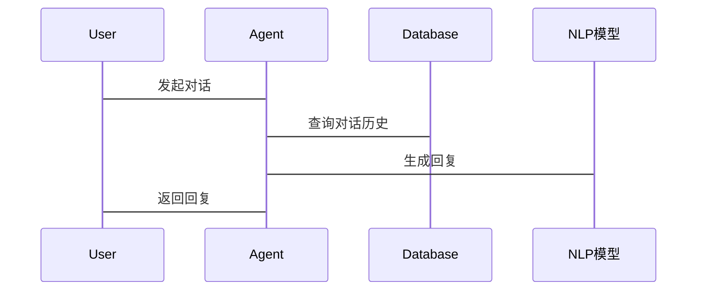

                 


# AI Agent的多轮对话能力增强

## 关键词：AI Agent, 多轮对话, 对话系统, 上下文理解, 对话历史记忆, 自然语言处理

## 摘要：  
随着人工智能技术的快速发展，AI Agent（智能体）在多轮对话中的应用越来越广泛。然而，现有的对话系统在理解和保持对话连贯性方面仍存在诸多挑战。本文系统地探讨了如何增强AI Agent的多轮对话能力，涵盖了从基础概念到高级算法的各个方面。我们首先介绍了多轮对话的基本概念和其在AI Agent中的重要性，然后深入分析了增强对话能力的关键技术，包括对话历史记忆、上下文管理和对话策略优化。接着，我们从算法原理的角度，详细讲解了记忆网络和对话生成模型的工作机制，并通过实际案例展示了如何将这些技术应用于实际场景。最后，我们总结了当前的研究成果，并展望了未来的发展方向。

---

# 第1章: AI Agent的多轮对话能力概述

## 1.1 问题背景与描述  
在人工智能领域，对话系统已经成为人机交互的重要组成部分。传统的单轮对话系统虽然能够处理简单的查询，但在复杂场景下难以保持对话的连贯性和一致性。例如，在客服、教育、医疗等领域，用户的需求往往需要通过多轮对话来逐步明确和满足。因此，提升AI Agent的多轮对话能力，使其能够理解和保持对话的上下文信息，是当前研究的一个重要方向。

### 1.1.1 多轮对话的必要性  
- 多轮对话能够帮助系统更好地理解用户的需求，尤其是在处理复杂问题时。  
- 通过多轮对话，系统可以逐步收集更多信息，从而提供更精准的服务。  
- 多轮对话能够提升用户体验，使对话更加自然和流畅。  

### 1.1.2 AI Agent在对话中的角色定位  
AI Agent作为对话系统的核心，负责处理用户的输入、维护对话上下文，并根据对话历史生成合适的回复。AI Agent需要具备以下能力：  
- 理解用户意图。  
- 维护对话历史。  
- 生成连贯的回复。  

### 1.1.3 当前对话能力的局限性  
- 传统的对话系统往往依赖预定义的规则，难以处理复杂的上下文信息。  
- 在多轮对话中，系统容易出现信息遗忘或混淆的问题。  
- 对话生成的模型通常只关注当前输入，缺乏对历史信息的利用。  

## 1.2 AI Agent的核心概念  
### 1.2.1 AI Agent的定义与特点  
AI Agent是一种能够感知环境、自主决策并执行任务的智能体。其特点包括：  
- 主动性：能够自主发起对话。  
- 智能性：能够理解用户意图并生成合理的回复。  
- 持续性：能够维护对话历史并保持上下文的一致性。  

### 1.2.2 多轮对话的定义与特征  
多轮对话是指用户和AI Agent之间进行的多轮交互，其特征包括：  
- 对话的连贯性：每一轮回复需要与前一轮的信息相关联。  
- 上下文依赖性：后续的回复依赖于之前的对话内容。  
- 用户参与度：用户在对话中可以随时改变话题或提供更多信息。  

### 1.2.3 对话能力的衡量标准  
- 对话的准确性：回复是否符合用户意图。  
- 对话的流畅性：回复是否自然连贯。  
- 用户满意度：用户对对话结果的满意程度。  

## 1.3 与其他对话技术的对比  
### 1.3.1 单轮对话与多轮对话的区别  
- 单轮对话：一次输入，一次输出，适用于简单查询。  
- 多轮对话：多次输入，多次输出，适用于复杂场景。  

### 1.3.2 传统聊天机器人与AI Agent的差异  
- 传统聊天机器人：依赖预定义的规则库，缺乏智能性。  
- AI Agent：具备自主决策能力，能够维护对话上下文。  

### 1.3.3 当前技术的优缺点分析  
- 优点：AI Agent能够处理复杂场景，提供更智能的服务。  
- 缺点：算法复杂，计算资源消耗较大，难以实时处理大规模对话。  

## 1.4 应用价值与前景  
### 1.4.1 多轮对话在AI Agent中的应用领域  
- 客服：解决用户问题，提供个性化服务。  
- 教育：为学生提供个性化的学习建议。  
- 医疗：帮助医生和患者进行有效沟通。  

### 1.4.2 市场需求与发展趋势  
随着人工智能技术的普及，市场对多轮对话能力的需求日益增加。未来，AI Agent将在更多领域得到广泛应用。  

### 1.4.3 技术挑战与解决方案  
- 技术挑战：对话历史的高效存储与管理，上下文信息的有效利用。  
- 解决方案：引入记忆网络和上下文管理技术，提升对话能力。  

## 1.5 本章小结  
本章主要介绍了AI Agent的多轮对话能力的重要性，分析了其核心概念和与其他对话技术的差异，并展望了其应用价值和发展前景。

---

# 第2章: 多轮对话的核心概念与联系  

## 2.1 对话系统的组成部分  
### 2.1.1 对话历史记录  
对话历史记录是多轮对话的核心组成部分，用于存储用户和AI Agent之间的所有交互信息。  

### 2.1.2 上下文管理  
上下文管理负责维护当前对话的上下文信息，确保每一轮回复与前一轮信息相关联。  

### 2.1.3 对话策略  
对话策略是AI Agent在多轮对话中选择下一步行动的规则和策略，包括内容生成和信息检索等。  

## 2.2 多轮对话的流程分析  
### 2.2.1 初始对话的启动  
- 用户发起对话，系统接收输入并启动对话流程。  

### 2.2.2 中间对话的衔接  
- 系统根据对话历史生成回复，并将回复发送给用户。  

### 2.2.3 对话的终止与总结  
- 用户确认问题解决，对话结束。  

## 2.3 对话质量的衡量标准  
### 2.3.1 响应的相关性  
- 回复是否与用户的问题直接相关。  

### 2.3.2 逻辑的连贯性  
- 回复是否与前一轮对话内容连贯。  

### 2.3.3 用户体验的满意度  
- 用户对对话结果的满意程度。  

## 2.4 核心概念的ER实体关系图  
```mermaid
er
    actor(Agent)
    actor(对话历史)
    actor(上下文信息)
    actor(对话策略)
    relation(拥有)
```

## 2.5 本章小结  
本章详细分析了多轮对话的核心概念，包括对话系统的组成部分、流程分析和质量衡量标准，并通过ER实体关系图展示了各部分之间的关系。

---

# 第3章: 增强多轮对话能力的关键技术  

## 3.1 对话历史记忆的实现方法  
### 3.1.1 基于规则的对话历史记忆  
- 通过预定义规则存储对话历史，适用于简单场景。  

### 3.1.2 基于模型的对话历史记忆  
- 使用深度学习模型（如记忆网络）存储和管理对话历史。  

## 3.2 上下文管理技术  
### 3.2.1 基于关键词的上下文管理  
- 通过关键词匹配维护上下文信息。  

### 3.2.2 基于语义的上下文管理  
- 使用自然语言处理技术（如BERT）理解上下文语义。  

## 3.3 对话策略优化  
### 3.3.1 基于规则的对话策略  
- 预定义对话规则，适用于简单场景。  

### 3.3.2 基于模型的对话策略  
- 使用强化学习优化对话策略，提升对话质量。  

---

# 第4章: 增强多轮对话能力的算法原理  

## 4.1 记忆网络的算法原理  
### 4.1.1 记忆网络的结构  
- 包括编码器、记忆单元和解码器。  

### 4.1.2 记忆网络的公式推导  
$$ p(y_t|x, m) = \sum_{k} p(y_t|x, m_k) p(m_k) $$  

## 4.2 对话生成模型  
### 4.2.1 基于Transformer的对话生成模型  
- 使用自注意力机制生成连贯的回复。  

### 4.2.2 对话生成模型的训练流程  
1. 数据预处理：收集多轮对话数据。  
2. 模型训练：使用深度学习模型训练对话生成器。  

## 4.3 算法流程图  


---

# 第5章: 增强多轮对话能力的系统架构设计  

## 5.1 系统场景介绍  
### 5.1.1 系统目标  
- 提供高效的多轮对话服务。  

### 5.1.2 系统用户  
- 最终用户：与AI Agent进行对话的用户。  

## 5.2 系统功能设计  
### 5.2.1 领域模型  


### 5.2.2 系统架构  


## 5.3 系统接口设计  
### 5.3.1 接口定义  
- 用户输入接口：接收用户的对话输入。  
- 系统输出接口：发送AI Agent的回复。  

## 5.4 系统交互流程  
### 5.4.1 交互流程图  


---

# 第6章: 增强多轮对话能力的项目实战  

## 6.1 环境安装  
### 6.1.1 安装Python  
- 使用Anaconda安装Python 3.8及以上版本。  

### 6.1.2 安装依赖库  
- 使用pip安装`numpy`, `tensorflow`, `transformers`等库。  

## 6.2 系统核心实现源代码  
### 6.2.1 对话历史记忆模块  
```python
class DialogueHistory:
    def __init__(self):
        self.history = []
    
    def add(self, utterance):
        self.history.append(utterance)
    
    def get(self):
        return self.history
```

### 6.2.2 上下文管理模块  
```python
from transformers import AutoTokenizer, AutoModelForSeq2Seq
class ContextManager:
    def __init__(self, model_name):
        self.tokenizer = AutoTokenizer.from_pretrained(model_name)
        self.model = AutoModelForSeq2Seq.from_pretrained(model_name)
    
    def manage_context(self, input_text):
        inputs = self.tokenizer(input_text, return_tensors="pt")
        outputs = self.model.generate(inputs.input_ids, max_length=50)
        return self.tokenizer.decode(outputs[0], skip_special_tokens=True)
```

## 6.3 代码应用解读与分析  
### 6.3.1 对话历史记忆模块解读  
- 该模块负责存储用户和AI Agent之间的所有对话历史。  

### 6.3.2 上下文管理模块解读  
- 该模块使用预训练的语言模型（如BERT）管理对话上下文，生成连贯的回复。  

## 6.4 实际案例分析  
### 6.4.1 案例描述  
- 用户与AI Agent进行多轮对话，解决复杂问题。  

### 6.4.2 案例分析  
- 对话历史记忆模块记录每一轮对话内容。  
- 上下文管理模块生成连贯的回复。  

## 6.5 项目小结  
本章通过实际项目展示了如何在Python环境中实现增强多轮对话能力的技术，包括对话历史记忆和上下文管理模块的设计与实现。

---

# 第7章: 增强多轮对话能力的前沿技术  

## 7.1 结合大模型的多轮对话技术  
### 7.1.1 大模型的优势  
- 参数量大，能够捕捉复杂的上下文信息。  

### 7.1.2 大模型的挑战  
- 计算资源消耗大，实时性难以保证。  

## 7.2 多模态交互技术  
### 7.2.1 多模态交互的定义  
- 结合文本、语音、图像等多种模态信息进行对话。  

### 7.2.2 多模态交互的优势  
- 提供更丰富的交互方式，提升用户体验。  

## 7.3 伦理与安全问题  
### 7.3.1 数据隐私问题  
- 对话数据可能包含用户的敏感信息。  

### 7.3.2 对话内容的伦理问题  
- 如何确保AI Agent的回复符合伦理规范。  

## 7.4 本章小结  
本章探讨了增强多轮对话能力的前沿技术，包括结合大模型和多模态交互，同时分析了伦理与安全问题。

---

# 第8章: 总结与展望  

## 8.1 本章总结  
本文系统地探讨了AI Agent的多轮对话能力增强技术，涵盖了从核心概念到算法实现的各个方面。我们分析了多轮对话的重要性和必要性，详细讲解了增强对话能力的关键技术，并通过实际案例展示了这些技术的应用。

## 8.2 未来展望  
随着人工智能技术的不断发展，增强AI Agent的多轮对话能力将变得更加重要。未来的研究方向包括：  
- 更高效的对话历史记忆技术。  
- 更智能的上下文管理方法。  
- 更自然的对话生成模型。  
- 结合多模态信息的交互方式。  

## 8.3 本章小结  
本文总结了AI Agent多轮对话能力增强的核心内容，并展望了未来的发展方向。

---

# 结语  
通过本文的探讨，读者可以全面了解AI Agent的多轮对话能力增强技术，从理论到实践，从基础到高级，逐步掌握相关知识。未来，随着技术的进步，AI Agent将在更多领域发挥重要作用，为人类带来更智能、更便捷的服务。

