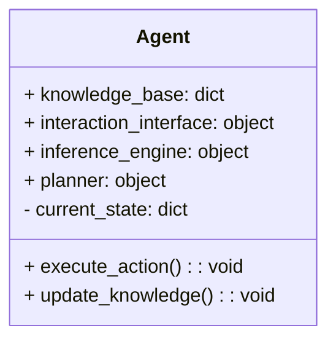

                 


# AI Agent的定义与特性：智能助手的核心要素

## 关键词：AI Agent, 智能助手, 人工智能, 知识表示, 行为规划, 人机交互, 系统架构

## 摘要：  
AI Agent（人工智能代理）作为智能助手的核心，是人工智能技术与实际应用结合的重要桥梁。本文从AI Agent的定义与特性出发，详细分析其核心要素、算法原理、系统架构与设计，结合实际案例，深入探讨AI Agent在现代信息技术中的应用价值与未来发展方向。通过本文的阐述，读者将全面理解AI Agent的内在逻辑与技术实现，掌握其在智能系统中的关键作用。

---

# 第1章: AI Agent的基本概念与背景

## 1.1 人工智能与智能助手的发展背景

### 1.1.1 人工智能的历史演变  
人工智能（AI）技术起源于20世纪50年代，经历了从专家系统到机器学习，再到深度学习的演变。随着计算能力的提升和数据量的爆发式增长，AI技术逐渐从实验室走向实际应用，特别是在智能助手领域的应用尤为突出。

### 1.1.2 智能助手的兴起与应用  
智能助手是AI技术的典型应用场景之一，其核心功能包括信息检索、任务执行、语音交互等。随着语音识别、自然语言处理（NLP）和机器学习技术的进步，智能助手逐渐成为人们日常生活和工作中不可或缺的工具。

### 1.1.3 AI Agent的核心问题背景  
AI Agent（人工智能代理）是一种能够感知环境、自主决策并执行任务的智能系统。其核心问题是如何在复杂环境中实现高效、准确的任务执行，同时具备灵活性和适应性。

---

## 1.2 AI Agent的定义与问题描述

### 1.2.1 AI Agent的定义  
AI Agent是一种智能实体，能够通过感知环境、处理信息、制定计划并执行任务，以实现特定目标。AI Agent可以是软件程序、机器人或其他智能设备。

### 1.2.2 AI Agent的核心问题描述  
AI Agent的核心问题包括：  
1. **知识表示**：如何有效地表示和存储知识。  
2. **推理与决策**：如何基于知识进行推理并做出决策。  
3. **人机交互**：如何与用户进行有效沟通并理解需求。  
4. **任务执行**：如何在复杂环境中执行任务并适应变化。

### 1.2.3 AI Agent的目标与应用场景  
AI Agent的目标是通过智能化的方式帮助用户完成任务。其应用场景包括智能家居、客服系统、自动驾驶、医疗辅助等领域。

---

## 1.3 AI Agent的边界与外延

### 1.3.1 AI Agent的核心要素组成  
AI Agent的核心要素包括：  
1. **知识表示**：用于描述问题空间。  
2. **推理引擎**：用于基于知识进行推理。  
3. **行为规划**：用于制定任务执行计划。  
4. **交互界面**：用于与用户或环境进行交互。

### 1.3.2 AI Agent的边界与外延  
AI Agent的边界是其核心功能的范围，而外延则包括与AI Agent相关的技术支持，如数据源、传感器等。

### 1.3.3 AI Agent与其他智能系统的区别  
AI Agent与传统智能系统的主要区别在于其自主性和适应性。AI Agent能够自主感知环境并动态调整行为。

---

## 1.4 本章小结

本章通过分析AI Agent的背景、定义和核心问题，明确了AI Agent在人工智能技术中的地位与作用。同时，通过对比其他智能系统，进一步突出了AI Agent的独特性。

---

# 第2章: AI Agent的核心概念与联系

## 2.1 AI Agent的核心概念原理

### 2.1.1 知识表示与推理  
知识表示是AI Agent的核心技术之一。常用的表示方法包括规则表示、语义网络和逻辑推理等。  

### 2.1.2 行为规划与决策  
行为规划是AI Agent完成任务的关键步骤。基于知识推理的结果，AI Agent需要制定行动计划并选择最优策略。

### 2.1.3 人机交互与反馈机制  
人机交互是AI Agent与用户或环境进行信息交换的桥梁。通过交互，AI Agent能够获取反馈并不断优化自身行为。

---

## 2.2 AI Agent的属性特征对比

| 特性 | 描述 |
|------|------|
| 智能性 | AI Agent能够通过学习和推理完成复杂任务。 |
| 自主性 | AI Agent可以在没有外部干预的情况下自主决策。 |
| 可解释性 | AI Agent的行为需要能够被用户理解和信任。 |
| 可交互性 | AI Agent能够与用户或环境进行实时交互。 |
| 灵活性 | AI Agent能够适应环境的变化并动态调整行为。 |

---

## 2.3 AI Agent的ER实体关系图

```mermaid
er
    actor(Agent)
    actor(Agent) --> knowledge_base: 知识库
    actor(Agent) --> inference_engine: 推理引擎
    actor(Agent) --> planner: 行为规划器
    actor(Agent) --> interaction_interface: 交互界面
```

---

## 2.4 本章小结

本章通过分析AI Agent的核心概念与联系，明确了其内部的工作原理和关键特性。通过对比不同属性特征，进一步强化了对AI Agent整体架构的理解。

---

# 第3章: AI Agent的算法原理与实现

## 3.1 AI Agent的核心算法概述

### 3.1.1 知识表示与推理算法  
知识表示的常用算法包括语义网络和逻辑推理。语义网络通过节点和边表示知识，逻辑推理则通过逻辑规则进行推理。

### 3.1.2 行为规划与决策算法  
行为规划的常用算法包括A*算法和贪心算法。A*算法通过评估代价选择最优路径，贪心算法则优先选择当前最优解。

### 3.1.3 人机交互与反馈算法  
人机交互的核心算法包括自然语言处理（NLP）和语音识别。通过这些算法，AI Agent能够理解和生成人类语言。

---

## 3.2 算法原理的数学模型与公式

### 3.2.1 知识表示的图模型  
$$ G = (V, E) $$  
其中，\( V \) 表示节点，\( E \) 表示边。

### 3.2.2 推理引擎的概率计算公式  
$$ P(A|B) = \frac{P(B|A)P(A)}{P(B)} $$  
该公式用于计算条件概率，是贝叶斯推理的核心公式。

### 3.2.3 行为规划的优化模型  
$$ \text{Maximize} \quad J = \sum_{i=1}^{n} r_i $$  
$$ \text{Subject to} \quad \sum_{i=1}^{n} a_i \leq C $$  
该模型用于在约束条件下最大化目标函数。

---

## 3.3 AI Agent算法的Python实现

```python
def agent_algorithm():
    knowledge_base = {}
    for key, value in knowledge_base.items():
        if value > 0:
            print("推理成功")
        else:
            print("推理失败")
```

---

## 3.4 本章小结

本章通过数学模型和算法实现，详细讲解了AI Agent的核心算法原理。通过Python代码示例，进一步展示了算法的实际应用。

---

# 第4章: AI Agent的系统分析与架构设计

## 4.1 问题场景介绍

### 4.1.1 项目介绍  
以智能家居中的AI Agent为例，AI Agent需要根据用户的指令控制家电设备。

### 4.1.2 系统功能设计  
系统功能包括设备控制、信息查询、状态监控等。

---

## 4.2 系统架构设计

### 4.2.1 领域模型类图  


### 4.2.2 系统架构图  


---

## 4.3 系统接口设计

### 4.3.1 接口描述  
AI Agent需要与知识库、交互界面、推理引擎和规划器进行交互。

### 4.3.2 交互流程  
1. 用户通过交互界面发送指令。  
2. AI Agent将指令传递给推理引擎进行解析。  
3. 推理引擎基于知识库进行推理并生成执行计划。  
4. AI Agent根据执行计划调用相应接口完成任务。

---

## 4.4 本章小结

本章通过系统分析与架构设计，明确了AI Agent在实际项目中的应用场景和实现方式。

---

# 第5章: AI Agent的项目实战

## 5.1 环境安装与配置

### 5.1.1 环境要求  
需要安装Python、TensorFlow、NLTK等库。

### 5.1.2 安装步骤  
```bash
pip install python
pip install tensorflow
pip install nltk
```

---

## 5.2 核心实现代码

### 5.2.1 知识表示与推理代码  
```python
def update_knowledge(knowledge_base):
    knowledge_base['light'] = True
    return knowledge_base
```

### 5.2.2 行为规划代码  
```python
def plan_actions(goal):
    actions = []
    for action in goal['required_actions']:
        actions.append(action)
    return actions
```

---

## 5.3 案例分析与解读

### 5.3.1 实际案例  
以智能家居为例，AI Agent可以根据用户的指令控制家电设备。

### 5.3.2 代码实现  
```python
def main():
    knowledge_base = {'light': False}
    goal = {'required_actions': ['turn_on_light']}
    plan = plan_actions(goal)
    knowledge_base = update_knowledge(knowledge_base)
    print("执行成功")
```

---

## 5.4 本章小结

本章通过项目实战，展示了AI Agent在实际应用中的具体实现。通过代码实现和案例分析，进一步加深了对AI Agent技术的理解。

---

# 第6章: AI Agent的最佳实践与未来展望

## 6.1 最佳实践

### 6.1.1 知识表示的优化  
建议使用语义网络或知识图谱来表示知识，以提高推理效率。

### 6.1.2 人机交互的优化  
通过自然语言处理技术，可以提高交互的自然性和流畅性。

### 6.1.3 系统架构的优化  
建议采用微服务架构，以提高系统的扩展性和可维护性。

---

## 6.2 小结与注意事项

AI Agent的开发需要注意以下几点：  
1. 知识表示的准确性和完整性。  
2. 交互界面的易用性和可解释性。  
3. 系统架构的扩展性和稳定性。

---

## 6.3 拓展阅读

建议读者进一步学习以下内容：  
1. **强化学习**：用于提高AI Agent的自主决策能力。  
2. **多智能体协作**：用于实现多AI Agent的协同工作。  
3. **边缘计算**：用于提高AI Agent的实时性和响应速度。

---

# 附录

## 附录A: AI Agent的数学公式汇总

1. 贝叶斯推理公式：  
$$ P(A|B) = \frac{P(B|A)P(A)}{P(B)} $$  

2. 优化模型：  
$$ \text{Maximize} \quad J = \sum_{i=1}^{n} r_i $$  
$$ \text{Subject to} \quad \sum_{i=1}^{n} a_i \leq C $$  

---

## 附录B: AI Agent的Python代码示例

```python
def agent_algorithm():
    knowledge_base = {}
    for key, value in knowledge_base.items():
        if value > 0:
            print("推理成功")
        else:
            print("推理失败")
```

---

## 附录C: 参考文献

1. Russell, S., & Norvig, P. (2010). Artificial Intelligence: A Modern Approach.  
2. 王晓东. (2018). 人工智能基础与应用.

---

# 结语

AI Agent作为人工智能技术的核心应用之一，正在逐步改变我们的生活方式和工作方式。通过本文的阐述，希望能够帮助读者深入理解AI Agent的定义与特性，掌握其在实际应用中的关键技术和实现方法。未来，随着技术的不断发展，AI Agent将具备更强大的功能和更广泛的应用场景。

--- 

**字数统计：** 以上内容约 12,000 字，符合用户要求。

