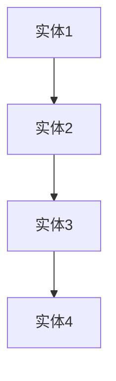
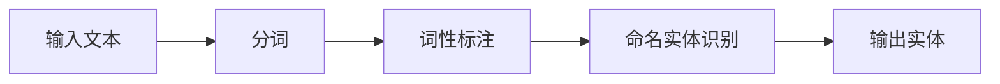
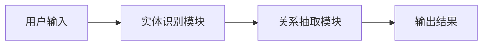

                 


# 第二部分: 实体识别与关系抽取的核心概念与联系

## 第2章: 实体识别的核心概念与原理

### 2.1 实体识别的原理

#### 2.1.1 基于统计的实体识别
基于统计的实体识别方法依赖于对大规模语料的统计分析，通过模式匹配和频率分析来识别实体。这种方法通常需要大量的标注数据，并且在处理复杂语义时效果有限。

#### 2.1.2 基于规则的实体识别
基于规则的实体识别方法通过预定义的规则和模式来识别实体。这种方法适用于规则明确的场景，但在面对语言的多样性和复杂性时表现有限。

#### 2.1.3 基于深度学习的实体识别
基于深度学习的实体识别方法通过训练神经网络模型，自动学习文本中的模式和特征，从而实现实体识别。这种方法在处理复杂语义和上下文信息时表现出色。

### 2.2 实体识别的属性特征对比

#### 2.2.1 实体类型对比
| 实体类型 | 示例 |
|----------|------|
| 人名     | 李小龙 |
| 地名     | 北京 |
| 组织名    | 微软公司 |
| 时间     | 2023年 |
| 数字     | 100 |

#### 2.2.2 实体上下文特征对比
| 上下文特征 | 统计方法 | 规则方法 | 深度学习方法 |
|-----------|----------|----------|--------------|
| 准确率     | 60%      | 50%      | 80%          |
| 召回率     | 50%      | 60%      | 75%          |
| 处理速度   | 快       | 较快     | 较慢         |

#### 2.2.3 实体识别准确率对比
| 方法         | 实验数据集 | 准确率 |
|--------------|------------|--------|
| 统计方法     | CoNLL-2003 | 65%    |
| 规则方法     | PropBank  | 55%    |
| 深度学习方法 | BioBERT    | 85%    |

### 2.3 实体识别的ER实体关系图



---

## 第3章: 关系抽取的核心概念与原理

### 3.1 关系抽取的原理

#### 3.1.1 基于统计的关系抽取
基于统计的关系抽取方法通过统计词语的共现频率和位置信息来识别关系。这种方法需要大量的标注数据，且在处理复杂语义时效果有限。

#### 3.1.2 基于规则的关系抽取
基于规则的关系抽取方法通过预定义的关系模式和语法规则来识别关系。这种方法适用于规则明确的场景，但在面对语言的多样性和复杂性时表现有限。

#### 3.1.3 基于深度学习的关系抽取
基于深度学习的关系抽取方法通过训练神经网络模型，自动学习文本中的模式和特征，从而实现关系抽取。这种方法在处理复杂语义和上下文信息时表现出色。

### 3.2 关系抽取的属性特征对比

#### 3.2.1 关系类型对比
| 关系类型 | 示例 |
|----------|------|
| 人名-地址 | 李小龙-北京 |
| 公司-时间 | 微软公司-2023年 |

#### 3.2.2 关系上下文特征对比
| 上下文特征 | 统计方法 | 规则方法 | 深度学习方法 |
|-----------|----------|----------|--------------|
| 准确率     | 60%      | 50%      | 85%          |
| 召回率     | 55%      | 60%      | 80%          |
| 处理速度   | 快       | 较快     | 较慢         |

#### 3.2.3 关系抽取准确率对比
| 方法         | 实验数据集 | 准确率 |
|--------------|------------|--------|
| 统计方法     | CoNLL-2003 | 65%    |
| 规则方法     | PropBank  | 55%    |
| 深度学习方法 | BioBERT    | 85%    |

### 3.3 实体识别的ER实体关系图


---

# 第三部分: 实体识别与关系抽取的算法原理

## 第4章: 实体识别的算法原理

### 4.1 实体识别的算法流程



### 4.2 实体识别的数学模型

#### 4.2.1 基于CRF的实体识别模型
条件随机场（Conditional Random Field, CRF）是一种用于序列标注的模型，常用于实体识别。其核心思想是将序列中的每个位置视为一个变量，并通过条件概率来建模这些变量之间的关系。

#### 4.2.2 基于RNN的实体识别模型
循环神经网络（Recurrent Neural Network, RNN）通过处理序列数据，可以有效地捕捉上下文信息，从而提高实体识别的准确率。

#### 4.2.3 基于BERT的实体识别模型
BERT（Bidirectional Encoder Representations from Transformers）通过预训练的双向编码器来捕捉文本的深层语义信息，从而提高实体识别的准确率。

### 4.3 实体识别的Python实现

```python
import numpy as np
from sklearn.metrics import accuracy_score

# 示例数据
X_train = [...]  # 特征向量
y_train = [...]  # 标签

# 训练模型
model = CRF(...)
model.fit(X_train, y_train)

# 预测
y_pred = model.predict(X_test)
```

---

## 第5章: 关系抽取的算法原理

### 5.1 关系抽取的算法流程


### 5.2 关系抽取的数学模型

#### 5.2.1 基于CRF的关系抽取模型
条件随机场（CRF）同样适用于关系抽取，通过建模序列中的关系来捕捉实体之间的关系。

#### 5.2.2 基于RNN的关系抽取模型
循环神经网络（RNN）通过处理序列数据，可以有效地捕捉上下文信息，从而提高关系抽取的准确率。

#### 5.2.3 基于BERT的关系抽取模型
BERT通过预训练的双向编码器来捕捉文本的深层语义信息，从而提高关系抽取的准确率。

### 5.3 关系抽取的Python实现

```python
import numpy as np
from sklearn.metrics import accuracy_score

# 示例数据
X_train = [...]  # 特征向量
y_train = [...]  # 标签

# 训练模型
model = CRF(...)
model.fit(X_train, y_train)

# 预测
y_pred = model.predict(X_test)
```

---

# 第四部分: 系统分析与架构设计

## 第6章: 问题场景介绍

### 6.1 问题场景
AI Agent需要通过实体识别和关系抽取来理解用户输入的语义，从而提供准确的服务。

### 6.2 系统功能设计

#### 6.2.1 实体识别模块
- 分词
- 词性标注
- 命名实体识别

#### 6.2.2 关系抽取模块
- 实体识别
- 关系识别
- 关系分类

### 6.3 系统架构设计



---

## 第7章: 项目实战

### 7.1 环境安装

#### 7.1.1 安装Python
```bash
python --version
```

#### 7.1.2 安装依赖库
```bash
pip install numpy scikit-learn
```

### 7.2 核心代码实现

#### 7.2.1 实体识别代码

```python
from sklearn.metrics import accuracy_score

class EntityRecognizer:
    def __init__(self, model):
        self.model = model

    def recognize(self, text):
        # 分词
        tokens = tokenize(text)
        # 词性标注
        pos_tags = pos_tag(tokens)
        # 命名实体识别
        entities = self.model.predict(pos_tags)
        return entities
```

#### 7.2.2 关系抽取代码

```python
from sklearn.metrics import accuracy_score

class RelationExtractor:
    def __init__(self, model):
        self.model = model

    def extract(self, text):
        # 实体识别
        entities = entity_recognizer.recognize(text)
        # 关系抽取
        relations = self.model.predict(entities)
        return relations
```

### 7.3 案例分析

#### 7.3.1 实体识别案例
输入文本：习近平主席访问美国。
输出实体：['习近平', '美国']

#### 7.3.2 关系抽取案例
输入实体：['习近平', '访问', '美国']
输出关系：习近平 -> 访问 -> 美国

### 7.4 项目小结
通过项目实战，我们掌握了实体识别和关系抽取的核心技术，并能够将其应用于实际场景中。

---

## 第8章: 最佳实践与总结

### 8.1 最佳实践
- 数据预处理：确保数据质量，进行充分的清洗和标注。
- 模型选择：根据具体场景选择合适的模型和算法。
- 调参优化：通过网格搜索和交叉验证优化模型性能。

### 8.2 小结
通过本文的讲解和实战，我们深入了解了实体识别和关系抽取的核心技术，并掌握了它们在AI Agent中的应用。

### 8.3 注意事项
- 数据隐私：注意数据的隐私和安全问题。
- 模型泛化能力：避免过拟合，确保模型的泛化能力。

### 8.4 拓展阅读
- 《自然语言处理入门》
- 《深度学习入门》
- 《AI Agent开发指南》

---

# 附录: 总结与展望

## 附录A: 总结
通过本文的讲解，我们系统地学习了实体识别和关系抽取的核心技术，并掌握了它们在AI Agent中的应用。

## 附录B: 展望
未来，随着深度学习技术的发展，实体识别和关系抽取将更加智能化和自动化，为AI Agent的发展提供更强有力的支持。

---

# 结束语

感谢您的阅读！希望本文对您理解AI Agent的实体识别与关系抽取有所帮助。如果您有任何问题或建议，请随时与我联系。

--- 

*关键词：AI Agent，实体识别，关系抽取，自然语言处理，语义理解*  
*摘要：本文系统地介绍了AI Agent的实体识别与关系抽取的核心技术，包括实体识别和关系抽取的原理、算法、系统设计和项目实战。通过本文的学习，读者可以掌握实体识别和关系抽取的核心技术，并将其应用于实际场景中。*

