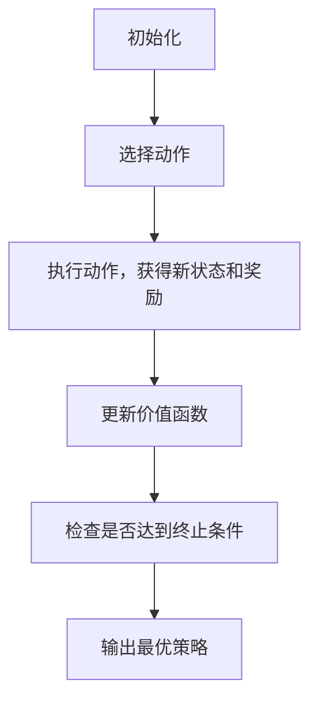
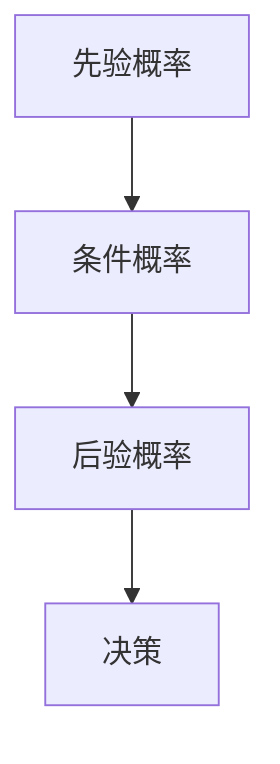
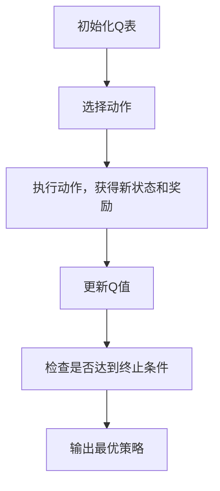
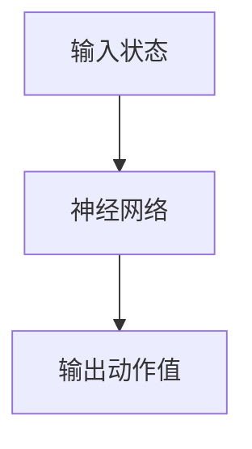
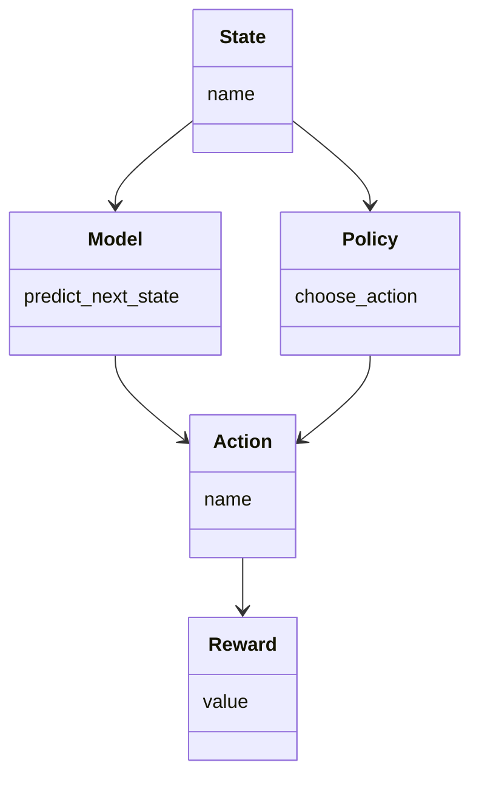
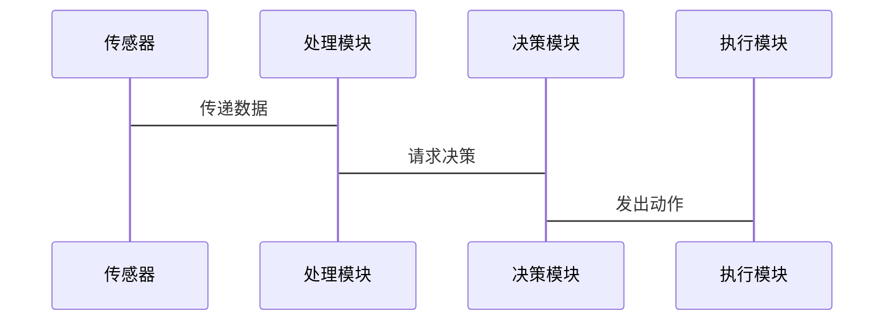

                 


```markdown
# 第三章: 实时决策算法原理

## 3.1 基于模型的实时决策算法

### 3.1.1 动态规划算法
动态规划（Dynamic Programming）是一种基于模型的实时决策算法，适用于状态空间较小且完全可观察的环境。其核心思想是通过不断更新价值函数，找到最优策略。

#### 动态规划算法流程图


#### 动态规划算法代码示例
```python
def dynamic_programming():
    # 初始化价值函数
    V = {s: 0 for s in states}
    while not convergence:
        for s in states:
            # Bellman方程更新价值函数
            V[s] = max(Q(s, a) for a in actions)
    return V
```

### 3.1.2 贝叶斯网络
贝叶斯网络是一种基于概率的实时决策算法，适用于处理不确定性问题。

#### 贝叶斯网络结构


### 3.1.3 马尔可夫决策过程
马尔可夫决策过程（MDP）是一种数学框架，用于建模决策过程。

#### MDP的状态转移公式
$$P(s'|s,a) = \text{概率从状态}s转移到状态s'，在动作a下。$$

## 3.2 基于模型-free的实时决策算法

### 3.2.1 Q-learning算法
Q-learning是一种基于模型-free的实时决策算法，适用于离线和在线学习。

#### Q-learning算法流程图


#### Q-learning算法代码示例
```python
def q_learning():
    # 初始化Q表
    Q = {s: {a: 0 for a in actions} for s in states}
    while not convergence:
        for s in states:
            for a in actions:
                # Q-learning更新公式
                Q[s][a] = Q[s][a] + α * (r + γ * max(Q[s'][a']) - Q[s][a])
    return Q
```

### 3.2.2 Deep Q-Networks
Deep Q-Networks（DQN）是一种结合深度学习的实时决策算法。

#### DQN网络结构


### 3.2.3 Policy Gradient方法
Policy Gradient方法直接优化策略，适用于参数化策略。

#### Policy Gradient算法更新公式
$$\nabla \theta = \frac{\partial J}{\partial \theta}$$

## 3.3 算法的数学模型与公式

### 3.3.1 动态规划的数学模型
$$V(s) = \max_a \sum_{s'} P(s'|s,a) V(s')$$

### 3.3.2 Q-learning的数学模型
$$Q(s,a) = Q(s,a) + \alpha [r + \gamma \max Q(s',a') - Q(s,a)]$$

### 3.3.3 Policy Gradient的数学模型
$$J(\theta) = \mathbb{E}_{\tau} [\sum_t r_t]$$
$$\nabla J(\theta) = \mathbb{E}_{\tau} [\sum_t \nabla \log \pi_\theta(a_t|s_t) Q_\theta(s_t,a_t)]$$

## 3.4 本章小结

---

# 第四章: 系统分析与架构设计

## 4.1 问题场景介绍
在实时决策系统中，我们需要处理动态变化的环境和复杂的决策过程。例如，在自动驾驶中，AI Agent需要实时感知环境并做出决策。

## 4.2 系统功能设计

### 4.2.1 领域模型设计
领域模型展示了系统的核心实体及其关系。

#### 领域模型类图


### 4.2.2 系统架构设计
实时决策系统的架构需要高效处理数据和快速做出决策。

#### 系统架构图


### 4.2.3 接口设计
系统需要定义清晰的接口，确保各模块之间的通信。

#### 接口设计


## 4.3 本章小结

---

# 第五章: 项目实战

## 5.1 环境安装
需要安装Python、TensorFlow、OpenAI Gym等依赖库。

## 5.2 系统核心实现

### 5.2.1 Q-learning实现
```python
import gym
import numpy as np

env = gym.make('CartPole-v0')
states = env.observation_space.shape[0]
actions = env.action_space.n

# 初始化Q表
Q = np.zeros((states, actions))

# 参数设置
alpha = 0.1
gamma = 0.99

# Q-learning算法
def q_learn():
    for episode in range(1000):
        state = env.reset()
        while True:
            # 选择动作
            action = np.argmax(Q[state]) if np.any(Q[state]) else 0
            # 执行动作
            next_state, reward, done, _ = env.step(action)
            # 更新Q值
            Q[state][action] += alpha * (reward + gamma * np.max(Q[next_state]) - Q[state][action])
            state = next_state
            if done:
                break
    return Q

# 训练模型
Q = q_learn()
```

### 5.2.2 案例分析
以CartPole环境为例，通过Q-learning算法实现平衡杆的控制。

## 5.3 项目总结
详细分析项目的实现过程、结果和可能的优化方向。

---

# 第六章: 结论与展望

## 6.1 本章小结
总结全文内容，强调AI Agent在实时决策系统中的重要性。

## 6.2 注意事项
在实际应用中，需注意算法的实时性、模型的可解释性等问题。

## 6.3 拓展阅读
推荐相关领域的书籍和论文，供读者深入学习。

---

# 关键词：AI Agent, 实时决策系统, 人工智能, 机器学习, 决策算法

# 摘要：本文详细介绍了AI Agent在实时决策系统中的设计与实现，涵盖算法原理、系统架构、项目实战等多个方面，帮助读者全面理解AI Agent的实时决策机制。
```

