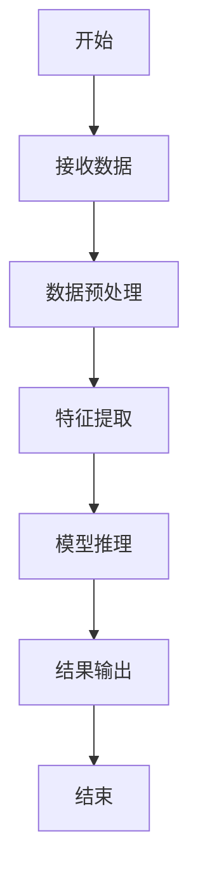
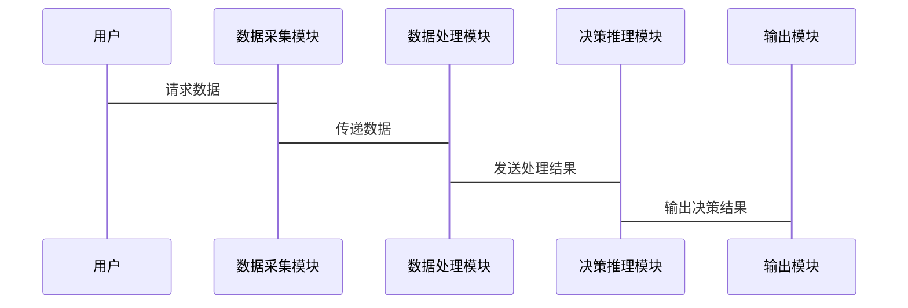

                 


# AI Agent的实时数据处理技术

> 关键词：AI Agent、实时数据处理、数据流、事件驱动、系统架构、Python实现

> 摘要：本文详细探讨了AI Agent在实时数据处理技术中的应用，从核心概念到算法原理，再到系统架构设计，最后结合项目实战，全面解析了AI Agent如何高效处理实时数据，实现智能决策。

---

## 第一部分: AI Agent与实时数据处理概述

### 第1章: AI Agent与实时数据处理的背景与概念

#### 1.1 AI Agent的基本概念
AI Agent（人工智能代理）是指能够感知环境、自主决策并执行任务的智能实体。AI Agent通过实时数据处理技术，能够快速响应环境变化，做出最优决策。

#### 1.2 实时数据处理的定义与特点
实时数据处理是指在数据生成的同时进行处理和分析，具有低延迟、高实时性和高可靠性的特点。

#### 1.3 AI Agent与实时数据处理的关系
AI Agent依赖实时数据处理技术来实现智能化决策和行动，实时数据处理是AI Agent的核心能力之一。

---

## 第二部分: AI Agent的核心概念与技术原理

### 第2章: AI Agent的核心概念与联系

#### 2.1 AI Agent的核心概念
- **数据流**：实时数据处理的核心，数据流的类型和处理方式直接影响AI Agent的性能。
- **事件驱动**：AI Agent通过事件驱动的方式，实时响应数据变化。

#### 2.2 核心概念的对比分析
以下是对实时数据处理相关概念的对比分析：

| 概念       | 描述                                                                 |
|------------|----------------------------------------------------------------------|
| 数据流      | 持续流动的数据，如传感器数据或用户行为数据                               |
| 事件驱动    | 基于事件触发的处理方式，如接收到新数据后触发处理                       |
| 实时处理    | 在数据生成的同时进行处理，保证低延迟和高实时性                         |

#### 2.3 ER实体关系图
以下是一个简单的ER实体关系图，展示了AI Agent与实时数据源的关系：

```mermaid
er
actor(Agent, 实时数据源, 用户)
rectangle(Agent, 实时数据处理系统, 数据存储)
rectangle(实时数据源, 数据流, 事件)
rectangle(用户, 请求, 响应)
```

---

## 第三部分: AI Agent的实时数据处理技术

### 第3章: AI Agent的实时数据处理算法

#### 3.1 数据流处理算法
数据流处理算法是实时数据处理的核心，以下是一个基于滑动窗口的处理流程：



#### 3.2 算法实现
以下是一个简单的数据流处理算法的Python实现：

```python
def process_stream(window_size=5):
    window = []
    while True:
        data = receive_data()  # 接收实时数据
        window.append(data)
        if len(window) > window_size:
            window.pop(0)
        result = process_window(window)
        output_result(result)
```

#### 3.3 数学模型与公式
实时数据处理中的滑动窗口算法可以用以下数学公式表示：

$$
\text{平均值} = \frac{1}{n} \sum_{i=1}^{n} x_i
$$

其中，\( n \) 是窗口大小，\( x_i \) 是窗口中的数据点。

---

## 第四部分: AI Agent的系统架构设计

### 第4章: AI Agent的系统架构

#### 4.1 系统功能设计
AI Agent的系统功能设计包括数据采集、数据处理、决策推理和结果输出四个模块。

#### 4.2 系统架构图
以下是AI Agent系统的分层架构图：


#### 4.3 系统接口设计
系统接口设计包括数据采集接口、数据处理接口和结果输出接口，以下是一个接口设计示例：



---

## 第五部分: AI Agent的项目实战

### 第5章: 实时数据处理项目实战

#### 5.1 环境搭建
需要安装以下工具和库：
- Python 3.8+
- Pandas
- NumPy
- matplotlib

#### 5.2 核心代码实现
以下是一个实时数据处理的Python代码示例：

```python
import pandas as pd
import numpy as np
import time

def process_data实时数据():
    # 模拟实时数据
    data = np.random.randn(100)
    # 数据预处理
    df = pd.DataFrame(data, columns=['value'])
    # 特征提取
    mean = df['value'].mean()
    return mean

if __name__ == '__main__':
    while True:
        result = process_data实时数据()
        print(f"当前均值: {result}")
        time.sleep(1)
```

#### 5.3 代码解读与分析
- 数据预处理：将实时数据转换为可处理的形式。
- 特征提取：从数据中提取关键特征，如均值、方差等。
- 模型推理：基于特征进行决策推理。
- 结果输出：将处理结果输出到目标系统或存储。

---

## 第六部分: 总结与展望

### 第6章: 总结与展望

#### 6.1 本章小结
本文详细探讨了AI Agent在实时数据处理技术中的应用，从核心概念到算法原理，再到系统架构设计，最后结合项目实战，全面解析了AI Agent如何高效处理实时数据，实现智能决策。

#### 6.2 未来展望
未来，随着边缘计算和分布式架构的发展，AI Agent的实时数据处理技术将进一步优化，实现更高效、更智能的数据处理能力。

---

通过以上内容，您可以根据需要扩展和细化每个部分，撰写一篇完整的技术博客文章。

